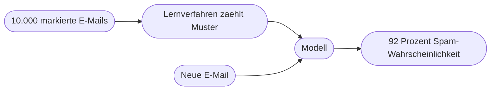
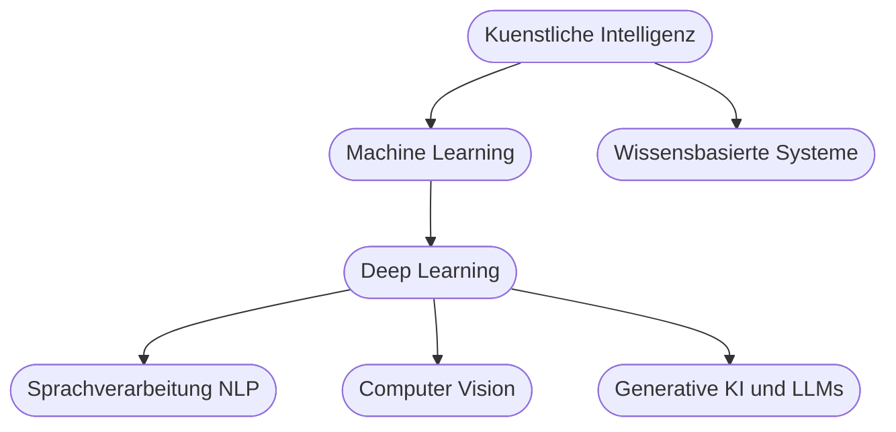

# Kapitel 1 – Was ist Künstliche Intelligenz?

{{ progress(1) }}

<div class="lernziele" markdown>
<h3>Was du in diesem Kapitel lernst</h3>

- Was mit **Künstlicher Intelligenz (KI)** gemeint ist und wie sie sich von klassischer Software unterscheidet
- Warum es **keine** einheitliche Definition gibt und was der „KI-Effekt" damit zu tun hat
- Welche **Teilgebiete** die KI hat (Machine Learning, Deep Learning, NLP, Computer Vision) und wie sie zusammenhängen
- Der Unterschied zwischen **schwacher** und **starker** KI – und wo wir heute realistisch stehen
- Warum **generative KI** der Baustein ist, auf dem KI-Agenten aufsetzen
- Wo dir KI im Arbeitsalltag begegnet und welche Rolle sie in automatisierten Abläufen spielt
</div>

---

## So gehst du vor

1. Lies die Kapitelinhalte und präge dir die zentralen Begriffe ein.
2. Bearbeite die **Kurzübungen** – mindestens eine davon setzt du direkt in einem KI-Werkzeug um (Microsoft Copilot, ChatGPT oder Claude).
3. Arbeite die **Workshop-Aufgabe** durch. Sie verknüpft das Gelernte mit deinem eigenen Arbeitsumfeld.

---

## 1.1 Was ist Künstliche Intelligenz?

**Künstliche Intelligenz** ist ein Teilgebiet der Informatik, das sich mit Systemen beschäftigt, die Aufgaben lösen, für die man normalerweise **menschliche Intelligenz** voraussetzt: Sprache verstehen, Muster erkennen, Entscheidungen treffen, aus Erfahrung lernen.

Wichtig ist die Betonung auf **„für die man menschliche Intelligenz voraussetzt"**. KI muss nicht denken wie ein Mensch – sie muss nur ein Ergebnis liefern, das wir sonst nur von intelligenten Menschen erwarten würden. Ein Taschenrechner rechnet schneller als jeder Mensch, gilt aber nicht als KI, weil das Vorgehen fest vorgegeben ist. Ein System, das aus tausenden E-Mails **selbst lernt**, welche Spam sind, gilt als KI.

### Der entscheidende Unterschied: Regeln oder Lernen

| Klassische Software | KI-System |
|---|---|
| Folgt fest programmierten **Regeln** (`wenn … dann …`) | **Lernt Muster** aus Daten und Beispielen |
| Verhalten ist vollständig vorhersehbar | Verhalten ist **statistisch**, nicht immer identisch |
| Entwickler beschreibt jeden Fall | Entwickler stellt **Daten** und ein Lernverfahren bereit |
| Fehler = Programmierfehler (Bug) | Fehler = ungünstige Daten oder Grenzfall |
| Beispiel: Taschenrechner, Buchhaltungssoftware | Beispiel: Spam-Filter, Sprachassistent, Copilot |

!!! info "Merksatz"
    Klassische Software wird **programmiert**, KI wird **trainiert**. Statt „Sag dem Computer genau, was er tun soll" heißt es bei KI: „Zeig dem Computer viele Beispiele, damit er das Muster selbst findet."

Diese Unterscheidung ist für den ganzen Kurs zentral. Ein automatisierter Ablauf, wie du ihn ab Block 4 selbst baust, ist klassische Software: exakt vorhersehbar. Ein KI-Baustein darin ist es nicht. Wer beides kombiniert, muss wissen, welcher Teil zuverlässig ist und welcher geprüft werden muss.

### Warum es keine eindeutige Definition gibt

„Künstliche Intelligenz" ist ein **bewegliches Ziel**. Sobald ein Problem gelöst ist, wirkt es plötzlich nicht mehr wie „echte" Intelligenz – dieses Phänomen nennt man den **KI-Effekt**: *„KI ist alles, was noch nicht funktioniert."*

!!! example "Der KI-Effekt in der Praxis"
    - In den 1990er-Jahren galt „ein Computer schlägt den Schachweltmeister" als Beweis für Intelligenz. Heute sagt man: „Das ist doch nur Rechenleistung."
    - Spracherkennung, Gesichtserkennung, Übersetzung – alles galt einmal als KI-Meilenstein und wird heute als selbstverständliche Funktion wahrgenommen.

    Für die Praxis ist die genaue Definition zweitrangig. Entscheidend ist die Leitfrage: **Lernt das System aus Daten, oder folgt es festen Regeln?**

---

## 1.2 Das Paradigma „Daten statt Regeln" – durchgerechnet

Um den Unterschied wirklich zu verstehen, betrachten wir dieselbe Aufgabe zweimal: **Erkenne, ob eine E-Mail Spam ist.**

**Ansatz 1 – klassische Regeln, von Hand programmiert:**

```text
WENN Betreff enthaelt "Gewinn" ODER "gratis" ODER "!!!"
   DANN markiere als Spam
```

Das Problem: Spammer schreiben „G-r-a-t-i-s" oder „Gew1nn". Für jede neue Masche muss ein Mensch eine neue Regel ergänzen. Das Regelwerk wird unübersichtlich und ist immer einen Schritt hinterher.

**Ansatz 2 – KI, aus Daten gelernt:**

Man gibt dem System **10.000 E-Mails**, jeweils markiert mit „Spam" oder „kein Spam". Das Verfahren zählt, welche Merkmale bei Spam häufiger vorkommen, und leitet daraus **Wahrscheinlichkeiten** ab. Trifft eine neue E-Mail ein, berechnet es: „Mit 92 Prozent Wahrscheinlichkeit Spam."



!!! info "Warum das mächtiger ist"
    Taucht eine neue Spam-Masche auf, muss niemand eine Regel schreiben – man ergänzt einfach neue **Beispiele** und trainiert nach. Das System passt sich an, statt starr zu bleiben. Genau dieser Wechsel von „Regeln von Hand" zu „Muster aus Daten" ist der Kern moderner KI.

Beachte aber die Kehrseite, die dich durch den ganzen Kurs begleitet: Das Ergebnis ist eine **Wahrscheinlichkeit**, keine Gewissheit. 92 Prozent heißt eben auch: In manchen Fällen liegt das System falsch. Wer KI in einen Ablauf einbaut, muss deshalb immer die Frage beantworten: Was passiert im Fehlerfall?

---

## 1.3 Die Teilgebiete der KI

KI ist ein Oberbegriff. Darunter liegen mehrere ineinander verschachtelte Teilgebiete:



| Teilgebiet | Worum es geht | Beispiel | Bezug zu diesem Kurs |
|---|---|---|---|
| Machine Learning (ML) | Systeme lernen Muster aus Daten | Kreditwürdigkeit einschätzen | Grundlage |
| Deep Learning | ML mit tiefen neuronalen Netzen | Bilderkennung, Sprachmodelle | Fundament der Agenten |
| Sprachverarbeitung (NLP) | Verarbeitung natürlicher Sprache | Übersetzung, Chatbots | Kernstück |
| Computer Vision | Verstehen von Bildern und Videos | Belegerkennung, Qualitätsprüfung | Dokumentenverarbeitung (Kap. 31) |
| Generative KI | Erzeugen neuer Inhalte | Text, Bild, Code (Copilot, ChatGPT) | genau hier |

Wichtig ist die **Verschachtelung**: Deep Learning ist ein Teil von Machine Learning, Machine Learning ist ein Teil von KI. NLP und Computer Vision sind **Anwendungsfelder**, die heute meist mit Deep Learning umgesetzt werden. Bis in die 1980er-Jahre dominierten dagegen **wissensbasierte Systeme** (Expertensysteme), die auf handgeschriebenen Regeln beruhten – ohne Lernen.

!!! tip "Einordnung der Werkzeuge dieses Kurses"
    **Microsoft Copilot**, **ChatGPT** und **Claude** basieren auf **großen Sprachmodellen** (Large Language Models, LLMs) und gehören damit zur **generativen KI** – unten rechts in der Grafik. Sie erzeugen Texte, Zusammenfassungen, Code und Auswertungen auf Basis deiner Eingaben. Wie das technisch funktioniert, vertiefst du in Kapitel 5; was daraus einen **Agenten** macht, in Kapitel 6.

---

## 1.4 Schwache und starke KI

| Merkmal | Schwache KI (Narrow AI) | Starke KI (General AI) |
|---|---|---|
| Fähigkeit | Löst **eine** Klasse von Aufgaben | Beliebige Aufgaben wie ein Mensch |
| Beispiel | Übersetzer, Copilot, Navigation, Schach-KI | existiert **nicht**, Forschungsvision |
| Übertragbarkeit | kann Gelerntes kaum auf Fremdes übertragen | flexibel wie menschliche Intelligenz |
| Bewusstsein | nein | hypothetisch |
| Stand heute | **alle** heutigen Systeme | nicht erreicht |

Zwischen beiden gibt es keine Skala, die man einfach hochzählt. Auch ein sehr fähiges System wie Copilot ist **schwache KI** – es ist erstaunlich breit einsetzbar (Text, Auswertung, Zusammenfassung), aber es „versteht" nicht im menschlichen Sinn und kann sich kein eigenes Ziel setzen.

!!! warning "Häufiges Missverständnis"
    Dass ein KI-Werkzeug flüssig und „klug" antwortet, verleitet zur Annahme, es „denke". Tatsächlich berechnet es das **wahrscheinlich passende nächste Wort** auf Basis riesiger Textmengen (Details in Kap. 5). Es hat kein Bewusstsein, keine Absichten und kein echtes Weltverständnis. Diese Einordnung ist entscheidend, um Ergebnisse **richtig einzuschätzen und zu prüfen**.

!!! info "Und die Superintelligenz?"
    In den Medien ist oft von „Superintelligenz" die Rede – einer KI, die den Menschen in **allen** Bereichen übertrifft. Das ist eine **hypothetische** Stufe jenseits der starken KI und gehört in die Zukunfts- und Risikodebatte, nicht in die heutige betriebliche Praxis.

---

## 1.5 Generative KI: der Baustein, auf dem Agenten aufsetzen

**Generative KI** erzeugt neue Inhalte, statt nur bestehende einzuordnen. Das ist der Unterschied zwischen „Ist diese E-Mail Spam?" (einordnen) und „Schreibe eine Antwort auf diese E-Mail" (erzeugen).

| Aufgabentyp | Was das System tut | Beispiel |
|---|---|---|
| Einordnen (Klassifikation) | wählt eine von wenigen vorgegebenen Kategorien | Spam / kein Spam, Reklamation / Anfrage |
| Vorhersagen (Regression) | schätzt einen Zahlenwert | erwarteter Umsatz im nächsten Monat |
| Erzeugen (Generierung) | produziert neuen Text, Bild oder Code | Antwortentwurf, Zusammenfassung, Formel |

Für diesen Kurs ist die Generierung der wichtigste Fall – aber Einordnen bleibt relevant: Genau diese Fähigkeit setzt du später in automatisierten Abläufen ein, etwa um eingehende Anfragen automatisch dem richtigen Team zuzuweisen (Kap. 29).

!!! example "Erste praktische Erfahrung"
    Öffne dein KI-Werkzeug und gib ein:

    ```text
    Erklaere einer Kollegin ohne IT-Hintergrund in fuenf Saetzen, was Kuenstliche
    Intelligenz ist und wie sie sich von normaler Software unterscheidet.
    Nutze ein Alltagsbeispiel.
    ```

    Beobachte die Antwort – und schärfe dann nach:

    ```text
    Kuerze auf drei Saetze und ersetze das Beispiel durch eines aus dem
    Kundenservice.
    ```

    Zwei Dinge werden sofort sichtbar: Erstens liefert das Werkzeug **sprachlich sauberen** Text – aber ob Beispiel und Ton passen, entscheidest **du**. Zweitens verbessert der **präzisere zweite Auftrag** das Ergebnis gezielt. Dieses schrittweise Steuern von Aufträgen ist **Prompt-Design** und wird ab Kapitel 9 systematisch aufgebaut.

---

## 1.6 Wo dir KI im Arbeitsalltag begegnet

KI steckt heute in vielen Werkzeugen, oft unsichtbar:

| Bereich | Sichtbare Funktion | Dahinterliegendes KI-Feld |
|---|---|---|
| Suche und Empfehlungen | Produktvorschläge, Auto-Vervollständigung | ML, NLP |
| Kommunikation | Spam-Filter, Antwortvorschläge, Übersetzung | NLP |
| Office und Produktivität | Zusammenfassungen, Textentwürfe, Formeln | generative KI |
| Analyse | Prognosen, Erkennen von Auffälligkeiten | ML |
| Dokumente | Belegerkennung, Feldextraktion, Untertitel | Computer Vision, NLP |

Interessant wird es, wenn KI nicht mehr nur als Chatfenster genutzt wird, sondern **in Abläufe eingebaut** ist: Eine Reklamation trifft ein, wird automatisch eingeordnet, zusammengefasst, an die richtige Person weitergeleitet – und erst die Freigabe erfolgt durch einen Menschen. Genau diese Verbindung von KI und Automatisierung ist das Ziel dieses Kurses.


!!! warning "Verantwortung von Anfang an"
    KI liefert **Entwürfe und Vorschläge**, keine geprüften Wahrheiten. Fakten, Ton und Freigabe bleiben immer beim Menschen. Diese Haltung begleitet dich durch den ganzen Kurs – von den Risiken in Kapitel 3 bis zu den Freigabepunkten in deinem eigenen Projekt in Block 7.

---

## Zusammenfassung

- KI löst Aufgaben, die man sonst menschlicher Intelligenz zuschreibt – der Kern ist **Lernen aus Daten statt fester Regeln**.
- Eine feste Definition gibt es nicht (**KI-Effekt**); die praktische Leitfrage lautet: Lernt das System aus Daten?
- Teilgebiete sind verschachtelt: **Deep Learning** liegt in **Machine Learning**, das wiederum in **KI**. Copilot, ChatGPT und Claude sind **generative KI**.
- Alle heutigen Systeme sind **schwache KI** – sie berechnen Wahrscheinlichkeiten und „denken" nicht.
- KI-Ergebnisse sind **statistisch**: Wer KI in Abläufe einbaut, muss den Fehlerfall mitplanen.
- Der Kurs verbindet beides: **verlässliche Automatisierung** außen, **KI-Bausteine** innen, **Mensch** an den Entscheidungspunkten.

---

## Kurzübungen

{{ task(file="tasks/k01_01.yaml") }}

{{ task(file="tasks/k01_02.yaml") }}

{{ task(file="tasks/k01_03.yaml") }}

---

## Workshop

{{ task(file="tasks/workshop_k01.yaml") }}
