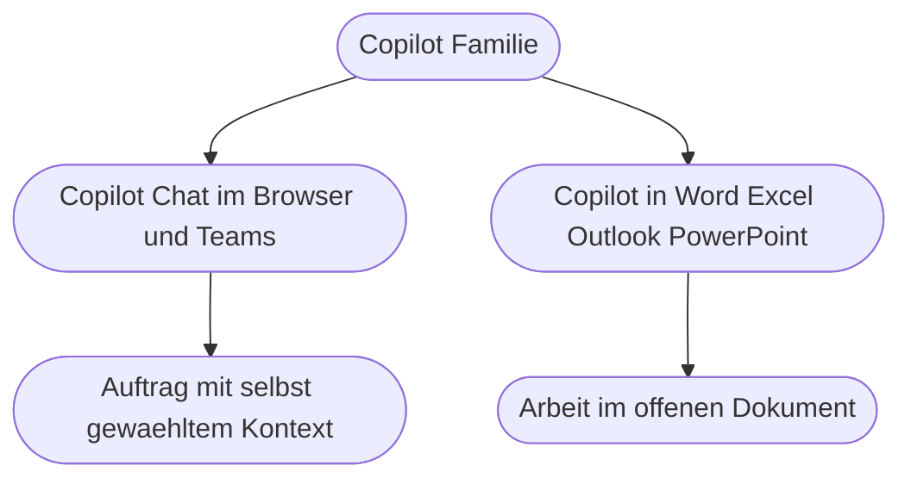
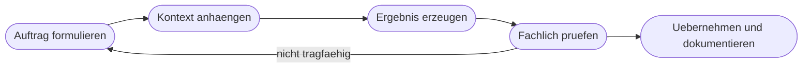

# Kapitel 11 – Copilot in Microsoft 365: Überblick und Arbeitsweise

{{ progress(11) }}

<div class="lernziele" markdown>
<h3>Was du in diesem Kapitel lernst</h3>

- Wo **Copilot** überhaupt sitzt: Copilot Chat im Browser und in Teams gegenüber Copilot **in** Word, Excel, Outlook, PowerPoint und Teams
- Wie Copilot auf deine **eigenen Dateien und Mails** zugreift und warum dabei genau deine bestehenden **Berechtigungen** gelten
- Wie du **Dateien und Links als Kontext** mitgibst, statt auf Erraten zu hoffen
- Warum Copilot in M365 bei **Vertraulichkeit** anders zu bewerten ist als öffentliche Werkzeuge
- Die häufigsten **Enttäuschungen** im Copilot-Alltag und ihre echten Ursachen
- Eine belastbare **Arbeitsweise** aus Auftrag, Kontext, Prüfung und Übernahme
</div>

---

## 11.1 Copilot ist nicht ein Produkt, sondern eine Familie

„Wir haben jetzt Copilot" sagt fast nichts darüber aus, was du konkret vor dir hast. Hinter dem Namen stecken mehrere Zugänge mit deutlich unterschiedlichem Verhalten. Der wichtigste Unterschied verläuft zwischen **Copilot Chat** und **Copilot in der App**.

**Copilot Chat** ist ein Chatfenster – erreichbar über den Browser unter `microsoft365.com/chat`, über die Copilot-App in Teams oder über das Copilot-Symbol in der Titelleiste vieler Office-Programme. Du beschreibst dort einen Auftrag, gibst Kontext mit und bekommst Text zurück, den du selbst weiterverwendest.

**Copilot in der App** arbeitet dagegen im Dokument, in dem du gerade stehst. In Word schreibt es in den Text, in Excel in die Tabelle, in Outlook in den Antwortentwurf. Der Kontext ist dabei meist schon gesetzt: das offene Dokument, die offene Mail, der markierte Bereich.



| Zugang | Wo du ihn findest | Stärke | Typische Aufgabe |
|---|---|---|---|
| Copilot Chat (Browser) | `microsoft365.com/chat` | freie Aufträge, viele Dateien als Kontext | Recherche in eigenen Dokumenten, Entwürfe |
| Copilot Chat (Teams) | Teams → linke Leiste → Copilot | schneller Zugriff im Arbeitsfluss | „Was ist in Projekt X passiert?" |
| Copilot in Word | Word → Registerkarte Start → Copilot | Formulieren im Dokument | Entwurf, Umschreiben, Zusammenfassen |
| Copilot in Outlook | Outlook → Nachricht → Copilot | Kommunikation verdichten | Thread zusammenfassen, Antwort entwerfen |
| Copilot in Excel | Excel → Registerkarte Start → Copilot | Tabellen und Formeln | Formel erzeugen, Auffälligkeiten suchen |
| Copilot in Teams-Besprechungen | Besprechung → Copilot | Gesprächsinhalte festhalten | Zusammenfassung, offene Punkte |

!!! info "Der Funktionsumfang hängt an Lizenz und Freigabe"
    Welche dieser Zugänge du siehst, entscheidet nicht das Programm, sondern deine **Lizenz** und die **Freigaben deiner Organisation**. Es gibt Umgebungen mit vollem Copilot in allen Apps, Umgebungen mit ausschließlich Copilot Chat und Umgebungen ohne Copilot. Wenn dir eine im Kapitel beschriebene Schaltfläche fehlt, ist das kein Fehler deinerseits.

    **Ausweichweg:** Fast jede Aufgabe dieses Blocks lässt sich auch in Copilot Chat lösen, indem du den benötigten Text von Hand in den Chat einfügst. Ohne jeden Copilot-Zugang nutzt du ChatGPT oder Claude – aber ausschließlich mit Inhalten, die dafür freigegeben sind (Kap. 4). Kopiere dann nur den fachlich nötigen Ausschnitt und ersetze Namen durch Platzhalter wie `[Kundenname]`.

---

## 11.2 Woher Copilot deine Daten kennt

Der entscheidende Unterschied zu einem öffentlichen Chatwerkzeug ist der Zugriff auf deine Arbeitsumgebung. Copilot in Microsoft 365 kann auf die Inhalte zugreifen, die in **Microsoft Graph** liegen – das ist die gemeinsame Datenschicht hinter M365: Mails in Outlook, Chats und Kanäle in Teams, Dateien in OneDrive und SharePoint, Termine im Kalender.

Dabei gilt eine Regel, die du dir merken solltest: **Copilot sieht genau das, was du auch selbst sehen könntest.** Es gibt keine Sonderrechte. Wenn du auf eine SharePoint-Bibliothek keinen Zugriff hast, findet Copilot dort nichts für dich. Umgekehrt gilt aber auch: Wenn eine Datei versehentlich für „alle im Unternehmen" freigegeben ist, kann Copilot sie finden und zitieren – ein bestehendes Berechtigungsproblem wird durch Copilot also nicht erzeugt, aber sehr wohl **sichtbar**.

| Frage | Antwort |
|---|---|
| Sieht Copilot mehr als ich? | Nein. Es gelten deine Berechtigungen. |
| Sieht Copilot Dateien auf meiner Festplatte? | Nein. Nur Cloud-Speicher (OneDrive, SharePoint, Teams). |
| Sieht Copilot meine Mails? | Ja, deine eigenen – nicht die von Kolleginnen und Kollegen. |
| Lernt das Modell aus meinen Daten? | Nein, deine Inhalte werden nicht zum Training des Modells verwendet. |
| Bleiben Ergebnisse nachvollziehbar? | Copilot Chat nennt Quellen als Verweis auf Dateien und Mails – prüfe sie. |

!!! warning "Typische Falle: Die Datei liegt lokal"
    Der häufigste Grund für „Copilot findet mein Dokument nicht" ist banal: Die Datei liegt in einem lokalen Ordner oder auf einem Netzlaufwerk, nicht in OneDrive oder SharePoint. Copilot durchsucht nur Cloud-Inhalte. Verschiebe die Datei nach OneDrive und versuche es erneut. Dasselbe gilt für sehr frisch hochgeladene Dateien: Bis sie durchsuchbar sind, kann es einige Zeit dauern.

---

## 11.3 Kontext gezielt mitgeben statt hoffen

Copilot ist kein Hellseher. Die meisten schwachen Ergebnisse entstehen nicht, weil das Modell schlecht ist, sondern weil es den entscheidenden Kontext nicht hatte. Deshalb ist die wichtigste praktische Fähigkeit in diesem Block: **Kontext bewusst anhängen**.

In Copilot Chat gibst du Kontext auf drei Wegen mit:

1. Über das **Anlagen-Symbol** im Eingabefeld: `Copilot Chat → Anlage hinzufügen → Cloud-Dateien` und dann die Datei auswählen.
2. Über einen **Verweis im Text** mit dem Schrägstrich: Du tippst `/` und danach den Dateinamen, zum Beispiel `/Angebotsvorlage`.
3. Über **eingefügten Text**: Du kopierst den relevanten Ausschnitt direkt in den Prompt. Das ist der zuverlässigste Weg, wenn die Dateisuche nicht greift.

Der Unterschied ist gewaltig. Vergleiche diese beiden Aufträge:

```text
Schreib mir eine Zusammenfassung des Projektstands.
```

```text
Rolle: Du bist Projektassistenz in einem Mittelstandsunternehmen.
Aufgabe: Fasse den Stand des Projekts Lagerumbau fuer die Geschaeftsfuehrung
zusammen.
Kontext: Nutze ausschliesslich die angehaengte Datei Projektstatus_Lagerumbau.docx
und die Teams-Kanalbeitraege der letzten vier Wochen im Kanal Lagerumbau.
Format: Ueberschrift, dann drei Absaetze mit maximal 60 Woertern
Stand, Risiken, naechste Schritte. Danach eine Tabelle mit offenen
Entscheidungen und der jeweils verantwortlichen Person.
Einschraenkung: Nenne keine Zahl, die nicht in den Quellen steht. Wenn eine
Angabe fehlt, schreibe dort ausdruecklich unklar.
```

Der zweite Auftrag enthält Rolle, Aufgabe, Kontextquelle, Format und eine Einschränkung gegen Erfundenes. Genau dieses Muster hast du in Kapitel 9 kennengelernt – hier kommt die Kontextquelle als vierter Baustein dazu.

!!! example "Links als Kontext"
    Auch ein Link auf eine SharePoint-Datei oder eine Teams-Nachricht funktioniert als Kontext, solange du selbst Zugriff darauf hast:

    ```text
    Aufgabe: Vergleiche die beiden Angebotsvorlagen unter den folgenden Links und
    liste die Unterschiede in Aufbau, Tonalitaet und Zahlungsbedingungen als
    Tabelle auf.
    Links:
    [SharePoint-Link Vorlage 2024]
    [SharePoint-Link Vorlage 2026]
    Format: Tabelle mit den Spalten Aspekt, Vorlage 2024, Vorlage 2026, Bewertung.
    Einschraenkung: Keine Empfehlung, nur Beschreibung der Unterschiede.
    ```

---

## 11.4 Vertraulichkeit: der Unterschied, der zählt

Für die Praxis reicht es, zwei Kategorien sauber zu unterscheiden.

| Merkmal | Copilot in Microsoft 365 | Öffentliches Werkzeug im Privatkonto |
|---|---|---|
| Datenraum | innerhalb des Mandanten deiner Organisation | Anbieterinfrastruktur außerhalb |
| Berechtigungen | bestehende M365-Rechte gelten | keine, alles Eingefügte ist verfügbar |
| Training mit deinen Eingaben | nein | je nach Tarif und Einstellung möglich |
| Zugriff auf interne Dateien | ja, im Rahmen deiner Rechte | nur, was du manuell hineinkopierst |
| Geeignet für personenbezogene Daten | nur nach interner Freigabe und Prüfung | nein |

Das heißt nicht, dass in Copilot alles erlaubt ist. Es heißt: Der **Datenraum** ist ein anderer. Ob du Bewerberdaten, Gehaltslisten oder Kundenkontodaten überhaupt verarbeiten darfst, entscheidet nicht das Werkzeug, sondern die Rechtsgrundlage und die internen Regeln (Kap. 4). In den Fallbeispielen ab Kapitel 14 wird das je Fachbereich konkret.

!!! warning "Häufiges Missverständnis"
    „Copilot ist von Microsoft, also ist es datenschutzkonform" ist ein Trugschluss. Datenschutzkonform ist nicht ein Werkzeug, sondern eine **Verarbeitung**: bestimmte Daten, bestimmter Zweck, bestimmte Rechtsgrundlage. Copilot in M365 erleichtert die Sache erheblich, ersetzt aber weder Freigabe noch Zweckbindung noch die Beteiligung der Mitbestimmung.

---

## 11.5 Typische Enttäuschungen und ihre Ursachen

Nach den ersten Tagen mit Copilot hört man fast immer die gleichen Sätze. In den meisten Fällen liegt die Ursache nicht im Modell.

| Erlebnis | Wahrscheinliche Ursache | Was du tun kannst |
|---|---|---|
| „Es findet meine Datei nicht." | Datei liegt lokal, nicht in OneDrive oder SharePoint | Datei in die Cloud verschieben, Dateiname exakt nennen |
| „Die Antwort ist beliebig." | Auftrag ohne Rolle, Format und Einschränkung | Auftragsmuster aus 11.3 verwenden |
| „Es erfindet Zahlen." | keine Quelle mitgegeben, Modell füllt Lücken | Quelle anhängen und Erfinden ausdrücklich verbieten |
| „In Word passiert nichts Sinnvolles." | leeres Dokument ohne Kontext | Stichpunkte oder Quelldokument zuerst einfügen |
| „Kollegin bekommt andere Ergebnisse." | andere Berechtigungen, andere Kontextdateien | Kontext explizit gleich setzen und vergleichen |
| „Die Zusammenfassung lässt Wichtiges weg." | keine Angabe, was wichtig ist | Prioritäten und Zielgruppe im Auftrag nennen |

!!! tip "Die Zwei-Versuche-Regel"
    Verwirf ein Ergebnis nie nach dem ersten Versuch. Formuliere stattdessen einen **Nachschärfer** – eine kurze Korrekturanweisung im gleichen Chat:

    ```text
    Zu allgemein. Streiche alle Saetze, die auch fuer ein beliebiges anderes
    Projekt gelten wuerden. Ergaenze zu jedem Risiko die betroffene Abteilung und
    ein Datum. Maximal 150 Woerter.
    ```

    Erst wenn auch der zweite Versuch nichts bringt, fehlt in der Regel Kontext – nicht Modellqualität.

---

## 11.6 Eine Arbeitsweise, die trägt

Damit aus Einzelversuchen verlässliche Routine wird, brauchst du einen festen Ablauf. Er ist immer derselbe, unabhängig vom Fachbereich:



Der Schritt, der in der Praxis am häufigsten übersprungen wird, ist die **fachliche Prüfung**. Sie ist keine Formalie: Ein sprachlich perfekter Text kann eine falsche Frist, eine erfundene Referenz oder eine nicht existierende interne Regel enthalten. Ab Kapitel 12 bekommst du dafür eine konkrete Prüfliste. Denn Copilot verkürzt den Weg vom leeren Blatt zum Entwurf – nicht den Weg vom Entwurf zur Verantwortung. Wer unterschreibt, versendet oder bucht, haftet, nicht das Werkzeug.

---

## Zusammenfassung

- Copilot ist eine Familie: **Copilot Chat** für freie Aufträge mit selbst gewähltem Kontext, **Copilot in der App** für Arbeit im offenen Dokument.
- Der Zugriff läuft über **Microsoft Graph** und respektiert exakt deine **bestehenden Berechtigungen** – lokale Dateien bleiben unsichtbar.
- Gute Ergebnisse entstehen durch **bewusst angehängten Kontext**: Datei, Link oder eingefügter Text plus Rolle, Format und Einschränkung.
- Copilot in M365 arbeitet in einem anderen **Datenraum** als öffentliche Werkzeuge – das ersetzt aber keine Freigabe und keine Zweckbindung.
- Die meisten Enttäuschungen haben drei Ursachen: **fehlender Kontext**, **unklarer Auftrag**, **Datei nicht in der Cloud**.
- Der tragfähige Ablauf lautet immer: Auftrag, Kontext, Ergebnis, **Prüfung**, Übernahme.

---

## Kurzübungen

{{ task(file="tasks/k11_01.yaml") }}

{{ task(file="tasks/k11_02.yaml") }}

{{ task(file="tasks/k11_03.yaml") }}

---

## Workshop

{{ task(file="tasks/workshop_k11.yaml") }}
