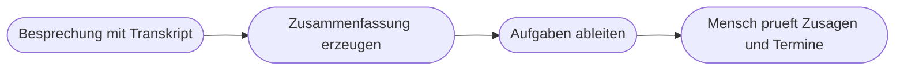

# Kapitel 12 – KI-gestützte Textarbeit in Word, Outlook und Teams

{{ progress(12) }}

<div class="lernziele" markdown>
<h3>Was du in diesem Kapitel lernst</h3>

- Wie du in **Word** Entwürfe erzeugst, umschreibst, kürzt und den **Ton** wechselst
- Wie du **lange Dokumente** zusammenfasst und gezielt befragst, statt sie ganz zu lesen
- Wie du in **Outlook** E-Mail-Threads verdichtest und Antwortentwürfe erzeugst
- Wie du aus einer **Teams-Besprechung** eine belastbare Zusammenfassung mit Aufgaben ableitest
- Wie du **Corporate Wording** und Textbausteine in wiederverwendbare Vorlagen überführst
- Eine konkrete **Prüfliste** für KI-Texte – der Schritt, der über Qualität entscheidet
</div>

---

## 12.1 Was KI an Textarbeit tatsächlich beschleunigt

KI ist nicht überall gleich stark. Wer sie an der falschen Stelle einsetzt, verliert Zeit statt sie zu gewinnen:

| Tätigkeit | Zeitgewinn | Warum |
|---|---|---|
| Erster Entwurf aus Stichpunkten | sehr hoch | Das leere Blatt kostet die meiste Zeit |
| Umformulieren, Ton wechseln | sehr hoch | Sprachliche Umformung ist die Kernstärke |
| Lange Texte zusammenfassen | hoch | Struktur erkennen geht schneller als lesen |
| Fachliche Richtigkeit prüfen | kein Gewinn | Das Modell kennt deine internen Regeln nicht |
| Verbindliche Zusagen formulieren | negativ | Erfundene Fristen und Konditionen sind teuer |

!!! info "Merksatz"
    KI ist stark bei der **Form** und schwach bei der **Verbindlichkeit**. Delegiere Formulierung, Struktur und Tonlage. Behalte Fakten, Zahlen, Fristen und Zusagen bei dir.

---

## 12.2 Word: entwerfen, umschreiben, kürzen, Ton wechseln

Der Einstieg läuft über `Word → Registerkarte Start → Copilot → Entwurf mit Copilot`. Der wichtigste Hebel ist die **Stichpunktübergabe**: Du gibst nicht ein Thema, sondern deine Inhalte. Aus einem Thema entsteht Beliebigkeit, aus Stichpunkten entsteht dein Text.

```text
Rolle: Du bist Mitarbeiterin im Innendienst der Musterhandel GmbH.
Aufgabe: Schreibe ein Anschreiben zur Ankuendigung einer Preisanpassung an
Bestandskunden.
Kontext, meine Stichpunkte:
- Anpassung ab 01.04., durchschnittlich vier Prozent
- Grund: gestiegene Fracht- und Verpackungskosten
- Bestehende Rahmenvereinbarungen bleiben bis Jahresende unberuehrt
- Ansprechpartnerin fuer Rueckfragen: Frau Berger, Innendienst
Format: Betreffzeile, Anrede mit Platzhalter [Kundenname], drei kurze Absaetze,
Gruss. Maximal 200 Woerter. Ton sachlich, kein Bedauern.
Einschraenkung: Nenne keine Prozentwerte oder Termine, die nicht oben stehen.
Keine Entschuldigung und keine Zusage auf Ausnahmen.
```

Fürs **Umschreiben** markierst du den Textabschnitt und wählst `Word → Copilot → Umschreiben mit Copilot`. Oft ist der Chatweg aber präziser, weil du die Richtung vorgeben kannst:

| Ziel | Konkrete Anweisung |
|---|---|
| Kürzen | `Kuerze auf 120 Woerter. Streiche zuerst Nebensaetze und Fuellwoerter, nicht Inhalte.` |
| Verständlicher | `Formuliere fuer Leser ohne Fachkenntnis. Erklaere jeden Fachbegriff im Satz, in dem er vorkommt.` |
| Freundlicher, ohne weich | `Freundlicherer Ton, aber ohne Konjunktive und ohne Abschwaechungen wie eventuell oder gegebenenfalls.` |

!!! warning "Typische Falle: Der Tonwechsel schleift Inhalte mit"
    Wenn du „freundlicher" oder „kürzer" verlangst, verändert das Modell nicht nur die Sprache – es lässt gern auch Bedingungen, Fristen oder Einschränkungen weg, weil sie unfreundlich oder lang wirken. Vergleiche nach jedem Tonwechsel die **harten Angaben** von Vorher und Nachher: Zahlen, Datumsangaben, Namen, Bedingungen.

---

## 12.3 Lange Dokumente zusammenfassen und befragen

Bei einem 40-seitigen Dokument ist „Fasse das zusammen" fast immer die schwächste Frage. Eine Zusammenfassung ohne Zweck gewichtet gleichmäßig – und du brauchst gerade die Gewichtung.

Zwei bessere Muster sind die **zweckgebundene Zusammenfassung** und die **gezielte Befragung**. Beide verbindet die wirkungsvollste Einzelanweisung für Dokumentarbeit: jede Aussage mit Fundstelle belegen. Das kostet nichts, macht die Prüfung um ein Vielfaches schneller und senkt die Neigung des Modells, Lücken plausibel zu füllen.

```text
Aufgabe: Fasse das angehaengte Dokument fuer eine Entscheidung ueber die
Verlaengerung des Vertrags zusammen.
Format:
1. Empfehlungsrelevante Punkte, maximal fuenf Bullets
2. Tabelle mit den Spalten Risiko, Auswirkung, Fundstelle
3. Liste der Punkte, die im Dokument offen bleiben
Einschraenkung: Jede Aussage mit Abschnittsnummer belegen. Keine eigene
Empfehlung.
```

```text
Aufgabe: Beantworte aus dem angehaengten Dokument ausschliesslich diese vier
Fragen. Nutze keine anderen Quellen.
1. Welche Kuendigungsfristen sind genannt?
2. Welche Leistungen sind ausdruecklich ausgeschlossen?
3. Welche Pflichten treffen uns bei Verzug?
4. Welche Stellen widersprechen sich?
Format: Je Frage ein Absatz mit maximal 40 Woertern plus Fundstelle. Steht die
Antwort nicht im Dokument, schreibe nicht enthalten.
```

---

## 12.4 Outlook: Threads verdichten und Antworten entwerfen

Der Klickpfad lautet `Outlook → Nachricht öffnen → Copilot → Zusammenfassen` beziehungsweise `Outlook → Antworten → Copilot → Entwurf mit Copilot`. Ein Thread mit 18 Nachrichten enthält typischerweise drei Sachinformationen und fünfzehn Mal Höflichkeit, Zitate und Terminfindung. Genau dieses Verhältnis macht die Verdichtung so wertvoll – wenn du sagst, worauf es dir ankommt:

```text
Aufgabe: Verdichte den ausgewaehlten Mailverlauf.
Format:
- Sachstand in maximal drei Saetzen
- Tabelle: Wer hat was zugesagt, mit Datum der Nachricht
- Offene Fragen und was von mir erwartet wird
Einschraenkung: Keine Hoeflichkeitsfloskeln uebernehmen. Widersprueche zwischen
Nachrichten ausdruecklich als Widerspruch benennen.
```

Für Antwortentwürfe gilt: Gib die **Position** vor, statt sie erfinden zu lassen.

```text
Aufgabe: Entwirf eine Antwort auf die ausgewaehlte Nachricht.
Meine Position: Wir koennen den Liefertermin nicht vorziehen. Wir bieten eine
Teillieferung am urspruenglichen Termin an, den Rest zwei Wochen spaeter.
Ton: freundlich, klar, keine Entschuldigungsschleifen.
Format: Maximal 130 Woerter, ein Angebot am Ende, keine Rueckfrage.
Einschraenkung: Keine Mengen, Preise oder Termine nennen, die nicht in meiner
Position oder in der Anfrage stehen.
```

!!! warning "Der gefährlichste Satz in KI-Mails"
    Antwortentwürfe erzeugen ungefragt Zusagen: „Selbstverständlich können wir das bis Freitag umsetzen", „Gerne erstatten wir Ihnen die Kosten". Solche Sätze klingen kundenfreundlich und sind rechtlich relevant. Suche in jedem Entwurf zuerst nach **Zusagen, Fristen und Zahlen** – und lösche alles, was du nicht selbst vorgegeben hast.

---

## 12.5 Teams: Besprechung, Zusammenfassung, Aufgaben

In einer Besprechung mit aktivierter Aufzeichnung oder Transkription erreichst du Copilot über `Teams → Besprechung → Copilot`; danach findest du die Zusammenfassung unter `Teams → Kalender → Besprechung → Registerkarte Zusammenfassung`. Der Mehrwert entsteht weniger bei der Zusammenfassung selbst als bei der **Aufgabenableitung**: Eine Protokollzusammenfassung liest niemand zweimal, eine Aufgabenliste mit Verantwortlichen und Terminen wird zum Arbeitsmittel.

```text
Aufgabe: Leite aus der Besprechung die Aufgaben ab.
Format: Tabelle mit den Spalten Aufgabe, Verantwortlich, Termin, Quelle im
Gespraech.
Regeln:
- Nur Aufgaben aufnehmen, die im Gespraech tatsaechlich zugesagt wurden
- Wenn keine Person genannt wurde, schreibe offen statt einen Namen zu raten
- Wenn kein Termin genannt wurde, schreibe kein Termin
- Danach separat: diskutierte, aber nicht entschiedene Themen
```



!!! info "Der Ausweichweg ohne Besprechungs-Copilot"
    Ohne Copilot in Teams-Besprechungen bleibt der klassische Weg: Notizen als Stichpunkte mitschreiben, danach in Copilot Chat einfügen und mit demselben Auftrag verarbeiten. Das Ergebnis ist erfahrungsgemäß nicht schlechter, weil deine Stichpunkte schon eine Vorauswahl enthalten. Achte darauf, dass eine Aufzeichnung oder Transkription nicht ohne Zustimmung der Beteiligten und ohne Beteiligung der Mitbestimmung eingeschaltet wird (Kap. 4).

---

## 12.6 Corporate Wording, Textbausteine und die Prüfliste

Wenn zwölf Leute KI-Texte erzeugen, entstehen zwölf Tonlagen. Dagegen hilft ein **Wording-Block**: ein fester Textbaustein, den du an jeden Schreibauftrag anhängst.

```text
Wording Musterhandel GmbH, immer anhaengen:
- Anrede: Sehr geehrte Frau [Name] bzw. Sehr geehrter Herr [Name]
- Wir-Form, aktiv, keine Passivkonstruktionen
- Keine Superlative, keine Ausrufezeichen, keine Emojis
- Wir sagen Auftrag, nicht Order. Wir sagen Rechnung, nicht Invoice
- Fristen immer mit konkretem Datum, nie mit kurzfristig oder zeitnah
- Kein Bedauern ohne Anlass, keine Entschuldigung ohne Fehler
```

Noch wirksamer sind **Textbausteine mit Platzhaltern** in einer gemeinsamen Vorlagensammlung, etwa in einer SharePoint-Bibliothek. Und dann kommt der Schritt, der in der Praxis am häufigsten fehlt.

| Prüfschritt | Konkrete Frage | Warum |
|---|---|---|
| 1. Fakten | Steht jede Zahl, jedes Datum, jeder Name so in meiner Quelle? | Häufigster Fehlertyp |
| 2. Zusagen | Enthält der Text eine Verpflichtung, die ich nicht vorgegeben habe? | Rechtlich relevant |
| 3. Vollständigkeit | Fehlt eine Bedingung oder Einschränkung, die im Original stand? | Tonwechsel schleift mit |
| 4. Ton und Adressat | Passt das zur Beziehung und zum Anlass? | Modell trifft Register oft zu glatt |
| 5. Wording | Sind unsere Begriffe und Anredeformen eingehalten? | Außenwirkung |
| 6. Eigenständigkeit | Würde dieser Text auch für ein beliebiges anderes Unternehmen passen? | Erkennungsmerkmal für Beliebigkeit |
| 7. Verantwortung | Kann ich diesen Text mit meinem Namen darunter vertreten? | Letzte Instanz |

!!! example "Prüfliste angewandt"
    Ein Entwurf enthielt den Satz: „Selbstverständlich kümmern wir uns umgehend um Ihr Anliegen und melden uns zeitnah mit einer Lösung." Prüfschritt 2 findet die Zusage „mit einer Lösung", Prüfschritt 5 findet „zeitnah" als verbotene unbestimmte Frist.     Korrigierte Fassung: „Wir prüfen Ihr Anliegen und melden uns bis Donnerstag, 12. März, mit einer Rückmeldung." Kürzer, verbindlicher, und es ist genau das zugesagt, was auch eingehalten werden kann.

    Nutze die Prüfliste die ersten Wochen bewusst und schriftlich. Danach sitzen die Schritte 1, 2 und 3 als Reflex – und genau die drei sind die teuren.

---

## Zusammenfassung

- KI ist stark bei **Form, Struktur und Tonlage** und schwach bei **Verbindlichkeit** – teile Aufgaben entsprechend auf.
- In Word gilt: **Stichpunkte übergeben**, nicht Themen. Aus einem Thema entsteht Beliebigkeit.
- Bei langen Dokumenten ist **zweckgebundene Zusammenfassung oder gezielte Befragung** besser als „fasse zusammen" – mit **Fundstellenpflicht**.
- In Outlook lohnt Verdichtung besonders bei Threads; bei Antwortentwürfen gibst du die **Position** vor. Aus Teams-Besprechungen ist die **Aufgabenableitung** wertvoller als die Zusammenfassung.
- **Corporate Wording** als anhängbarer Block plus eine feste **Prüfliste** machen aus Einzelversuchen verlässliche Textqualität.

---

## Kurzübungen

{{ task(file="tasks/k12_01.yaml") }}

{{ task(file="tasks/k12_02.yaml") }}

{{ task(file="tasks/k12_03.yaml") }}

---

## Workshop

{{ task(file="tasks/workshop_k12.yaml") }}
