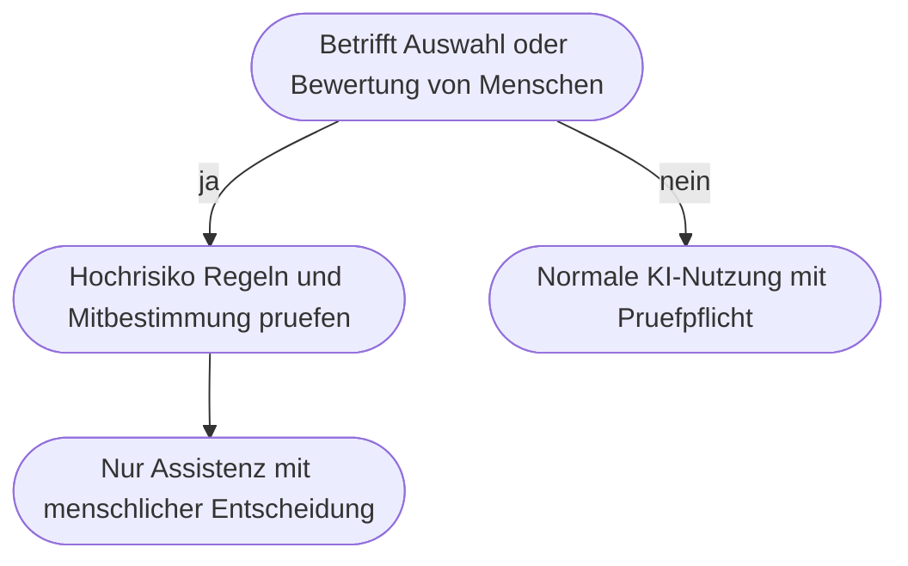

# Kapitel 14 – Fallbeispiel HR: Personalarbeit mit KI und ihre Grenzen

{{ progress(14) }}

<div class="lernziele" markdown>
<h3>Was du in diesem Kapitel lernst</h3>

- Warum die Personalauswahl im **EU AI Act als Hochrisiko** eingestuft ist und was daraus folgt
- Wie du **Stellenanzeige und Anforderungsprofil** mit KI schärfer und diskriminierungsärmer bekommst
- Wie eine **Sichtung von Bewerbungsunterlagen** als Assistenz aussehen darf – und wo sie aufhört
- Wie du **strukturierte Interviewleitfäden** erstellst, die vergleichbare Ergebnisse liefern
- Wie du **Onboarding-Plan** und **Mitarbeitergespräche** vorbereitest, wie ein **Personalfragen-Assistent** auf internen Richtlinien funktioniert und welche Rolle **Mitbestimmung** dabei spielt
</div>

---

## 14.1 Die Leitplanke steht am Anfang, nicht am Ende

In den anderen Fachbereichen dieses Blocks kannst du erst arbeiten und dann prüfen. In HR nicht: Personalarbeit betrifft Entscheidungen über Menschen und ihre Erwerbsmöglichkeit. Drei Sätze musst du kennen, bevor du das erste Werkzeug öffnest. **Erstens: Beschäftigtenauswahl ist Hochrisiko.** Der EU AI Act stuft KI-Systeme für Einstellung, Auswahl, Beförderung oder Kündigung als **Hochrisiko-Anwendung** ein (Kap. 4). Daran hängen Pflichten zu Risikomanagement, Dokumentation, Datenqualität, Transparenz gegenüber Betroffenen und wirksamer menschlicher Aufsicht. Sie treffen vor allem Anbieter und betreibende Organisationen, bestimmen aber, was in deinem Unternehmen eingesetzt werden darf.

**Zweitens: Keine automatisierte Entscheidung über Menschen.** Eine Ablehnung, eine Rangfolge von Bewerbenden oder eine Eignungsbewertung darf nicht das Ergebnis eines Werkzeugs sein. Die DSGVO schützt Betroffene vor Entscheidungen, die ausschließlich auf automatisierter Verarbeitung beruhen und erhebliche Auswirkungen haben. Wer eine KI-Rangliste durchwinkt, ohne sie inhaltlich zu prüfen, entscheidet nicht – er nickt. **Drittens: Bewerberdaten gehören nicht in öffentliche Werkzeuge.** Ein Lebenslauf ist ein dichtes Bündel personenbezogener Daten, oft einschließlich besonderer Kategorien wie Gesundheit, Herkunft oder Religionszugehörigkeit. Ihn in ein privates Chatkonto zu kopieren, ist keine Grauzone, sondern eine unzulässige Übermittlung – auch bei „nur dem Werdegang".



!!! warning "Mitbestimmung ist kein Formalismus"
    Der Einsatz von KI-Werkzeugen in der Personalarbeit berührt Mitbestimmungsrechte des Betriebsrats – insbesondere bei technischen Einrichtungen, die zur Überwachung von Verhalten oder Leistung geeignet sind, und bei Auswahlrichtlinien. Ein Werkzeug, das Bewerbungen bewertet oder Leistungsdaten verdichtet, ist mitbestimmungspflichtig. Wer es „erst mal im Kleinen ausprobiert", schafft keine Erleichterung, sondern eine Rechtsverletzung und verbrennt das Vertrauen für alle späteren Vorhaben.

---

## 14.2 Stellenanzeige und Anforderungsprofil

Hier ist der Nutzen groß und das Risiko klein. Der entscheidende Schritt kommt vor der Anzeige: das **Anforderungsprofil**, also die begründete Trennung zwischen dem, was jemand wirklich braucht, und dem, was sich über Jahre eingeschlichen hat.

```text
Rolle: Du bist Personalreferentin und arbeitest anforderungsbasiert.
Aufgabe: Entwickle ein Anforderungsprofil fuer die Stelle Sachbearbeitung
Auftragsabwicklung bei der Musterhandel GmbH.
Kontext, Taetigkeiten laut Fachbereich: Auftraege aus Mail und Telefon erfassen
und pruefen, Liefertermine mit Lager und Spedition abstimmen, Reklamationen
aufnehmen und weiterleiten, monatliche Auswertung offener Auftraege in Excel.
Format: Tabelle mit den Spalten Anforderung, Muss oder Kann, Begruendung aus
der Taetigkeit, Nachweis im Auswahlverfahren.
Einschraenkung: Jede Anforderung muss sich aus einer genannten Taetigkeit
ableiten lassen. Keine Anforderungen zu Alter, Geschlecht, Herkunft, Familien-
stand, Aussehen oder Muttersprachlichkeit. Keine Berufserfahrung in Jahren.
```

Aus dem geprüften Profil entsteht die Anzeige. Dann folgt der Schritt, der in der Praxis fast immer fehlt: die **Gegenprüfung auf Diskriminierungsrisiko**.

```text
Aufgabe: Pruefe den folgenden Anzeigentext auf Formulierungen, die Bewerbende
mittelbar ausschliessen oder abschrecken koennten. Pruefe insbesondere
Geschlecht, Alter, Herkunft und Sprache, Behinderung, Religion,
Familiensituation, soziale Herkunft.
Format: Tabelle mit den Spalten Fundstelle, Risiko, Begruendung,
Alternativformulierung.
Einschraenkung: Keine Stilkritik, nur Fundstellen mit konkretem Risiko. Wenn du
nichts findest, sage das ausdruecklich.
```

| Formulierung | Risiko | Bessere Fassung |
|---|---|---|
| „junges, dynamisches Team" | Alter | „Team mit kurzen Entscheidungswegen" |
| „Muttersprachler Deutsch" | Herkunft | „sehr gute Deutschkenntnisse in Wort und Schrift" |
| „körperlich belastbar" ohne Bezug | Behinderung | konkrete Tätigkeit nennen, etwa „Heben von Paketen bis 15 kg" |
| „mindestens 10 Jahre Erfahrung" | Alter, mittelbar | „nachgewiesene Erfahrung in [Tätigkeit]" |

Diskriminierende Formulierungen sind meist nicht böse gemeint, sondern **eingeschliffen** – und genau solche sprachlichen Muster erkennt ein Sprachmodell zuverlässig. Es ersetzt keine rechtliche Prüfung, findet aber die offensichtlichen zwei Drittel in Sekunden.

---

## 14.3 Bewerbungssichtung: Assistenz, keine Auswahl

Das ist die heikelste Anwendung in diesem Kapitel. Die Trennlinie verläuft zwischen **Aufbereiten** und **Bewerten** – und sie ist in der Praxis klar erkennbar: Ein Werkzeug, dessen Ausgabe man in eine Reihenfolge bringen kann, bewertet. Ein Werkzeug, dessen Ausgabe für alle Unterlagen dieselbe neutrale Struktur hat, bereitet auf.

| Erlaubte Assistenz | Nicht zulässig |
|---|---|
| Unterlagen in ein einheitliches Übersichtsformat bringen | Rangfolge oder Punktzahl der Bewerbenden erzeugen |
| Prüfen, ob formale Nachweise vorhanden sind | Eignung oder Persönlichkeit einschätzen |
| Fehlende Angaben und Lücken benennen | Aus Lücken auf Zuverlässigkeit schließen |
| Absageschreiben nach getroffener Entscheidung | Absageentscheidung oder Ablehnungsempfehlung |

```text
Aufgabe: Bringe die Angaben der angehaengten Bewerbung in ein Uebersichtsformat.
Format: Tabelle mit den Zeilen Abschluss und Qualifikation, Berufliche Stationen
mit Zeitraeumen, Nachgewiesene Kenntnisse mit Fundstelle, Angaben zu den vier
Muss-Anforderungen des Anforderungsprofils, Fehlende oder unklare Angaben.
Einschraenkung: Ausschliesslich Angaben uebernehmen, die in den Unterlagen
stehen. Keine Bewertung, keine Punktzahl, keine Rangfolge, keine Einschaetzung
von Eignung oder Persoenlichkeit. Keine Rueckschluesse aus Luecken. Fehlende
Angaben als fehlt markieren.
```

!!! warning "Warum eine Rangliste auch bei menschlicher Freigabe unzulässig bleibt"
    Der häufigste Einwand lautet: „Ich prüfe die Rangliste doch nachher." Das hält der Praxis nicht stand. Wer eine Reihenfolge vorgelegt bekommt, prüft die oberen Plätze intensiv und die unteren gar nicht – das ist keine Charakterschwäche, sondern ein bekannter Ankereffekt. Die Rangliste hat die Entscheidung damit faktisch getroffen. Deshalb darf sie nicht entstehen, nicht erst nicht befolgt werden. Kommt sie als Funktion eines Bewerbermanagementsystems von außen, ist das ein Fall für Datenschutz, Mitbestimmung und Rechtsabteilung – nicht für einen Praxistest.

---

## 14.4 Strukturierte Interviewleitfäden

Unstrukturierte Interviews sind der Ort, an dem die meisten Fehlentscheidungen entstehen: Jede Person wird etwas anderes gefragt, am Ende entscheidet Sympathie, und begründen lässt sich nichts. Ein **strukturierter Leitfaden** stellt allen dieselben Fragen mit denselben Bewertungsankern – dieses Gerüst lässt sich gut mit KI erstellen.

```text
Rolle: Du unterstuetzt bei der Erstellung strukturierter Auswahlgespraeche.
Aufgabe: Erstelle einen Interviewleitfaden fuer die Stelle Sachbearbeitung Auftragsabwicklung.
Kontext: Nutze die vier Muss-Anforderungen aus dem angehaengten Anforderungsprofil.
Gespraechsdauer 45 Minuten, zwei Gespraechsfuehrende.
Format: Je Muss-Anforderung eine verhaltensbasierte Hauptfrage nach dem Muster Schildern Sie
eine Situation, zwei Nachfragen zu konkretem Handeln, Beobachtungsanker fuer die Stufen
unzureichend, ausreichend, stark. Danach ein Ablaufplan mit Zeitangaben.
Einschraenkung: Keine Fragen zu Familienplanung, Gesundheit, Religion, Herkunft oder
Vermoegen. Keine Fangfragen. Beobachtungsanker beschreiben Verhalten, nicht Eigenschaften.
```

Die Bewertung schreiben die Gesprächsführenden anschließend selbst – von Hand, unabhängig voneinander, vor dem Austausch. KI hilft beim Zusammenführen der Notizen zu einem Protokoll, nicht bei der Bewertung.

!!! tip "Der Test für einen guten Beobachtungsanker"
    Ein Anker ist brauchbar, wenn zwei Personen unabhängig voneinander dieselbe Stufe ankreuzen würden. „Wirkt strukturiert" scheitert daran; „Nennt bei der Terminabstimmung von sich aus die betroffenen Stellen und einen Zeitpunkt" funktioniert. Verlange beobachtbares Verhalten, sonst produziert das Werkzeug Eigenschaftswörter.

---

## 14.5 Onboarding-Plan und Mitarbeitergespräche

Nach der Entscheidung verschwinden die Hochrisiko-Fragen – hier ist KI ein sehr guter Assistent. Für das **Onboarding** ist der Hebel die Vollständigkeit: Vergessene Zugänge, fehlende Einweisungen und unklare Ansprechpersonen kosten neue Beschäftigte die ersten zwei Wochen.

```text
Aufgabe: Erstelle einen Onboarding-Plan fuer die ersten 30 Tage einer neuen Person in der
Auftragsabwicklung bei der Musterhandel GmbH.
Kontext: Team von acht Personen, Einarbeitung durch Frau Berger, Notebook und Telefon,
Fachsystem fuer Auftraege, Excel-Auswertungen, erste Kundengespraeche ab Woche drei.
Format: Tabelle mit den Spalten Tag oder Woche, Thema, Verantwortlich, Ergebnis. Gliedere in
vier Bereiche: Technische Ausstattung und Zugaenge, Fachliche Einarbeitung, Menschen und
Netzwerk, Pflicht- und Sicherheitsthemen.
Einschraenkung: Jede Zeile braucht eine verantwortliche Rolle, keine Zeile mit
Verantwortlichkeit alle. Keine Schulungsthemen erfinden.
```

Für **Mitarbeitergespräche** ist der Nutzen die Vorbereitung, nicht der Inhalt. Ein Sprachmodell hilft, Beobachtungen zu ordnen und schwierige Punkte klar zu formulieren. Es darf keine Leistungsbewertung erzeugen und keine personenbezogenen Leistungsdaten in ein Werkzeug tragen, für das es keine Freigabe gibt.

```text
Aufgabe: Hilf mir, ein Jahresgespraech vorzubereiten.
Kontext, meine eigenen Beobachtungen: fachlich sicher, uebernimmt schwierige Kundenfaelle von
sich aus, uebergibt Aufgaben spaet mit zweimal Terminverzug im Team, moechte perspektivisch
mehr Verantwortung uebernehmen.
Format: Drei priorisierte Gespraechsziele, je Beobachtung eine Formulierung nach dem Muster
Beobachtung, Wirkung, Bitte, drei offene Fragen, zwei moegliche Einwaende mit je einer
sachlichen Reaktion.
Einschraenkung: Keine Bewertung der Person, keine Charaktereigenschaften, keine Formulierung,
die eine Konsequenz ankuendigt.
```

!!! warning "Personenbezug bleibt Personenbezug"
    „Anonymisiert" heißt nicht „Name weggelassen". In einem Team von acht Personen ist eine Beschreibung wie „übergibt Aufgaben spät, zweimal Terminverzug" oft eindeutig zuordenbar. Verwende solche Inhalte nur in freigegebenen Werkzeugen innerhalb deiner Organisation und formuliere so knapp wie möglich. Bei Leistungs- und Verhaltensdaten kommt die Mitbestimmung ins Spiel, sobald daraus eine systematische Auswertung wird.

---

## 14.6 Personalfragen-Assistent auf Basis interner Richtlinien

Der wirtschaftlich interessanteste HR-Anwendungsfall ist unspektakulär: die immer gleichen Fragen zu Urlaubsübertrag, Reisekosten, Elternzeit oder Fortbildungsantrag. Ein Assistent, der ausschließlich aus den internen Richtlinien antwortet, entlastet HR spürbar und ist rechtlich unkritisch – solange drei Bedingungen erfüllt sind: **nur interne Quellen** (Wissensbasis auf die freigegebene SharePoint-Bibliothek beschränkt), **keine Auskunft ohne Quelle** (Antwort mit Fundstelle, sonst ausdrücklich „nicht geregelt") und **kein Einzelfallurteil** (bei individuellen Ansprüchen an HR verweisen). In einer Instruktion sieht das so aus:

```text
Instruktion fuer den Assistenten:
Du beantwortest Fragen von Beschaeftigten zu Personalthemen der Musterhandel GmbH und nutzt
ausschliesslich die freigegebenen internen Richtlinien als Quelle.
Regeln:
- Jede Antwort nennt die Richtlinie und den Abschnitt als Fundstelle
- Ist ein Sachverhalt nicht geregelt, antworte In den Richtlinien nicht geregelt, bitte wende
  dich an die Personalabteilung
- Du entscheidest keine Einzelfaelle, gibst keine Rechtsauskunft, bewertest keine Personen und
  beantwortest keine Fragen zu anderen Beschaeftigten
- Bei Krankheit, Behinderung, Schwangerschaft oder Konflikten verweist du unmittelbar auf die
  Personalabteilung
Ton: sachlich, freundlich, kurz. Maximal 120 Woerter je Antwort.
```

Wie du so etwas als eigenen Agenten aufbaust, folgt in Kapitel 32. Die Instruktion zeigt bereits das Grundmuster jeder verantwortbaren HR-Anwendung: enge Quelle, Fundstellenpflicht, klarer Ausstiegspfad zum Menschen.

!!! info "Merksatz für den ganzen Bereich"
    In HR gilt eine Reihenfolge, von der du nicht abweichen solltest: **Rechtslage prüfen, dann Mitbestimmung einbeziehen, dann Werkzeug einsetzen, dann Ergebnis verantworten.**

---

## Zusammenfassung

- Personalauswahl gilt im **EU AI Act als Hochrisiko** (Kap. 4); daran hängen Dokumentations-, Transparenz- und Aufsichtspflichten.
- Eine **automatisierte Entscheidung über Menschen** ist unzulässig – und eine durchgewinkte KI-Rangliste ist faktisch eine solche Entscheidung.
- **Bewerberdaten gehören nie in öffentliche Werkzeuge**, auch nicht auszugsweise und nicht zum Testen. Bei **Stellenanzeige und Anforderungsprofil** ist der Nutzen hoch: Anforderungen aus Tätigkeiten ableiten und Formulierungen auf Diskriminierungsrisiko gegenprüfen.
- Bei der **Sichtung** verläuft die Grenze zwischen Aufbereiten und Bewerten: einheitliche Struktur ja, Rangfolge und Eignungsurteil nein. **Strukturierte Interviewleitfäden** mit beobachtbaren Ankern machen Gespräche vergleichbar; die Bewertung bleibt beim Menschen.
- **Onboarding, Gesprächsvorbereitung und Richtlinien-Assistent** sind die risikoarmen Anwendungen mit dem schnellsten Nutzen. **Mitbestimmung** ist bei jedem Werkzeug einzubeziehen, das Verhalten oder Leistung auswerten kann.

---

## Kurzübungen

{{ task(file="tasks/k14_01.yaml") }}

{{ task(file="tasks/k14_02.yaml") }}

{{ task(file="tasks/k14_03.yaml") }}

---

## Workshop

{{ task(file="tasks/workshop_k14.yaml") }}
