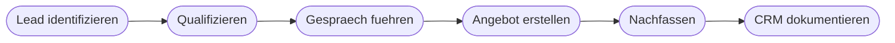

# Kapitel 15 – Fallbeispiel Vertrieb: vom Lead bis zur CRM-Notiz

{{ progress(15) }}

<div class="lernziele" markdown>
<h3>Was du in diesem Kapitel lernst</h3>

- Wo im **Vertriebsprozess** KI tatsächlich Zeit spart und wo sie schadet
- Wie **Lead-Recherche und Qualifizierung** funktionieren, ohne dass Vermutungen zu Fakten werden
- Wie du dich mit KI auf ein **Kundengespräch** vorbereitest und wie **Angebots- und Nutzentexte** entstehen, die nichts versprechen, was nicht gedeckt ist
- Wie du **Einwandbehandlung** vorbereitest, **Follow-up-Sequenzen** aufbaust und aus einem Gesprächsprotokoll eine brauchbare **CRM-Notiz** machst
- Wo **Personalisierung** in Vertrauensverlust kippt
</div>

---

## 15.1 Der Vertriebsprozess und die Stellen, an denen KI wirkt

Im Vertrieb ist die Versuchung besonders groß, KI überall einzusetzen – weil fast alles Text ist. Genau deshalb lohnt eine nüchterne Einordnung.



| Prozessschritt | KI-Nutzen | Risiko | Was beim Menschen bleibt |
|---|---|---|---|
| Lead identifizieren | mittel | erfundene Firmenangaben | Prüfen, ob die Firma so existiert |
| Qualifizieren | hoch | Vermutung wird zur Tatsache | Bedarf im Gespräch verifizieren |
| Gespräch vorbereiten | sehr hoch | keines, wenn intern | Fragen tatsächlich stellen |
| Angebot erstellen | hoch | erfundene Preise und Leistungen | Konditionen und Zusagen |
| Nachfassen | sehr hoch | Serienbrief-Wirkung | Entscheidung, ob überhaupt |
| CRM dokumentieren | hoch | Glättung von Warnsignalen | Bewertung der Chance |

!!! info "Merksatz für den Vertrieb"
    KI hilft dir, **schneller vorbereitet** zu sein. Sie hilft dir nicht, **mehr zu behaupten**. Jede erfundene Referenz, jeder erfundene Preis und jede erfundene Zusage kostet dich genau einmal einen Kunden – und dann dauerhaft die Glaubwürdigkeit.

---

## 15.2 Lead-Recherche und Qualifizierung

Bei der Recherche gibt es eine harte Grenze: Ein Sprachmodell ohne Internetzugriff kennt keine aktuellen Unternehmensdaten und erfindet sie im Zweifel. Namen von Geschäftsführungen, Umsatzzahlen, Standorte und Mitarbeitendenzahlen sind die häufigsten Halluzinationen im Vertriebsalltag – und sie klingen völlig plausibel. Der belastbare Weg dreht deshalb die Richtung: Du lieferst die Fakten, das Werkzeug strukturiert sie und formuliert die Fragen, die noch offen sind. Die Spalte **Vermutung** im folgenden Format ist dabei der eigentliche Wert – sie macht sichtbar, was du eigentlich nur annimmst, und genau das ist im Gespräch zuerst zu klären.

```text
Rolle: Du unterstuetzt im Vertriebsinnendienst der Musterhandel GmbH, Handel mit Lager- und
Bueroeinrichtung. Aufgabe: Bereite die Qualifizierung eines Leads vor.
Kontext, das ist mir bekannt: Nordlicht Bueromoebel, Hamburg, Fachhandel, rund 30
Beschaeftigte. Kontakt entstand auf einer Messe, Ansprechpartner Herr Voss aus dem Einkauf.
Interesse an Rollcontainern, erwaehnte einen neuen Standort. Lieferant und Preisniveau
unbekannt.
Format: 1. Tabelle mit den Spalten Bekannt, Vermutung, Offen. 2. Acht Qualifizierungsfragen,
sortiert nach Wichtigkeit, jede mit dem Ziel, das sie klaert. 3. Drei Anzeichen, die gegen
eine Weiterverfolgung sprechen wuerden.
Einschraenkung: Nenne keine Zahl, keinen Namen und keine Kennzahl, die nicht oben steht.
Trage keine Angaben aus deinem allgemeinen Wissen ueber die Branche als Fakt ein. Vermutungen
ausdruecklich als Vermutung kennzeichnen.
```

!!! warning "Typische Falle: die plausible Firmenangabe"
    Frage ein Werkzeug nach „allem, was du über die Nordlicht Büromöbel GmbH weißt", und du bekommst häufig eine saubere Firmenbeschreibung mit Gründungsjahr, Standorten und Sortiment. Bei einem erfundenen Unternehmen ist all das erfunden. Bei einem echten ist es teilweise erfunden – was schlimmer ist, weil es nicht auffällt. Prüfe jede Angabe an einer Quelle, die du selbst kennst: Website, CRM, letzte Rechnung, Gesprächsnotiz.

---

## 15.3 Gesprächsvorbereitung

Hier ist der Nutzen am größten und das Risiko am kleinsten, weil du nur mit eigenem Material arbeitest. Mit Copilot in M365 wird es besonders stark: Der Kontext liegt schon in Postfach und SharePoint (Kap. 11).

```text
Aufgabe: Bereite mich auf ein Gespraech mit Herrn Voss von Nordlicht Bueromoebel vor.
Kontext: Nutze ausschliesslich den angehaengten Mailverlauf, die letzte Angebotsdatei und
meine Gespraechsnotiz von der Messe.
Format: 1. Sachstand in fuenf Bullets, jeder mit Fundstelle. 2. Was der Kunde nachweislich
gesagt hat, wortnah zitiert. 3. Offene Punkte aus dem Verlauf, die noch niemand beantwortet
hat. 4. Fuenf Fragen fuer das Gespraech, sortiert nach Wichtigkeit. 5. Zwei Themen, bei denen
ich mit Widerspruch rechnen muss.
Einschraenkung: Keine Empfehlung zur Verhandlungsstrategie. Keine Aussage darueber, was der
Kunde vermutlich will. Nur Belegtes und Offenes.
```

Die Strategieempfehlung ist bewusst ausgeschlossen: Danach gefragt, liefert ein Sprachmodell zuverlässig Allgemeinplätze – Nutzen betonen, Dringlichkeit erzeugen, Alternativen anbieten. Der Wert liegt in Punkt 2 und 3: **wortnahe Belege** und **unbeantwortete Fragen**. Beides würdest du beim schnellen Durchlesen übersehen.

---

## 15.4 Angebots- und Nutzentexte, Einwandbehandlung

Bei Angebotstexten gilt eine Regel ohne Ausnahme: **Alle Konditionen kommen von dir.** Preise, Rabatte, Lieferzeiten, Gewährleistung, Zahlungsbedingungen – das sind rechtlich relevante Zusagen (Kap. 12). Was KI kann, ist die Übersetzung von Leistungsmerkmalen in Kundennutzen.

```text
Aufgabe: Formuliere den Nutzenteil eines Angebots.
Kontext, Leistungsmerkmale unseres Rollcontainers: Vollauszuege mit Selbsteinzug und
gepruefter Belastung 25 kg je Schub, Zentralverriegelung, Korpus 19 mm mit umleimten Kanten,
Lieferung montiert, 5 Jahre Garantie auf die Mechanik.
Kundensituation laut Gespraechsnotiz: Neuer Standort mit 30 Arbeitsplaetzen, knapper Zeitplan
fuer die Einrichtung, in der Vergangenheit Aerger mit klemmenden Schueben.
Format: Je Merkmal ein Satz nach dem Muster Merkmal, konkreter Nutzen fuer diesen Kunden,
danach ein Absatz von maximal 70 Woertern als Einleitung.
Einschraenkung: Keine Preise, Rabatte, Liefertermine oder Zahlungsbedingungen. Keine
Vergleiche mit Wettbewerbern, keine Referenzkunden, keine Superlative wie marktfuehrend oder
einzigartig. Keine Behauptung, die nicht aus den Merkmalen folgt.
```

!!! warning "Erfundene Referenzen sind der teuerste Fehler"
    Fordere ein Werkzeug auf, „Referenzen zu ergänzen, die den Kunden überzeugen", und du bekommst Firmennamen, Projektbeschreibungen und Zufriedenheitsaussagen – frei erfunden. Das ist nicht nur peinlich, wenn der Kunde nachfragt: Es ist irreführende Werbung, es verletzt die Rechte der genannten Unternehmen, und es kann eine Zusage begründen, die niemand halten kann. Dasselbe gilt für erfundene Zertifikate, Prüfsiegel, Normen und technische Kennwerte. Wenn eine Zahl nicht in deinem Datenblatt steht, darf sie nicht ins Angebot.

Für die **Einwandbehandlung** ist der Nutzen die Vorbereitung, nicht das Skript. Nützlich wird es, wenn du dich der unbequemen Version stellst – die Antworten formulierst du anschließend selbst, dann bleiben sie deine und du kannst sie halten:

```text
Aufgabe: Nimm die Rolle eines kritischen Einkaeufers ein, der unser Angebot ablehnen will.
Kontext: Angebot fuer 30 Rollcontainer, angehaengt. Der Einkaeufer hat ein guenstigeres
Konkurrenzangebot und wenig Zeit.
Format: Formuliere die fuenf haertesten Einwaende in direkter Rede. Ordne jeden Einwand ein
als Preis, Risiko, Zeit, Zustaendigkeit oder Bedarf. Nenne zu jedem Einwand die Information,
die ich brauche, um sachlich zu antworten.
Einschraenkung: Keine Antwortformulierungen fuer mich, keine Verkaufstipps. Nur Einwaende und
der jeweilige Informationsbedarf.
```

| Einwandtyp | Was tatsächlich dahintersteckt | Was du brauchst |
|---|---|---|
| Preis | fehlender Nutzenbezug oder echtes Budgetproblem | Vergleichsbasis, Gesamtkosten über Nutzungsdauer |
| Risiko | schlechte Erfahrung mit einem Vorlieferanten | Garantiebedingungen, Ablauf im Schadensfall |
| Zeit | Termindruck im Projekt | verbindliche Lieferzeiten aus dem Lager |
| Zuständigkeit | Person darf nicht entscheiden | Entscheidungsweg und Beteiligte |
| Bedarf | Problem ist nicht dringlich | Auslöser und Zeitpunkt der Entscheidung |

---

## 15.5 Follow-up-Sequenzen und CRM-Notizen

Nachfassen scheitert selten an der Formulierung und fast immer daran, dass es nicht passiert. Eine vorbereitete **Sequenz** löst das: mehrere Nachrichten mit unterschiedlichem Anlass, festen Abständen und einem klaren Abbruchpunkt.

```text
Aufgabe: Entwirf eine Follow-up-Sequenz zu einem versandten Angebot.
Kontext: Angebot vom 03.03. an Herrn Voss, Nordlicht Bueromoebel, 30 Rollcontainer. Zugesagt
hatte er Rueckmeldung bis 10.03.
Format: Vier Nachrichten mit Abstand in Tagen. Jede Nachricht bringt einen eigenen Anlass,
nicht nur eine Erinnerung. Je Nachricht maximal 80 Woerter, Betreffzeile, ein einziger klarer
naechster Schritt. Nachricht 4 stellt das Angebot ruhend und laesst die Tuer offen.
Einschraenkung: Keine Rabatte, keine Fristverkuerzungen, keine kuenstliche Verknappung, keine
Formulierung wie letzte Chance. Keine Wiederholung derselben Frage in anderen Worten.
```

Bei **CRM-Notizen** ist der Zeitgewinn hoch und die Falle subtil: Eine gute Notiz hält fest, was gesagt wurde, wer entscheidet und was als Nächstes passiert – nicht, wie zuversichtlich du bist.

```text
Aufgabe: Erzeuge eine CRM-Notiz aus meinem Gespraechsprotokoll.
Format, feste Abschnitte in dieser Reihenfolge: Gespraechspartner und Rolle, Anlass,
Sachstand in maximal drei Saetzen, genannte Anforderungen wortnah, genannte Einwaende
wortnah, Entscheidungsweg und beteiligte Personen, naechster Schritt mit Datum und
Verantwortlichem, offene Punkte.
Einschraenkung: Keine Bewertung der Abschlusswahrscheinlichkeit, keine Interpretation von
Stimmung oder Motiven, keine Angabe, die nicht im Protokoll steht. Widersprueche im Protokoll
ausdruecklich als Widerspruch benennen.
```

!!! warning "Häufiges Missverständnis: die glatte Notiz"
    Sprachmodelle formulieren freundlich und runden ab. Aus „Er sagte, das Budget sei dieses Jahr eigentlich weg" wird schnell „Budgetfrage wird geklärt". Genau dieses Weichzeichnen macht CRM-Daten wertlos: Die Warnsignale, die du in drei Monaten bräuchtest, sind verschwunden. Verlange wortnahe Zitate für Anforderungen und Einwände – das ist die einzige wirksame Gegenmaßnahme.

---

## 15.6 Personalisierung ohne Vertrauensverlust

Personalisierung wirkt, solange sie **relevant** ist. Sie kippt, sobald sie **beliebig** oder **übergriffig** wird. Die Grenze ist erstaunlich gut beschreibbar.

| Wirkt | Kippt |
|---|---|
| Bezug auf etwas, das der Kunde selbst gesagt hat | Bezug auf recherchierte Privatdetails |
| Konkreter Bezug auf seinen Anwendungsfall | eingesetzter Firmenname in einem Standardtext |
| Erinnerung an einen zugesagten Termin | Behauptung einer Beziehung, die nicht besteht |
| Antwort auf einen genannten Einwand | erfundene Gemeinsamkeit oder Schmeichelei |

Zwei Tests reichen. Der erste: **Würde diese Nachricht auffliegen, wenn der Kunde sie neben die Nachricht an einen anderen Kunden legt?** Wenn nur der Firmenname sich unterscheidet, ist es keine Personalisierung, sondern eine Serienmail mit Platzhalter. Der zweite betrifft die Quelle: **Woher weiß ich das, und darf ich es wissen?** Angaben aus dem Gespräch, aus dem CRM oder von der Unternehmenswebsite sind unproblematisch, Angaben aus privaten Profilen nicht – auch dann nicht, wenn sie öffentlich zugänglich waren. Personenbezogene Daten aus Vertriebsrecherchen unterliegen der DSGVO, einschließlich Zweckbindung und Informationspflicht (Kap. 4).

!!! example "Zwei Fassungen im Vergleich"
    Schwach: „Sehr geehrter Herr Voss, als innovatives Unternehmen wie die Nordlicht Büromöbel steht Ihnen sicher der Wunsch nach zukunftsfähigen Lösungen im Vordergrund."

    Tragfähig: „Sehr geehrter Herr Voss, Sie hatten am Messestand erwähnt, dass bei Ihrem letzten Lieferanten die Schubladenauszüge geklemmt haben und die Einrichtung des neuen Standorts unter Zeitdruck steht. Beide Punkte sind der Grund, warum ich Ihnen die montierte Lieferung und die Garantie auf die Mechanik gesondert aufgeführt habe." Die zweite Fassung enthält kein einziges Werbewort und ist trotzdem stärker – weil jeder Satz auf etwas verweist, das nur für diesen Kunden gilt.

Personalisierung entsteht also aus **Zuhören**, nicht aus Textgenerierung. KI kann nur personalisieren, was du ihr an echtem Kundenwissen mitgibst. Ohne dieses Wissen produziert sie Höflichkeit – und Höflichkeit ist im Vertrieb kein Argument.

---

## Zusammenfassung

- KI wirkt im Vertrieb am stärksten bei **Vorbereitung und Dokumentation**, am schwächsten bei allem, was **Behauptungen** erzeugt.
- Bei der **Lead-Recherche** lieferst du die Fakten; die Spalten Bekannt, Vermutung und Offen machen sichtbar, was noch zu klären ist.
- **Gesprächsvorbereitung** aus eigenem Material ist der beste Anwendungsfall – mit Fundstellen statt Strategietipps.
- In **Angebotstexten** kommen alle Konditionen von dir; erfundene Referenzen, Preise und Kennwerte sind der teuerste Fehler. **Einwandbehandlung** vorbereiten heißt, sich die härtesten Einwände geben zu lassen – die Antworten formulierst du selbst.
- **Follow-up-Sequenzen** brauchen je Nachricht einen eigenen Anlass und einen Abbruchpunkt ohne Druck. **CRM-Notizen** müssen wortnah bleiben; geglättete Warnsignale machen die Datenbasis wertlos.
- **Personalisierung** trägt nur, wenn sie aus Zuhören stammt und die Quelle zulässig ist.

---

## Kurzübungen

{{ task(file="tasks/k15_01.yaml") }}

{{ task(file="tasks/k15_02.yaml") }}

{{ task(file="tasks/k15_03.yaml") }}

---

## Workshop

{{ task(file="tasks/workshop_k15.yaml") }}
