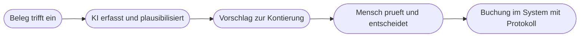

# Kapitel 16 – Fallbeispiel Rechnungswesen: Vorschlag, Prüfung, Nachweis

{{ progress(16) }}

<div class="lernziele" markdown>
<h3>Was du in diesem Kapitel lernst</h3>

- Warum im Rechnungswesen die **Nachvollziehbarkeit** wichtiger ist als die Geschwindigkeit
- Wie du **Belegdaten erfassen und plausibilisieren** lässt, ohne die Prüfung abzugeben
- Warum ein **Kontierungsvorschlag** immer ein Vorschlag bleibt und niemals eine Buchung wird
- Wie du **Zahlungserinnerungen und Mahntexte** in abgestufter Tonlage aufbaust
- Wie du **Abweichungen analysierst** und Reports so kommentierst, dass sie belegt sind
- Wie **Vier-Augen-Prinzip**, Dokumentation und Aufbewahrung praktisch aussehen und welche Daten in **keinem Fall** in öffentliche Werkzeuge gelangen dürfen
</div>

---

## 16.1 Was im Rechnungswesen anders ist

In Kapitel 12 war ein sprachlich guter Text schon halb gewonnen. Im Rechnungswesen ist er wertlos, wenn die Zahl darunter nicht stimmt und der Weg dahin nicht dokumentiert ist. Drei Besonderheiten prägen den ganzen Bereich.

**Nachvollziehbarkeit ist Pflicht, nicht Kür.** Die Grundsätze zur ordnungsmäßigen Führung und Aufbewahrung von Büchern, Aufzeichnungen und Unterlagen in elektronischer Form – kurz **GoBD** – verlangen, dass jeder Geschäftsvorfall nachvollziehbar, vollständig, richtig, zeitgerecht, geordnet und unveränderbar aufgezeichnet wird. Praktisch heißt das: Ein Dritter muss später erkennen können, welcher Beleg zu welcher Buchung führte, wer sie veranlasst hat und ob sie nachträglich verändert wurde. Nachträgliches Überschreiben ohne Spur ist nicht erlaubt.

**Ein Fehler wirkt nach.** Eine schlecht formulierte Mail kostet Sympathie. Eine falsche Kontierung wandert in den Jahresabschluss, in die Umsatzsteuervoranmeldung und in die Kostenstellenrechnung. Korrekturen sind möglich, aber selbst dokumentationspflichtig. **Zahlungsdaten sind sensibel.** Kontonummern, Zahlungsverhalten einzelner Personen, Gehaltsdaten, offene Posten mit Namen – all das sind personenbezogene oder geschäftskritische Daten. Sie gehören nicht in ein privates Chatkonto, auch nicht als „nur ein Beispiel" (Kap. 4).



!!! info "Merksatz für den ganzen Bereich"
    Im Rechnungswesen ist KI ein **Vorschlagswesen**, kein Ausführungsorgan. Sie liest, ordnet, rechnet vor und formuliert. Sie bucht nicht, sie gibt nicht frei, und sie zahlt nicht aus. Der Nutzen liegt darin, dass ein Mensch weniger abtippt und mehr prüft – nicht darin, dass niemand mehr prüft.

---

## 16.2 Belegdaten erfassen und plausibilisieren

Der erste Schritt ist unspektakulär und spart die meiste Zeit: aus einem Beleg die relevanten Felder in eine strukturierte Form bringen (Kap. 13). Die letzte Zeile des folgenden Auftrags ist dabei die wichtigste.

```text
Aufgabe: Uebertrage die Angaben der angehaengten Eingangsrechnung in die folgenden Felder.
Felder: Lieferant, Rechnungsnummer, Rechnungsdatum, Leistungszeitraum, Nettobetrag,
Umsatzsteuersatz, Umsatzsteuerbetrag, Bruttobetrag, Zahlungsbedingungen, Bestellbezug,
Umsatzsteuer-Identifikationsnummer.
Format: Tabelle mit den Spalten Feld, Wert, Fundstelle im Beleg.
Einschraenkung: Keinen Wert berechnen, ergaenzen oder korrigieren. Fehlende oder unlesbare
Angaben als fehlt markieren. Widersprueche im Beleg ausdruecklich benennen statt aufzuloesen.
```

Ein Beleg mit einem Rechenfehler ist ein **fehlerhafter Beleg** und muss als solcher erkannt werden; ein Werkzeug, das den Fehler stillschweigend korrigiert, hat das Problem nicht gelöst, sondern versteckt. Danach folgt die **Plausibilisierung**: nicht die Buchung, sondern die Frage, ob der Beleg überhaupt in Ordnung ist.

| Prüfung | Konkrete Frage | Typischer Fund |
|---|---|---|
| Rechnerische Prüfung | Netto plus Umsatzsteuer gleich Brutto? | Rundungsdifferenz oder falscher Steuersatz |
| Steuerliche Prüfung | Steuersatz plausibel für die Leistung? | 7 statt 19 Prozent oder umgekehrt |
| Pflichtangaben | Sind alle erforderlichen Angaben vorhanden? | fehlende Steuernummer oder Leistungszeitraum |
| Dublettenprüfung | Rechnungsnummer bereits erfasst? | doppelte Erfassung nach Mahnung |
| Sachliche Prüfung | Bestellbezug und Leistung passen zusammen? | Menge weicht vom Lieferschein ab |

Die rechnerische Prüfung lässt du **in Excel oder im System** rechnen, nicht im Chatfenster (Kap. 13). Das Werkzeug soll sagen, *was* zu prüfen ist und *wo* es hakt – die Zahl kommt aus einer Rechnung, die du nachvollziehen kannst.

!!! warning "Typische Falle: die stillschweigende Korrektur"
    Übergibt man einen Beleg mit `Netto 1.000,00`, `Umsatzsteuer 190,00`, `Brutto 1.209,00` ohne die Einschränkung aus dem Prompt, liefern Werkzeuge häufig einfach `1.190,00` – weil das die richtige Zahl ist. Genau das darf nicht passieren. Der Beleg stimmt nicht, und das ist der Befund. Die Korrektur erfolgt durch eine korrigierte Rechnung des Lieferanten, nicht durch eine hilfsbereite Zusammenfassung.

---

## 16.3 Kontierungsvorschläge bleiben Vorschläge

Ein Kontierungsvorschlag ist zulässig und nützlich – unter zwei Bedingungen: Er ist als Vorschlag erkennbar, und er nennt seine Begründung.

```text
Rolle: Du unterstuetzt die Buchhaltung der Musterhandel GmbH mit Kontierungsvorschlaegen.
Aufgabe: Erstelle einen Vorschlag zur Kontierung fuer die folgenden Belege.
Kontext: Wir buchen nach unserem internen Kontenplan, angehaengt. Bei Zweifeln gilt der
Kontenplan, nicht dein allgemeines Wissen.
Belege:
Reparatur eines Gabelstaplers, netto 840,00, USt 19 Prozent, Werkstattrechnung
Jahreslizenz Buchhaltungssoftware, netto 1.200,00, Laufzeit 01.07. bis 30.06.
Buerostuehle, 6 Stueck, netto 2.940,00, Nutzungsdauer laut Liste 13 Jahre
Bewirtung von zwei Geschaeftspartnern, brutto 96,40, mit Anlass auf dem Beleg
Format: Tabelle mit den Spalten Beleg, Kontovorschlag, Begruendung, Sicherheitsgrad hoch
mittel niedrig, offene Frage an die Buchhaltung.
Einschraenkung: Kennzeichne jede Zeile ausdruecklich als Vorschlag, buche nichts. Bei
Sicherheitsgrad niedrig formuliere die konkrete Frage, die vor der Buchung geklaert werden
muss. Nenne keine Kontonummer, die nicht im angehaengten Kontenplan steht.
```

Die Spalte **Sicherheitsgrad** ist die wichtigste. Sie verwandelt einen Stapel gleich aussehender Vorschläge in eine sortierte Arbeitsliste: Die sicheren Fälle bestätigst du schnell, die unsicheren bearbeitest du bewusst. Die offenen Fragen zeigen dabei, warum die Entscheidung beim Menschen bleiben muss – sie hängen von Beträgen, Wahlrechten und internen Festlegungen ab, die kein Werkzeug kennt.

| Beleg aus dem Beispiel | Typische offene Frage |
|---|---|
| Staplerreparatur | Erhaltungsaufwand oder aktivierungspflichtige Verbesserung? |
| Jahreslizenz über den Jahreswechsel | Aktive Rechnungsabgrenzung für das Folgejahr nötig? |
| Bürostühle, 6 Stück | Sammelposten, Sofortabschreibung oder Anlagegut je Stück? |

!!! warning "Häufiges Missverständnis"
    „Die KI kennt doch den Standardkontenrahmen" ist gefährlich richtig. Sie kennt gängige Kontenrahmen ungefähr – und erzeugt daraus im Zweifel eine Kontonummer, die plausibel aussieht und in deinem Kontenplan nicht existiert oder etwas anderes bedeutet. Deshalb gehört der eigene Kontenplan als Kontext in den Prompt, und deshalb steht in der Einschränkung ausdrücklich, dass keine anderen Konten verwendet werden dürfen.

---

## 16.4 Zahlungserinnerung und Mahnwesen

Hier ist der Nutzen hoch und das Risiko überschaubar – vorausgesetzt, die **Abstufung** ist bewusst gestaltet. Der häufigste Fehler im Mahnwesen ist nicht ein zu harter Ton, sondern ein Ton, der nicht zur Stufe passt: die erste Erinnerung klingt wie eine Drohung, die dritte wie eine Bitte. Der eigentliche Gewinn liegt deshalb in der Konsistenz – vier geprüfte Stufen, konsequent verwendet, wirken professioneller als jede einzelne besonders gut formulierte Mahnung. Genau deshalb ist das Mahnwesen später ein guter Kandidat für einen automatisierten Ablauf mit Freigabe-Gate (Kap. 27 und Kap. 29).

```text
Aufgabe: Erstelle vier abgestufte Textvorlagen zum Zahlungsverzug.
Kontext: Musterhandel GmbH, Zahlungsziel 14 Tage netto. Vorlagen werden mit Platzhaltern
befuellt: [Kundenname], [Rechnungsnummer], [Rechnungsdatum], [Betrag], [Faelligkeitsdatum],
[neue Frist].
Stufen:
1. Freundliche Zahlungserinnerung, 7 Tage nach Faelligkeit, geht von einem Versehen aus
2. Erste Mahnung, 21 Tage nach Faelligkeit, sachlich, mit neuer Frist
3. Zweite Mahnung, 35 Tage nach Faelligkeit, deutlich, nennt die naechste Eskalationsstufe
4. Letzte Mahnung vor Uebergabe, nennt Frist und Folge ohne Drohgebaerde
Format: Je Stufe Betreffzeile und Text, maximal 110 Woerter.
Einschraenkung: Keine Angabe zu Verzugszinsen, Mahnkosten, Schadensersatz oder rechtlichen
Schritten mit konkreten Betraegen oder Paragrafen. Keine Unterstellung von Absicht. Keine
Formulierung, die die Geschaeftsbeziehung in Stufe 1 und 2 in Frage stellt. Jede Stufe nennt
genau eine Frist mit Datum.
```

| Stufe | Grundhaltung | Was nicht hineingehört |
|---|---|---|
| Zahlungserinnerung | Versehen unterstellen | Kosten, Fristandrohung, Vorwurf |
| Erste Mahnung | sachliche Feststellung | Emotion, Rechtsbegriffe |
| Zweite Mahnung | Deutlichkeit mit Weg | Drohgebärde, Beziehungsentzug |

!!! warning "Zinsen, Kosten und Paragrafen sind nichts für Textgeneratoren"
    Sprachmodelle ergänzen im Mahnkontext gern Verzugszinssätze, pauschale Mahnkosten und Paragrafenverweise. Diese Angaben sind rechtlich voraussetzungsabhängig – etwa davon, ob es sich um ein Verbrauchergeschäft handelt, ob Verzug wirksam eingetreten ist und was vertraglich vereinbart wurde. Falsche Angaben können die Forderung schwächen und eigene Ansprüche des Kunden begründen. Solche Bausteine legt die Rechtsabteilung oder eine fachkundige Stelle fest; du fügst sie als geprüften Textbaustein ein.

---

## 16.5 Abweichungsanalyse und Kommentierung von Reports

Der Monatsbericht ist erstellt, die Zahlen stehen – und dann fehlt der Text, der erklärt, was passiert ist. Diese Kommentierung ist ein sehr guter KI-Anwendungsfall, sofern eine Regel gilt: **Die KI beschreibt, sie erklärt nicht.** Ursachen kennt nur, wer im Betrieb war.

```text
Aufgabe: Kommentiere die folgende Abweichungsuebersicht fuer den Monatsbericht.
Daten:
Kostenstelle;Plan;Ist;Abweichung
Fracht ausgehend;42000;51300;9300
Verpackung;12000;12400;400
Instandhaltung;18000;9100;-8900
Reisekosten;9000;14200;5200
Buerobedarf;3000;2850;-150
Format: Je Zeile ein Satz Beschreibung mit absoluter und prozentualer Abweichung. Danach die
drei wesentlichen Abweichungen und je eine konkrete Rueckfrage an die verantwortliche
Kostenstelle.
Einschraenkung: Keine Ursachen vermuten, keine Bewertung als gut oder schlecht, keine
Massnahmenempfehlung. Prozentwerte auf eine Stelle runden und die Rechnung nachvollziehbar
angeben.
```

Die Prozentwerte prüfst du gegen: Fracht plus 22,1 Prozent, Verpackung plus 3,3 Prozent, Instandhaltung minus 49,4 Prozent, Reisekosten plus 57,8 Prozent, Bürobedarf minus 5,0 Prozent. Rechne mindestens zwei davon selbst nach – die Extremwerte, dort fallen Fehler zuerst auf. Dann kommt der fachliche Teil, den nur du leisten kannst: Die auffälligste Zahl ist nicht die größte Abweichung. Frachtkosten plus 9.300 Euro sehen dramatisch aus, sind aber bei gestiegenen Umsätzen erklärbar. Instandhaltung minus 8.900 Euro sieht nach Einsparung aus und ist häufig eine **verschobene Maßnahme**, die im nächsten Quartal doppelt zuschlägt.

Wozu die Ursachensperre dient, zeigt der Gegentest: Ohne sie liefert ein Werkzeug zuverlässig Sätze wie „Der Anstieg der Frachtkosten ist auf gestiegene Treibstoffpreise zurückzuführen." Das klingt fachlich, ist aber geraten – und wanderte es in den Monatsbericht, stünde dort eine erfundene Ursache mit Unterschrift. Die Rückfrage an die Kostenstelle ist der einzige Weg zur echten Ursache, und genau sie soll das Werkzeug formulieren.

---

## 16.6 Vier-Augen-Prinzip, Nachweis und Aufbewahrung

Der Einsatz von KI verändert die Kontrolllogik nicht – er verschiebt nur, wo der Mensch hinschaut. Damit das funktioniert, brauchst du drei Festlegungen.

**Erstens das Vier-Augen-Prinzip.** Wer einen Vorschlag erzeugt, darf ihn nicht selbst freigeben. Eine KI ersetzt nicht das zweite Augenpaar, sondern höchstens das Abtippen des ersten. Konkret: Erfassung und Vorschlag durch eine Person mit Werkzeugunterstützung, Prüfung und Freigabe durch eine zweite Person, Buchung im System mit Protokoll.

**Zweitens die Dokumentation des KI-Einsatzes.** Für die Nachvollziehbarkeit muss erkennbar bleiben, wie ein Vorschlag entstand – je Prozessschritt also festhalten, welches Werkzeug und welche Prompt-Vorlage genutzt wurden, wer geprüft hat und was geändert wurde.

| Zu dokumentieren | Warum | Wo |
|---|---|---|
| Eingesetztes Werkzeug und Zweck | Nachvollziehbarkeit des Entstehungswegs | Verfahrensdokumentation |
| Verwendete Prompt-Vorlage mit Version | Ergebnisse sind sonst nicht reproduzierbar | Vorlagensammlung in SharePoint |
| Prüfende Person und Zeitpunkt sowie Änderungen am Vorschlag | Vier-Augen-Nachweis, zeigt geprüft statt nur bestätigt | Freigabe- und Buchungsprotokoll |

**Drittens die Aufbewahrung.** Der Beleg und die Buchung sind aufbewahrungspflichtig und müssen unveränderbar dokumentiert sein. Ein Chatverlauf ist kein Buchungsnachweis: Er kann verschwinden, er ist nicht revisionssicher, und er lässt sich verändern. Die Ablage des Belegs und die Buchung gehören ins System, nicht in ein Chatfenster.

!!! warning "Keine Kontodaten und Zahlungsdaten in öffentliche Werkzeuge"
    IBANs, Kontoauszüge, offene-Posten-Listen mit Namen, Gehaltsabrechnungen, Mahnlisten mit Personenbezug: Diese Daten haben in einem privaten ChatGPT- oder Claude-Konto nichts zu suchen. Willst du dort einen Text oder eine Struktur erproben, arbeite mit vollständig erfundenen Daten und Platzhaltern wie `[Kundenname]` und `[Betrag]`. Innerhalb von Copilot in M365 bleiben die Daten im Datenraum deiner Organisation (Kap. 11) – auch dort gelten aber Zweckbindung und interne Freigaben.

Der nächste logische Schritt ist die Automatisierung des Belegwegs: Rechnung trifft ein, Felder werden ausgelesen, Plausibilitätsprüfungen laufen automatisch, unsichere Fälle gehen in eine Prüfschleife, sichere Fälle in eine Freigabe. Wie das mit Dokumentenverarbeitung, Konfidenzwerten und Schwellenwerten aufgebaut wird, folgt in Kapitel 31. Die Leitfrage bleibt dabei immer dieselbe: nicht „Kann die KI das?", sondern „Bleibt es nachvollziehbar, prüfbar und unveränderbar dokumentiert?".

---

## Zusammenfassung

- Im Rechnungswesen zählt **Nachvollziehbarkeit** vor Geschwindigkeit: Der GoBD-Gedanke verlangt vollständige, richtige, zeitgerechte, geordnete und **unveränderbare** Dokumentation.
- Bei der **Belegerfassung** gilt: nichts berechnen, nichts korrigieren, Widersprüche benennen – ein fehlerhafter Beleg ist ein Befund, kein Rundungsproblem.
- **Kontierungen** sind Vorschläge mit Begründung, Sicherheitsgrad und offener Frage; der eigene Kontenplan muss als Kontext mitgegeben werden.
- **Mahntexte** wirken durch bewusste Abstufung; Zinsen, Kosten und Paragrafen kommen aus geprüften Bausteinen.
- Bei **Abweichungsanalysen** beschreibt die KI und fragt nach – Ursachen benennt nur, wer sie kennt. Die größte Zahl ist selten die wichtigste.
- Das **Vier-Augen-Prinzip** bleibt bestehen: Wer den Vorschlag erzeugt, gibt ihn nicht frei. Der **KI-Einsatz selbst gehört dokumentiert**: Werkzeug, Prompt-Vorlage, prüfende Person, Änderungen.
- **Kontodaten und personenbezogene Zahlungsdaten** gehören nie in öffentliche Werkzeuge.

---

## Kurzübungen

{{ task(file="tasks/k16_01.yaml") }}

{{ task(file="tasks/k16_02.yaml") }}

{{ task(file="tasks/k16_03.yaml") }}

---

## Workshop

{{ task(file="tasks/workshop_k16.yaml") }}
