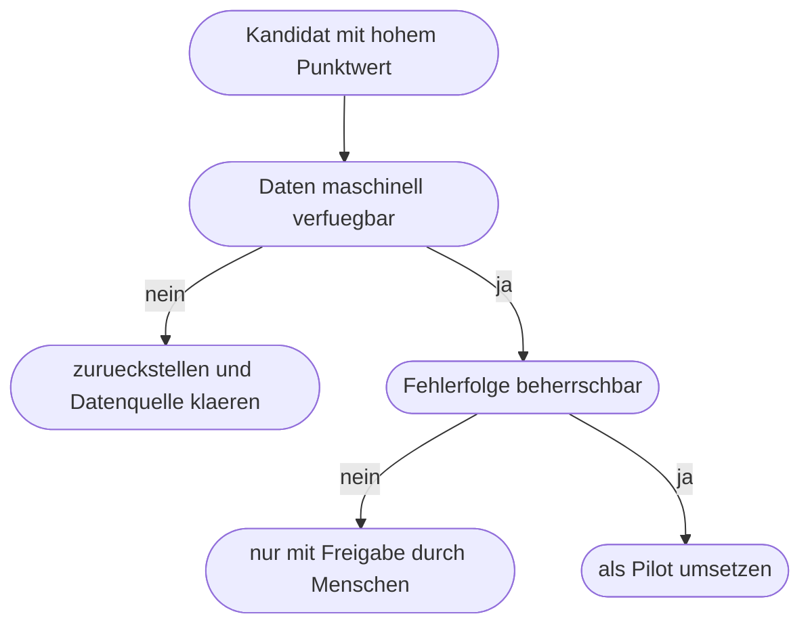

# Kapitel 17 – Workflow-Grundlagen

{{ progress(17) }}

<div class="lernziele" markdown>
<h3>Was du in diesem Kapitel lernst</h3>

- Was ein **Workflow** ist und wie er sich vom **Geschäftsprozess** unterscheidet
- Wie du einen Ist-Prozess systematisch **aufnimmst**: Auslöser, Schritte, Beteiligte, Systeme, Medienbrüche, Wartezeiten
- Wie du einen Ablauf als **Schrittliste** und als **Diagramm** notierst, ohne eine Notationslehre zu lernen
- Wie du Automatisierungspotenzial über **Häufigkeit × Aufwand × Regelhaftigkeit** einschätzt
- Wie du Kandidaten **priorisierst**, statt beim größten Wunsch anzufangen
- Was du bewusst **nicht** automatisierst – und warum das eine Stärke ist

</div>

---

## 17.1 Prozess und Workflow sind nicht dasselbe

Ein **Geschäftsprozess** beschreibt fachlich, wie ein Ergebnis von Anfang bis Ende entsteht: „Von der eingehenden Rechnung bis zur Zahlung." Er ist unabhängig davon, mit welchen Werkzeugen gearbeitet wird, und enthält alle Beteiligten, auch die Ausnahmen und Sonderfälle.

Ein **Workflow** ist die konkrete Umsetzung eines Prozessabschnitts als festgelegte Folge von Schritten – mit klaren Auslösern, Zuständigkeiten, Übergaben und Regeln. Ein Workflow ist damit enger, präziser und überprüfbar. Genau deshalb kann man ihn automatisieren.

| Kriterium | Geschäftsprozess | Workflow |
|---|---|---|
| Blickwinkel | fachlich, Ende zu Ende | operativ, ein Abschnitt |
| Detailtiefe | „Rechnung wird geprüft" | „Betrag mit Bestellung vergleichen, Abweichung über 50 Euro melden" |
| Umfang | enthält alle Sonderfälle | behandelt den geregelten Normalfall |
| Beteiligte | Abteilungen, Rollen | einzelne Zuständigkeiten pro Schritt |
| Änderungsanlass | Strategie, Organisation, Recht | neue Regel, neues System, Fehler im Ablauf |
| Automatisierbar | nein, zu unscharf | ja, wenn die Regeln eindeutig sind |

!!! info "Merksatz"
    Der Prozess sagt, **was** erreicht werden soll. Der Workflow sagt, **wer wann was womit** tut. Automatisiert wird immer ein Workflow – niemals ein ganzer Prozess. Wer „den Rechnungsprozess automatisieren" will, hat noch keine Aufgabe, sondern ein Thema.

Daraus folgt die Reihenfolge in diesem Block: Erst nimmst du den Prozess auf, dann schneidest du daraus einen Workflow zu, dann baust du ihn (Block 5). Wer sofort ein Werkzeug öffnet, baut meist den Ablauf, den er sich vorstellt – nicht den, der wirklich läuft.

---

## 17.2 Das durchgängige Beispiel: Eingangsrechnung

Dieser Block arbeitet mit einem Szenario, auf das die Kapitel 18, 19 und 20 zurückgreifen. Es ist bewusst unspektakulär: Hohe Stückzahl, klare Regeln im Normalfall, viele Übergaben und ein Problem, das alle kennen – genau so sehen die typischen ersten Automatisierungsfälle aus.

```text
Nordwind Handel GmbH, 180 Mitarbeitende, Handel mit Buerobedarf.
Rund 400 Eingangsrechnungen pro Monat, davon 300 als PDF an das
  Sammelpostfach rechnung@nordwind-handel.de, 100 auf Papier per Post.
Beteiligte: 2 Personen Buchhaltung pruefen formal, ca. 20
  Kostenstellenverantwortliche geben fachlich frei, Leitung
  Finanzen gibt Zahlungen ueber 5000 Euro frei.
Systeme: Outlook, SharePoint-Ablage, Excel-Liste Rechnungseingang, ERP.
Problem: Rechnungen bleiben liegen, Skonto verfaellt, und niemand
  weiss auf Zuruf, wo eine Rechnung gerade haengt.
```

---

## 17.3 Prozessaufnahme in der Praxis

Eine Prozessaufnahme ist kein Modellierungsprojekt, sondern ein strukturiertes Nachfragen. Sechs Fragen reichen für den Anfang:

1. **Auslöser:** Was passiert als Erstes, sodass der Ablauf überhaupt beginnt? Eine E-Mail, ein Formular, ein Datum, ein Anruf?
2. **Schritte:** Was passiert danach, in welcher Reihenfolge, bis das Ergebnis vorliegt?
3. **Beteiligte:** Wer führt den Schritt aus – Rolle, nicht Name?
4. **Systeme:** In welchem Werkzeug findet der Schritt statt?
5. **Medienbrüche:** Wo wechseln Informationen das Medium oder werden von Hand übertragen?
6. **Wartezeiten:** Wo liegt der Vorgang, ohne dass jemand daran arbeitet?

Ein **Medienbruch** ist jede Stelle, an der Daten aus einem Medium in ein anderes übertragen werden, meist durch Abtippen oder Kopieren: PDF in Excel, Excel ins ERP, E-Mail-Text in ein Ticketsystem. Medienbrüche sind Fehlerquellen und gleichzeitig die lohnendsten Automatisierungsstellen.

So sieht die Aufnahme für Nordwind aus. Bilde beim Lesen die Summe der letzten beiden Spalten – fünf Medienbrüche und bis zu neun Tage Wartezeit an einer einzigen Stelle zeigen ohne weitere Analyse, wo hier das Geld liegt.

| Nr. | Schritt | Wer | System | Medienbruch | Wartezeit |
|---|---|---|---|---|---|
| 1 | Rechnung trifft im Sammelpostfach ein | – | Outlook | nein | bis zu 1 Tag |
| 2 | PDF in Ablage speichern, Dateiname vergeben | Buchhaltung | Outlook, SharePoint | ja | – |
| 3 | Kopfdaten in Excel-Liste eintragen | Buchhaltung | Excel | ja, Abtippen | – |
| 4 | Formal prüfen: Pflichtangaben, Bestellbezug | Buchhaltung | Excel, ERP | nein | – |
| 5 | Freigabe per E-Mail anfordern | Buchhaltung | Outlook | nein | 2 bis 9 Tage |
| 6 | Fachliche Freigabe erteilen oder ablehnen | Kostenstelle | Outlook | ja, Antwort per Text | – |
| 7 | Freigabe in Excel nachtragen | Buchhaltung | Excel | ja | – |
| 8 | Buchen und zur Zahlung vormerken | Buchhaltung | ERP | ja, Abtippen | bis Zahllauf |

!!! warning "Typische Falle"
    Fast alle nehmen versehentlich den **Wunschprozess** auf, nicht den echten. Gefragt wird „wie läuft das?", geantwortet wird „so soll es laufen". Frage deshalb immer nach dem letzten konkreten Fall: „Zeig mir die Rechnung, die du heute Morgen bearbeitet hast." Und frage nach Ausnahmen: „Was war der letzte Fall, der nicht so lief?"

!!! tip "KI als Strukturierhilfe – mit Gegenprobe"
    Wenn du eine Prozessbeschreibung als Fließtext hast, lass sie dir strukturieren:

    ```text
    Hier ist eine Prozessbeschreibung als Fliesstext. Wandle sie in eine
    Tabelle mit den Spalten Schritt, Rolle, System, Medienbruch, Wartezeit.
    Markiere jede Stelle, an der die Beschreibung unklar ist, mit OFFEN.
    Erfinde nichts.
    ```

    Der Wert liegt in den `OFFEN`-Markierungen: Sie zeigen, wo du nachfragen musst. Prüfe die Tabelle trotzdem Zeile für Zeile – KI ergänzt gern plausible Schritte, die es bei euch gar nicht gibt (Kap. 8).

---

## 17.4 Notation: Schrittliste und Diagramm

Für Fachanwender genügen zwei Darstellungen. Die **Schrittliste** ist die Arbeitsform. Sie ist schnell, textbasiert und lässt sich später fast eins zu eins in ein Werkzeug übertragen:

```text
Ausloeser: E-Mail mit PDF-Anhang trifft im Sammelpostfach ein
Schritt 1: Anhang in Ablage speichern
Schritt 2: Kopfdaten erfassen
Schritt 3: WENN Bestellbezug fehlt DANN Rueckfrage an Lieferant, Ende
Schritt 4: Freigabe bei Kostenstelle anfordern
Schritt 5: WENN abgelehnt DANN Klaerfall, sonst weiter
Schritt 6: Betrag ueber 5000 Euro zusaetzlich Leitung Finanzen
Schritt 7: Buchen und zur Zahlung vormerken
```

Das **Diagramm** ist die Kommunikationsform. Es zeigt Verzweigungen auf einen Blick und eignet sich, um sich mit Beteiligten abzustimmen:


Halte Diagramme klein. Mehr als etwa zehn Kästen liest niemand freiwillig, und Sonderfälle gehören in die Schrittliste, nicht ins Bild. Umgekehrt gilt: Wenn du einen Ablauf nicht als Schrittliste aufschreiben kannst, ist er noch nicht verstanden – und dann kannst du ihn auch nicht automatisieren.

---

## 17.5 Automatisierungspotenzial erkennen und priorisieren

Ob sich ein Schritt lohnt, hängt an drei Größen, die multipliziert werden – nicht addiert. Ist ein Faktor sehr klein, ist das Ergebnis klein, egal wie gut die anderen aussehen.

- **Häufigkeit:** Wie oft läuft der Schritt? 1 = selten, 5 = täglich vielfach.
- **Aufwand je Fall:** Wie viel Zeit und Nerven kostet er? 1 = Sekunden, 5 = viele Minuten oder Warten.
- **Regelhaftigkeit:** Wie eindeutig ist die Regel? 1 = Einzelfallurteil, 5 = immer identisch.

| Kandidat | Häufigkeit | Aufwand | Regelhaftigkeit | Punktwert | Einschätzung |
|---|---|---|---|---|---|
| PDF ablegen und benennen | 5 | 2 | 5 | 50 | starker Kandidat |
| Kopfdaten abtippen | 5 | 4 | 4 | 80 | starker Kandidat |
| Freigabe anfordern und nachhalten | 5 | 3 | 5 | 75 | starker Kandidat |
| Sachliche Freigabe entscheiden | 5 | 2 | 1 | 10 | bleibt beim Menschen |
| Jahresabschluss vorbereiten | 1 | 5 | 2 | 10 | kein Kandidat |

!!! example "Durchgerechnet"
    „Kopfdaten abtippen" kommt auf 5 × 4 × 4 = **80** und ist damit der stärkste Kandidat. „Sachliche Freigabe entscheiden" kommt trotz identischer Häufigkeit nur auf 5 × 2 × 1 = **10**, weil die Regelhaftigkeit fehlt: Ob eine Leistung tatsächlich erbracht wurde, weiß nur die Person, die sie beauftragt hat. Der Schritt wird nicht automatisiert – aber sein **Drumherum** schon: anfordern, erinnern, dokumentieren. Das ist das wichtigste Muster dieses Blocks.

Der Punktwert ordnet, entscheidet aber nicht. Vor der Umsetzung kommen drei Gegenfragen: Sind die **Daten verfügbar** in einer Form, mit der ein Werkzeug arbeiten kann? Welche **Folge** hat ein Fehler – falsch abgelegte Datei oder falsch angewiesene Zahlung? Und ist die **Akzeptanz** da, oder umgeht das Team den neuen Ablauf?



Fange mit einem Kandidaten an, der hoch punktet, geringe Fehlerfolgen hat und in wenigen Tagen sichtbar wird. Ein kleiner Erfolg finanziert die nächsten drei Vorhaben; ein gescheitertes Prestigeprojekt blockiert sie (Kap. 34).

---

## 17.6 Was du bewusst nicht automatisierst

Nicht zu automatisieren ist eine fachliche Entscheidung, keine Kapitulation. Ein Workflow, der ständig ausgebessert werden muss, kostet mehr Zeit, als er spart.

| Fall | Warum problematisch | Besserer Umgang |
|---|---|---|
| Seltene Vorgänge | Bauaufwand rechnet sich nie, Wissen veraltet | Checkliste und gute Dokumentation |
| Unklare Regeln | Regel muss erst erfunden werden, Ergebnis wird willkürlich | erst fachlich klären, dann automatisieren |
| Häufig wechselnde Vorgaben | jede Änderung erzwingt Nacharbeit am Ablauf | manuell lassen oder nur den stabilen Kern automatisieren |
| Echte Ermessensentscheidungen | Verantwortung ist nicht delegierbar | Entscheidung beim Menschen, Vorbereitung automatisieren |
| Chaotischer Ist-Zustand | Automatisierung beschleunigt das Chaos | Prozess zuerst aufräumen |
| Rechtlich sensible Schritte | Nachweispflichten, Mitbestimmung | mit Fachbereich und IT klären (Kap. 4, Kap. 20) |

!!! warning "Häufiges Missverständnis"
    „Wir automatisieren erst mal und regeln die Details später" klingt pragmatisch und ist der häufigste Grund für aufgegebene Automatisierungen. Ein Workflow ist eine **schriftlich fixierte Entscheidung**. Wo es keine Entscheidung gibt, kann der Ablauf sie nicht ersetzen – er macht die Lücke nur schneller sichtbar, meist im Fehlerfall.

Der produktive Zwischenweg heißt **Teilautomatisierung**: Der Ablauf erledigt alles Regelhafte und legt der zuständigen Person eine fertig vorbereitete Entscheidung vor. So bleibt Verantwortung dort, wo sie hingehört, und die Fleißarbeit verschwindet trotzdem.

---

## Zusammenfassung

- Der **Geschäftsprozess** beschreibt das fachliche Ganze, der **Workflow** einen geregelten Abschnitt – automatisiert wird immer der Workflow.
- Eine Prozessaufnahme klärt sechs Dinge: Auslöser, Schritte, Beteiligte, Systeme, **Medienbrüche**, **Wartezeiten**.
- Nimm den **echten** Ablauf auf, nicht den gewünschten: nach dem letzten konkreten Fall und nach Ausnahmen fragen.
- **Schrittliste** zum Arbeiten, **Diagramm** zum Abstimmen. Was du nicht als Schrittliste aufschreiben kannst, kannst du nicht automatisieren.
- Potenzial ergibt sich aus **Häufigkeit × Aufwand × Regelhaftigkeit**; Datenverfügbarkeit, Fehlerfolge und Akzeptanz entscheiden über die Reihenfolge.
- Selten, unklar geregelt oder ständig wechselnd heißt: nicht automatisieren – oder nur das Drumherum einer menschlichen Entscheidung.

---

## Kurzübungen

{{ task(file="tasks/k17_01.yaml") }}

{{ task(file="tasks/k17_02.yaml") }}

{{ task(file="tasks/k17_03.yaml") }}

---

## Workshop

{{ task(file="tasks/workshop_k17.yaml") }}
