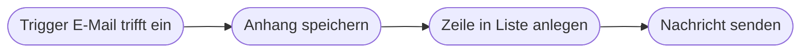
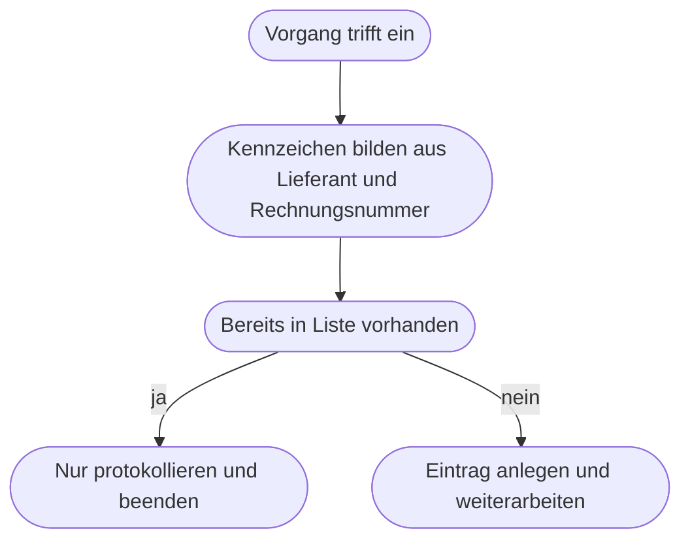

# Kapitel 18 – Trigger, Aktionen und Daten

{{ progress(18) }}

<div class="lernziele" markdown>
<h3>Was du in diesem Kapitel lernst</h3>

- Wie jeder automatisierte Ablauf aufgebaut ist: **ein Auslöser, viele Aktionen**
- Die vier **Trigger-Arten** – Ereignis, Zeitplan, manueller Start und eingehender Aufruf
- Wie Daten von Schritt zu Schritt weitergegeben werden und was **Mapping** bedeutet
- Welche **Datentypen** es gibt und warum Text, Zahl und Datum so oft verwechselt werden
- Wie du mit einer **Trigger-Bedingung** filterst, bevor überhaupt gearbeitet wird
- Warum Abläufe **doppelt** laufen können und was **Idempotenz** dagegen hilft

</div>

---

## 18.1 Der Bauplan jedes Ablaufs

Jeder automatisierte Ablauf – in Power Automate heißt er **Flow**, in Make **Szenario**, in Zapier **Zap** – hat denselben Aufbau: **genau ein Auslöser**, danach eine Folge von Aktionen, die Daten weitergeben.

Ein **Trigger** (Auslöser) ist das Ereignis, das den Ablauf startet. Er ist keine Aktion, sondern eine Beobachtungsstelle: Solange nichts passiert, passiert nichts. Eine **Aktion** ist ein einzelner Arbeitsschritt, der etwas liest, schreibt, sendet oder berechnet.



Entscheidend ist, was zwischen den Kästen fließt. Der Trigger liefert einen Satz von Feldern – bei einer E-Mail etwa Absender, Betreff, Empfangszeit, Anhänge. Jede folgende Aktion kann auf die Ergebnisse **aller vorherigen** Schritte zugreifen, nicht nur auf den direkt davorliegenden. Diesen Datenvorrat nennt Power Automate **dynamische Inhalte**.

!!! info "Merksatz"
    Ein Ablauf hat **einen** Auslöser und **viele** Aktionen. Wenn du zwei Auslöser brauchst – Mail *und* Formular – dann brauchst du zwei Abläufe, die dasselbe Ziel bedienen. Das ist keine Einschränkung des Werkzeugs, sondern eine nützliche Disziplin.

---

## 18.2 Die vier Trigger-Arten

| Art | Startet, wenn … | Beispiel im Rechnungsszenario | Worauf du achten musst |
|---|---|---|---|
| Ereignis | in einem System etwas passiert | neue E-Mail im Sammelpostfach, neues Element in einer Liste | feuert auch bei Dingen, die du nicht meinst |
| Zeitplan | ein Zeitpunkt erreicht ist | täglich 8 Uhr Erinnerung an offene Freigaben | Zeitzone und Feiertage bedenken |
| Manueller Start | eine Person den Ablauf startet | Buchhaltung stößt Nachbearbeitung für einen Beleg an | braucht eine Eingabemaske für Parameter |
| Eingehender Aufruf | ein anderes System eine Nachricht sendet | Lieferantenportal meldet neue Rechnung | Adresse ist ein Geheimnis, sonst kann jeder auslösen |

Der **eingehende Aufruf** heißt technisch **Webhook**: Dein Ablauf bekommt eine eigene Internetadresse, und wer diese Adresse mit einer Nachricht aufruft, startet ihn. Das ist die schnellste und sparsamste Variante, weil nichts abgefragt werden muss – aber sie setzt voraus, dass das andere System so etwas senden kann.

Der **Zeitplan** ist der unterschätzte Trigger. Viele Aufgaben, die man als Ereignis denkt, sind eigentlich Zeitpunkte: „Erinnere an Freigaben, die älter als drei Tage sind" ist kein Ereignis, sondern ein täglicher Rundgang durch eine Liste.

!!! tip "Trigger-Wahl in einem Satz"
    Frage dich: *Woran genau merkt jemand, dass es losgeht?* Merkt es ein System – Ereignis. Merkt es der Kalender – Zeitplan. Merkt es ein Mensch – manueller Start. Meldet es ein Fremdsystem – eingehender Aufruf. Kommt die Antwort „das merkt keiner, das fällt irgendwann auf", dann fehlt noch fachliche Klärung (Kap. 17).

---

## 18.3 Aktionen und das Zuordnen von Feldern

Der eigentliche Bauaufwand liegt selten in den Aktionen selbst, sondern im **Mapping**: Welches Feld aus einem früheren Schritt gehört in welches Eingabefeld des nächsten? Diese Zuordnung schreibt man am besten vor dem Bauen auf.

| Zielfeld in der Rechnungsliste | Herkunft | Umformung nötig? |
|---|---|---|
| Lieferant | Absenderadresse aus dem Trigger | ja, Domain in Klarnamen übersetzen |
| Eingangsdatum | Empfangszeit aus dem Trigger | ja, nur Datum ohne Uhrzeit |
| Betreff | Betreff aus dem Trigger | nein |
| Belegdatei | Anhang aus dem Trigger | nein, aber Dateiname festlegen |
| Betrag | steht nur im PDF | ja, muss ausgelesen werden (Kap. 31) |
| Status | fester Wert | nein, immer „in Prüfung" |

Die Tabelle macht drei Dinge sichtbar. Erstens: Manche Zielfelder kommen direkt aus dem Trigger. Zweitens: Manche brauchen eine kleine Umformung – dafür gibt es **Ausdrücke**, kleine Formeln wie in Excel; in Power Automate schreibt man sie in der Form `@{formatDateTime(...)}` (Details in Kap. 23). Drittens: Manche Felder sind schlicht **nicht vorhanden**. Der Betrag steckt im PDF, nicht in der E-Mail. Solche Lücken früh zu erkennen, verhindert Abbrüche mitten im Bauen.

!!! example "Ein Feldplan, bevor du klickst"
    Notiere den Datenfluss als Textskizze. Platzhalter schreibst du in eckigen Klammern:

    ```text
    Ziel: Dateiname in der Ablage
    Muster: [Eingangsdatum]_[Lieferant]_[Betreff].pdf
    Ergebnis: 2026-03-04_Papierwelt_Rechnung 4711.pdf

    Regeln:
    Eingangsdatum aus Empfangszeit, Format Jahr-Monat-Tag
    Lieferant aus Absenderdomain, nur der Name ohne Endung
    Betreff auf 40 Zeichen kuerzen, Sonderzeichen entfernen
    ```

    Das Kürzen und Entfernen ist kein Detail: Doppelpunkte, Schrägstriche und Sternchen sind in Dateinamen nicht erlaubt, und ein 200 Zeichen langer Betreff sprengt die Pfadlänge. Solche Regeln fallen beim Feldplan auf – beim Bauen erst im Fehlerprotokoll.

---

## 18.4 Datentypen und typische Konvertierungsfehler

Ein **Datentyp** legt fest, welche Art von Wert in einem Feld steht und was man damit rechnen darf. Werkzeuge sind hier strenger als Menschen: Für dich ist `1.250,00` eine Zahl, für den Ablauf ist es Text – und Text kann man nicht addieren.

| Datentyp | Enthält | Typischer Fehler | Gegenmaßnahme |
|---|---|---|---|
| Text | Zeichenfolge beliebiger Art | Zahl als Text ankommen lassen und dann vergleichen | ausdrücklich in Zahl umwandeln |
| Zahl | Ganzzahl oder Dezimalzahl | deutsches Komma und Tausenderpunkt | vor der Umwandlung Punkt und Komma bereinigen |
| Ja/Nein | genau zwei Zustände | Text „Ja" ist nicht der Wert Ja | Feld sauber als Ja/Nein anlegen |
| Datum und Uhrzeit | Zeitpunkt mit Zeitzone | Anzeige im Werkzeug ist UTC, nicht Ortszeit | Zeitzone explizit umrechnen |
| Liste | mehrere Einträge | Liste wie einen Einzelwert behandeln | Schleife verwenden (Kap. 19) |
| Datei | Binärinhalt plus Name | Dateiinhalt mit Dateipfad verwechseln | Inhalt und Name getrennt führen |

!!! warning "Typische Falle"
    Der Vergleich `Betrag größer als 5000` schlägt lautlos fehl, wenn der Betrag als Text `"5.000,00"` vorliegt. Textvergleiche arbeiten **zeichenweise**: `"5.000,00"` ist kleiner als `"6"`, weil die `5` vor der `6` kommt – und `"10000"` ist kleiner als `"9"`. Der Ablauf läuft dabei ohne Fehlermeldung durch und leitet einfach jahrelang die falschen Rechnungen an die Leitung Finanzen weiter. Deshalb gilt: Beträge und Mengen **immer** in einen Zahlentyp umwandeln, bevor du sie vergleichst.

Der zweite Klassiker ist das **Datum**. Systeme speichern Zeitpunkte fast immer in der Weltzeit UTC. Eine Rechnung, die um 00:30 Uhr Ortszeit eintrifft, wird intern auf den Vortag datiert. In Monatsauswertungen erscheinen dadurch Belege im falschen Monat. Rechne Zeitpunkte deshalb einmal bewusst auf die gewünschte Zeitzone um und arbeite danach nur noch mit dem umgerechneten Wert.

---

## 18.5 Trigger-Bedingungen: filtern, bevor gearbeitet wird

Ein Ereignis-Trigger feuert bei **allem**, was zu seinem Ereignis passt. Im Sammelpostfach löst also auch die Werbemail, die Abwesenheitsnotiz und die Rückfrage einer Kollegin den Ablauf aus. Dagegen gibt es zwei Stellen:

- Eine **Trigger-Bedingung** prüft, ob der Ablauf überhaupt starten soll. Passt sie nicht, läuft nichts – es entsteht kein Ausführungsprotokoll und kein Verbrauch.
- Eine **Bedingung als erste Aktion** startet den Ablauf trotzdem und beendet ihn dann. Das ist leichter zu verstehen und zu prüfen, kostet aber jedes Mal eine Ausführung.

Für den Anfang ist die Bedingung als erste Aktion die bessere Wahl, weil du im Protokoll sehen kannst, was aussortiert wurde. Sobald ein Ablauf produktiv viele Male am Tag unnötig startet, verschiebst du den Filter nach vorn in die Trigger-Bedingung.

Sinnvolle Filter im Rechnungsszenario: Anhang vorhanden, Anhangstyp PDF, Absender nicht aus der eigenen Domain, Betreff enthält nicht „Abwesenheit". Formuliere Filter möglichst als **Positivliste** – „nur PDF verarbeiten" ist stabiler als „alles außer den sieben Dingen, die uns bisher eingefallen sind".

Vergiss dabei nicht: Jeder Filter ist eine Entscheidung darüber, welche Vorgänge **nicht** bearbeitet werden. Das muss jemand fachlich verantworten, und es muss nachvollziehbar bleiben. Aussortierte Nachrichten sollten deshalb nicht spurlos verschwinden, sondern in einem Ordner landen oder in einer Liste protokolliert werden.

---

## 18.6 Doppelausführung, Idempotenz und die Grenzen der Trigger

Automatisierte Abläufe laufen manchmal zweimal für denselben Vorgang. Die häufigsten Gründe: Ein Ablauf wird nach einem Fehler erneut gestartet, ein Fremdsystem sendet denselben Aufruf zur Sicherheit doppelt, jemand bearbeitet ein Element mehrfach, oder ein Zeitplan-Ablauf greift sich einen Vorgang, der noch nicht als bearbeitet markiert ist.

**Idempotenz** bedeutet: Es macht keinen Unterschied, ob ein Schritt einmal oder fünfmal ausgeführt wird. Der Aufzugknopf ist idempotent – fünfmal drücken holt den Aufzug nicht fünfmal. Eine Zahlungsanweisung ist es nicht.



Das Muster dahinter ist immer dasselbe: Bilde ein **eindeutiges Kennzeichen** für den Vorgang, prüfe vor dem Schreiben, ob es schon existiert, und schreibe nur, wenn nicht. Im Rechnungsfall ist das Kennzeichen die Kombination aus Lieferant und Rechnungsnummer. Wähle als Kennzeichen niemals die Empfangszeit oder eine laufende Nummer, die der Ablauf selbst erzeugt – beides ist bei einer Wiederholung anders.

Neben der Doppelausführung haben Trigger drei weitere Grenzen, die du kennen musst:

- **Abfrageintervall:** Viele Ereignis-Trigger fragen das Quellsystem in festen Abständen ab, statt sofort benachrichtigt zu werden. Zwischen Ereignis und Start liegt deshalb eine **Verzögerung** von wenigen Minuten bis zu einer Stunde, je nach Werkzeug, Lizenz und Verbindung. Für einen Rechnungseingang ist das belanglos, für eine Chat-Antwort erwartet niemand fünf Minuten Wartezeit.
- **Keine Rückwirkung:** Ein neu eingeschalteter Ablauf sieht nur, was **ab jetzt** passiert. Die 300 Rechnungen, die schon im Postfach liegen, muss ein separater Ablauf oder ein Mensch nacharbeiten.
- **Stapelverhalten:** Treffen viele Elemente gleichzeitig ein, verarbeiten manche Trigger sie einzeln, andere als Paket. Das entscheidet darüber, ob du eine Schleife brauchst (Kap. 19).

!!! warning "Häufiges Missverständnis"
    „Der Ablauf ist doch getestet, dann läuft er auch richtig" gilt nur für den Normalfall. Getestet wird fast immer die **einmalige** Ausführung mit sauberen Daten. Die teuren Fehler entstehen bei der zweiten Ausführung desselben Vorgangs, bei leeren Feldern und bei Daten, die anders formatiert sind als im Test. Plane deshalb von Anfang an ein eindeutiges Kennzeichen ein – nachträglich einbauen ist deutlich aufwendiger.

---

## Zusammenfassung

- Jeder Ablauf hat **einen Trigger** und **viele Aktionen**; jede Aktion darf auf die Ergebnisse aller vorherigen Schritte zugreifen.
- Vier Trigger-Arten: **Ereignis**, **Zeitplan**, **manueller Start**, **eingehender Aufruf** – die Leitfrage lautet: Woran merkt jemand, dass es losgeht?
- Der Bauaufwand steckt im **Mapping**. Ein Feldplan vor dem Bauen zeigt Umformungen und fehlende Daten.
- **Datentypen** sind die häufigste stille Fehlerquelle: Zahl als Text vergleichen und Zeitpunkte in der falschen Zeitzone.
- **Trigger-Bedingungen** filtern früh; sie sind fachliche Entscheidungen und müssen nachvollziehbar bleiben.
- **Doppelausführung** ist normal. Ein eindeutiges Kennzeichen plus Prüfung vor dem Schreiben macht einen Ablauf **idempotent**.

---

## Kurzübungen

{{ task(file="tasks/k18_01.yaml") }}

{{ task(file="tasks/k18_02.yaml") }}

{{ task(file="tasks/k18_03.yaml") }}

---

## Workshop

{{ task(file="tasks/workshop_k18.yaml") }}
