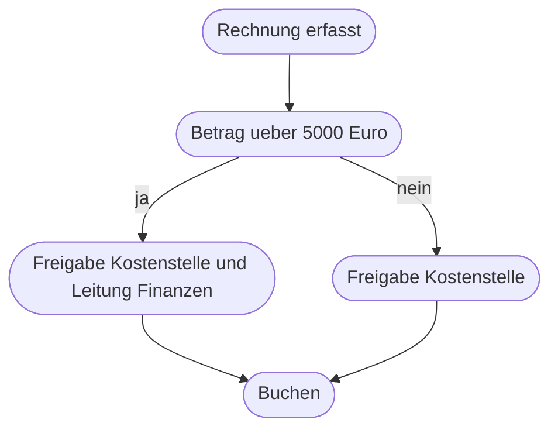
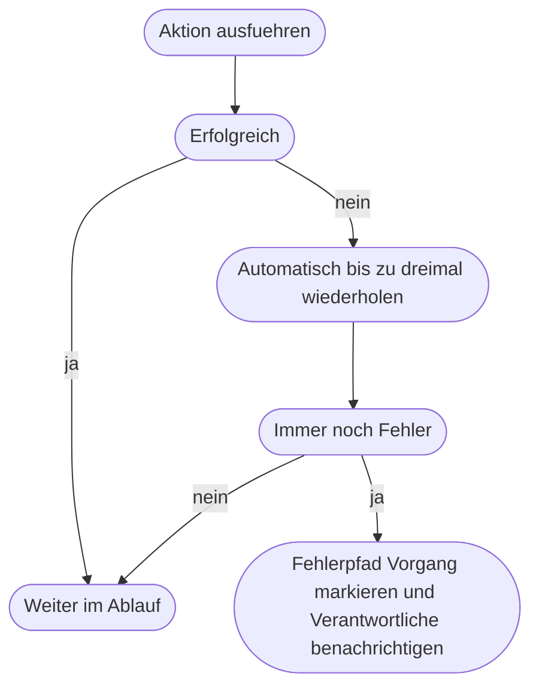

# Kapitel 19 – Logikbausteine

{{ progress(19) }}

<div class="lernziele" markdown>
<h3>Was du in diesem Kapitel lernst</h3>

- Wie **Bedingung** und **Verzweigung** einen Ablauf in Wege aufteilen
- Wann eine **Mehrfachauswahl** die bessere Wahl ist als verschachtelte Bedingungen
- Wie **Schleifen** über Listen arbeiten, wo sie teuer werden und wofür du **Variablen** wirklich brauchst
- Wie du mit **Warten**, **Verzögern** und **parallelen Zweigen** umgehst
- Wie **Fehlerpfade**, **Wiederholungen** und **Notbremsen** einen Ablauf beherrschbar machen
- Warum **Benennung** kein Schönheitsthema ist und welche **Logikfehler** typisch sind

</div>

---

## 19.1 Bedingung und Verzweigung

Eine **Bedingung** prüft eine Aussage und teilt den Ablauf in genau zwei Wege: erfüllt oder nicht erfüllt. Beide Wege müssen bedacht werden – auch der, den du „eigentlich nicht brauchst".



Eine gute Bedingung erfüllt drei Anforderungen: Sie vergleicht **einen** klar benannten Wert, sie arbeitet mit dem **richtigen Datentyp** (Kap. 18), und ihr Nein-Weg ist genauso ausgearbeitet wie ihr Ja-Weg. Zusammengesetzte Bedingungen mit „und" und „oder" sind erlaubt, aber ab drei Teilaussagen wird nicht mehr nachvollziehbar, welcher Fall welchen Weg nimmt.

!!! info "Merksatz"
    Jede Bedingung erzeugt **zwei** Wege, und beide werden irgendwann betreten. Ein leerer Nein-Zweig heißt in der Praxis: Der Vorgang verschwindet stillschweigend. Schreibe dort mindestens einen protokollierenden Schritt hinein – „Vorgang [Kennzeichen] ohne Behandlung beendet".

---

## 19.2 Mehrfachauswahl mit Switch

Sobald ein Wert mehr als zwei sinnvolle Ausgänge hat, ist die verschachtelte Bedingung das falsche Werkzeug. Die **Mehrfachauswahl**, in Power Automate `Switch` genannt, prüft einen Wert gegen mehrere feste Fälle und hat zusätzlich einen Standardfall für alles Übrige.

| Merkmal | Bedingung | Mehrfachauswahl |
|---|---|---|
| Anzahl Wege | zwei | beliebig viele plus Standardfall |
| Prüfbar auf | Vergleich, Größer, Enthält, Und/Oder | Gleichheit mit festen Werten |
| Lesbarkeit bei fünf Fällen | schlecht, tief verschachtelt | gut, alle Fälle nebeneinander |
| Typischer Einsatz | Schwellenwert, Ja/Nein-Prüfung | Kategorie, Abteilung, Dokumentart |
| Gefahr | vergessener Nein-Zweig | vergessener Standardfall |

Im Rechnungsszenario ist die Kostenstelle ein klassischer Fall für die Mehrfachauswahl: Einkauf, Marketing, IT, Lager, Verwaltung – fünf Werte, fünf Empfänger. Als verschachtelte Bedingung wären das fünf Ebenen, in denen jeder spätere Fall tiefer eingerückt ist als der vorherige. Nach zwei Monaten weiß niemand mehr, welche Ebene wofür zuständig ist.

Der **Standardfall** ist der wichtigste Zweig, nicht der unwichtigste. Er fängt genau die Werte auf, an die niemand gedacht hat: eine neu gegründete Kostenstelle, ein Tippfehler, ein leeres Feld. Wenn der Standardfall leer ist, verschwinden diese Vorgänge. Lege stattdessen fest: Standardfall bedeutet immer „an einen Menschen geben und protokollieren".

!!! tip "Wann Mehrfachauswahl, wann Nachschlagetabelle"
    Wächst die Liste der Fälle regelmäßig – neue Kostenstellen, neue Lieferanten, neue Dokumentarten –, dann gehört die Zuordnung nicht in den Ablauf, sondern in eine **Nachschlagetabelle**: eine kleine Liste mit den Spalten Schlüssel und Zuständigkeit. Der Ablauf liest darin nach. So kann der Fachbereich Änderungen selbst pflegen, ohne dass jemand den Ablauf anfasst.

---

## 19.3 Schleifen über Listen und Variablen

Viele Aktionen liefern nicht einen Wert, sondern eine **Liste**: alle Anhänge einer Mail, alle offenen Zeilen einer Freigabeliste, alle Dateien eines Ordners. Um jedes Element einzeln zu behandeln, brauchst du eine **Schleife** – in Power Automate heißt sie `Auf jedes anwenden`.

```text
Fuer jedes Element in [Liste der Anhaenge]:
    Schritt A: pruefen, ob Dateiendung pdf ist
    Schritt B: wenn ja, Datei speichern
    Schritt C: wenn nein, Element protokollieren und ueberspringen
```

Drei Dinge musst du wissen:

- **Die Schleife läuft auch nullmal.** Ist die Liste leer, wird der Inhalt nie ausgeführt. Wenn danach etwas vom Ergebnis abhängt, muss die leere Liste ein eigener Fall sein.
- **Die Reihenfolge ist nicht garantiert.** Viele Werkzeuge verarbeiten Elemente gleichzeitig, um Zeit zu sparen. Wenn Reihenfolge fachlich wichtig ist – etwa bei einer laufenden Nummer –, muss die gleichzeitige Verarbeitung ausgeschaltet werden.
- **Schleifen sind der größte Kostenfaktor.** Jeder Durchlauf verbraucht Aktionen. 200 Elemente mal 6 Aktionen sind 1200 Ausführungen, nicht 6.

!!! example "Erst filtern, dann schleifen"
    Ein täglicher Ablauf soll offene Freigaben anmahnen. Naiver Entwurf: alle 4000 Zeilen der Liste holen, in der Schleife prüfen, ob Status offen und älter als drei Tage ist. Ergebnis: 4000 Durchläufe für vielleicht 12 Mahnungen.

    Besser: Schon beim Lesen der Liste filtern, sodass nur die 12 passenden Zeilen zurückkommen, und erst darüber schleifen. Der Ablauf wird nicht nur billiger, sondern auch schneller und im Protokoll lesbar. Als Regel: **Filtere so früh wie möglich, am besten im lesenden Schritt selbst.**

Eng mit Schleifen verbunden sind **Variablen**. Eine Variable ist ein benannter Behälter, dessen Inhalt sich während des Ablaufs ändern darf. Anfänger legen zu viele davon an, weil sie es aus Excel gewohnt sind. Meistens genügt es, direkt auf das Ergebnis eines früheren Schrittes zuzugreifen.

| Situation | Variable nötig? | Warum |
|---|---|---|
| Wert eines früheren Schrittes wiederverwenden | nein | Ergebnis ist ohnehin verfügbar |
| Zwischenergebnis lesbar benennen | nein, besser feste Zwischenaktion | ändert sich nicht, braucht keinen Behälter |
| In einer Schleife mitzählen | ja | Wert muss je Durchlauf verändert werden |
| Liste über mehrere Durchläufe aufbauen | ja | Sammelbehälter für die Zusammenfassung |
| Kennzeichen einmal berechnen | nein | einmal berechnen, mehrfach lesen |
| Zwei Zweige sollen dasselbe Feld füllen | ja | jeder Zweig schreibt in denselben Behälter |

Die Faustregel: **Variablen nur dort, wo sich ein Wert wirklich verändert.** Wer alles in Variablen ablegt, verliert die Nachvollziehbarkeit, weil im Protokoll nicht mehr zu erkennen ist, woher ein Wert stammt. Und in Schleifen mit gleichzeitiger Verarbeitung führen Zählvariablen zu falschen Ergebnissen, weil mehrere Durchläufe gleichzeitig hochzählen.

---

## 19.4 Zeit und Gleichzeitigkeit

Drei Bausteine steuern, wann etwas passiert:

- **Verzögern** hält den Ablauf für eine feste Dauer an: „warte 15 Minuten, dann prüfe erneut". Nützlich, wenn ein Fremdsystem Zeit zum Verarbeiten braucht.
- **Warten bis** hält bis zu einem Zeitpunkt an: „warte bis morgen 8 Uhr, dann sende die Erinnerung". Vermeidet Mails um drei Uhr nachts.
- **Parallele Zweige** führen mehrere unabhängige Stränge gleichzeitig aus und laufen danach wieder zusammen: Datei ablegen und Eintrag anlegen können parallel geschehen.

Parallelität lohnt nur, wenn die Zweige wirklich unabhängig sind. Braucht Zweig B einen Wert aus Zweig A, ist das Ergebnis von der Zufälligkeit der Ausführung abhängig – ein Fehler, der beim Testen selten und im Betrieb regelmäßig auftritt. Und lange Wartezeiten von Tagen gehören nicht in einen wartenden Ablauf, sondern in einen **täglichen Zeitplan-Ablauf**, der eine Liste durchsieht (Kap. 18). Ein Ablauf, der neun Tage auf eine Freigabe wartet, ist neun Tage lang unsichtbar, nicht änderbar und geht bei jedem Zwischenfall verloren.

---

## 19.5 Fehlerpfade, Wiederholungen und Notbremsen

Jeder Ablauf, der andere Systeme anspricht, wird irgendwann scheitern: ein Dienst ist nicht erreichbar, eine Berechtigung wurde entzogen, eine Datei ist gesperrt. Ohne Vorsorge bricht der Ablauf mitten im Vorgang ab – Datei gespeichert, Eintrag fehlt, niemand merkt es.



Drei Mittel greifen ineinander:

1. Eine **Wiederholung** startet die fehlgeschlagene Aktion automatisch erneut, meist mit wachsendem Abstand. Sie hilft bei vorübergehenden Störungen und nur dort – bei einer fehlenden Berechtigung nützt der zehnte Versuch nichts. Wiederhole nur **idempotente** Aktionen (Kap. 18), sonst versendest du eine Mail dreimal.
2. Ein **Fehlerpfad** ist ein Zweig, der nur nach einem Fehler ausgeführt wird. Er sorgt dafür, dass der Vorgang einen sichtbaren Zustand bekommt: Status auf „Fehler" setzen, Kennzeichen und Fehlertext protokollieren, eine benannte Person benachrichtigen. Nicht die Person, die den Ablauf gebaut hat – die Person, die fachlich zuständig ist.
3. Eine **Notbremse** stoppt den Ablauf, bevor er Schaden anrichtet. Bewährt sind drei Formen: eine **Obergrenze** („mehr als 50 Vorgänge in einem Lauf sind unplausibel, abbrechen und melden"), ein **Schalter** in einer Liste („Ablauf aktiv Ja/Nein" – auf Nein beendet der Ablauf sich selbst) und eine **Plausibilitätsprüfung** vor kritischen Schritten („Betrag größer null und kleiner 100000").

!!! warning "Typische Falle"
    Eine Fehlerbenachrichtigung, die an ein Sammelpostfach oder an den Erbauer geht, wird nach zwei Wochen ignoriert. Danach läuft der Ablauf monatelang halb kaputt. Lege deshalb bei jedem Ablauf schriftlich fest, **wer** benachrichtigt wird, **wer vertritt** und **was diese Person tun soll** – „Vorgang in Liste suchen, Status prüfen, von Hand nacharbeiten" ist eine brauchbare Anweisung, „bitte prüfen" nicht.

---

## 19.6 Lesbarkeit, Benennung und typische Logikfehler

Ein Ablauf wird einmal gebaut und jahrelang gelesen – oft von jemand anderem. Deshalb ist Benennung Teil der Funktion, nicht Kosmetik.

| Schlecht | Gut | Warum |
|---|---|---|
| Bedingung | Betrag ueber 5000 Euro | die Bedingung ist ohne Öffnen verständlich |
| Auf jedes anwenden 2 | Fuer jeden PDF-Anhang | zeigt, worüber geschleift wird |
| Variable | Zaehler verarbeitete Belege | zeigt Inhalt und Zweck |
| E-Mail senden 3 | Freigabeanfrage an Kostenstelle | zeigt Empfänger und Zweck |
| Verfassen | Kennzeichen bilden | zeigt das Ergebnis, nicht die Technik |

Dazu vier Regeln, die den Unterschied machen: Benenne Schritte **beim Anlegen**, nicht später. Beschreibe das **Ergebnis**, nicht die Technik. Halte die **Verschachtelung flach** – mehr als zwei Ebenen ist ein Hinweis, dass eine Mehrfachauswahl oder eine Nachschlagetabelle fehlt. Und notiere im Ablauf selbst in einem Kommentarfeld, **warum** eine ungewöhnliche Regel existiert; die Regel „Absender ignorieren, wenn Betreff mit AW beginnt" ist ohne Begründung nach einem Jahr nicht mehr wartbar.

| Logikfehler | Symptom | Ursache und Abhilfe |
|---|---|---|
| Endlosschleife | Ablauf startet sich immer wieder, Kontingent erschöpft | Ablauf ändert ein Element, dessen Änderung ihn selbst auslöst; über Trigger-Bedingung oder Statusfeld ausschließen |
| Bedingung prüft leeren Wert | falscher Zweig, obwohl scheinbar alles stimmt | leeres Feld ist nicht gleich Nein; Vorhandensein separat prüfen |
| Verschachtelte Bedingungen statt Mehrfachauswahl | niemand versteht den Ablauf, Fälle fehlen | ab drei Ausgängen Mehrfachauswahl oder Nachschlagetabelle |
| Vergessener Nein- oder Standardfall | Vorgänge verschwinden ohne Spur | jeden Zweig mit mindestens einem Protokollschritt füllen |
| Vergleich auf dem falschen Datentyp | Schwellenwert greift willkürlich | vor dem Vergleich in Zahl oder Datum umwandeln (Kap. 18) |
| Schleife ohne Filter | Ablauf läuft minutenlang, Kosten steigen | im lesenden Schritt filtern, nicht in der Schleife |

!!! warning "Häufiges Missverständnis"
    Der Klassiker unter den Logikfehlern ist die Prüfung `Status ist nicht gleich Genehmigt`. Sie ist auch dann erfüllt, wenn der Status **leer** ist – etwa weil noch niemand entschieden hat. Der Ablauf behandelt einen unbearbeiteten Vorgang damit wie eine Ablehnung. Prüfe deshalb immer zuerst, ob ein Wert überhaupt vorhanden ist, und entscheide erst danach über seinen Inhalt. Drei Zustände sind zu unterscheiden: **leer**, **abgelehnt**, **genehmigt** – nicht zwei.

---

## Zusammenfassung

- Eine **Bedingung** erzeugt zwei Wege, und beide werden betreten – der Nein-Zweig braucht mindestens einen Protokollschritt.
- Ab drei Ausgängen gehört der Fall in eine **Mehrfachauswahl**, bei wachsenden Listen in eine **Nachschlagetabelle**; der Standardfall ist der wichtigste Zweig.
- **Schleifen** laufen auch nullmal, garantieren keine Reihenfolge und kosten pro Element – deshalb so früh wie möglich filtern.
- **Variablen** nur dort, wo sich ein Wert wirklich ändert; sonst leidet die Nachvollziehbarkeit.
- Lange Wartezeiten gehören in einen **Zeitplan-Ablauf**, nicht in einen wartenden Ablauf; **parallele Zweige** nur, wenn sie wirklich unabhängig sind.
- **Wiederholung**, **Fehlerpfad** und **Notbremse** greifen zusammen: automatisch nachfassen, Fehler sichtbar machen, Schaden begrenzen.
- **Benennung** ist Funktion: Ein Ablauf wird einmal gebaut und jahrelang gelesen.

---

## Kurzübungen

{{ task(file="tasks/k19_01.yaml") }}

{{ task(file="tasks/k19_02.yaml") }}

{{ task(file="tasks/k19_03.yaml") }}

---

## Workshop

{{ task(file="tasks/workshop_k19.yaml") }}
