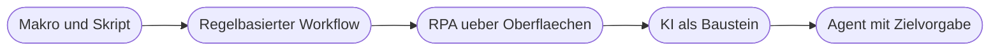
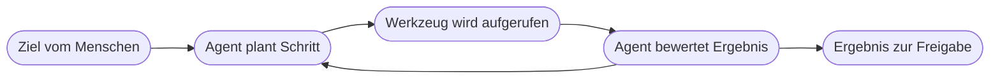
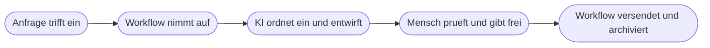

# Kapitel 2 – KI, Automatisierung, RPA und Agenten im Vergleich

{{ progress(2) }}

<div class="lernziele" markdown>
<h3>Was du in diesem Kapitel lernst</h3>

- Wie sich **Automatisierung**, **RPA**, **KI** und **Agent** sauber voneinander trennen lassen
- Das **Automatisierungs-Spektrum** von Makro über Workflow und RPA bis zum Agenten
- Warum **RPA** die Oberfläche bedient und wann das eine gute oder eine schlechte Idee ist
- Was einen **Agenten** von einem Chatfenster unterscheidet: Zielvorgabe, Werkzeuge, mehrere Schritte
- Ein praktisches **Entscheidungsraster**, welche Technologie zu welcher Aufgabe passt
- Wie du die Ansätze **kombinierst**, statt dich für einen entscheiden zu müssen
</div>

---

## 2.1 Vier Begriffe, die im Alltag durcheinandergehen

„Wir automatisieren das mit KI" – dieser Satz fällt in Projekten ständig, und meistens meinen zwei Personen am Tisch etwas völlig anderes damit. Deshalb steht dieses Kapitel früh im Kurs: Ohne saubere Begriffe wird jede Diskussion über Nutzen, Aufwand und Risiko beliebig.

**Automatisierung** heißt: Ein Ablauf läuft ohne menschliches Zutun, weil vorher festgelegt wurde, was in welcher Reihenfolge passieren soll. Die Intelligenz steckt im Kopf der Person, die den Ablauf entworfen hat – nicht im System.

**RPA** steht für **Robotic Process Automation**, auf Deutsch „robotergesteuerte Prozessautomatisierung". Eine Software bedient andere Programme so, wie ein Mensch es täte: Fenster öffnen, Felder ausfüllen, Knöpfe klicken, kopieren und einfügen.

**KI** liefert eine **Einschätzung oder einen Inhalt** – sie ordnet ein, extrahiert, fasst zusammen, formuliert. KI ist damit ein **Baustein**, kein Ablauf. Sie erledigt einen einzelnen Denkschritt, aber sie ruft von sich aus nichts auf und schickt keine E-Mail.

Ein **Agent** ist ein KI-System, das ein **Ziel** erhält, dazu **Werkzeuge** benutzen darf und selbst entscheidet, in welcher Reihenfolge es Schritte ausführt, bis das Ziel erreicht ist.

| Begriff | Kernidee | Wer legt die Schritte fest | Ergebnis ist |
|---|---|---|---|
| Automatisierung | fester Ablauf ohne Zutun | der Mensch beim Bauen | exakt vorhersehbar |
| RPA | Oberflächen bedienen wie ein Mensch | der Mensch beim Aufzeichnen | vorhersehbar, aber störanfällig |
| KI | einen Denkschritt erledigen | der Mensch ruft den Baustein auf | eine Wahrscheinlichkeit, keine Gewissheit |
| Agent | Ziel erreichen mit Werkzeugen | das System zur Laufzeit | variabel, muss begrenzt werden |

!!! info "Merksatz"
    Bei Automatisierung sagst du dem System **wie**. Bei einem Agenten sagst du ihm **was** – und gibst ihm die Werkzeuge dazu. Alles, was dazwischenliegt, ist eine Mischform.

---

## 2.2 Das Automatisierungs-Spektrum

Die vier Begriffe sind keine Gegensätze, sondern Stationen auf einer Linie. Je weiter rechts, desto mehr Entscheidungsspielraum gibt du ab – und desto mehr Kontrolle musst du bewusst wieder einbauen.



**Stufe 1 – Makro und Skript.** Eine aufgezeichnete Abfolge innerhalb eines Programms, klassisch das Excel-Makro. Es läuft nur dort, wo es aufgezeichnet wurde, und nur, wenn jemand es startet.

**Stufe 2 – Regelbasierter Workflow.** Ein Ablauf über Systemgrenzen hinweg, ausgelöst durch ein Ereignis oder einen Zeitplan: Mail mit Anhang kommt an, Datei landet in SharePoint, das Team wird informiert. Dies ist die Stufe, die du ab Block 4 mit **Power Automate** selbst baust. Sie arbeitet über **Connectoren**, also vorgefertigte Verbindungen zu Diensten wie Outlook, Teams oder Excel.

**Stufe 3 – RPA.** Kommt ins Spiel, wenn es keine Connectoren gibt – etwa bei einem alten Fachprogramm ohne Schnittstelle.

**Stufe 4 – KI als Baustein.** Innerhalb eines Ablaufs übernimmt ein KI-Schritt genau die Stelle, die sich nicht in Regeln fassen lässt: „Ist diese Nachricht eine Reklamation, eine Anfrage oder eine Kündigung?"

**Stufe 5 – Agent.** Erhält ein Ziel statt einer Schrittfolge und wählt seinen Weg selbst.

| Stufe | Typisches Werkzeug | Vorhersehbarkeit | Beispielaufgabe |
|---|---|---|---|
| Makro | Excel, Word | vollständig | Monatsbericht formatieren |
| Workflow | Power Automate Cloud-Flow, Zapier, Make | vollständig | Anhang ablegen und benachrichtigen |
| RPA | Power Automate Desktop | hoch, aber bruchgefährdet | Daten in Altsystem eintippen |
| KI-Baustein | AI Builder, Copilot, ChatGPT, Claude | statistisch | Anfrage einordnen, Text entwerfen |
| Agent | Copilot Studio, ChatGPT, Claude | variabel | Rechercheauftrag mehrstufig abarbeiten |

!!! warning "Häufiges Missverständnis"
    „Weiter rechts" bedeutet nicht „besser". Jede Stufe nach rechts kostet mehr Aufwand, mehr Prüfzeit und mehr Erklärungsbedarf. Wenn eine Aufgabe mit einer Regel gelöst ist, ist die Regel die richtige Antwort – auch dann, wenn ein Agent das ebenfalls könnte.

---

## 2.3 RPA: Automatisierung über die Oberfläche

RPA ist der pragmatische Notausgang. Es gibt in fast jedem Unternehmen ein System, das seit fünfzehn Jahren läuft, keine Schnittstelle hat und aus dem trotzdem täglich Daten heraus- oder hineinmüssen. Genau dort setzt RPA an: Der Software-Roboter meldet sich an, navigiert durch Masken, liest Felder aus, tippt ein.

Der Preis dafür ist **Zerbrechlichkeit**. Weil RPA sieht, was ein Mensch sieht, stört es alles, was ein Mensch mühelos wegklickt: ein verschobener Knopf nach dem Update, ein unerwartetes Dialogfenster, eine längere Ladezeit.

| Merkmal | Workflow über Connector | RPA über Oberfläche |
|---|---|---|
| Zugriffsweg | dokumentierte Schnittstelle | Bildschirm und Maus |
| Stabilität bei Updates | hoch | niedrig, bricht bei Layoutänderung |
| Geschwindigkeit | schnell, viele Fälle parallel | langsam, Fall für Fall |
| Wartungsaufwand | gering | dauerhaft und spürbar |
| Sinnvoll, wenn | eine Schnittstelle existiert | keine Schnittstelle existiert |

!!! tip "Reihenfolge der Prüfung"
    Frage in dieser Reihenfolge: Erstens – gibt es einen Connector oder eine Schnittstelle? Zweitens – kann die Fachabteilung den Zwischenschritt anders lösen, etwa über einen Export? Erst wenn beides Nein ist, ist RPA die richtige Wahl. Die Werkzeuglandschaft und ihre Auswahlkriterien vertiefst du in Kapitel 20.

---

## 2.4 KI ist ein Baustein, ein Agent ist ein Akteur

Der wichtigste Unterschied in diesem Kapitel ist der zwischen Stufe 4 und Stufe 5 – weil er im Marketing der Anbieter systematisch verwischt wird.

Ein **KI-Baustein** wird aufgerufen, bekommt eine Eingabe, gibt eine Ausgabe zurück und ist fertig. Er hat keinen Auftrag, der über diesen einen Schritt hinausgeht. Wenn du in einem Ablauf einen Prompt-Schritt einbaust, der eine Reklamation in drei Sätzen zusammenfasst, dann ist das ein Baustein: Der umgebende Ablauf entscheidet, was mit der Zusammenfassung passiert.

Ein **Agent** hat ein Ziel und eine Schleife. Er beobachtet die Lage, plant einen nächsten Schritt, führt ihn mit einem Werkzeug aus, sieht das Ergebnis und entscheidet erneut. Dazu braucht er vier Dinge: eine **Instruktion** (wie er sich verhalten soll), **Werkzeuge** (was er aufrufen darf), **Wissen** (auf welche Dokumente er zugreift) und ein **Gedächtnis** (was im Gespräch schon geklärt ist). Diese Anatomie baust du in Kapitel 6 systematisch auf, eigene Agenten mit Copilot Studio in Kapitel 32.



!!! example "Dieselbe Aufgabe auf drei Stufen"
    Aufgabe: Eingangsrechnungen prüfen und bei Abweichung nachfragen.

    - **Workflow:** Rechnung kommt per Mail, wird in SharePoint abgelegt, eine Aufgabe für die Buchhaltung wird erstellt. Immer gleich, kein Denkschritt.
    - **Workflow mit KI-Baustein:** Zusätzlich liest ein KI-Schritt Rechnungsnummer, Betrag und Lieferant aus dem PDF. Ein Vergleich mit der Bestellung erfolgt danach wieder regelbasiert – nur bei Abweichung geht eine Aufgabe an den Menschen.
    - **Agent:** Erhält das Ziel „kläre offene Abweichungen bei Eingangsrechnungen". Er darf die Bestelldatenbank abfragen, beim Einkauf nachfragen und eine Rückfrage an den Lieferanten entwerfen. Welche Schritte er in welcher Reihenfolge geht, entscheidet er selbst.

    Die dritte Variante ist die mächtigste und gleichzeitig die, die du am genauesten begrenzen und protokollieren musst.

---

## 2.5 Entscheidungsraster: welche Technologie für welche Aufgabe

Statt mit der Technologie anzufangen, fängst du mit der Aufgabe an. Fünf Fragen genügen für eine erste belastbare Zuordnung:

```text
Frage 1: Laesst sich die Aufgabe vollstaendig in Regeln beschreiben?
         Ja  -> Workflow. Nein -> weiter.
Frage 2: Steckt der schwierige Teil in Sprache, Text oder Dokumenten?
         Ja  -> KI-Baustein im Workflow. Nein -> weiter.
Frage 3: Fehlt eine Schnittstelle zum Zielsystem?
         Ja  -> RPA pruefen. Nein -> weiter.
Frage 4: Sind Anzahl und Reihenfolge der Schritte vorab unbekannt?
         Ja  -> Agent pruefen. Nein -> Workflow genuegt.
Frage 5: Waere ein Fehler teuer, rechtlich relevant oder schwer erkennbar?
         Ja  -> Freigabe durch Menschen ist Pflicht, Autonomie senken.
```

| Aufgabenmerkmal | Passende Stufe | Begründung |
|---|---|---|
| Immer gleiche Schrittfolge, klare Daten | Workflow | vorhersehbar, günstig, wartbar |
| Ein Schritt braucht Urteil über Text | Workflow plus KI-Baustein | KI nur an der Stelle, wo Regeln versagen |
| Zielsystem ohne Schnittstelle | RPA | letzte Möglichkeit, wenn kein Connector existiert |
| Offener Auftrag, Weg unklar | Agent | Reihenfolge entsteht erst zur Laufzeit |
| Rechtsverbindliche oder personenbezogene Entscheidung | Mensch entscheidet | KI liefert höchstens den Entwurf |
| Aufgabe fällt zweimal im Jahr an | gar nichts automatisieren | Bau- und Wartungsaufwand lohnt nicht |

!!! warning "Typische Falle"
    Die letzte Zeile wird am häufigsten übersehen. Eine Automatisierung, die zwei Tage Bauzeit kostet und dreimal jährlich zehn Minuten spart, ist ein Verlustgeschäft – auch wenn sie technisch gelungen ist. Wie du Kandidaten nach Häufigkeit, Aufwand und Regelmäßigkeit priorisierst, vertiefst du in Kapitel 17 und Kapitel 34.

---

## 2.6 Kombinieren statt wählen

In der Praxis ist die Frage fast nie „Workflow **oder** KI". Das tragfähige Muster lautet **deterministisch außen, KI innen**: Der Ablauf, der Daten transportiert, Fristen wahrt und protokolliert, ist regelbasiert und damit nachvollziehbar. Die KI sitzt in einem klar begrenzten Innenschritt. Und an jeder Stelle mit Folgen sitzt ein Mensch als Freigabepunkt.



Der Vorteil dieses Aufbaus ist die **Fehlereingrenzung**. Wenn etwas schiefgeht, kannst du unterscheiden: Hat der Ablauf nicht ausgelöst? Hat die KI falsch eingeordnet? Oder hat die Freigabe gefehlt? Bei einem Agenten, der alles auf einmal macht, ist diese Unterscheidung sehr viel schwerer – ein Grund, warum Agenten selten der beste erste Schritt sind. Die Einsatzstellen für KI in Abläufen behandelt Kapitel 29, das Zusammenspiel von Agent und Workflow Kapitel 33.

Ab jetzt lohnt es sich, die Begriffe konsequent zu trennen: Sprich nicht von „KI", wenn du einen Ablauf meinst, und nicht von „Agent", wenn du einen einzelnen KI-Aufruf meinst. Diese Präzision hilft nicht nur im Kurs, sondern vor allem in Gesprächen mit der IT, der Datenschutzbeauftragten und dem Betriebsrat – die dort gestellten Fragen unterscheiden sich je Stufe erheblich (Kapitel 4).

---

## Zusammenfassung

- **Automatisierung** legt Schritte fest, **KI** erledigt einen Denkschritt, ein **Agent** verfolgt ein Ziel mit Werkzeugen – das sind drei verschiedene Dinge.
- Das Spektrum reicht von **Makro** über **Workflow** und **RPA** bis zum **KI-Baustein** und zum **Agenten**; weiter rechts heißt mehr Freiheitsgrade und mehr Kontrollbedarf.
- **RPA** ist die Notlösung ohne Schnittstelle: schnell gebaut, dauerhaft wartungsintensiv, empfindlich gegen Updates.
- Der Unterschied zwischen **Baustein** und **Agent** liegt in Zielvorgabe, Werkzeugen und der eigenen Entscheidung über die Schrittfolge.
- Das Entscheidungsraster fragt nach Regelhaftigkeit, Sprachanteil, Schnittstellen, Offenheit des Wegs und Fehlerfolgen – erst danach fällt die Werkzeugwahl.
- Das belastbarste Muster ist **deterministisch außen, KI innen, Mensch an den Entscheidungspunkten**.

---

## Kurzübungen

{{ task(file="tasks/k02_01.yaml") }}

{{ task(file="tasks/k02_02.yaml") }}

{{ task(file="tasks/k02_03.yaml") }}

---

## Workshop

{{ task(file="tasks/workshop_k02.yaml") }}
