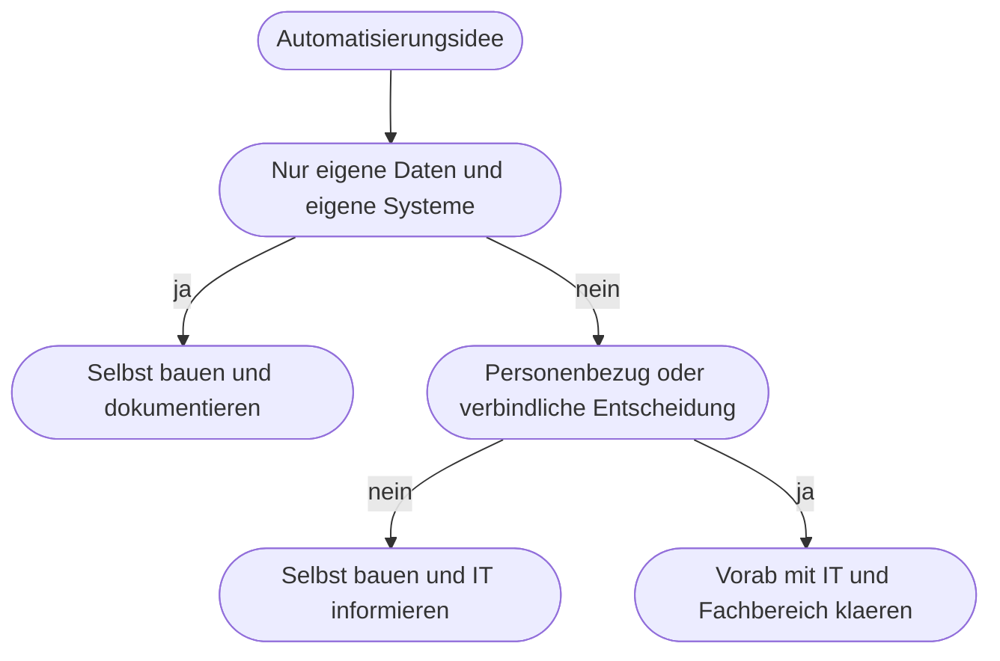

# Kapitel 20 – Werkzeuglandschaft: Power Automate, Zapier, Make

{{ progress(20) }}

<h3>Was du in diesem Kapitel lernst</h3>

- Warum alle drei Werkzeuge **dasselbe Grundprinzip** nutzen und sich trotzdem deutlich unterscheiden
- Wie **Power Automate**, **Zapier** und **Make** positioniert sind und wo jeweils ihre Stärke liegt
- Nach welchen **Kriterien** du vergleichst – von Integrationstiefe bis Betrieb
- Wie du mit einer **Auswahlmatrix** zu einer begründeten Entscheidung kommst
- Wann **Low-Code an Grenzen stößt** und die IT eingebunden werden muss
- Was **Schatten-IT** ist und warum die Frage „wem gehört diese Verbindung" so wichtig ist

---

## 20.1 Drei Werkzeuge, ein Prinzip

Alle drei Werkzeuge folgen dem Bauplan aus den Kapiteln 18 und 19: ein Auslöser, eine Kette von Aktionen, Logikbausteine dazwischen, Verbindungen zu Fremdsystemen. Wer das Prinzip verstanden hat, findet sich in jedem der drei zurecht – die Begriffe unterscheiden sich, die Denkweise nicht.

| Begriff | Power Automate | Zapier | Make |
|---|---|---|---|
| Der Ablauf heißt | Flow | Zap | Szenario |
| Der Auslöser heißt | Trigger | Trigger | Trigger-Modul |
| Ein Schritt heißt | Aktion | Action | Modul |
| Die Anbindung heißt | Connector und Verbindung | App und Connection | App und Connection |
| Die Darstellung ist | Liste von Schritten | Liste von Schritten | frei angeordnetes Diagramm |

Der wichtigste gemeinsame Baustein ist die **Verbindung** (englisch *Connection*): eine gespeicherte Anmeldung an ein Fremdsystem, mit der der Ablauf dort im Namen einer Person oder eines Kontos handelt. Verbindungen sind der Kern fast aller Betriebsprobleme – dazu Abschnitt 20.6.

!!! info "Merksatz"
    Die Werkzeugfrage ist selten die schwierige Frage. Ein schlecht aufgenommener Prozess (Kap. 17) und fehlende Datenklarheit (Kap. 18) lassen sich mit keinem Werkzeug retten. Entscheide erst, **was** automatisiert werden soll, dann **womit**.

---

## 20.2 Positionierung und Stärken

**Power Automate** ist Teil der Microsoft-Power-Platform und damit tief in Microsoft 365 verwoben. Ein Ablauf greift auf SharePoint, Outlook, Teams, Excel, Forms und Microsoft Lists zu, ohne dass zusätzliche Verträge nötig sind, und arbeitet innerhalb derselben Berechtigungswelt. Zwei Dinge kann nur Power Automate: **Genehmigungen** als eigenen Baustein mit Erinnerung und Protokoll (Kap. 27) und **Desktop-Automatisierung**, also das Steuern von Programmen ohne Schnittstelle über Maus, Tastatur und Bildschirmelemente – das, was üblicherweise als **RPA** (Robotic Process Automation) bezeichnet wird.

**Zapier** ist das Werkzeug mit dem breitesten **App-Katalog**. Für Nischenanwendungen aus Marketing, Vertrieb, Buchhaltung oder Projektmanagement gibt es dort am häufigsten eine fertige Anbindung. Die Bedienung ist sehr einfach: ein Auslöser, eine Handvoll Schritte, fertig in wenigen Minuten. Genau diese Einfachheit ist auch die Grenze – tiefe Verzweigungen und Schleifen sind möglich, aber nicht die Stärke.

**Make** setzt auf eine **visuelle Szenario-Ansicht**: Module werden auf einer Fläche angeordnet und mit Linien verbunden, Verzweigungen laufen sichtbar auseinander. Für Abläufe mit mehreren Wegen und Datenumformungen ist das die klarste Darstellung der drei. Make ist außerdem stark bei der Arbeit mit Datenstrukturen und bietet feine Kontrolle über Fehlerbehandlung pro Modul.

!!! example "Dasselbe Vorhaben, drei Wege"
    Aufgabe: Eingehende Rechnung ablegen, in eine Liste schreiben, Freigabe einholen.

    - **Power Automate:** naheliegende Wahl, weil Postfach, Ablage und Liste ohnehin in Microsoft 365 liegen und die Genehmigung ein fertiger Baustein ist. Kein zusätzlicher Anbieter, kein zusätzlicher Vertrag.
    - **Zapier:** sinnvoll, wenn Ablage und Freigabe in Nicht-Microsoft-Werkzeugen stattfinden, etwa in einem Projektwerkzeug mit eigener Aufgabenverwaltung.
    - **Make:** sinnvoll, wenn die Rechnung aus mehreren Quellen kommt und je Lieferant unterschiedlich verarbeitet wird – die Verzweigungen bleiben im Diagramm lesbar.

    Alle drei lösen die Aufgabe. Der Unterschied liegt nicht im Können, sondern in Aufwand, Kosten und Betriebsverantwortung.

---

## 20.3 Vergleich nach Kriterien

| Kriterium | Power Automate | Zapier | Make |
|---|---|---|---|
| Integrationstiefe in Microsoft 365 | sehr hoch, inklusive Berechtigungen und Genehmigungen | mittel, über Standardanbindungen | mittel, über Standardanbindungen |
| Breite des App-Katalogs | groß, Schwerpunkt Unternehmenssysteme | am größten, viele Nischenanwendungen | groß, technisch orientiert |
| Verzweigungslogik und Übersicht | vollständig, Darstellung als lange Liste | einfache Verzweigungen, bewusst schlicht | stärkste Übersicht durch Szenario-Diagramm |
| Umgang mit Datenstrukturen | gut, über Ausdrücke | begrenzt | sehr gut, feingranular |
| Desktop-Automatisierung und RPA | ja, als Desktop-Flow | nein | nein |
| Datenhaltung und Serverstandort | folgt der Region des Mandanten, EU-Regionen verfügbar | überwiegend Anbieterinfrastruktur, Standort prüfen | EU-Region wählbar, Anbieter mit europäischem Ursprung |
| Auftragsverarbeitung nach DSGVO | über bestehende Rahmenverträge meist abgedeckt | eigener Vertrag nötig | eigener Vertrag nötig |
| Preis- und Lizenzlogik | teils in M365-Lizenzen enthalten, Premium-Anbindungen kosten extra | Staffelung nach Anzahl ausgeführter Abläufe | Staffelung nach Anzahl ausgeführter Schritte |
| Lernkurve für Fachanwender | mittel, viele Begriffe und Ausdrücke | flach, schnelle erste Erfolge | mittel bis steil, dafür sehr transparent |
| Betrieb und Governance | Umgebungen, Richtlinien, zentrale Übersicht möglich | wenig zentrale Steuerung, oft persönliche Konten | Team- und Rechteverwaltung vorhanden |

Drei Punkte aus dieser Tabelle verdienen besondere Aufmerksamkeit.

Erstens die **Kostenlogik**. Zapier zählt im Kern ausgeführte Abläufe, Make zählt einzelne Schritte. Derselbe Ablauf kann daher je Werkzeug völlig unterschiedlich zu Buche schlagen – besonders wenn er eine Schleife über viele Elemente enthält (Kap. 19). Rechne vor der Entscheidung mit realistischen Mengen, nicht mit dem Testfall.

Zweitens die **Datenfrage**. Bei Zapier und Make laufen deine Inhalte durch die Systeme eines zusätzlichen Anbieters. Das ist zulässig, erfordert aber einen Vertrag zur Auftragsverarbeitung, eine Prüfung des Serverstandorts und eine Bewertung, welche Datenarten dort verarbeitet werden dürfen (Kap. 4). Bei Power Automate bleiben die Daten in der Regel innerhalb der bestehenden Microsoft-365-Vereinbarung – das ist der praktische Hauptvorteil in deutschen Unternehmen.

Drittens die **Lernkurve**. Zapier ist am schnellsten zu bedienen, Make am transparentesten, Power Automate am mächtigsten. Für einen Kurs wie diesen ist Power Automate die richtige Wahl, weil dort das gesamte Spektrum vorkommt – von der einfachen Regel bis zur Genehmigung mit Protokoll.

!!! warning "Typische Falle"
    Vergleichstabellen im Internet sind fast immer veraltet und häufig von einem Anbieter finanziert. Funktionsumfang, Tarifstufen und Regionen ändern sich mehrmals im Jahr. Nutze eine Tabelle wie diese als **Fragenkatalog**, nicht als Faktenblatt – und prüfe die drei Punkte Kosten, Datenstandort und Vertragslage immer aktuell beim Anbieter selbst.

---

## 20.4 Auswahlkriterien-Matrix

Für eine begründete Entscheidung gewichtest du die Kriterien nach deinem Fall und bewertest jedes Werkzeug von 1 bis 5. Die Gewichtung ist der eigentliche fachliche Beitrag – sie macht sichtbar, was dir wichtig ist.

| Kriterium | Gewicht | Power Automate | Zapier | Make |
|---|---|---|---|---|
| Systeme liegen in Microsoft 365 | 3 | 5 | 3 | 3 |
| Nischenanwendung muss angebunden werden | 2 | 2 | 5 | 4 |
| Personenbezogene Daten im Ablauf | 3 | 5 | 2 | 3 |
| Viele Verzweigungen und Sonderwege | 2 | 3 | 2 | 5 |
| Schnelles Ergebnis ohne IT-Beteiligung | 1 | 2 | 5 | 3 |
| Betrieb über Jahre und Vertretungsregelung | 3 | 5 | 2 | 3 |
| **Gewichtete Summe** | | **57** | **40** | **48** |

So liest du das Ergebnis: Bei einem Vorhaben mit personenbezogenen Daten in einer Microsoft-365-Landschaft gewinnt Power Automate deutlich. Verschiebst du das Gewicht auf „Nischenanwendung" und „schnelles Ergebnis" – etwa bei einer kleinen Marketingautomatisierung ohne Personendaten –, dreht sich das Bild zugunsten von Zapier. Die Matrix liefert keine Wahrheit, sondern eine **nachvollziehbare Begründung**, die man auch in einem halben Jahr noch verstehen kann.

Ein pragmatischer Zusatz: Es muss nicht ein Werkzeug für alles sein. Viele Organisationen betreiben Power Automate als Standard für interne, datensensible Abläufe und lassen daneben ein zweites Werkzeug für abgegrenzte Fälle zu. Wichtig ist, dass diese Aufteilung **entschieden** und aufgeschrieben ist – nicht zufällig entstanden.

---

## 20.5 Wo Low-Code endet

**Low-Code** heißt: Abläufe entstehen durch Konfigurieren statt durch Programmieren. Das trägt weit, aber nicht beliebig weit. Diese Anzeichen bedeuten, dass du die IT einbinden solltest:

- Der Ablauf braucht eine **Anbindung, die es nicht gibt**, und du fängst an, Schnittstellen von Hand aufzurufen und Anmeldeverfahren nachzubauen (Kap. 26).
- Der Ablauf hat **mehr als etwa 30 Schritte** oder mehr als zwei Verschachtelungsebenen. Dann ist er nicht mehr wartbar (Kap. 19).
- Der Ablauf greift auf **Daten mit hohem Schutzbedarf** zu: Gesundheitsdaten, Bewerberdaten, Entgeltdaten, Kundenverträge.
- Der Ablauf soll **verbindliche Entscheidungen** treffen: Zahlungen anweisen, Verträge kündigen, Bewerber ablehnen.
- Es hängen **andere Abteilungen** davon ab oder er läuft in einem Bereich mit Nachweispflichten.
- Es gibt **Premium- oder Lizenzbedarf**, Adminrechte oder eine neue Umgebung.

Die IT einzubinden ist keine Niederlage und kein Kontrollverlust. In der Praxis ist es der einzige Weg, dass ein Ablauf einen Personalwechsel, eine Systemumstellung und eine Datenschutzprüfung übersteht. Umgekehrt gilt aber auch: Wer für jede Ablage-Automatisierung ein Freigabeverfahren verlangt, erzeugt genau die Umgehungen, die im nächsten Abschnitt beschrieben werden.

---

## 20.6 Schatten-IT und die Frage, wem eine Verbindung gehört

**Schatten-IT** bezeichnet Werkzeuge und Abläufe, die im Fachbereich entstehen, ohne dass IT, Datenschutz oder Einkauf davon wissen. Bei Automatisierungswerkzeugen ist das besonders naheliegend: Ein kostenloser Tarif ist in fünf Minuten eingerichtet, und schon fließen Unternehmensdaten über ein System, das nie geprüft wurde.

| Risiko | Was konkret passiert | Praktische Gegenmaßnahme |
|---|---|---|
| Personenabhängigkeit | Ablauf läuft unter einem persönlichen Konto und stoppt beim Austritt | Abläufe auf ein Funktionskonto oder eine Teamumgebung stellen |
| Unbekannte Datenflüsse | niemand weiß, welche Daten wohin gehen | einfaches Verzeichnis der Abläufe mit Datenarten führen |
| Fehlende Verträge | Auftragsverarbeitung ungeklärt, Datenschutzverstoß möglich | vor Produktivnutzung Vertragslage klären (Kap. 4) |
| Kein Betrieb | Fehler bleiben unbemerkt, niemand ist zuständig | Verantwortliche Rolle plus Vertretung schriftlich festlegen (Kap. 19) |
| Doppelte Lösungen | drei Abteilungen bauen denselben Ablauf dreimal | Abläufe sichtbar machen, bevor neu gebaut wird |
| Kostenüberraschung | Tarifgrenze wird erreicht, Abläufe stoppen mitten im Monat | Verbrauch abschätzen und beobachten |

Die praktisch wichtigste Einzelfrage lautet: **Wem gehört die Verbindung?** Wenn du einen Ablauf mit deiner eigenen Anmeldung an das Postfach, die Ablage oder das Fachsystem baust, handelt der Ablauf mit **deinen** Rechten und unter **deinem** Namen. Drei Folgen ergeben sich daraus:

1. Der Ablauf kann alles, was du kannst – auch versehentlich mehr, als er sollte.
2. Verlierst du eine Berechtigung oder änderst du dein Kennwort, bricht der Ablauf ab.
3. Verlässt du das Unternehmen, stirbt der Ablauf mit deinem Konto – oft unbemerkt.

Für alles, was länger als ein Experiment leben soll, gilt daher: Verbindung auf ein **Funktionskonto** oder eine geteilte Umgebung umstellen, Miteigentümer eintragen, und in einer kurzen Betriebsnotiz festhalten, welche Verbindungen der Ablauf nutzt und mit welchen Rechten. Wie das in Power Automate konkret aussieht, folgt in Kapitel 21; die Betriebsseite vertiefst du in Kapitel 38.

!!! tip "Der pragmatische Weg"
    Verbiete nichts, was du nicht ersetzen kannst. Bewährt hat sich diese Reihenfolge: Erstens ein **erlaubter Spielplatz** für Selbstversuche mit unkritischen Daten. Zweitens eine kurze, verständliche Regel, ab wann ein Ablauf gemeldet werden muss – zum Beispiel „sobald andere Personen darauf angewiesen sind oder personenbezogene Daten verarbeitet werden". Drittens ein sichtbares Verzeichnis, in dem Abläufe auffindbar sind. Damit entstehen Automatisierungen weiter im Fachbereich, aber sie bleiben auffindbar und übergebbar.

---

## Zusammenfassung

- Alle drei Werkzeuge nutzen dasselbe Prinzip aus Trigger, Aktionen und Logik – nur die Begriffe und Darstellungen unterscheiden sich.
- **Power Automate** punktet mit Microsoft-365-Tiefe, Genehmigungen und Desktop-Automatisierung, **Zapier** mit dem breitesten App-Katalog und der flachsten Lernkurve, **Make** mit der klarsten visuellen Darstellung verzweigter Abläufe.
- Vergleiche entlang fester Kriterien: Integrationstiefe, App-Katalog, Datenhaltung und Serverstandort, Auftragsverarbeitung, Verzweigungslogik, Kostenlogik, Lernkurve, Betrieb.
- Die **Kostenlogik** unterscheidet sich grundlegend – Abläufe zählen ist nicht dasselbe wie Schritte zählen; rechne mit realistischen Mengen.
- Eine **Auswahlmatrix** mit Gewichtung liefert keine Wahrheit, aber eine nachvollziehbare Begründung.
- **Low-Code endet** bei fehlenden Anbindungen, hoher Komplexität, schutzbedürftigen Daten und verbindlichen Entscheidungen – dort gehört die IT dazu.
- Die entscheidende Betriebsfrage ist, **wem eine Verbindung gehört**: persönliche Konten machen Abläufe unsichtbar und sterblich.

---

## Kurzübungen

{{ task(file="tasks/k20_01.yaml") }}

{{ task(file="tasks/k20_02.yaml") }}

{{ task(file="tasks/k20_03.yaml") }}

---

## Workshop

{{ task(file="tasks/workshop_k20.yaml") }}
