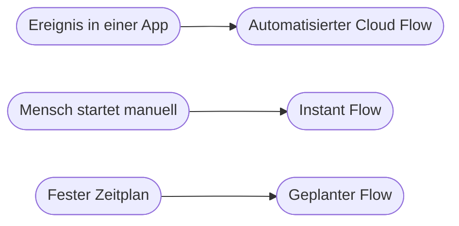

# Kapitel 21 – Einführung in Power Automate

{{ progress(21) }}

<div class="lernziele" markdown>
<h3>Was du in diesem Kapitel lernst</h3>

- Wie du **Zugang** zu Power Automate bekommst und wie die Oberfläche aufgebaut ist
- Welche **Flow-Typen** es gibt und welcher zu welcher Aufgabe passt
- Was **Connectoren** sind und was der Unterschied zwischen **Standard** und **Premium** bedeutet
- Warum **Verbindungen (Connections)** an ein Konto gebunden sind und wer damit eigentlich handelt
- Was eine **Umgebung (Environment)** ist und warum sie über Sichtbarkeit und Rechte entscheidet
- Wie du **Vorlagen (Templates)** als Startpunkt nutzt, ohne dich von ihnen in die Irre führen zu lassen
</div>

---

## 21.1 Was Power Automate ist und wie du hineinkommst

**Power Automate** ist der Automatisierungsdienst von Microsoft und Teil der **Power Platform** – der Familie aus Power Automate, Power Apps, Power BI und Copilot Studio. Du baust darin **Flows**: Abläufe aus einem Auslöser und mehreren Aktionen, die ohne dein Zutun laufen. Die Begriffe Trigger, Aktion, Datenfluss und Trigger-Bedingung kennst du schon werkzeugunabhängig (Kap. 18); ab hier setzt du sie konkret um.

Der Zugang läuft über den Browser: `make.powerautomate.com` → Anmeldung mit deinem Geschäfts- oder Schulkonto. Es gibt keine Installation. Oben rechts siehst du zwei Dinge, die du dir angewöhnen solltest zu prüfen: das **Konto**, mit dem du angemeldet bist, und die **Umgebung**, in der du gerade arbeitest.

!!! info "Merksatz"
    In Power Automate arbeitest du immer in drei Koordinaten: **wer** du bist (Konto), **wo** du bist (Umgebung) und **womit** der Flow auf Daten zugreift (Verbindung). Wenn ein Flow „unerklärlich" nicht funktioniert, liegt der Fehler sehr oft in einer dieser drei Angaben und nicht in der Logik.

---

## 21.2 Die Oberfläche: sechs Bereiche, die du brauchst

Links liegt die Navigation. Sie ist schmal, aber jeder Punkt hat eine klare Funktion.

| Bereich | Was du dort findest | Wann du hingehst |
|---|---|---|
| **Startseite (Home)** | Suchfeld, empfohlene Vorlagen, letzte Aktivität | Einstieg, schnelle Suche |
| **Erstellen (Create)** | alle Wege, einen neuen Flow zu beginnen | jeder neue Flow |
| **Meine Flows (My flows)** | deine eigenen Flows, geteilte Flows, Desktop-Flows | bearbeiten, ein- und ausschalten |
| **Vorlagen (Templates)** | fertige Flow-Muster nach Thema und App | Startpunkt, Inspiration |
| **Verbindungen (Connections)** | alle Konten, mit denen deine Flows arbeiten | Verbindung reparieren oder neu anlegen |
| **Lösungen (Solutions)** | Container, um Flows als Paket zu verwalten | Zusammenarbeit, Umzug zwischen Umgebungen |

Unter **Meine Flows** siehst du zu jedem Flow den Status **Ein** oder **Aus**, den Typ und die letzte Änderung. Über das Kontextmenü eines Flows kommst du zu **Bearbeiten**, **Details** und **Ausführungsverlauf (Run history)** – der Verlauf ist deine wichtigste Informationsquelle bei Fehlern (Kap. 22).

Zwei weitere Punkte tauchen in der Navigation auf, sind aber keine Bauwerkzeuge: **Genehmigungen (Approvals)** sammelt Aufgaben, die Menschen erledigen müssen (Kap. 27), und **Prozessmining** analysiert bestehende Abläufe. Beide brauchst du für die ersten Flows nicht.

---

## 21.3 Die Flow-Typen und ihr Einsatzzweck

Der Weg `make.powerautomate.com → Erstellen` zeigt dir die Startpunkte. Die wichtigste Entscheidung dabei ist: **Was löst den Ablauf aus?**



| Flow-Typ | Auslöser | Typisches Beispiel | Grenze |
|---|---|---|---|
| **Automatisierter Cloud-Flow** | Ereignis in einem Dienst | neue E-Mail, neues Listenelement, Datei hochgeladen | reagiert nur, wenn der Dienst das Ereignis meldet |
| **Instant-Flow** (manuell ausgelöst) | Mensch drückt auf Start, z. B. in der Mobil-App oder aus Teams | „Diesen Auftrag jetzt melden" | nichts passiert ohne Auslösung |
| **Geplanter Flow (Scheduled)** | Zeitplan | jeden Montag 8 Uhr Wochenbericht | läuft auch, wenn es nichts zu tun gibt |
| **Desktop-Flow (RPA)** | wird von einem Cloud-Flow oder manuell gestartet | Daten in ein Altsystem eintippen, das keinen Connector hat | braucht Power Automate Desktop auf einem Rechner, ist störanfällig |
| **Prozess-Flow (Business Process Flow)** | Datensatz in Dataverse | mehrstufiger Vertriebsprozess mit Phasen | kein Automatismus, sondern eine Führung für Menschen |

Die ersten drei Typen sind **Cloud-Flows** – sie laufen auf Microsoft-Servern, brauchen keinen eingeschalteten Rechner und sind der Schwerpunkt dieses Blocks. Der **Desktop-Flow** ist die RPA-Variante: Sie bedient Programmoberflächen wie ein Mensch. Wann das sinnvoll und wann es eine Notlösung ist, hast du in Kapitel 2 eingeordnet.

!!! warning "Typische Falle"
    Ein automatisierter Cloud-Flow ist keine Dauerüberwachung deines Bildschirms. Er reagiert ausschließlich auf Ereignisse, die der jeweilige Dienst meldet. „Wenn jemand eine Excel-Datei auf seinem Laufwerk ändert" ist deshalb kein brauchbarer Auslöser – die Datei muss in OneDrive oder SharePoint liegen, damit ein Ereignis überhaupt entsteht.

---

## 21.4 Connectoren: Standard und Premium

Ein **Connector** ist die vorgefertigte Brücke zu einem Dienst. Er bringt **Trigger** („Bei Eingang einer neuen E-Mail") und **Aktionen** („Datei erstellen") mit und übernimmt die technische Kommunikation. Es gibt mehrere Hundert davon, und Microsoft teilt sie in zwei Gruppen.

| | Standard-Connector | Premium-Connector |
|---|---|---|
| Beispiele | Outlook, SharePoint, Teams, OneDrive for Business, Excel Online, Forms, Planner, To Do, Microsoft Lists | Dataverse, SQL Server, Salesforce, SAP, HTTP, Custom Connector, Azure-Dienste |
| Enthalten in | den meisten Microsoft-365-Plänen | nur mit Power-Automate-Zusatzlizenz |
| Kennzeichnung | keine | Hinweis **Premium** direkt am Connector-Namen |
| Für diesen Kurs | Grundlage aller Übungen | einzelne Ausblicke, vor allem HTTP (Kap. 26) |

Die Kennzeichnung siehst du beim Hinzufügen einer Aktion: `Flow bearbeiten → Aktion hinzufügen → Suchfeld` – neben dem Namen steht bei kostenpflichtigen Connectoren ein **Premium**-Kennzeichen. Wenn du eine Vorlage auswählst, die Premium enthält, meldet Power Automate das erst beim Speichern oder beim ersten Lauf.

!!! info "Falls du keinen Zugang oder keine Premium-Lizenz hast"
    Alle Pflichtübungen dieses Blocks kommen mit **Standard-Connectoren** aus – Outlook, OneDrive for Business, SharePoint, Teams, Forms und Excel Online genügen. Falls dir Power Automate gar nicht zur Verfügung steht, hast du diese Möglichkeiten:

    - Ein **Microsoft-365-Testkonto** anlegen (der Developer-Plan enthält eine eigene Umgebung mit Postfach, OneDrive, SharePoint und Teams).
    - Für Premium-Themen: Es gibt eine zeitlich begrenzte **Testversion** von Power Automate Premium, die du ohne Kauf starten kannst.
    - Ohne jeden Zugang: Baue den Flow als **Papier-Entwurf** in der Schrittlisten-Form, die in diesem Block überall verwendet wird, und setze die Logik in **Zapier** oder **Make** im kostenlosen Tarif um (Kap. 20). Trigger, Aktionen, Verzweigung und Ausdrücke sind übertragbar, nur die Bezeichnungen unterscheiden sich.

---

## 21.5 Verbindungen: unter wessen Konto läuft der Flow?

Wenn du zum ersten Mal eine Outlook-Aktion einfügst, legt Power Automate eine **Verbindung (Connection)** an: eine gespeicherte Anmeldung an diesen Dienst mit **deinem** Konto. Alles, was der Flow danach tut, tut er als du.

```text
Flow: Rechnungsanhang ablegen
  Trigger: Bei Eingang einer neuen E-Mail (V3)
    Verbindung: anna.beispiel@firma.de
  Aktion: Datei erstellen (OneDrive for Business)
    Verbindung: anna.beispiel@firma.de
  Aktion: Nachricht in einem Chat oder Kanal veroeffentlichen (Teams)
    Verbindung: anna.beispiel@firma.de
```

Das hat drei Konsequenzen, die in der Praxis regelmäßig unterschätzt werden:

1. Der Flow sieht genau die Daten, die **dieses Konto** sehen darf – nicht mehr und nicht weniger.
2. Empfänger sehen deinen Namen als Absender. Eine automatische Mail aus dem Flow ist von einer persönlichen Mail nicht zu unterscheiden.
3. Verlässt die Person das Unternehmen oder wird ihr Passwort geändert, bricht die Verbindung – und der Flow fällt aus.

Unter `Verbindungen` siehst du zu jeder Verbindung einen Status. Steht dort **Behoben werden muss** oder **Nicht verbunden**, musst du sie über `... → Verbindung repariert` neu anmelden. Für Abläufe, die dauerhaft laufen sollen, verwenden Organisationen deshalb häufig ein **Dienstkonto** – ein eigenes Konto ohne persönliche Nutzung, dessen Anmeldedaten der IT bekannt sind. Wie du das mit Berechtigungen und Postfächern zusammenbringst, vertieft Kapitel 25.

!!! warning "Häufiges Missverständnis"
    „Ich habe den Flow mit einer Kollegin geteilt, jetzt läuft er unter ihrem Konto." Falsch: Teilen gibt Bearbeitungsrechte, ändert aber die Verbindungen nicht. Der Flow handelt weiterhin mit dem Konto, das in den Verbindungen eingetragen ist. Prüfe bei jedem Flow, den andere weiterverwenden sollen, unter `Flow-Details → Verbindungen`, welches Konto dort steht.

---

## 21.6 Umgebungen, Lizenzen und Vorlagen

Eine **Umgebung (Environment)** ist ein abgetrennter Bereich eines Mandanten, in dem Flows, Apps und Daten liegen. Jeder Mandant hat eine **Standardumgebung**, in der alle Nutzenden automatisch arbeiten. Größere Organisationen legen zusätzlich eigene Umgebungen an, oft getrennt nach **Entwicklung**, **Test** und **Produktion**.

| Merkmal | Standardumgebung | Eigene Umgebung |
|---|---|---|
| Wer darf hinein | alle Nutzenden des Mandanten | nur zugewiesene Personen |
| Typischer Zweck | persönliche Flows, erste Versuche | Team- und Abteilungslösungen, getrennte Testläufe |
| Verwaltung | von der IT selten aktiv gepflegt | bewusst eingerichtet und überwacht |
| Risiko | wächst unkontrolliert, Flows gehen verloren | Aufwand für Einrichtung und Rechte |

Der **Umgebungsumschalter** liegt oben rechts. Merke dir seine Bedeutung: Ein Flow, den du nicht mehr findest, liegt fast immer in einer anderen Umgebung als der, die gerade ausgewählt ist. Dasselbe gilt für Verbindungen – sie sind an eine Umgebung gebunden.

**Lösungen (Solutions)** sind Pakete innerhalb einer Umgebung. Alles, was zusammengehört – Flows, Verbindungsverweise, Listen – liegt in einer Lösung und kann als Einheit exportiert und in eine andere Umgebung importiert werden. Für deine ersten Flows brauchst du das nicht; sobald ein Ablauf aber produktiv genutzt wird und eine Testversion existieren soll, ist es der saubere Weg (Kap. 38).

Zur **Lizenzlogik** genügen dir drei Sätze. Erstens: Cloud-Flows mit Standard-Connectoren sind in den gängigen Microsoft-365-Plänen enthalten. Zweitens: Premium-Connectoren, Desktop-Flows im unbeaufsichtigten Betrieb und Prozess-Mining brauchen eine Zusatzlizenz. Drittens: Es gibt Grenzwerte pro Lizenz, etwa für die Zahl der Flow-Aktionen pro Tag – im Kursbetrieb erreichst du sie nicht, in einem Flow, der stündlich über 5.000 Listenelemente läuft, sehr wohl (Kap. 28).

!!! example "Vorlage als Startpunkt richtig nutzen"
    Weg: `make.powerautomate.com → Vorlagen → Suchfeld: Anhang speichern`. Wähle eine Vorlage, die deinem Ziel nahekommt, und arbeite sie in dieser Reihenfolge durch:

    1. **Lesen, nicht speichern.** Welche Connectoren sind beteiligt, steht ein Premium-Kennzeichen dabei?
    2. **Verbindungen bestätigen.** Die Vorlage fragt nach jedem beteiligten Konto.
    3. **Erstellen und sofort umbenennen.** Vorlagennamen wie „Save my email attachments to a SharePoint document library" verraten nichts über deinen Anwendungsfall.
    4. **Jeden Schritt einzeln öffnen** und Felder auf deine Ordner, Postfächer und Kanäle umstellen.
    5. **Erst dann einschalten.** Bis alle Felder geprüft sind, bleibt der Flow über `Meine Flows → Ausschalten` deaktiviert.

    Vorlagen sind gute Gerüste und schlechte Endergebnisse. Sie enthalten oft mehr Schritte als du brauchst, und ihre Feldbelegung ist auf ein fremdes Beispiel zugeschnitten.

---

## Zusammenfassung

- Power Automate läuft im Browser über `make.powerautomate.com`; die Navigation führt zu Erstellen, Meine Flows, Vorlagen, Verbindungen und Lösungen.
- Die Wahl des **Flow-Typs** folgt der Frage nach dem Auslöser: Ereignis, manueller Start oder Zeitplan; Desktop-Flows sind die RPA-Variante, Prozess-Flows führen Menschen.
- **Connectoren** liefern Trigger und Aktionen; **Premium** ist am Kennzeichen erkennbar und braucht eine Zusatzlizenz – dieser Block kommt ohne aus.
- Eine **Verbindung** bindet den Flow an ein Konto: Rechte, Absendername und Ausfallrisiko hängen daran, nicht am Teilen des Flows.
- **Umgebungen** trennen Bereiche voneinander; wer einen Flow „verloren" hat, prüft zuerst den Umgebungsumschalter.
- **Vorlagen** sind Gerüste: übernehmen, umbenennen, jedes Feld prüfen, erst dann einschalten.

---

## Kurzübungen

{{ task(file="tasks/k21_01.yaml") }}

{{ task(file="tasks/k21_02.yaml") }}

{{ task(file="tasks/k21_03.yaml") }}

---

## Workshop

{{ task(file="tasks/workshop_k21.yaml") }}
