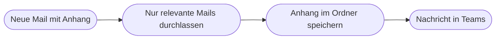

# Kapitel 22 – Der erste Cloud-Flow

{{ progress(22) }}

<div class="lernziele" markdown>
<h3>Was du in diesem Kapitel lernst</h3>

- Wie du einen **automatisierten Cloud-Flow** von der leeren Seite bis zum aktiven Ablauf baust
- Wie du einen **Trigger** konfigurierst und mit einer **Trigger-Bedingung** unnötige Läufe verhinderst
- Wie du **Aktionen** hinzufügst und Felder mit **dynamischen Inhalten (Dynamic Content)** füllst
- Warum du jeden Schritt **umbenennst** und wie du den Flow speicherst, ohne ihn scharf zu stellen
- Wie du **manuell** und mit **echter Auslösung** testest
- Wie du den **Ausführungsverlauf (Run history)** liest und **Ein- und Ausgaben** eines Schrittes prüfst
</div>

---

## 22.1 Das Szenario und das Zielbild

Du baust einen Ablauf, der in Verwaltung, Einkauf und Buchhaltung ständig gebraucht wird: **Eine E-Mail mit Anhang trifft ein, der Anhang wird in einen Ordner gelegt, und das Team wird informiert.**



Als Schrittliste sieht der Zielzustand so aus. Die Einrückung zeigt, was ineinander liegt:

```text
Flow: 22 Rechnungsanhang ablegen   (automatisierter Cloud-Flow)
  Trigger: Bei Eingang einer neuen E-Mail V3
    Ordner: Posteingang
    Nur mit Anlagen: Ja
    Anlagen einschliessen: Ja
    Betrefffilter: Rechnung
  Aktion: Auf jedes anwenden   (ueber Anlagen)
    Aktion: Datei erstellen   (OneDrive for Business)
      Ordnerpfad: /Rechnungseingang
      Dateiname: Name der Anlage
      Dateiinhalt: Inhalt der Anlage
  Aktion: Nachricht in einem Chat oder Kanal veroeffentlichen   (Teams)
    Text: Neue Rechnung von Absender mit Betreff eingegangen
```

Alle beteiligten Connectoren sind Standard-Connectoren (Kap. 21), du brauchst also keine Zusatzlizenz. Wenn du kein Teams hast, ersetze den letzten Schritt durch `E-Mail senden (V2)` – die Logik bleibt gleich.

!!! info "Merksatz"
    Baue nie den ganzen Flow und teste dann. Baue **Trigger plus eine Aktion**, teste, und erweitere erst danach. Ein Flow mit acht Schritten, der beim ersten Lauf scheitert, hat acht Fehlerkandidaten; ein Flow mit zwei Schritten hat einen.

---

## 22.2 Flow anlegen und Trigger konfigurieren

Der Weg: `make.powerautomate.com → Erstellen → Automatisierter Cloud-Flow`. Es öffnet sich ein Dialog mit zwei Feldern.

Im Feld **Flow-Name** trägst du sofort einen sprechenden Namen ein, zum Beispiel `22 Rechnungsanhang ablegen`. Im Feld **Flow-Trigger auswählen** suchst du nach `neue E-Mail` und wählst **Bei Eingang einer neuen E-Mail (V3)** aus dem Office-365-Outlook-Connector. Dann `Erstellen`.

Du landest im **Flow-Designer**. Der Trigger ist als erste Karte da, aber leer. Klicke ihn an und öffne über `Erweiterte Optionen anzeigen` die vollständige Feldliste.

| Feld im Trigger | Bedeutung | Empfehlung für diesen Flow |
|---|---|---|
| **Ordner** | welcher Postfachordner überwacht wird | `Posteingang`, besser ein eigener Unterordner |
| **An / Von** | Filter auf Empfänger oder Absender | leer lassen oder Absenderadresse eintragen |
| **Betrefffilter (Subject Filter)** | Text, der im Betreff vorkommen muss | `Rechnung` |
| **Nur mit Anlagen** | `Ja` = Mails ohne Anhang lösen nichts aus | `Ja` |
| **Anlagen einschließen** | `Ja` = der Inhalt der Anhänge wird mitgeliefert | `Ja` |
| **Wichtigkeit** | Filter auf Priorität der Mail | `Beliebig` |

Die beiden letzten Felder sind der klassische Stolperstein: **Nur mit Anlagen** entscheidet, *ob* der Flow startet. **Anlagen einschließen** entscheidet, ob du an den *Inhalt* der Anhänge kommst. Steht das zweite auf `Nein`, startet der Flow zwar, aber der Dateiinhalt ist leer.

!!! warning "Typische Falle"
    Der Trigger prüft dein Postfach in einem festen Takt, nicht in Echtzeit. Zwischen Eingang der Mail und Start des Flows liegt in der Praxis oft eine Minute oder mehr. Ein Flow, der „nicht funktioniert", ist häufig einfach noch nicht gelaufen – warte einmal ab und schau danach in den Ausführungsverlauf.

---

## 22.3 Vor dem Start filtern: Trigger-Bedingung

Der Betrefffilter im Trigger reicht oft nicht. Vielleicht willst du nur Mails von zwei bestimmten Absendern, oder du willst Weiterleitungen aussparen. Dafür gibt es die **Trigger-Bedingung (Trigger Condition)**: einen Ausdruck, der vor dem Start geprüft wird. Ist er nicht erfüllt, startet der Flow gar nicht und erzeugt auch keinen Eintrag im Ausführungsverlauf.

Weg: `Trigger-Karte → ... → Einstellungen → Trigger-Bedingungen → Neu hinzufügen`. Dort trägst du einen Ausdruck ein, der `true` oder `false` ergibt:

```text
@not(startsWith(triggerOutputs()?['body/subject'], 'AW:'))
```

Diese Bedingung lässt Antwortmails aus. Warum das so wichtig ist: Ein Flow, der auf Mails reagiert und selbst Mails verschickt, kann sich sonst gegenseitig auslösen. Die Syntax solcher Ausdrücke lernst du systematisch in Kapitel 23; für den Moment genügt das Prinzip.

Jede Bedingung, die du im Trigger oder in einer Trigger-Bedingung unterbringst, spart einen kompletten Lauf. Eine `Bedingung (Condition)` mitten im Flow prüft dagegen erst, nachdem der Flow schon gestartet ist – das verbraucht Kontingent und macht den Ausführungsverlauf unübersichtlich (Kap. 24).

---

## 22.4 Aktionen hinzufügen und dynamische Inhalte einsetzen

Unter dem Trigger klickst du auf `+ Neuer Schritt` beziehungsweise auf das Plus-Symbol. Suche nach `Datei erstellen` und wähle die Aktion aus dem Connector **OneDrive for Business** (oder `Datei erstellen` aus SharePoint, wenn du in eine Bibliothek ablegst).

Die Aktion hat drei Felder. Sobald du in ein Feld klickst, öffnet sich die Auswahl **Dynamischer Inhalt (Dynamic Content)** – eine Liste aller Werte, die die vorherigen Schritte geliefert haben.

| Feld | Was du einträgst | Herkunft |
|---|---|---|
| **Ordnerpfad** | `/Rechnungseingang` | von Hand, über das Ordnersymbol auswählbar |
| **Dateiname** | dynamischer Inhalt `Name der Anlage` | Trigger |
| **Dateiinhalt** | dynamischer Inhalt `Inhalt der Anlage` | Trigger |

In dem Moment, in dem du `Name der Anlage` einsetzt, passiert etwas Wichtiges: Power Automate legt automatisch eine Schleife **Auf jedes anwenden (Apply to each)** um die Aktion. Der Grund ist, dass eine Mail mehrere Anhänge haben kann – `Anlagen` ist also eine **Liste**, und der Dienst muss jeden Eintrag einzeln behandeln. Diese automatische Umklammerung überrascht Anfänger regelmäßig; sie ist richtig und du solltest sie nicht wegräumen. Details zu Schleifen folgen in Kapitel 24.

Als dritten Schritt fügst du `Nachricht in einem Chat oder Kanal veröffentlichen` (Teams) hinzu. Wähle `Kanal`, dein Team und einen Kanal, und schreibe eine Nachricht, die feste Textteile mit dynamischen Inhalten mischt:

```text
Neue Rechnung eingegangen.
Absender: Von
Betreff: Betreff
Empfangen: Empfangszeit
Ablage: /Rechnungseingang
```

Die kursiv wirkenden Bezeichnungen `Von`, `Betreff` und `Empfangszeit` sind keine getippten Wörter, sondern Bausteine aus dem dynamischen Inhalt – im Designer erkennbar als kleine farbige Kacheln.

!!! warning "Häufiges Missverständnis"
    Die Teams-Nachricht liegt **außerhalb** der Schleife, die Dateiablage **innerhalb**. Setzt du die Nachricht versehentlich mit in die Schleife, bekommt dein Kanal bei einer Mail mit vier Anhängen vier Nachrichten. Prüfe vor dem Speichern immer die Einrückung: Was in der Schleifenkarte steht, läuft pro Listeneintrag.

---

## 22.5 Benennen, speichern, testen

**Schritte umbenennen.** Jede Karte hat im Menü `...` den Punkt `Umbenennen`. Aus `Datei erstellen` wird `Anhang in Rechnungsordner speichern`, aus `Auf jedes anwenden` wird `Fuer jeden Anhang`. Das ist keine Kosmetik: Die Schrittnamen erscheinen im Ausführungsverlauf und in Fehlermeldungen. Ein Fehler in `Aktion 3` sagt dir nichts, ein Fehler in `Anhang in Rechnungsordner speichern` sofort alles.

**Speichern.** `Speichern` oben rechts. Power Automate prüft dabei auf leere Pflichtfelder und meldet sie. Wichtig: Ein automatisierter Flow ist nach dem Speichern **aktiv**. Wenn du das nicht willst, schalte ihn über `Meine Flows → ... → Ausschalten` ab.

**Manuell testen.** `Testen → Manuell → Testen`. Der Designer wartet nun auf ein echtes Ereignis: Du schickst dir selbst eine Mail mit Anhang und dem Wort „Rechnung" im Betreff. Der Trigger greift, und du siehst live, welche Karte grün, welche grau und welche rot wird.

**Mit gespeicherten Daten testen.** Nach dem ersten Lauf steht unter `Testen` die Option `Automatisch → Mit Daten aus vorherigen Ausführungen`. Damit wiederholst du denselben Fall, ohne jedes Mal eine neue Mail zu schicken. Das ist der schnellste Weg, eine Korrektur zu prüfen.

**Echte Auslösung.** Zum Abschluss lässt du eine Mail von einer anderen Person schicken. Erst damit prüfst du, was du selbst nie prüfst: fremde Anhangnamen, fremde Betreffzeilen, Signaturbilder als zusätzliche Anhänge.

!!! example "Der Lauf, den du sehen willst"
    ```text
    Ausfuehrung 14:02  Erfolgreich  Dauer 3 Sekunden
      Bei Eingang einer neuen E-Mail V3      0 s   Erfolgreich
      Fuer jeden Anhang                      2 s   Erfolgreich
        Anhang in Rechnungsordner speichern  1 s   Erfolgreich   1 von 1
      Team informieren                       1 s   Erfolgreich
    ```

    Prüfe zusätzlich das Ergebnis am Ziel, nicht nur den grünen Haken: Liegt die Datei im Ordner, ist sie größer als 0 Kilobyte, lässt sie sich öffnen?

---

## 22.6 Den Ausführungsverlauf lesen

Weg: `Meine Flows → Flow anklicken`. Auf der Detailseite steht unten der Bereich **28-Tage-Ausführungsverlauf** mit Startzeit, Dauer und Status.

| Status | Bedeutung | Erster Schritt |
|---|---|---|
| **Erfolgreich** | alle Schritte gelaufen | Ergebnis am Ziel prüfen |
| **Fehlgeschlagen** | ein Schritt hat abgebrochen | Lauf öffnen, rote Karte anklicken |
| **Wird ausgeführt** | läuft noch oder wartet | abwarten, bei Genehmigungen normal |
| **Abgebrochen** | Flow wurde gestoppt oder ausgeschaltet | Status des Flows prüfen |
| **kein Eintrag** | Trigger hat nicht gegriffen | Trigger-Felder und Trigger-Bedingung prüfen |

Öffne einen Lauf und klicke eine Karte an. Du siehst zwei Blöcke: **Eingaben (Inputs)** – womit der Schritt gestartet wurde – und **Ausgaben (Outputs)** – was er zurückgegeben hat. Das ist das wichtigste Diagnosewerkzeug überhaupt, weil es die Frage beantwortet: Ist der Wert schon vor diesem Schritt falsch gewesen, oder erst hier?

Die letzte Zeile der Tabelle ist der häufigste Ratlosigkeitsfall: **kein Eintrag im Verlauf**. Dann ist nicht der Flow kaputt, sondern der Trigger hat nie ausgelöst – falscher Ordner, Betrefffilter zu streng, `Nur mit Anlagen` auf `Ja` bei einer Mail ohne Anhang, oder eine Trigger-Bedingung, die immer `false` ergibt.

!!! warning "Die drei häufigsten Anfängerfehler in diesem Szenario"
    1. **Anlagen einschließen steht auf `Nein`.** Der Flow läuft grün durch, aber die abgelegte Datei hat 0 Byte. Symptom: Datei da, Inhalt weg. Lösung: Trigger öffnen, `Erweiterte Optionen anzeigen`, `Anlagen einschließen` auf `Ja`.
    2. **Dateien überschreiben sich.** Zwei Absender schicken je eine `Rechnung.pdf`. Die zweite Datei ersetzt die erste oder der Schritt scheitert. Lösung: einen eindeutigen Dateinamen bauen, etwa aus Datum, Absender und Originalname (Kap. 23).
    3. **Die Benachrichtigung liegt in der Schleife.** Vier Anhänge erzeugen vier Teams-Nachrichten, davon drei mit Signaturbildern. Lösung: Nachricht aus der Karte `Auf jedes anwenden` herausziehen und Anhänge zusätzlich nach Dateiendung filtern (Kap. 24).

---

## Zusammenfassung

- Ein Cloud-Flow entsteht über `Erstellen → Automatisierter Cloud-Flow`; Name und Trigger werden sofort vergeben.
- Im Trigger entscheidet `Nur mit Anlagen`, **ob** der Flow startet, und `Anlagen einschließen`, ob du an den **Inhalt** kommst.
- Eine **Trigger-Bedingung** filtert vor dem Start und verhindert unnötige Läufe und Selbstauslösung.
- **Dynamische Inhalte** übertragen Werte aus vorherigen Schritten; bei Listen legt Power Automate automatisch `Auf jedes anwenden` um die Aktion.
- Bauen in kleinen Schritten, jede Karte umbenennen, manuell testen, dann mit gespeicherten Daten und zuletzt mit echter fremder Auslösung.
- Der **Ausführungsverlauf** mit **Eingaben und Ausgaben** je Schritt ist das zentrale Diagnosewerkzeug; kein Eintrag bedeutet: der Trigger hat nicht gegriffen.

---

## Kurzübungen

{{ task(file="tasks/k22_01.yaml") }}

{{ task(file="tasks/k22_02.yaml") }}

{{ task(file="tasks/k22_03.yaml") }}

---

## Workshop

{{ task(file="tasks/workshop_k22.yaml") }}
