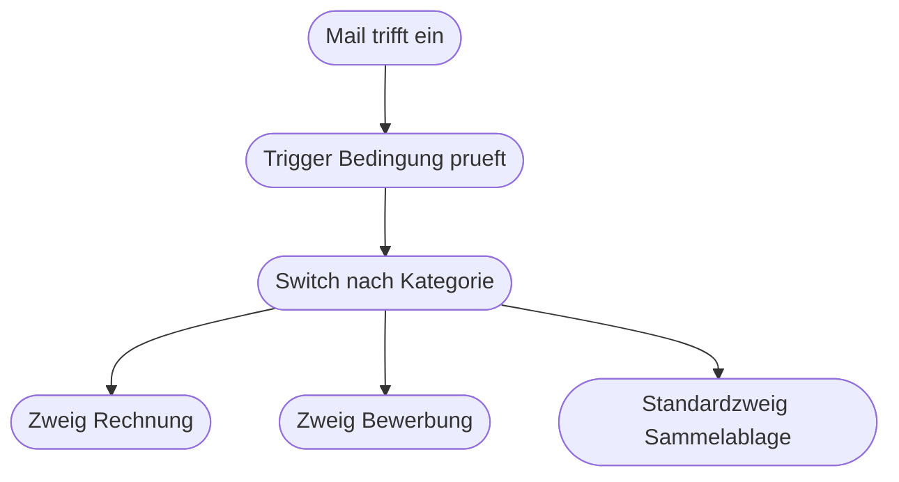

# Kapitel 24 – Steuerung und Verzweigung in Power Automate

{{ progress(24) }}

<div class="lernziele" markdown>
<h3>Was du in diesem Kapitel lernst</h3>

- Wann du eine **Bedingung (Condition)** nimmst und wann ein **Switch** die bessere Wahl ist
- Wie **Auf jedes anwenden (Apply to each)** funktioniert und warum Power Automate die Schleife oft selbst einfügt
- Wie du mit **Array filtern (Filter array)** und **Abfrage auswählen (Select)** Listen ohne Schleife bearbeitest
- Wozu **Bereich (Scope)**, **Parallele Verzweigung** und **Beenden (Terminate)** gut sind
- Wann du **Variablen** brauchst, wann **Verfassen** genügt und warum Variablen in parallelen Schleifen gefährlich sind
- Wie du mit **Trigger-Bedingungen** filterst und wie ein Flow auch nach Monaten lesbar bleibt
</div>

---

## 24.1 Verzweigen: Bedingung und Switch

Die **Bedingung (Condition)** teilt den Flow in zwei Wege: `Wenn ja` und `Wenn nein`. Du fügst sie über `+ Neuer Schritt → Steuerung → Bedingung` ein. Links steht der zu prüfende Wert, in der Mitte der Vergleichsoperator, rechts der Vergleichswert.

```text
Bedingung: Ist der Anhang ein PDF
  Wenn ja
    Aktion: Anhang speichern
    Aktion: Team informieren
  Wenn nein
    Aktion: Verfassen Uebersprungen
```

Beide Zweige dürfen leer bleiben. Ein leerer `Wenn nein`-Zweig ist völlig in Ordnung und heißt einfach: dann passiert nichts. Über `Erweiterten Modus verwenden` kannst du statt der Feldauswahl einen Ausdruck eintragen – nützlich, wenn du mehrere Prüfungen mit `and` oder `or` verbinden willst.

Der **Switch** (`Steuerung → Schalter`) prüft **einen** Wert gegen mehrere feste Fälle und hat pro Fall einen eigenen Zweig plus einen **Standardzweig** für alles Übrige. Er ist die richtige Wahl, sobald du drei oder mehr Möglichkeiten hast.

| Kriterium | Bedingung | Switch |
|---|---|---|
| Anzahl Wege | genau zwei | beliebig viele plus Standard |
| Prüfung | beliebige Vergleiche, auch mehrere kombiniert | ein Wert gegen feste Einzelwerte |
| Typisch für | ja/nein, größer/kleiner, leer/gefüllt | Kategorie, Abteilung, Status, Priorität |
| Grenze | verschachtelt schnell unleserlich | kein „größer als", keine Bereiche |

!!! warning "Typische Falle"
    Drei verschachtelte Bedingungen sind der schnellste Weg zu einem unlesbaren Flow: Der Designer schiebt sie so weit nach rechts, dass du seitwärts scrollen musst, und im Ausführungsverlauf ist nicht mehr erkennbar, welcher Pfad gelaufen ist. Sobald du die zweite Verschachtelungsebene erreichst, prüfe zwei Alternativen: einen `Switch` oder eine Vorentscheidung per `if`-Ausdruck in einer `Verfassen`-Aktion (Kap. 23).

---

## 24.2 Wiederholen: Auf jedes anwenden

**Auf jedes anwenden (Apply to each)** führt die enthaltenen Aktionen für **jeden Eintrag einer Liste** einmal aus. Du findest die Aktion unter `Steuerung`, aber meistens fügt Power Automate sie **automatisch** ein – und zwar genau dann, wenn du einen dynamischen Inhalt in ein Feld setzt, der aus einer **Liste (Array)** kommt.

Das ist die Erklärung für ein Verhalten, das fast alle Anfänger überrascht: Du wählst `Name der Anlage` und plötzlich liegt deine Aktion in einer Schleifenkarte. Der Grund ist, dass eine Mail mehrere Anhänge haben kann, das Feld aber nur einen Wert aufnimmt. Power Automate löst das Problem, indem es die Aktion pro Eintrag einmal ausführt.

```text
Auf jedes anwenden   (ueber Anlagen)
  Bedingung: Endet der Name auf .pdf
    Wenn ja
      Aktion: Anhang speichern
  Aktion: Zaehler erhoehen
Aktion: Zusammenfassung an Team      (ausserhalb der Schleife)
```

Auf den aktuellen Eintrag greifst du mit `items` und dem Namen der Schleife zu, wobei Leerzeichen zu Unterstrichen werden: `@{items('Fuer_jeden_Anhang')?['name']}` liefert den Namen des gerade bearbeiteten Anhangs, `?['size']` seine Größe.

Unter `... → Einstellungen` der Schleifenkarte findest du die **Nebenläufigkeitssteuerung (Concurrency Control)**. Ist sie aus, läuft die Schleife der Reihe nach – Eintrag 1, dann 2, dann 3. Schaltest du sie ein, arbeitet Power Automate mehrere Einträge gleichzeitig ab, standardmäßig 20 auf einmal. Das ist bei 500 Listenelementen ein enormer Zeitgewinn und bei jeder Schleife mit Reihenfolge oder Zähler ein Problem.

!!! info "Merksatz"
    Alles, was **pro Eintrag** passieren soll, gehört in die Schleife. Alles, was **einmal pro Lauf** passieren soll, gehört davor oder danach. Diese eine Frage klärt die meisten Fehler mit doppelten Mails und doppelten Dateien.

---

## 24.3 Listen ohne Schleife: Array filtern und Abfrage auswählen

Eine Schleife ist nicht immer nötig. Zwei Aktionen aus der Gruppe `Datenvorgang (Data Operation)` bearbeiten ganze Listen in einem Schritt und machen Flows schneller und lesbarer. **Array filtern (Filter array)** gibt nur die Einträge zurück, die eine Bedingung erfüllen – aus vier Anhängen werden die zwei PDF-Dateien, bevor überhaupt eine Schleife startet. **Abfrage auswählen (Select)** formt jeden Eintrag um: Aus einer Liste voller Objekte mit zwanzig Feldern wird eine schlanke Liste mit genau den drei Feldern, die du brauchst – ideal für eine Übersicht in einer Mail.

```text
Aktion: Array filtern   -> umbenannt in: Nur PDF-Anhaenge
  Von: Anlagen
  Bedingung: endsWith von name ist gleich .pdf
Aktion: Auf jedes anwenden
  Von: Ausgabe von Nur PDF-Anhaenge
  Aktion: Anhang speichern
```

| Aktion | Eingabe | Ausgabe | Typischer Einsatz |
|---|---|---|---|
| **Array filtern** | Liste plus Bedingung | kürzere Liste, gleiche Struktur | Signaturbilder aussortieren, nur offene Vorgänge behalten |
| **Abfrage auswählen** | Liste plus Feldzuordnung | gleich lange Liste, neue Struktur | Übersichtstabelle für eine Mail vorbereiten |
| **Verfassen mit join** | Liste | ein Text | Liste als Aufzählung in eine Nachricht schreiben |
| **Länge über length** | Liste | Zahl | prüfen, ob überhaupt etwas übrig ist |

Die Kombination `Array filtern` plus `length` löst ein Problem, das sonst still bleibt: eine **Schleife über eine leere Liste**. Sie erzeugt keinen Fehler, sie tut nur nichts – und danach verschickst du eine Bestätigung über null verarbeitete Dateien. Prüfe deshalb nach dem Filtern mit einer Bedingung, ob die Liste noch Einträge hat: `@{length(body('Nur_PDF-Anhaenge'))}` ist größer als 0.

---

## 24.4 Struktur und Notbremse: Bereich, Parallele Verzweigung, Beenden

Ein **Bereich (Scope)** ist eine Klammer um mehrere Aktionen. Er tut selbst nichts, macht aber zwei Dinge möglich: Er fasst zusammengehörige Schritte optisch zu einem Block zusammen, und er hat ein gemeinsames Ergebnis – gescheitert oder erfolgreich. Genau darauf setzt eine saubere Fehlerbehandlung auf, die du in Kapitel 28 baust.

Die **Parallele Verzweigung** fügst du über das Plus-Symbol zwischen zwei Aktionen mit `Parallelen Branch hinzufügen` ein. Beide Zweige starten gleichzeitig und laufen unabhängig voneinander – sinnvoll bei zwei voneinander unabhängigen Dingen wie Datei ablegen und Kalendereintrag erstellen, falsch, wenn der zweite Zweig ein Ergebnis des ersten braucht, denn dann ist die Reihenfolge zufällig.

**Beenden (Terminate)** aus der Gruppe `Steuerung` stoppt den Flow sofort, mit wählbarem Status `Erfolgreich`, `Fehlgeschlagen` oder `Abgebrochen`. Das ist die richtige Aktion für „hier gibt es nichts zu tun" oder „diese Eingabe ist ungültig".

```text
Bedingung: Ist die Liste leer
  Wenn ja
    Aktion: Beenden
      Status: Erfolgreich
  Wenn nein
    Aktion: Auf jedes anwenden ueber die Liste
```

!!! tip "Status bewusst wählen"
    Ein `Beenden` mit `Fehlgeschlagen` färbt den Lauf im Ausführungsverlauf rot. Nutze das für echte Fehler, etwa eine ungültige Eingabe, die jemand nachbessern muss – dann fällt es auf. Für den völlig normalen Fall „keine passenden Daten vorhanden" nimm `Erfolgreich`, sonst gewöhnst du dich an rote Läufe und übersiehst die echten Probleme.

---

## 24.5 Werte festhalten: Variablen und Verfassen

Eine **Variable** ist ein benannter Behälter, dessen Inhalt sich während des Laufs ändern darf. Du brauchst sie in zwei Schritten: `Variable initialisieren` legt Name, Typ und Startwert fest und muss **außerhalb** jeder Schleife auf der obersten Ebene stehen. `Variable festlegen` oder `An Variable anfügen` ändert den Inhalt später.

```text
Aktion: Variable initialisieren   Name: AnzahlGespeichert, Typ: Ganze Zahl, Wert: 0
Aktion: Auf jedes anwenden
  Aktion: Anhang speichern
  Aktion: Variable inkrementieren   Name: AnzahlGespeichert, Wert: 1
Aktion: Mail senden
  Text: Es wurden @{variables('AnzahlGespeichert')} Dateien gespeichert.
```

| Frage | Verfassen | Variable |
|---|---|---|
| Wert ändert sich im Lauf | nein | ja |
| Anzahl der Schritte | eine Aktion | mindestens zwei |
| Position im Flow | überall, auch in Schleifen | Initialisieren nur auf oberster Ebene |
| Im Ausführungsverlauf sichtbar | ja, als Ausgabe | ja, aber nur der Wert beim Zuweisen |
| Typischer Fall | Dateiname, formatiertes Datum, Textbaustein | Zähler, Sammelliste, Merker über Schleifen hinweg |

Die Faustregel: **Nimm Verfassen, solange es geht.** Variablen sind kein Fehler, aber sie erzeugen mehr Schritte, mehr Abhängigkeiten und einen unangenehmen Sonderfall.

!!! warning "Häufiges Missverständnis"
    Variablen und **parallele Schleifen** passen nicht zusammen. Ist die Nebenläufigkeitssteuerung eingeschaltet, greifen mehrere Durchläufe gleichzeitig auf dieselbe Variable zu. Das Ergebnis ist nicht falsch berechnet, sondern **unzuverlässig**: Ein Zähler steht bei 8 statt bei 10, und beim nächsten Lauf bei 9. Wenn du in einer Schleife zählst oder sammelst, schalte die Nebenläufigkeit aus – oder verzichte auf die Variable und arbeite mit `Array filtern` und `length` auf der Gesamtliste.

---

## 24.6 Vor dem Start filtern und lesbar bleiben

Die günstigste Steuerung ist die, die den Flow gar nicht erst startet. Eine **Trigger-Bedingung** (`Trigger-Karte → ... → Einstellungen → Trigger-Bedingungen`) ist ein Ausdruck, der `true` oder `false` ergibt. Nur bei `true` läuft der Flow überhaupt an, und es entsteht kein Eintrag im Ausführungsverlauf.

```text
Nur Mails mit Anhang:
@triggerOutputs()?['body/hasAttachments']
Keine Antwortmails, damit der Flow sich nicht selbst ausloest:
@not(startsWith(triggerOutputs()?['body/subject'], 'AW:'))
Nur von zwei bestimmten Absendern:
@or(equals(triggerOutputs()?['body/from'],'einkauf@firma.de'),equals(triggerOutputs()?['body/from'],'buchhaltung@firma.de'))
```



Zum Abschluss die Regeln, die einen Flow auch nach sechs Monaten und für andere Personen verständlich halten. Sie kosten beim Bauen Minuten und sparen später Stunden.

1. **Jeden Schritt benennen**, und zwar früh: `Nur PDF-Anhaenge` statt `Array filtern 2`. Die Namen erscheinen im Ausführungsverlauf und in Fehlermeldungen, und Ausdrücke, die auf einen Schritt verweisen, brechen beim späteren Umbenennen (Kap. 23).
2. **Flach bleiben.** Höchstens zwei Verschachtelungsebenen. Was tiefer wird, gehört in einen `Switch`, in einen vorgeschalteten Filter oder in einen eigenen Flow. Erst filtern, dann verzweigen, dann handeln – diese Reihenfolge hält die Zahl der Zweige klein.
3. **Notizen an Aktionen schreiben.** Jede Karte hat unter `...` den Punkt `Kommentar hinzufügen`. Nutze ihn für das **Warum**, nicht für das Was: „Signaturbilder ausschließen, kommen bei Weiterleitungen mit."
4. **Trigger-Bedingungen dokumentieren.** Sie sind im Designer unsichtbar. Schreibe sie in die Flow-Beschreibung unter `Details → Beschreibung`, sonst sucht die nächste Person stundenlang, warum der Flow „nicht auslöst".

---

## Zusammenfassung

- Die **Bedingung** trennt zwei Wege, der **Switch** mehrere feste Fälle mit Standardzweig; ab der zweiten Verschachtelungsebene ist der Flow neu zu ordnen.
- **Auf jedes anwenden** läuft pro Listeneintrag und wird automatisch eingefügt, sobald ein Array in ein Einzelfeld gesetzt wird; die **Nebenläufigkeitssteuerung** beschleunigt, zerstört aber Reihenfolge und Zähler.
- **Array filtern** und **Abfrage auswählen** bearbeiten Listen ohne Schleife; nach dem Filtern immer mit `length` prüfen, ob überhaupt etwas übrig ist.
- **Bereich** bündelt Schritte, die **Parallele Verzweigung** trennt Unabhängiges, **Beenden** stoppt bewusst – mit passend gewähltem Status.
- **Verfassen** für feste berechnete Werte, **Variablen** nur für Werte, die sich im Lauf ändern; in parallelen Schleifen sind Variablen unzuverlässig.
- Eine **Trigger-Bedingung** verhindert Läufe, bevor sie entstehen; Lesbarkeit kommt aus Benennung, flacher Struktur, Kommentaren und einer dokumentierten Trigger-Bedingung.

---

## Kurzübungen

{{ task(file="tasks/k24_01.yaml") }}

{{ task(file="tasks/k24_02.yaml") }}

{{ task(file="tasks/k24_03.yaml") }}

---

## Workshop

{{ task(file="tasks/workshop_k24.yaml") }}
