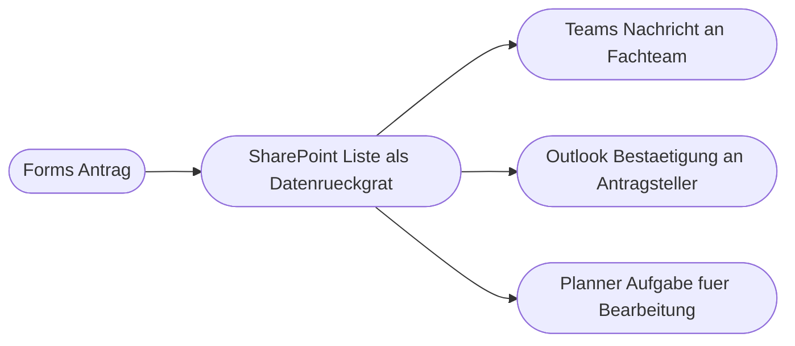
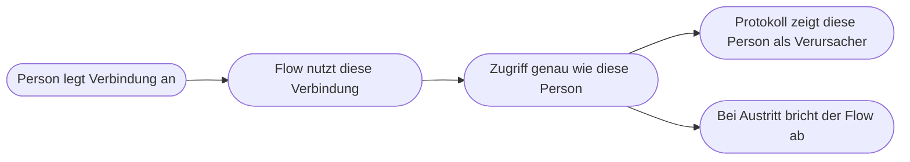

# Kapitel 25 – Integration von Microsoft 365

{{ progress(25) }}

<div class="lernziele" markdown>
<h3>Was du in diesem Kapitel lernst</h3>

- Wie du **SharePoint-Listen und Dokumentbibliotheken** als Datenrückgrat deiner Flows nutzt
- Wie du Daten gezielt liest: **Elemente abrufen** mit **Filterabfrage** statt Schleife über alles
- Wie **Microsoft Lists, Forms und Excel-Tabellen** als Eingang in den Prozess dienen
- Wie du über **Outlook** und **Teams** Menschen erreichst und über **Planner/To Do** Aufgaben erzeugst
- Unter welcher **Identität** ein Flow arbeitet – und warum das über Datenzugriff und Ausfallsicherheit entscheidet
- Welcher **Speicherort** für welchen Zweck taugt: SharePoint-Liste, Excel-Tabelle oder Dataverse
</div>

---

## 25.1 SharePoint als Datenrückgrat

Fast jeder ernsthafte Flow braucht einen Ort, an dem Daten **bleiben**. In Microsoft 365 ist das in der Regel SharePoint – in zwei Varianten:

- Eine **SharePoint-Liste** ist eine Tabelle mit klar definierten Spalten (Text, Zahl, Datum, Auswahl, Person, Ja/Nein). Sie eignet sich für Vorgänge: Anträge, Reklamationen, Bestellungen.
- Eine **Dokumentbibliothek** ist ein Ablageort für Dateien, der zusätzlich Spalten (Metadaten) tragen kann: Lieferant, Rechnungsnummer, Status.

Diese Aktionen brauchst du praktisch immer. Du findest sie über `make.powerautomate.com → Flow bearbeiten → Neuer Schritt → SharePoint`:

| Aktion (deutsch / englisch) | Zweck | Pflichtangaben |
|---|---|---|
| Element erstellen (Create item) | neuen Datensatz anlegen | Websiteadresse, Listenname, Spaltenwerte |
| Element aktualisieren (Update item) | bestehenden Datensatz ändern | zusätzlich **ID** des Elements |
| Element abrufen (Get item) | genau einen Datensatz laden | ID |
| Elemente abrufen (Get items) | mehrere Datensätze suchen | Filterabfrage, Sortierung, Anzahl |
| Datei erstellen (Create file) | Datei in Bibliothek ablegen | Ordnerpfad, Dateiname, Dateiinhalt |
| Dateieigenschaften aktualisieren (Update file properties) | Metadaten einer Datei setzen | ID der Datei |

Der wichtigste Hebel ist die **Filterabfrage** (Filter Query) in `Elemente abrufen`. Sie filtert **auf dem Server**, sodass gar nicht erst alle Datensätze in den Flow geladen werden:

```text
Status eq 'Offen'
Abteilung eq 'Einkauf' and Betrag gt 500
Faelligkeit lt '2026-09-01'
```

!!! warning "Typische Falle: interne Spaltennamen"
    Die Filterabfrage arbeitet mit dem **internen** Spaltennamen, nicht mit der Anzeige. Wird eine Spalte als „Fällig am" angelegt und später umbenannt, bleibt intern oft `F_x00e4_llig_x0020_am` stehen. Prüfe den internen Namen über `Listeneinstellungen → Spalte anklicken` und lies ihn aus der Adresszeile (Parameter `Field=`). Textwerte stehen in einfachen Anführungszeichen, Zahlen ohne.

`Elemente abrufen` liefert außerdem standardmäßig nur die ersten 100 Einträge. Für größere Listen musst du `Anzahl der Elemente` erhöhen und die **Paginierung** einschalten – das gehört zu Performance und Grenzen (Kap. 28). Merke dir die Grundregel: filtern statt schleifen. Alle 4.000 Elemente zu laden und in `Auf jedes anwenden` mit einer Bedingung zu prüfen (Kap. 24) kostet Laufzeit und macht den Flow unlesbar.

---

## 25.2 Microsoft Lists, Forms und Excel: der Eingang in den Prozess

**Microsoft Lists** ist keine zweite Datenbank, sondern eine **benutzerfreundliche Oberfläche auf genau dieselben SharePoint-Listen**: Ansichten, Formatierungen, Formularfelder, ein Kalender- oder Galerie-Layout. Für den Flow ändert sich dadurch nichts – du wählst weiterhin Websiteadresse und Listenname. Praktischer Effekt: Die Fachabteilung pflegt Daten in einer angenehmen Ansicht, dein Flow liest sie technisch als SharePoint-Liste.

**Microsoft Forms** ist der einfachste Prozessstart. Der Trigger heißt `Bei Übermittlung einer neuen Antwort (When a new response is submitted)` und liefert nur eine Antwort-ID. Die eigentlichen Antworten holst du mit `Antwortdetails abrufen (Get response details)`:

```text
Trigger: Bei Uebermittlung einer neuen Antwort  (Formular: Materialantrag)
Aktion:  Antwortdetails abrufen  (Antwort-ID aus dem Trigger)
Aktion:  Element erstellen  (Liste Materialantraege)
           Titel        = Antwortfeld Material
           Antragsteller = Antwortfeld Responder
           Status       = Offen
```

**Excel** ist der Klassiker, hat aber eine harte Voraussetzung: Der Connector `Excel Online (Business)` sieht ausschließlich Daten, die **als Tabelle formatiert** sind (`Excel → Einfügen → Tabelle`). Ein simpler Zellbereich ist für den Flow unsichtbar. Zusätzlich muss die Datei in OneDrive oder SharePoint liegen, nicht auf einem Netzlaufwerk.

| Excel-Aktion | Zweck | Stolperstein |
|---|---|---|
| Zeile in Tabelle hinzufügen (Add a row into a table) | Datensatz anhängen | Tabelle muss existieren und benannt sein |
| Zeilen abrufen (List rows present in a table) | Tabelleninhalt lesen | liefert alles als **Text**, Datumsangaben als Zahl |
| Zeile aktualisieren (Update a row) | Zeile ändern | braucht eine eindeutige Schlüsselspalte |

!!! warning "Häufiges Missverständnis: Excel ist keine Datenbank"
    Zwei Flows, die gleichzeitig in dieselbe Arbeitsmappe schreiben, blockieren sich. Öffnet jemand die Datei in der Desktop-App, schlagen Schreibaktionen fehl. Und Datumsangaben kommen als Seriennummer wie `46000` zurück, die du erst umrechnen musst. Für alles, was mehrere Personen gleichzeitig nutzen, ist eine SharePoint-Liste die stabilere Wahl.

---

## 25.3 Der Ausgang: Outlook, Teams, Planner und To Do

Ein Flow, dessen Ergebnis niemand sieht, ist wertlos. Für die Rückmeldung an Menschen gibt es vier Wege:

| Aktion | Wirkung | Typischer Einsatz |
|---|---|---|
| E-Mail senden V2 (Send an email V2) | Mail an Empfängerliste | Bestätigung, Zusammenfassung, Bericht |
| E-Mail mit Optionen senden (Send email with options) | Mail mit Antwort-Schaltflächen, Flow wartet | einfache Ja/Nein-Rückfrage |
| Ereignis erstellen V4 (Create event V4) | Kalendereintrag | Frist, Termin, Erinnerung |
| Nachricht in einem Chat oder Kanal veröffentlichen (Post message in a chat or channel) | Teams-Nachricht | Team informieren, Vorgang sichtbar machen |

`E-Mail senden V2` erlaubt im Bereich `Erweiterte Optionen` unter anderem CC, Anlagen und `Von (Senden als)`. Damit kann ein Flow im Namen eines **freigegebenen Postfachs** schreiben – etwa `einkauf@beispielfirma.example` statt der Privatadresse der Person, die den Flow gebaut hat.

Für Aufgaben gilt eine einfache Trennung: **Planner** ist Teamarbeit (`Aufgabe erstellen (Create a task)` mit Plan, Bucket und zugewiesener Person), **To Do** ist persönlich (`Aufgabe hinzufügen (Add a to-do)`). Wenn eine Aufgabe auch nach einem Urlaub oder Wechsel sichtbar bleiben muss, gehört sie nach Planner.

Ein Teams-Beitrag kann außerdem eine **Adaptive Card** sein – eine strukturierte Karte mit Feldern und Schaltflächen direkt im Chat. Damit lassen sich Freigaben ohne Umweg über E-Mail erledigen; das baust du in Kapitel 27 auf.



---

## 25.4 Unter welcher Identität arbeitet der Flow?

Das ist die wichtigste und am häufigsten übersehene Frage dieses Kapitels. Ein Flow hat **keine eigene Identität**. Er arbeitet über **Verbindungen** (Connections), und jede Verbindung gehört einer Person. Wenn du in einem Flow den SharePoint-Connector nutzt, ist dort deine Anmeldung hinterlegt – der Flow handelt also **in deinem Namen**.



Daraus folgen vier praktische Konsequenzen:

1. **Datenzugriff ist begrenzt auf deine Rechte.** Was du selbst nicht öffnen darfst, kann auch dein Flow nicht lesen. Ein Flow, der auf eine fremde Abteilungsliste zugreifen soll, scheitert mit einem Berechtigungsfehler (Statuscode 401 oder 403, Kap. 28) – nicht weil der Flow falsch gebaut ist, sondern weil die Identität nicht darf.
2. **Datenzugriff kann auch zu weit reichen.** Läuft der Flow unter einem Konto mit weitreichenden Rechten, können auf einmal alle Nutzenden über den Flow Dinge tun, die sie direkt nicht dürften. Ein manuell auslösbarer Flow, der mit einer privilegierten Verbindung Daten löscht, ist eine offene Hintertür.
3. **Die Spur im Protokoll zeigt dich.** In SharePoint steht in `Erstellt von` und `Geändert von` der Verbindungsinhaber, nicht die Person, die den Antrag gestellt hat. Wer wirklich beantragt hat, musst du selbst in eine eigene Spalte schreiben.
4. **Personalwechsel bricht den Flow.** Wird das Konto deaktiviert, die Lizenz entzogen oder das Kennwort zurückgesetzt, schlagen die Verbindungen fehl und der Flow steht – oft unbemerkt, weil die Fehlermeldung im Postfach einer nicht mehr existierenden Person landet.

!!! warning "Der Klassiker: Der Flow gehört einer Person, die das Haus verlässt"
    Ein Flow, der die Urlaubsanträge verteilt, läuft zwei Jahre stabil. Dann wechselt die Kollegin, die ihn gebaut hat, die Abteilung. Ihre Verbindung wird ungültig, niemand ist Miteigentümer, niemand bekommt die Fehlermeldung. Erst nach Wochen fällt auf, dass Anträge liegen bleiben. Genau dagegen helfen Dienstkonten und Miteigentümerschaft.

**Die Lösung: ein Dienst- oder Funktionskonto.** Das ist ein eigenes Benutzerkonto ohne persönlichen Inhaber, etwa `flow-service@beispielfirma.example`, mit passender Lizenz und genau den nötigen Rechten. Die Verbindungen des Flows werden mit diesem Konto angelegt. Vorteile: Der Flow ist unabhängig von Personalwechseln, im Protokoll ist erkennbar, dass eine Automatisierung gehandelt hat, und die Rechte lassen sich gezielt vergeben.

Zusätzlich – und mit weniger Aufwand – solltest du immer diese drei Dinge tun:

- **Miteigentümer eintragen:** `Meine Flows → Flow → Freigeben → Benutzer hinzufügen`. Mindestens zwei Personen oder eine Gruppe, damit der Flow bearbeitbar bleibt.
- **Fehlerbenachrichtigung an ein Team-Postfach** statt an eine Einzelperson (Kap. 28).
- **Verbindungen dokumentieren:** Welcher Connector läuft unter welchem Konto? Das ist der erste Blick bei jedem Berechtigungsfehler.

!!! info "Merksatz"
    Ein Flow ist kein neutraler Roboter. Er ist eine Vollmacht: Er handelt mit den Rechten derjenigen Identität, deren Verbindung er benutzt. Wer diese Frage nicht klärt, baut entweder einen Flow, der zu wenig darf, oder einen, der zu viel darf.

---

## 25.5 Welcher Speicherort für welchen Zweck?

| Kriterium | SharePoint-Liste | Excel-Tabelle | Dataverse (Ausblick) |
|---|---|---|---|
| Gleichzeitiger Zugriff | unproblematisch | Konflikte und Sperren | unproblematisch |
| Datentypen und Prüfung | Spaltentypen, Pflichtfelder | alles frei eintippbar | strenges Datenmodell mit Regeln |
| Berechtigungen | pro Liste, Ordner, Element möglich | nur über die Datei | fein pro Tabelle, Feld und Zeile |
| Versionsverlauf | pro Element vorhanden | nur pro Datei | vollständige Historie |
| Datenmenge | Tausende Einträge gut, dann Feinarbeit | wenige Tausend Zeilen | für große Datenmengen gebaut |
| Lizenz | in Microsoft 365 enthalten | in Microsoft 365 enthalten | **Premium**, kostet zusätzlich |
| Gut für | Vorgänge mit Status und Verlauf | Auswertung, Import, Export | zentrale Fachanwendungen |

Als Faustregel: **Vorgänge in eine SharePoint-Liste, Auswertungen in Excel.** Excel ist ein hervorragendes Ziel für einen Bericht („einmal pro Woche eine Zeile anhängen"), aber ein schlechter zentraler Datenspeicher für laufende Prozesse. **Dataverse** ist die professionelle Variante mit echtem Datenmodell und feiner Rechtevergabe, braucht aber eine Premium-Lizenz und ist in dieser Weiterbildung nur Ausblick.

!!! example "Durchgängiges Beispiel: Materialantrag Ende zu Ende"
    ```text
    Trigger: Bei Uebermittlung einer neuen Antwort  (Forms: Materialantrag)
    Aktion:  Antwortdetails abrufen
    Aktion:  Elemente abrufen  (Liste Kostenstellen)
               Filterabfrage: Kuerzel eq 'EK-100'
               Anzahl der Elemente: 1
    Aktion:  Element erstellen  (Liste Materialantraege)
               Titel         = Antwortfeld Material
               Antragsteller = Antwortfeld Responder
               Kostenstelle  = Wert aus Elemente abrufen
               Status        = Offen
    Aktion:  Nachricht in einem Chat oder Kanal veroeffentlichen
               Kanal Einkauf, Text mit Link auf das neue Element
    Aktion:  Aufgabe erstellen  (Planner, Bucket Pruefung)
    Aktion:  E-Mail senden V2  (an Antragsteller, Von: freigegebenes Postfach Einkauf)
    ```

    Beachte die Reihenfolge: Erst **speichern**, dann **benachrichtigen**. Schlägt die Mail fehl, ist der Antrag trotzdem erfasst – umgekehrt wäre er verloren.

---

## Zusammenfassung

- **SharePoint-Listen** sind das Datenrückgrat: `Element erstellen`, `Element aktualisieren`, `Element abrufen`, `Elemente abrufen` mit **Filterabfrage**, `Datei erstellen` für Bibliotheken.
- **Microsoft Lists** ist nur eine komfortable Oberfläche auf dieselben Listen – für den Flow ändert sich nichts.
- **Excel** funktioniert nur mit Daten, die **als Tabelle formatiert** sind, und ist bei gleichzeitigem Zugriff empfindlich.
- **Forms** startet Prozesse, **Outlook** und **Teams** melden zurück, **Planner** und **To Do** erzeugen Aufgaben.
- Ein Flow handelt **im Namen der Identität seiner Verbindungen** – das bestimmt Datenzugriff, Protokolleintrag und Ausfallrisiko bei Personalwechsel. **Dienstkonten** und Miteigentümerschaft lösen das.
- Wähle den Speicherort nach Zweck: Vorgänge in die Liste, Auswertungen nach Excel, Dataverse als Premium-Ausblick.

---

## Kurzübungen

{{ task(file="tasks/k25_01.yaml") }}

{{ task(file="tasks/k25_02.yaml") }}

{{ task(file="tasks/k25_03.yaml") }}

---

## Workshop

{{ task(file="tasks/workshop_k25.yaml") }}
