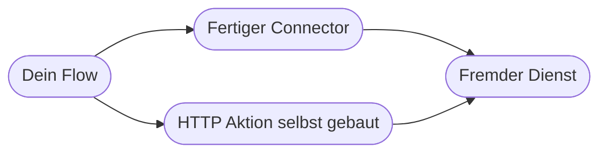
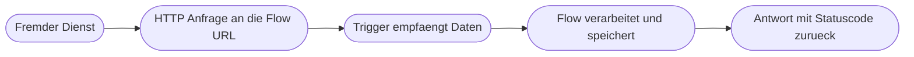

# Kapitel 26 – Integration externer Apps

{{ progress(26) }}

<div class="lernziele" markdown>
<h3>Was du in diesem Kapitel lernst</h3>

- Wie das **Connector-Prinzip** funktioniert und wo es endet
- Die Grundbegriffe einer **Schnittstelle (API)**: Endpunkt, Methode, Kopfzeilen, Anfragekörper, Antwort, Statuscode
- Wie du die Aktion **HTTP-Anforderung** konfigurierst und die **JSON**-Antwort weiterverarbeitest
- Wie **Authentifizierung** in Grundzügen läuft – API-Schlüssel, Basisauthentifizierung, OAuth
- Wie du mit dem Trigger **Bei Empfang einer HTTP-Anforderung** einen **Webhook** entgegennimmst
- Was **Ratenbegrenzungen** bedeuten und wie du mit Wiederholungen darauf reagierst
</div>

---

## 26.1 Das Connector-Prinzip – und wo es endet

Bisher hast du fertige **Connectoren** benutzt: SharePoint, Outlook, Teams (Kap. 25). Ein Connector ist eine vorgefertigte Übersetzung zwischen Power Automate und einem fremden Dienst. Er bringt fertige Aktionen mit sinnvollen deutschen Bezeichnungen, kümmert sich um die Anmeldung und blendet die technischen Details aus.

Es gibt sie in drei Gruppen: **Standard** (in den meisten Lizenzen enthalten), **Premium** (kostet zusätzlich, etwa SQL Server, Salesforce oder die generische `HTTP`-Aktion) und **Custom** (selbst gebaut). Für über tausend Dienste existiert ein Connector – aber eben nicht für alle. Genau dann greifst du selbst zum Werkzeug.



!!! info "Merksatz"
    Ein Connector ist bequem, aber nicht magisch. Darunter läuft immer derselbe Vorgang: Der Flow schickt eine Anfrage an eine Adresse im Internet und wertet die Antwort aus. Wenn du diesen Vorgang einmal von Hand nachbaust, verstehst du auch die fertigen Connectoren besser.

---

## 26.2 Schnittstellen verstehen: die sechs Begriffe

Eine **API** (Application Programming Interface, Anwendungsschnittstelle) ist die Tür, durch die Programme miteinander sprechen. Du brauchst dafür sechs Begriffe – und keinen davon musst du programmieren können.

| Begriff | Was es ist | Beispiel |
|---|---|---|
| **Endpunkt** (URL) | die Adresse der Funktion, die du aufrufen willst | `https://api.kursdienst.example/v1/kurse` |
| **Methode** | was du tun willst | `GET` = holen, `POST` = senden |
| **Kopfzeilen** (Header) | Zusatzangaben zur Anfrage | `Content-Type: application/json` |
| **Anfragekörper** (Body) | die eigentlichen Daten, die du sendest | Antragsdaten als JSON |
| **Antwort** (Response) | was zurückkommt | JSON mit Wechselkursen |
| **Statuscode** | Kurzbefund, ob es geklappt hat | `200` = in Ordnung |

Der Unterschied zwischen den beiden wichtigsten Methoden: **GET** holt Informationen und verändert nichts – du kannst es beliebig oft wiederholen. **POST** sendet Daten und legt in der Regel etwas an. Ein doppelt gesendetes POST kann also einen doppelten Datensatz erzeugen; das ist der Grund, warum Idempotenz (Kap. 18) bei Schreibaufrufen so wichtig ist. Die Statuscodes sind grob nach Hundertern sortiert: 200er heißt Erfolg, 400er heißt „deine Anfrage war das Problem", 500er heißt „der Dienst hat ein Problem".

| Code | Bedeutung | Was du tun musst |
|---|---|---|
| 200 | Erfolg, Antwort enthält Daten | nichts |
| 400 | fehlerhafte Anfrage | Anfragekörper und Pflichtfelder prüfen |
| 401 | nicht angemeldet oder Schlüssel falsch | Zugangsdaten und Header prüfen |
| 404 | Endpunkt oder Objekt existiert nicht | Adresse und ID prüfen, oft nur ein Tippfehler |
| 429 | zu viele Anfragen (Ratenbegrenzung) | warten und wiederholen |
| 500 | Fehler beim Anbieter | wiederholen, dann melden |

!!! warning "Häufiges Missverständnis: 401 ist kein Baufehler"
    Ein `401` sagt nicht, dass dein Flow falsch aufgebaut ist, sondern dass die Identität nicht akzeptiert wird – falscher Schlüssel, abgelaufener Zugriff oder fehlende Berechtigung. Ein `404` sagt nicht, dass der Dienst kaputt ist, sondern dass an dieser Adresse nichts liegt. Wer die Codes lesen kann, spart sich das Umbauen von funktionierenden Flows.

---

## 26.3 Die HTTP-Aktion in der Praxis

Die Aktion heißt in der Oberfläche `HTTP-Anforderung (HTTP)` und ist ein **Premium**-Baustein. Sie hat genau die Felder aus der Tabelle oben. Am Beispiel eines erfundenen Wechselkurs-Dienstes:

```text
Aktion: HTTP-Anforderung
  Methode:  GET
  URI:      https://api.kursdienst.example/v1/kurse?basis=EUR&ziel=CHF
  Kopfzeilen:
    Accept       = application/json
    X-Api-Key    = Wert aus sicherer Ablage
  Anfragekoerper: leer
```

Die Antwort kommt als **JSON** (JavaScript Object Notation) – ein Textformat aus Feldnamen und Werten in geschweiften Klammern, verschachtelbar:

```text
{
  "basis": "EUR",
  "datum": "2026-03-04",
  "kurse": {
    "CHF": 0.9612
  }
}
```

Auf einzelne Felder greifst du mit einem Ausdruck zu (Kap. 23). Der Pfad folgt der Verschachtelung:

```text
body('HTTP-Anforderung')?['basis']
body('HTTP-Anforderung')?['kurse']?['CHF']
```

Das Fragezeichen ist wichtig: Es verhindert einen Abbruch, wenn das Feld fehlt – dann kommt einfach ein leerer Wert zurück. Bequemer wird es mit der Aktion `JSON analysieren (Parse JSON)`: Du fügst dort ein Beispiel der Antwort ein, lässt das Schema erzeugen und bekommst danach alle Felder als dynamische Inhalte zur Auswahl.

!!! example "Durchgängiges Beispiel: Tageskurs in eine Liste schreiben"
    ```text
    Trigger: Wiederholung  (taeglich 07:00)
    Aktion:  HTTP-Anforderung  (GET auf den Kursdienst, Kopfzeile mit Schluessel)
    Aktion:  Bedingung  ->  Statuscode des HTTP-Schritts ist gleich 200
               Falls ja:
                 Aktion: JSON analysieren  (Inhalt = Body, Schema aus Beispiel)
                 Aktion: Element erstellen  (Liste Tageskurse)
                           Titel = 2026-03-04
                           Kurs  = Feld CHF aus JSON analysieren
               Falls nein:
                 Aktion: Nachricht in einem Chat oder Kanal veroeffentlichen
                           Text mit Statuscode und Fehlermeldung
    ```

    Beachte: Der Erfolgsfall wird **geprüft**, nicht angenommen. Fremde Dienste antworten irgendwann anders als erwartet – dieser eine Bedingungsschritt macht den Unterschied zwischen einem Flow, der still falsche Daten schreibt, und einem, der Bescheid gibt.

---

## 26.4 Authentifizierung – und wohin die Zugangsdaten gehören

Kaum ein Dienst antwortet ohne Nachweis, wer fragt. Drei Verfahren begegnen dir:

- **API-Schlüssel im Header:** Der Dienst gibt dir eine lange Zeichenfolge, die du in einer Kopfzeile mitschickst, etwa `X-Api-Key`. Einfach, verbreitet – aber wer den Schlüssel hat, ist du.
- **Basisauthentifizierung (Basic Authentication):** Benutzername und Kennwort werden bei jeder Anfrage mitgesendet. Die HTTP-Aktion hat dafür eigene Felder unter `Authentifizierung → Basic`. Nur akzeptabel über verschlüsselte Verbindungen und nur, wenn der Dienst nichts anderes anbietet.
- **OAuth:** Statt ein Kennwort weiterzugeben, erteilst du dem Flow einmal eine **Zustimmung**. Der Flow erhält daraufhin ein zeitlich begrenztes Zugriffstoken, das erneuert wird. Das ist das Verfahren hinter allen Microsoft-365-Connectoren – deshalb tippst du dort nie ein Kennwort in einen Flow-Schritt.

!!! warning "Zugangsdaten niemals im Klartext in den Flow"
    Ein Schlüssel, der direkt in ein Aktionsfeld oder eine `Verfassen`-Aktion getippt wird, steht anschließend im Flow-Definitionsexport, oft in den Ausführungsverlauf-Eingaben und ist für alle Miteigentümer lesbar. Nutze stattdessen eine sichere Ablage: **Azure Key Vault** über den entsprechenden Connector oder – wenn deine Organisation das vorsieht – **umgebungsspezifische Variablen** in einer Lösung. Setze bei sensiblen Schritten zusätzlich `Einstellungen → Sichere Eingaben` und `Sichere Ausgaben`, damit die Werte nicht im Verlauf erscheinen. Und wenn ein Schlüssel doch einmal sichtbar war: Er ist verbrannt und muss beim Anbieter neu erzeugt werden.

---

## 26.5 Webhooks: wenn der andere Dienst dich ruft

Bisher hast du gefragt. Ein **Webhook** dreht die Richtung: Der fremde Dienst ruft **dich**, sobald etwas passiert. Das ist sparsamer und schneller als ein Zeitplan, der alle fünf Minuten nachfragt.

In Power Automate baust du das mit dem Trigger `Bei Empfang einer HTTP-Anforderung (When a HTTP request is received)`. Beim ersten Speichern erzeugt Power Automate eine lange, eindeutige URL, die du beim fremden Dienst einträgst. Damit die Felder als dynamische Inhalte verfügbar sind, hinterlegst du im Trigger ein **Schema** – am einfachsten über `Beispielnutzlast zum Generieren des Schemas verwenden` mit einer Beispielnachricht:

```text
{
  "vorgangsnummer": "A-2026-0417",
  "kunde": "Musterwerk GmbH",
  "betrag": 1240.50
}
```



Wenn der andere Dienst eine Antwort erwartet, ergänze am Ende die Aktion `Antwort (Response)` mit Statuscode und optionalem Körper. Ohne sie antwortet Power Automate mit `202 Accepted`, sobald der Trigger gefeuert hat.

!!! warning "Diese URL ist ein Passwort"
    Die Trigger-URL enthält eine Signatur und braucht sonst keine Anmeldung: Wer sie kennt, kann deinen Flow auslösen – beliebig oft und mit beliebigen Inhalten. Behandle sie wie ein Kennwort. Verschicke sie nicht in Chatnachrichten, prüfe die eingehenden Daten im Flow auf Plausibilität, bevor du sie speicherst, und beschränke unter `Einstellungen → Trigger-Bedingungen` oder über eine erwartete Kopfzeile, wer sinnvoll durchkommt. Ist die URL abgeflossen, erzeuge sie neu, indem du den Trigger ersetzt.

---

## 26.6 Ratenbegrenzungen, Wiederholungen und der Blick nach vorn

Fremde Dienste schützen sich mit **Ratenbegrenzungen** (Rate Limits): etwa 60 Anfragen pro Minute. Darüber antworten sie mit `429`. Das trifft dich sofort, wenn ein `Auf jedes anwenden` über 500 Datensätze läuft und in jedem Durchlauf einen Aufruf macht.

| Gegenmittel | Wo eingestellt | Wirkung |
|---|---|---|
| Wiederholungsrichtlinie (Retry policy) | Aktion → Einstellungen | wiederholt automatisch mit steigendem Abstand |
| Nebenläufigkeit begrenzen | Auf jedes anwenden → Einstellungen | weniger gleichzeitige Aufrufe, dafür verlässlich |
| Verzögern (Delay) in der Schleife | eigene Aktion | einfache Bremse, kostet Laufzeit |
| Daten bündeln | Flow-Aufbau | ein Aufruf mit Sammelinhalt statt 500 Einzelaufrufe |

Die Wiederholungsrichtlinie steht standardmäßig auf vier Versuchen mit exponentiell steigendem Abstand. Bei `429` und `500` ist das genau richtig. Bei `400` und `404` ist Wiederholen sinnlos – der Fehler liegt an der Anfrage und wird beim fünften Versuch nicht besser. Wie du solche Fälle sauber abfängst, ist Thema von Kapitel 28.

Wenn du dieselbe Schnittstelle immer wieder brauchst, lohnt ein **Custom Connector**: Du beschreibst Endpunkte, Felder und Anmeldung einmal zentral, danach steht der Dienst allen im Team mit fertigen Aktionen zur Verfügung – ohne dass jemand URLs und Schlüssel kennen muss. Das ist ein Thema für die Zusammenarbeit mit der IT (Kap. 20) und hier nur Ausblick.

---

## Zusammenfassung

- Ein **Connector** ist eine fertige Übersetzung zu einem Dienst; fehlt sie, baust du den Aufruf mit der **HTTP-Anforderung** selbst.
- Jede Schnittstelle beschreibst du mit sechs Begriffen: **Endpunkt, Methode, Kopfzeilen, Anfragekörper, Antwort, Statuscode**.
- **GET** holt und ist wiederholbar, **POST** schreibt und kann Dubletten erzeugen.
- **JSON** ist das Austauschformat; Felder erreichst du über Ausdrücke mit `?['feldname']` oder komfortabel über `JSON analysieren`.
- Zugangsdaten gehören **nie im Klartext** in den Flow, sondern in eine sichere Ablage; OAuth ersetzt Kennwortweitergabe durch Zustimmung.
- **Webhooks** kehren die Richtung um – die Trigger-URL ist wie ein Passwort zu behandeln; gegen **Ratenbegrenzungen** helfen Wiederholungsrichtlinie, begrenzte Nebenläufigkeit und gebündelte Aufrufe.

---

## Kurzübungen

{{ task(file="tasks/k26_01.yaml") }}

{{ task(file="tasks/k26_02.yaml") }}

{{ task(file="tasks/k26_03.yaml") }}

---

## Workshop

{{ task(file="tasks/workshop_k26.yaml") }}
