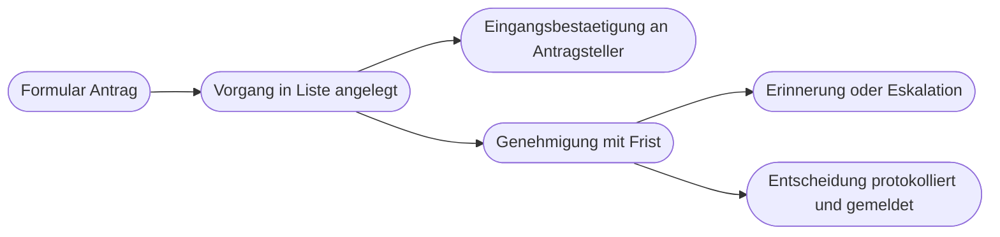

# Kapitel 27 – Menschen im Prozess: Genehmigungen und Formulare

{{ progress(27) }}

<div class="lernziele" markdown>
<h3>Was du in diesem Kapitel lernst</h3>

- Der Unterschied zwischen **Genehmigungen starten und warten** und **Genehmigung erstellen**
- Welche **Genehmigungstypen** es gibt und wann du mehrere Personen zuweist
- Wie du **Ergebnis, Antwort und Kommentar** auswertest und weiterverarbeitest
- Wie du mit **Fristen, Erinnerungen und Eskalation** verhinderst, dass Vorgänge liegen bleiben
- Wie **Adaptive Cards in Teams** Freigaben und Rückfragen direkt im Chat ermöglichen
- Wie du Entscheidungen **nachvollziehbar protokollierst** und dabei den Datenschutz einhältst
</div>

---

## 27.1 Zwei Aktionen für Genehmigungen

Bis hierhin liefen deine Flows in Sekunden durch. Sobald ein Mensch entscheiden muss, dauert ein Ablauf Stunden oder Tage – der Flow muss also **warten** können. Dafür gibt es den Connector `Genehmigungen (Approvals)` mit zwei grundlegend verschiedenen Ansätzen.

**`Genehmigungen starten und warten (Start and wait for an approval)`** erstellt die Anfrage und hält den Flow an, bis geantwortet wurde. Ein Schritt, danach steht das Ergebnis bereit. Das ist der Standardfall und für 90 Prozent der Prozesse richtig.

**`Genehmigung erstellen (Create an approval)`** erstellt nur die Anfrage und läuft sofort weiter. Auf die Antwort wartest du später mit `Auf Genehmigung warten (Wait for an approval)`. Der Vorteil: Zwischen Erstellen und Warten kannst du etwas anderes tun – etwa parallel eine Erinnerung planen oder mehrere Genehmigungen gleichzeitig anstoßen.

| Kriterium | Starten und warten | Erstellen plus warten |
|---|---|---|
| Anzahl Schritte | einer | zwei, getrennt platzierbar |
| Erinnerung dazwischen möglich | nein | ja |
| Mehrere Genehmigungen parallel | nur über parallele Verzweigung | ja, sauber |
| Lesbarkeit | hoch | erfordert Sorgfalt |
| Empfehlung | Standard | wenn Fristen und Erinnerungen nötig sind |

Die genehmigende Person bekommt die Anfrage an drei Stellen gleichzeitig: als E-Mail mit Schaltflächen, in der Power-Automate-App unter `Genehmigungen` und in Teams über die Genehmigungen-App. Eine Antwort an einer Stelle schließt die Anfrage überall.

!!! info "Merksatz"
    Sobald ein Mensch im Ablauf steckt, ist die entscheidende Frage nicht mehr „funktioniert der Flow", sondern „was passiert, wenn niemand antwortet". Genau darauf zielt dieses Kapitel.

---

## 27.2 Genehmigungstypen und Zuweisung

Im Feld `Genehmigungstyp` legst du fest, wie aus mehreren Antworten ein Ergebnis wird:

| Typ | Verhalten | Typischer Einsatz |
|---|---|---|
| Alle müssen genehmigen (Approve/Reject – Everyone must approve) | erst wenn **alle** zugestimmt haben, ist das Ergebnis positiv; eine Ablehnung genügt zum Ablehnen | Vier-Augen-Prinzip, Investition |
| Erste Antwort zählt (Approve/Reject – First to respond) | die erste Antwort entscheidet für alle | Urlaubsantrag an ein Leitungsteam |
| Eigene Antwortoptionen für eine Person (Custom Responses – Wait for one response) | frei definierte Optionen statt Ja/Nein | Freigeben, Mit Änderung freigeben, Zurück an Antragsteller |
| Eigene Antwortoptionen für alle (Custom Responses – Wait for all responses) | freie Optionen, alle antworten | Abstimmung mit mehreren Auswahlmöglichkeiten |

Mehrere Personen trägst du im Feld `Zugewiesen zu` als Adressliste ein, getrennt durch Semikolon. Statt fester Adressen solltest du die Zuständigkeit **aus Daten** ziehen: Schlage die verantwortliche Person in einer SharePoint-Liste `Kostenstellen` nach (Kap. 25) und setze das Ergebnis dynamisch ein. Dann muss niemand den Flow umbauen, wenn eine Zuständigkeit wechselt.

Die Felder `Titel` und `Details` sind das, was die Person sieht. `Details` versteht Markdown, also Fettschrift, Listen und Links. Ein Link auf das Listenelement erspart Rückfragen. Über `Elementlink` und `Elementlinkbeschreibung` erscheint zusätzlich eine Schaltfläche direkt in der Anfrage.

!!! warning "Typische Falle: Genehmigung ohne Entscheidungsgrundlage"
    „Antrag 4711 genehmigen?" ist keine Grundlage für eine Entscheidung. In `Details` gehören mindestens: worum es geht, wer beantragt, welcher Betrag, welche Frist – und ein Link zur vollständigen Sicht. Wer die Anfrage sparsam füllt, erzeugt Rückfragen per Mail und macht den automatisierten Ablauf wieder langsam.

---

## 27.3 Das Ergebnis auswerten

Nach der Genehmigung liefert der Schritt drei Dinge: `Ergebnis (Outcome)` als Text, `Antworten (Responses)` als Liste aller Einzelantworten und darin je Antwort `Kommentare (Comments)` sowie den Zeitpunkt. Für Ja/Nein ist `Ergebnis` entweder `Approve` oder `Reject` – auch in der deutschen Oberfläche.

```text
Aktion: Genehmigungen starten und warten
Aktion: Bedingung  ->  Ergebnis ist gleich Approve
          Falls ja:
            Aktion: Element aktualisieren  (Status = Genehmigt)
            Aktion: E-Mail senden V2  (Zusage an Antragsteller)
          Falls nein:
            Aktion: Element aktualisieren  (Status = Abgelehnt)
            Aktion: E-Mail senden V2  (Ablehnung samt Kommentar)
```

Bei eigenen Antwortoptionen nimmst du statt der Bedingung einen `Switch` mit einem Fall je Option (Kap. 24). Den Kommentar der ersten Antwort erreichst du über einen Ausdruck auf die Antwortliste:

```text
first(body('Genehmigungen_starten_und_warten')?['responses'])?['comments']
first(body('Genehmigungen_starten_und_warten')?['responses'])?['responder']?['displayName']
```

Schreibe **immer** Ergebnis, Kommentar, entscheidende Person und Zeitpunkt in dein Listenelement zurück. Nur dann ist die Entscheidung später auffindbar, ohne im Ausführungsverlauf zu graben – der nach einer Aufbewahrungsfrist ohnehin verschwindet.

---

## 27.4 Damit nichts liegen bleibt: Fristen, Erinnerung, Vertretung

Der häufigste Grund für gescheiterte Automatisierung ist nicht ein Fehler im Flow, sondern eine Genehmigung, auf die niemand reagiert. „Der Genehmiger ist im Urlaub" ist kein Ausnahmefall, sondern tritt bei jedem Prozess irgendwann ein. Dagegen brauchst du drei Bausteine.

**Erinnerung nach Frist.** Baue mit `Genehmigung erstellen` und `Parallele Verzweigung` (Kap. 24) zwei Zweige, die gleichzeitig laufen:

```text
Aktion: Genehmigung erstellen  (Typ Erste Antwort zaehlt)
Parallele Verzweigung:
  Zweig A:
    Aktion: Auf Genehmigung warten
  Zweig B:
    Aktion: Verzoegern  (3 Tage)
    Aktion: Bedingung  ->  Status in der Liste ist noch Offen
              Falls ja:
                Aktion: E-Mail senden V2  (Erinnerung an Genehmiger)
Nach der Verzweigung:
  Aktion: Element aktualisieren  (Ergebnis eintragen)
```

**Eskalation.** Reagiert nach der zweiten Frist niemand, geht die Anfrage eine Ebene höher oder an eine Vertretung. Technisch ist das eine weitere Genehmigung mit anderer Zuweisung – fachlich ist es die Frage, die du vorher klären musst: Wer entscheidet, wenn die zuständige Person nicht kann? Bei manchen Prozessen ist Eskalation zulässig, bei anderen (Rechnungsfreigabe, Personalentscheidung) nicht. Dann bleibt nur Erinnern und Sichtbarmachen.

**Vertretung.** Drei Wege, in dieser Reihenfolge zu bevorzugen:

1. **Zuweisung an mehrere Personen** mit Typ `Erste Antwort zählt`. Der einfachste und robusteste Weg – Urlaub fällt gar nicht auf.
2. **Zuständigkeit aus einer Liste** mit Spalten `Verantwortlich` und `Vertretung`. Der Flow liest, wer aktuell zuständig ist. Pflegeaufwand, aber nachvollziehbar.
3. **Weiterleitung durch die Person selbst.** In der Genehmigungsansicht kann eine Anfrage neu zugewiesen werden. Funktioniert nur, wenn die Person erreichbar ist – also genau dann nicht, wenn es nötig wäre.

!!! tip "Sichtbarer Status schlägt jede Erinnerung"
    Eine Statusspalte in der Liste plus eine Ansicht „Wartet seit mehr als 3 Tagen" macht Liegenbleiben sofort sichtbar – auch ohne Mail. Ergänze einen geplanten Flow, der montags die überfälligen Vorgänge als Sammelnachricht in einen Teams-Kanal stellt. Eine Nachricht an sechs Leute, die alle sehen, wirkt oft besser als sechs Einzelerinnerungen.

---

## 27.5 Adaptive Cards und Formulare als Rückkanal

Eine **Adaptive Card** ist eine strukturierte Karte in Teams: Textfelder, Auswahllisten und Schaltflächen in einer Chatnachricht. Die passende Aktion heißt `Adaptive Karte veröffentlichen und auf Antwort warten (Post adaptive card and wait for a response)` und hält den Flow an, bis jemand auf eine Schaltfläche geklickt hat.

| Wann welches Mittel | Genehmigungen-Aktion | Adaptive Card |
|---|---|---|
| Formale Freigabe mit Protokoll | ja, mit Verlauf in der Genehmigungsansicht | nur, was du selbst protokollierst |
| Rückfrage mit Freitext | eingeschränkt über Kommentar | frei gestaltbar mit Eingabefeldern |
| Sichtbarkeit im Team | nur für Zugewiesene | für den ganzen Kanal |
| Aufwand | gering | Kartenaufbau nötig |

Nutze Adaptive Cards für **Rückfragen und schnelle Abstimmungen** im Team, die Genehmigungen-Aktion für **verbindliche Entscheidungen**. Eine Karte im Kanal hat einen Nebeneffekt, der Gold wert ist: Alle sehen, dass etwas offen ist.

**Microsoft Forms** ist der Prozessstart (Kap. 25) – wichtig ist der **Rückkanal**. Ein Formular gibt von sich aus keine Rückmeldung außer „vielen Dank". Wer beantragt, will wissen: Ist es angekommen, wer bearbeitet es, was ist entschieden? Baue also mindestens eine Eingangsbestätigung mit Vorgangsnummer und eine Entscheidungsmail mit Begründung.



---

## 27.6 Nachvollziehbarkeit und Datenschutz

Eine automatisierte Entscheidung muss Monate später erklärbar sein. Drei Ebenen greifen zusammen: die **Genehmigungsansicht** (zeigt Anfragen und Antworten, aber nur den Beteiligten), der **Ausführungsverlauf** (technisch vollständig, aber nur begrenzte Zeit gespeichert) und deine **eigene Protokollierung** in der Liste. Nur die dritte Ebene kontrollierst du selbst – deshalb ist sie Pflicht.

Sinnvolles Minimum je Vorgang: Ergebnis, entscheidende Person, Zeitpunkt, Kommentar, angewandte Regel (etwa „über 250 Euro, deshalb Leitung"). Bei nachweispflichtigen Prozessen wie im Rechnungswesen (Kap. 16) gehört zusätzlich dazu, dass ein Eintrag nicht unbemerkt geändert werden kann – dafür sorgt der Versionsverlauf der SharePoint-Liste.

!!! warning "Personenbezogene Daten in Genehmigungstexten"
    Genehmigungsanfragen landen in Postfächern, in Teams und in einer Datenbank hinter der Genehmigungsansicht – oft sichtbar für mehr Personen als beabsichtigt. Schreibe deshalb nur hinein, was die entscheidende Person **wirklich braucht**. Diagnosen, Gehaltsbestandteile, Gründe für Fehlzeiten oder Bewerbungsunterlagen gehören nicht in einen Genehmigungstext, sondern hinter einen Link mit eigener Berechtigung. Grundsatz der Datenminimierung aus Kapitel 4: Nicht alles, was technisch mitgeschickt werden kann, darf mitgeschickt werden. Und Kommentarfelder sind Freitext – rechne damit, dass Menschen dort mehr hineinschreiben, als du geplant hast.

---

## Zusammenfassung

- `Genehmigungen starten und warten` ist der Standard; `Genehmigung erstellen` plus `Auf Genehmigung warten` erlaubt Erinnerungen und parallele Abläufe.
- Der **Genehmigungstyp** entscheidet, wie aus mehreren Antworten ein Ergebnis wird – von „alle müssen zustimmen" bis zu eigenen Antwortoptionen.
- Zuständigkeit gehört in **Daten**, nicht in fest eingetippte Adressen.
- Werte **Ergebnis, Kommentar, Person und Zeitpunkt** aus und schreibe sie in den Vorgang zurück.
- Gegen Liegenbleiben helfen **Frist, Erinnerung, Eskalation, Mehrfachzuweisung** und ein **sichtbarer Status**.
- **Adaptive Cards** eignen sich für Rückfragen im Team, die Genehmigungen-Aktion für verbindliche Entscheidungen.
- Protokolliere selbst – und schreibe **keine unnötigen personenbezogenen Daten** in Genehmigungstexte.

---

## Kurzübungen

{{ task(file="tasks/k27_01.yaml") }}

{{ task(file="tasks/k27_02.yaml") }}

{{ task(file="tasks/k27_03.yaml") }}

---

## Workshop

{{ task(file="tasks/workshop_k27.yaml") }}
