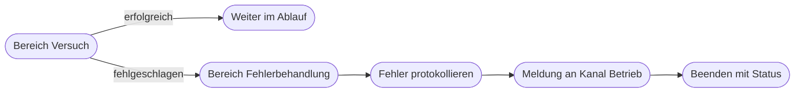

# Kapitel 28 – Testing, Fehlerbehandlung und Optimierung

{{ progress(28) }}

<div class="lernziele" markdown>
<h3>Was du in diesem Kapitel lernst</h3>

- Welche **Testarten** Power Automate anbietet und wann du welche einsetzt
- Wie du den **Ausführungsverlauf** liest und Ein- und Ausgaben je Schritt prüfst
- Welche **typischen Fehlermeldungen** es gibt und was sie wirklich bedeuten
- Wie du mit **Nach Fehler ausführen**, **Bereich** und **Wiederholungsrichtlinie** Fehler abfängst
- Wie du **Performance und Grenzen** im Blick behältst: Schleifen, Nebenläufigkeit, Paging, Limits
- Wie du Flows **wartbar** hältst und Änderungen versionierst
- Eine **Fehlersuch-Checkliste**, die du in fester Reihenfolge abarbeitest
</div>

---

## 28.1 Vier Arten zu testen

Ein Flow, der einmal durchgelaufen ist, ist nicht getestet. Getestet ist er, wenn du auch die unangenehmen Fälle ausprobiert hast: leere Felder, falsche Werte, fehlende Berechtigung. Power Automate bietet dafür vier Wege, die du über `Flow öffnen → Testen` erreichst:

| Testart | Wie es geht | Wofür geeignet |
|---|---|---|
| Manuell | `Testen → Manuell`, Trigger selbst auslösen | erster Durchlauf, Instant-Flows |
| Mit vorherigen Ausführungsdaten | `Testen → Automatisch` und einen früheren Lauf wählen | Änderungen prüfen, ohne neuen Auslöser zu erzeugen |
| Mit echten Auslösern | Flow einschalten und den Auslöser real erzeugen | Abnahme, Zusammenspiel mit anderen Systemen |
| Wiederholung einer fehlgeschlagenen Ausführung | im Ausführungsverlauf `Erneut übermitteln` | nach Behebung der Ursache denselben Fall nachfahren |

Der zweite Weg ist der praktischste: Du baust eine Aktion um und lässt den Flow mit den **Daten eines echten früheren Laufs** wiederholen. Keine Testmail, keine Testantwort, kein Aufräumen. Achte nur darauf, dass Schreibaktionen dabei wirklich schreiben – deshalb gehören Tests in eine Testliste, nicht in die Produktivliste.

!!! tip "Testfälle vorher aufschreiben"
    Notiere vor dem Bauen fünf Fälle: Normalfall, leeres Pflichtfeld, sehr großer Wert, unbekannter Schlüsselwert, doppelte Auslösung. Das ist keine Bürokratie, sondern die Liste, gegen die du am Ende abnimmst – und sie deckt die Fehler auf, die im Betrieb tatsächlich auftreten. In deinem eigenen Projekt (Kap. 36) definierst du genau solche Testfälle vorab.

---

## 28.2 Den Ausführungsverlauf lesen

Der Ausführungsverlauf ist dein wichtigstes Werkzeug. Du findest ihn unter `Meine Flows → Flow anklicken → Verlauf der 28-Tage-Ausführung`. Jeder Lauf ist mit Startzeit, Dauer und Status aufgeführt: `Erfolgreich`, `Fehlgeschlagen`, `Wird ausgeführt` oder `Abgebrochen`.

Öffne einen Lauf und du siehst den Flow als Baum. Ein grünes Häkchen bedeutet erfolgreich, ein rotes Ausrufezeichen fehlgeschlagen, ein graues Symbol übersprungen. Klick auf einen Schritt zeigt die beiden Dinge, auf die es ankommt:

- **Eingaben:** Was ist tatsächlich in der Aktion angekommen? Hier siehst du, ob dein Ausdruck den erwarteten Wert erzeugt hat oder eine leere Zeichenfolge.
- **Ausgaben:** Was hat die Aktion zurückgegeben? Bei Fehlern steht hier die Fehlermeldung mit Statuscode.

!!! info "Merksatz"
    Suche den Fehler nicht dort, wo es rot ist, sondern **einen Schritt davor**. Der rote Schritt ist meist nur das Opfer: Er hat einen leeren oder falschen Wert bekommen. Die Ursache steht in den **Eingaben** des fehlgeschlagenen Schritts und in den **Ausgaben** des Schritts davor.

Bei Schleifen zeigt der Verlauf zunächst nur den ersten Durchlauf. Über die Navigation innerhalb von `Auf jedes anwenden` springst du zu einem bestimmten Durchlauf – wichtig, wenn nur Datensatz 37 von 200 Probleme macht.

---

## 28.3 Typische Fehlermeldungen und was sie bedeuten

| Meldung / Code | Bedeutung | Erste Maßnahme |
|---|---|---|
| 401 Unauthorized | Verbindung nicht berechtigt oder abgelaufen | Verbindung neu anmelden, Rechte der Identität prüfen (Kap. 25) |
| 403 Forbidden | angemeldet, aber für dieses Objekt nicht berechtigt | Zugriff auf Website, Liste oder Postfach klären |
| 404 Not Found | Objekt existiert nicht | ID, Listenname, Ordnerpfad prüfen – oft ein Tippfehler |
| 429 Too Many Requests | Ratenbegrenzung erreicht | Nebenläufigkeit senken, Wiederholungsrichtlinie, bündeln (Kap. 26) |
| RequestTimeout / Zeitüberschreitung | Dienst antwortet nicht rechtzeitig | Zeitüberschreitung erhöhen, Datenmenge verkleinern |
| InvalidTemplate | Ausdruck fehlerhaft oder Feld nicht vorhanden | Ausdruck in `Verfassen` isoliert prüfen (Kap. 23) |
| Der Wert darf nicht NULL sein | ein Pflichtfeld ist leer | vorher auf leeren Wert prüfen, `coalesce` oder Standardwert setzen |
| Die angegebene Spalte ist unbekannt | interner Spaltenname weicht ab | internen Namen in den Listeneinstellungen nachsehen |

!!! warning "Häufiges Missverständnis: leerer Wert ist kein Fehler"
    Ein leeres Feld erzeugt selten sofort einen Abbruch. Der Flow läuft weiter und schreibt eine leere Zeile, eine Mail ohne Betreff oder einen Vorgang ohne Antragsteller. Solche Fehler sind gefährlicher als ein roter Lauf, weil niemand sie merkt. Prüfe deshalb Pflichtfelder aktiv mit einer Bedingung auf `empty(...)` und behandle den leeren Fall als **Fachfall**: eintragen, melden, abbrechen – aber nicht ignorieren.

---

## 28.4 Fehler abfangen statt hoffen

Standardmäßig gilt: Schlägt eine Aktion fehl, wird der Rest übersprungen und der Lauf endet rot. Für einen belastbaren Flow brauchst du vier Werkzeuge.

**`Nach Fehler ausführen (Configure run after)`** legt fest, wann eine Aktion überhaupt startet. Du findest es über `Aktion → drei Punkte → Nach Fehler ausführen` und wählst dort neben `ist erfolgreich` auch `ist fehlgeschlagen`, `Timeout aufgetreten` oder `wurde übersprungen`. Damit baust du einen Zweig, der **nur im Fehlerfall** läuft.

**`Bereich (Scope)`** fasst mehrere Aktionen zu einem Block zusammen. Der Bereich gilt als fehlgeschlagen, sobald eine Aktion darin scheitert. Kombiniert mit `Nach Fehler ausführen` ergibt das das Muster, das Programmierende als Try-Catch kennen:

```text
Bereich Versuch:
  Aktion: Elemente abrufen
  Aktion: HTTP-Anforderung
  Aktion: Element aktualisieren
Bereich Fehlerbehandlung:   (Nach Fehler ausfuehren: ist fehlgeschlagen, Timeout)
  Aktion: Verfassen  ->  result(Bereich Versuch) als Fehlerdetails
  Aktion: Element erstellen  (Liste Fehlerprotokoll)
  Aktion: Nachricht in einem Chat oder Kanal veroeffentlichen  (Kanal Betrieb)
  Aktion: Beenden  (Status Fehlgeschlagen)
Bereich Abschluss:          (Nach Fehler ausfuehren: alle Zustaende)
  Aktion: Element aktualisieren  (Laufzeit und Status vermerken)
```

Der Ausdruck `result('Bereich_Versuch')` liefert die Ergebnisse aller Aktionen im Bereich samt Fehlermeldung – damit steht in deiner Fehlermeldung, **welcher** Schritt gescheitert ist, nicht nur dass etwas gescheitert ist.

**`Wiederholungsrichtlinie (Retry policy)`** unter `Aktion → Einstellungen` wiederholt automatisch. Standard sind vier Versuche mit steigendem Abstand. Sinnvoll bei 429, 500 und Zeitüberschreitung – sinnlos bei 400, 401 und 404. Dort schaltest du sie auf `Keine`, damit der Fehler sofort sichtbar wird. Direkt darunter steht die **Zeitüberschreitung** (Timeout) als Höchstdauer für eine Aktion.

**`Beenden (Terminate)`** beendet den Flow bewusst mit `Erfolgreich`, `Fehlgeschlagen` oder `Abgebrochen` samt eigener Meldung. Nutze `Fehlgeschlagen`, wenn der Lauf im Verlauf rot erscheinen soll, und `Abgebrochen` für Fälle, in denen nichts zu tun war.



!!! warning "Fehlermeldungen an eine Person sind eine Sackgasse"
    Power Automate schickt Fehlermeldungen standardmäßig an den Flow-Besitzer. Ist diese Person im Urlaub, ausgeschieden oder ignoriert die Mail, bleibt der Ausfall wochenlang unbemerkt. Melde Fehler deshalb an ein **Team-Postfach oder einen Teams-Kanal** und protokolliere sie zusätzlich in einer Liste `Fehlerprotokoll`. Wer keine Fehlerbenachrichtigung baut, betreibt keinen Flow, sondern hofft.

---

## 28.5 Performance und Grenzen

Flows laufen nicht unbegrenzt. Die wichtigsten Grenzen und Hebel:

| Thema | Grenze in der Praxis | Hebel |
|---|---|---|
| Elemente je Abruf | `Elemente abrufen` liefert standardmäßig 100 | Anzahl erhöhen und **Paginierung** einschalten |
| Schleifen | `Auf jedes anwenden` über Tausende Elemente wird langsam und teuer | vorher filtern, `Array filtern`, serverseitige Filterabfrage |
| Nebenläufigkeit | Schleifen laufen parallel, Standard 20 gleichzeitig | unter `Einstellungen → Parallelität` senken – bei Ratenbegrenzung oder Schreibkonflikten |
| Laufzeit | ein Lauf ist zeitlich begrenzt, Wartezeiten zählen mit | lange Wartezeiten in einen zweiten Flow auslagern |
| Aktionsverbrauch | pro Lizenz gibt es ein Tageskontingent | Aktionen sparen statt Schleifen stapeln |

Die **Paginierung** stellst du an der Abrufaktion unter `Einstellungen → Paginierung` ein und gibst einen Schwellenwert an. Ohne sie bekommst du stillschweigend nur die erste Seite – ein Klassiker für Berichte, in denen plötzlich Datensätze fehlen, ohne dass etwas rot wird.

Bei **Nebenläufigkeit** gilt eine Faustregel: Parallel ist schneller, aber unvorhersehbar in der Reihenfolge. Schreibst du in einer Schleife Zeilen in eine Excel-Tabelle oder zählst du in einer Variablen hoch, setze die Parallelität auf 1 – sonst gehen Werte verloren. Bei reinen Leseoperationen darf sie hoch bleiben.

---

## 28.6 Wartbarkeit, Versionierung und die Fehlersuch-Checkliste

Ein Flow, den nur du verstehst, ist ein Risiko. Vier einfache Maßnahmen machen den Unterschied:

- **Sprechende Namen:** Benenne jede Aktion um, sobald du sie konfiguriert hast – `Antrag in Liste anlegen` statt `Element erstellen 3`. Nachträgliches Umbenennen bricht Ausdrücke, die sich auf den alten Namen beziehen, also früh benennen.
- **Notizen:** Über `Aktion → drei Punkte → Notiz hinzufügen` erklärst du direkt im Flow, warum ein Schritt so ist. Besonders bei Ausdrücken und Sonderfällen.
- **Beschreibung und Verantwortliche:** Trage in den Flow-Details Zweck, Datenquellen und verantwortliche Person ein, und setze mindestens zwei Miteigentümer.
- **Export als Version:** `Meine Flows → Flow → Exportieren → Paket (.zip)` vor jeder größeren Änderung. Power Automate hat für Cloud-Flows außerhalb von Lösungen keinen vollständigen Versionsverlauf – dein Export ist die Rückfalllinie. Benenne ihn mit Datum und Änderungsgrund.

!!! example "Fehlersuch-Checkliste – in dieser Reihenfolge"
    1. **Verlauf öffnen** und den ersten roten Schritt finden, nicht den letzten.
    2. **Eingaben** dieses Schritts lesen: Ist der Wert leer, falsch formatiert oder unerwartet?
    3. **Ausgaben des vorherigen Schritts** prüfen: Kam von dort überhaupt etwas?
    4. **Fehlermeldung und Statuscode** einordnen: Berechtigung, fehlendes Objekt, Ratenbegrenzung, Ausdruck oder leerer Wert?
    5. **Ausdruck isoliert testen** mit einer `Verfassen`-Aktion und einem festen Beispielwert.
    6. **Identität und Verbindung** prüfen: Läuft der Flow unter dem Konto, das Zugriff hat?
    7. **Schleifendurchlauf** einzeln aufrufen, wenn nur einzelne Datensätze scheitern.
    8. **Nach der Korrektur** denselben Fall über `Erneut übermitteln` oder mit vorherigen Ausführungsdaten nachfahren – nicht mit einem neuen, anderen Testfall.
    9. **Ergebnis festhalten:** Ursache und Behebung in einer Notiz am Schritt oder im Fehlerprotokoll vermerken.

Änderungen an einem laufenden Flow gehen niemals direkt in die Produktivfassung. Kopiere den Flow über `Speichern unter`, ändere die Kopie, teste sie gegen deine Testfälle und tausche dann. Und schalte den alten Flow erst aus, wenn der neue nachweislich läuft – sonst gibt es eine Lücke, in der niemand die Vorgänge bearbeitet.

---

## Zusammenfassung

- Es gibt vier Testarten; besonders praktisch ist der Test **mit vorherigen Ausführungsdaten** und das **erneute Übermitteln** eines fehlgeschlagenen Laufs.
- Im **Ausführungsverlauf** liegt die Wahrheit in den **Eingaben und Ausgaben** je Schritt – die Ursache steht meist einen Schritt vor dem roten Symbol.
- Fehlercodes sagen dir, was zu tun ist: 401 und 403 Berechtigung, 404 fehlendes Objekt, 429 Ratenbegrenzung, InvalidTemplate Ausdruck, leerer Wert stiller Datenfehler.
- **Bereich** plus **Nach Fehler ausführen** ergibt ein Try-Catch-Muster; **Wiederholungsrichtlinie** nur dort, wo Wiederholen sinnvoll ist; **Beenden** setzt einen klaren Status.
- Fehlerbenachrichtigungen gehören an ein **Team**, nicht an eine Einzelperson.
- **Paginierung, Filterung und begrenzte Nebenläufigkeit** entscheiden über Laufzeit und Datenvollständigkeit.
- **Namen, Notizen, Miteigentümer und Export** machen einen Flow übergabefähig; Änderungen laufen über eine getestete Kopie.

---

## Kurzübungen

{{ task(file="tasks/k28_01.yaml") }}

{{ task(file="tasks/k28_02.yaml") }}

{{ task(file="tasks/k28_03.yaml") }}

---

## Workshop

{{ task(file="tasks/workshop_k28.yaml") }}
