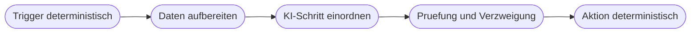
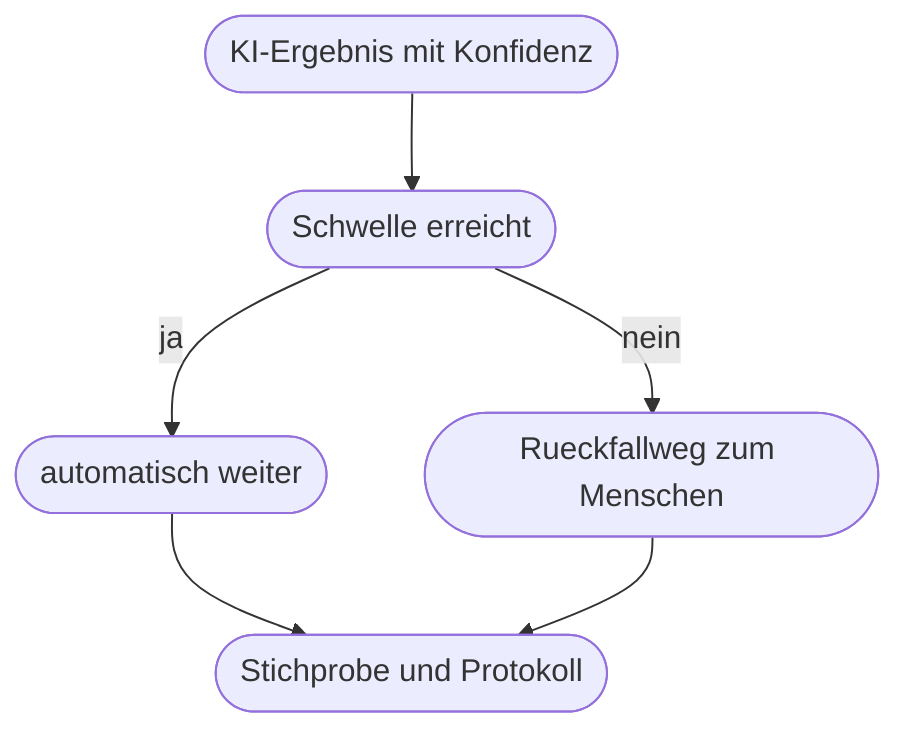

# Kapitel 29 – KI-Bausteine im Workflow: Muster und Einsatzstellen

{{ progress(29) }}

<h3>Was du in diesem Kapitel lernst</h3>

- Das Grundmuster **deterministisch außen, KI innen** und warum es die Basis jedes belastbaren KI-Ablaufs ist
- Die **acht Einsatzstellen**, an denen KI in einem Workflow tatsächlich Nutzen bringt
- Wie du mit **Unsicherheit** umgehst: Konfidenzschwelle, Rückfallweg, Freigabe-Gate, Stichprobe, Protokollierung
- Vier **Antimuster**, die in der Praxis zuverlässig Schaden anrichten
- Warum **Kosten, Laufzeit und Nichtdeterminismus** Betriebsthemen sind und nicht Detailfragen
- Wie du für einen konkreten Schritt entscheidest, ob er überhaupt KI braucht

---

## 29.1 Das Grundmuster: deterministisch außen, KI innen

Bis hierher hast du zwei Welten kennengelernt. Auf der einen Seite die **Sprachmodelle** (Kap. 5): sprachlich stark, aber statistisch, schwankend und gelegentlich frei erfunden. Auf der anderen Seite **Power Automate** (Kap. 21–28): exakt, wiederholbar, protokolliert – aber blind für alles, was nicht als feste Regel formulierbar ist.

Der Block 6 verbindet beides. Und die Verbindung folgt einem einzigen tragenden Muster:

!!! info "Merksatz"
    **Deterministisch außen, KI innen.** Der Ablauf steuert – er entscheidet, wann etwas passiert, was danach kommt, wer informiert wird und was im Fehlerfall geschieht. Die KI erledigt genau **einen unscharfen Teilschritt** innerhalb dieses Ablaufs. Sie steuert nicht, sie liefert zu.

Konkret heißt das: Der Trigger ist deterministisch. Die Verzweigung ist deterministisch. Das Schreiben in die SharePoint-Liste ist deterministisch. Nur der Schritt „Worum geht es in dieser Nachricht?" ist ein KI-Schritt – und sein Ergebnis wird behandelt wie eine Eingabe von außen: geprüft, eingegrenzt, notfalls verworfen.

Der Unterschied zum Chatfenster ist entscheidend. Im Chat prüfst du jede Antwort selbst, bevor du sie verwendest. Im Flow läuft der KI-Schritt **ohne dich** – nachts, am Wochenende, hundertfach. Was im Chat eine kleine Ungenauigkeit war, wird im Flow zu einer systematischen Fehlerquelle. Deshalb ist die Frage nie „Kann die KI das?", sondern: „Was passiert, wenn sie es zwanzig Mal richtig und beim einundzwanzigsten Mal falsch macht?"

---

## 29.2 Die acht Einsatzstellen

KI ist im Workflow kein Alleskönner, sondern ein Werkzeug für eine überschaubare Zahl von Aufgabentypen. Diese acht decken praktisch alles ab, was du in einem Büroprozess brauchst:

| Einsatzstelle | Was die KI liefert | Typisches Beispiel | Wie gut kontrollierbar |
|---|---|---|---|
| **Einordnen** | eine Kategorie aus einer festen Liste | Anfrage als Reklamation, Angebotsanfrage oder Rechnungsfrage | sehr gut – Liste ist vorgegeben |
| **Extrahieren** | benannte Felder aus unstrukturiertem Text | Kundennummer, Betrag, Termin aus einer Mail | gut – Feld ist entweder da oder nicht |
| **Zusammenfassen** | Kurzfassung eines längeren Textes | zwölf Mails eines Vorgangs auf fünf Zeilen | mittel – Auslassungen fallen kaum auf |
| **Formulieren** | einen Textentwurf | Antwortentwurf, Absageschreiben, Protokolltext | mittel – Ton und Inhalt müssen geprüft werden |
| **Übersetzen** | denselben Inhalt in einer anderen Sprache | englische Anfrage für das deutsche Team | gut bei Alltagstext, heikel bei Rechtstext |
| **Priorisieren** | eine Dringlichkeitsstufe | eilig, normal, kann warten | mittel – Kriterien müssen im Prompt stehen |
| **Bewerten** | eine Einschätzung mit Begründung | Vollständigkeit einer Bewerbung, Stimmung einer Rückmeldung | schwach – wirkt objektiver, als es ist |
| **Entwurf vorbereiten** | eine ausgefüllte Vorlage zum Weiterbearbeiten | vorausgefüllter Besuchsbericht | gut – der Mensch arbeitet ohnehin weiter |

Auffällig ist, was **nicht** in der Liste steht: rechnen, entscheiden, verschicken, buchen. Diese Dinge gehören in den deterministischen Teil. Ein Sprachmodell, das dir eine Summe nennt, hat sie nicht ausgerechnet, sondern formuliert – und das ist ein Unterschied, der in der Buchhaltung teuer wird (Kap. 8).

Daraus folgt eine einfache Arbeitsregel: Formuliere den KI-Anteil eines Prozesses immer als **einen** dieser acht Typen. Wenn du das nicht kannst, ist der Schritt zu groß geschnitten. „Bearbeite die Reklamation" ist kein KI-Schritt. „Ordne die Reklamation einer von vier Kategorien zu" ist einer.

---

## 29.3 Fünf Muster für den Umgang mit Unsicherheit

Ein KI-Schritt liefert nie eine Garantie, sondern bestenfalls eine begründete Vermutung. Der Ablauf drumherum muss das aushalten. Diese fünf Muster kannst du einzeln oder kombiniert einsetzen:

| Muster | Wie es funktioniert | Wann es passt |
|---|---|---|
| **Konfidenzschwelle** | Die KI gibt zusätzlich einen Sicherheitswert aus; nur oberhalb einer Schwelle läuft es automatisch weiter | wenn es viele gleichartige Fälle gibt |
| **Rückfallweg zum Menschen** | Unklare Fälle landen in einer Liste oder einem Postfach mit Zuständigem | immer als Auffangnetz nötig |
| **Freigabe-Gate** | Vor jeder Außenwirkung entscheidet ein Mensch per Genehmigung (Kap. 27) | bei Kundenkontakt, Geld, Rechtsfolgen |
| **Stichprobenprüfung** | Ein fester Anteil der automatisch gelaufenen Fälle wird nachträglich kontrolliert | wenn Vollprüfung zu teuer ist |
| **Protokollierung der KI-Ausgabe** | Eingabe, Ausgabe, Zeitpunkt und Modellversion werden gespeichert | immer – sonst ist nichts erklärbar |

Die Protokollierung ist das Muster, das am häufigsten vergessen und am bittersten vermisst wird. Drei Wochen nach dem Vorfall will jemand wissen, warum eine Anfrage im falschen Postfach gelandet ist. Ohne gespeicherte KI-Ausgabe kannst du das nicht beantworten – der Ausführungsverlauf zeigt zwar, dass der Zweig „Reklamation" genommen wurde, aber nicht, auf welcher Grundlage. Ein einfaches Anhängen der KI-Antwort an den Datensatz oder eine Protokollzeile in einer SharePoint-Liste kostet eine Aktion und rettet die Nachvollziehbarkeit (Kap. 33).

!!! warning "Typische Falle: die Schwelle als Placebo"
    Eine Konfidenzschwelle nützt nur, wenn der Rückfallweg tatsächlich bearbeitet wird. Eine Prüfliste, die niemandem gehört und in die niemand schaut, ist kein Sicherheitsnetz, sondern ein Ablagefach. Lege beim Bauen fest: **wer** schaut **wie oft** hinein, und was passiert, wenn ein Fall drei Tage liegt.

---

## 29.4 Vier Antimuster

Diese vier Konstruktionen tauchen in fast jedem ersten Entwurf auf. Sie sehen elegant aus und gehen zuverlässig schief.

!!! warning "Was du nicht bauen solltest"
    **KI entscheidet ohne Prüfung.** Der Flow verzweigt allein auf die KI-Ausgabe, ohne Schwelle, ohne Rückfallweg. Beim ersten unerwarteten Eingabeformat verzweigt er falsch – still und ohne Fehlermeldung, denn technisch ist alles in Ordnung.

    **KI rechnet.** Summen, Fristen, Prozentwerte, Vergleiche von Beträgen. Ein Sprachmodell erzeugt hier plausible Zahlen, keine korrekten. Rechnen gehört in Ausdrücke (Kap. 23) oder in Excel.

    **KI erzeugt Kundenkommunikation ohne Freigabe.** Der Entwurf ist meist gut. Das Problem ist der eine Fall, in dem er es nicht ist – und dann steht er bereits im Postfach des Kunden. Vor Außenwirkung immer ein Gate (Kap. 27).

    **KI als Ersatz für fehlende Regeln.** Wenn im Fachbereich niemand sagen kann, wann ein Vorgang eilig ist, kann es die KI auch nicht. Sie erfindet dann eine Regel, die niemand beschlossen hat und niemand kennt. Erst die Regel klären, dann automatisieren.

Das letzte Antimuster ist das gefährlichste, weil es sich als Fortschritt tarnt. Ein unklarer Prozess wird durch KI nicht klarer, sondern nur schneller unklar – und die Unklarheit ist danach in einem technischen System versteckt statt in einem Meeting sichtbar (Kap. 17).

---

## 29.5 Kosten, Laufzeit, Nichtdeterminismus

Sobald ein KI-Schritt produktiv läuft, wird er zum Betriebsthema. Drei Eigenschaften unterscheiden ihn von jeder anderen Aktion im Flow:

**Kosten.** KI-Aktionen sind nicht kostenlos. In der Power Platform werden sie über ein Kontingent abgerechnet, das an die Umgebung gebunden ist (Details in Kap. 30). Praktische Folge: Ein KI-Schritt in einer Schleife über 400 Zeilen ist etwas völlig anderes als ein KI-Schritt pro eingehender Mail. Prüfe bei jedem Entwurf, wie oft der Schritt pro Tag tatsächlich läuft.

**Laufzeit.** Ein KI-Aufruf dauert typischerweise Sekunden statt Millisekunden. In einer Schleife summiert sich das schnell zu Minuten. Bei zeitkritischen Abläufen und bei Flows mit vielen Durchläufen lohnt es, den KI-Schritt aus der Schleife herauszuziehen: statt fünfzig Einzelaufrufen ein Aufruf mit einer Liste – sofern die Ausgabe danach sauber zerlegbar bleibt.

**Nichtdeterminismus.** Zwei identische Eingaben können zwei verschiedene Ausgaben ergeben (Kap. 5). Für einen Ablauf ist das die unangenehmste Eigenschaft überhaupt, weil sie das Testen aushebelt: Ein einmal erfolgreicher Testlauf beweist nichts.

!!! example "Was Nichtdeterminismus für dein Testen bedeutet"
    Ein Flow ordnet eingehende Anfragen ein. Du testest mit einer Beispielmail, das Ergebnis stimmt. Ein Kollege testet dieselbe Mail am nächsten Tag – und bekommt eine andere Kategorie, weil das Modell einen Satz anders gewichtet hat.

    Konsequenz für die Praxis: Teste einen KI-Schritt nie mit einem Fall, sondern mit einem **Satz von zehn bis fünfzehn Fällen**, darunter drei bewusst schwierige und einen leeren. Lasse denselben Satz zweimal laufen. Was zwischen den Läufen wechselt, markiert die Fälle, in denen du eine Schwelle oder einen Rückfallweg brauchst. Dieses Vorgehen greifst du in Kap. 37 für dein eigenes Projekt wieder auf.

---

## 29.6 Braucht dieser Schritt überhaupt KI?

Bevor du einen KI-Baustein einbaust, beantworte vier Fragen. Erst wenn alle vier für KI sprechen, lohnt sich der Aufwand.

| Frage | Antwort spricht gegen KI | Antwort spricht für KI |
|---|---|---|
| Lässt sich der Schritt als Regel formulieren? | ja – dann nimm eine Bedingung | nein, die Eingaben sind zu vielfältig |
| Ist die Eingabe strukturiert? | ja – Formularfeld, Auswahlliste | nein – Freitext, Mail, Dokument |
| Was kostet ein Fehler? | viel und sofort wirksam | wenig oder leicht korrigierbar |
| Gibt es eine klare Sollantwort? | nein, niemand kann sie benennen | ja, ein Mensch könnte sie sofort geben |

Die dritte Zeile darf kein Ausschlusskriterium sein, sondern bestimmt die **Absicherung**: Hohe Fehlerkosten bedeuten nicht „keine KI", sondern „KI nur mit Freigabe-Gate". Die vierte Zeile dagegen ist ein hartes Ausschlusskriterium. Wenn ein erfahrener Mensch die richtige Antwort nicht benennen könnte, kann niemand prüfen, ob die KI richtig lag – und dann automatisierst du eine Behauptung.

!!! tip "Der kleinste sinnvolle Anfang"
    Baue den Flow zuerst **ohne** KI, mit einer festen Beispielausgabe an der Stelle des KI-Schritts. So testest du Trigger, Verzweigungen, Ablage und Benachrichtigung vollständig durch, während die unsichere Komponente noch berechenbar ist. Erst wenn der Rahmen steht, setzt du die echte KI-Aktion ein. Diese Reihenfolge spart in der Praxis mehr Zeit als jede Prompt-Optimierung.

---

## Zusammenfassung

- Das tragende Muster lautet **deterministisch außen, KI innen**: Der Ablauf steuert, die KI liefert genau einen unscharfen Teilschritt zu.
- KI im Workflow ist gut für **Einordnen, Extrahieren, Zusammenfassen, Formulieren, Übersetzen, Priorisieren, Bewerten und Entwürfe** – nicht für Rechnen und Entscheiden.
- Unsicherheit fängst du mit fünf Mustern ab: **Konfidenzschwelle, Rückfallweg, Freigabe-Gate, Stichprobe, Protokollierung**.
- Die vier Antimuster sind: KI entscheidet ungeprüft, KI rechnet, KI kommuniziert ohne Freigabe, KI ersetzt fehlende Regeln.
- **Kosten, Laufzeit und Nichtdeterminismus** machen den KI-Schritt zum Betriebsthema – ein einzelner erfolgreicher Test beweist nichts.
- Ein Schritt braucht nur dann KI, wenn er sich nicht als Regel formulieren lässt **und** ein Mensch die richtige Antwort benennen könnte.

---

## Kurzübungen

{{ task(file="tasks/k29_01.yaml") }}

{{ task(file="tasks/k29_02.yaml") }}

{{ task(file="tasks/k29_03.yaml") }}

---

## Workshop

{{ task(file="tasks/workshop_k29.yaml") }}
