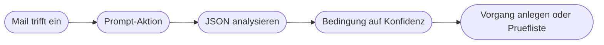

# Kapitel 30 – AI Builder und KI-Aktionen in Power Automate

{{ progress(30) }}

<div class="lernziele" markdown>
<h3>Was du in diesem Kapitel lernst</h3>

- Was **AI Builder** ist und wie er sich in die Power Platform einfügt
- Welche **vorgefertigten Modelle** es gibt und wann sich ein **eigenes trainiertes Modell** lohnt
- Wie du die **Prompt-Aktion** im Flow einsetzt und einen vollständigen Prompt dafür schreibst
- Der entscheidende Trick: die KI-Ausgabe in eine **feste Struktur zwingen** und danach zerlegen
- Welche **Voraussetzungen** gelten: Umgebung, Lizenz, Kontingent
- Wie du über die **HTTP-Aktion** einen KI-Dienst ansprichst, wenn AI Builder nicht verfügbar ist
</div>

---

## 30.1 AI Builder: der KI-Baukasten der Power Platform

**AI Builder** ist der KI-Werkzeugkasten innerhalb der Power Platform. Er stellt fertige KI-Funktionen als ganz normale Aktionen bereit, die du in einem Cloud-Flow genauso einfügst wie eine SharePoint- oder Outlook-Aktion (Kap. 25). Du brauchst dafür kein Modell zu verstehen und nichts zu programmieren.

AI Builder kennt zwei grundverschiedene Arten von Modellen:

| | Vorgefertigtes Modell | Eigenes trainiertes Modell |
|---|---|---|
| Woher es kommt | von Microsoft trainiert und bereitgestellt | du trainierst es mit eigenen Beispielen |
| Vorbereitung | keine – direkt einsetzbar | Beispieldaten sammeln, markieren, trainieren, veröffentlichen |
| Passgenauigkeit | allgemein, kennt deine Begriffe nicht | genau auf deine Dokumente und Kategorien zugeschnitten |
| Typischer Fall | Stimmung, Sprache, Texterkennung, Rechnungen | eure spezifischen Formulare und Lieferscheine |
| Aufwand | Minuten | Stunden bis Tage, plus Pflege |

!!! info "Merksatz"
    Fang **immer** mit einem vorgefertigten Modell oder einem Prompt an. Ein eigenes Modell trainierst du erst, wenn du nachweisen kannst, dass die fertige Variante an einer konkreten Stelle systematisch versagt. Das Training eigener Dokumentmodelle vertiefst du in Kap. 31.

---

## 30.2 Die vorgefertigten Modelle im Überblick

| Modell | Was es liefert | Sinnvoller Einsatz im Flow |
|---|---|---|
| **Stimmungsanalyse** | positiv, negativ oder neutral zu einem Text | Rückmeldungen aus Formularen vorsortieren |
| **Kategorieklassifizierung** | eine oder mehrere Kategorien zu einem Text | eingehende Anfragen einem Team zuordnen |
| **Schlüsselbegriffserkennung** | die zentralen Begriffe eines Textes | Stichworte für die Suche in einer Vorgangsliste |
| **Spracherkennung** | die Sprache eines Textes | Weiterleitung an ein fremdsprachiges Team |
| **Übersetzung** | denselben Text in einer Zielsprache | Anfragen für die Bearbeitung übersetzen |
| **Texterkennung** | den Text aus Bildern und Scans | Inhalt eines Fotos durchsuchbar machen |
| **Visitenkartenleser** | Name, Firma, Telefon, Mail aus einem Foto | Kontakte nach einer Messe erfassen |
| **Rechnungsverarbeitung** | Rechnungsfelder wie Betrag, Datum, Lieferant | Belege vorerfassen (Kap. 31) |
| **Belegverarbeitung** | Felder aus Kassenbelegen | Reisekostenabrechnung vorbereiten |

Diese Modelle haben eine angenehme Eigenschaft: Ihre Ausgabe ist **strukturiert**. Du bekommst ein Feld „Stimmung" mit dem Wert `negativ` und einen Zahlenwert dazu, kein Fließtextabsatz. Damit lässt sich sofort weiterarbeiten.

!!! warning "Typische Falle: Stimmung ist keine Dringlichkeit"
    Die Stimmungsanalyse misst den **Ton**, nicht die Wichtigkeit. Eine sachlich formulierte Kündigung wird als neutral eingestuft, ein verärgerter Hinweis auf einen Tippfehler als negativ. Wer daraus eine Eskalationslogik baut, eskaliert die falschen Fälle. Stimmung ist ein Zusatzsignal, nie das Entscheidungskriterium (Kap. 29).

---

## 30.3 Die Prompt-Aktion: KI mit eigener Anweisung

Für alles, was die vorgefertigten Modelle nicht abdecken, gibt es die **Prompt-Aktion**. Sie heißt in Power Automate je nach Version „Text mit GPT erstellen" oder erscheint als eigener Prompt, den du zuvor in AI Builder angelegt hast. Du findest sie unter `Power Automate → Aktion hinzufügen → AI Builder`.

Der Ablauf ist immer derselbe: Du schreibst eine Anweisung, markierst die Stellen, an denen Daten aus dem Flow eingesetzt werden, und bekommst eine Textantwort zurück. Alles, was du in Kap. 9 und 10 über Prompt-Design gelernt hast, gilt hier unverändert – mit einer Verschärfung: Im Flow liest niemand mit. Ein Prompt, der im Chat „meistens gut genug" ist, reicht nicht.

Hier ein vollständiger Prompt für die Einordnung eingehender Serviceanfragen:

```text
Du bist Sachbearbeiter im Kundenservice eines Bueromoebelhaendlers.
Ordne die folgende Kundennachricht ein.

Erlaubte Kategorien, waehle genau eine:
Reklamation, Angebotsanfrage, Rechnungsfrage, Terminfrage, Sonstiges

Erlaubte Dringlichkeitsstufen, waehle genau eine:
hoch, mittel, niedrig
Hoch gilt nur bei Lieferstopp, Reklamation mit Fristsetzung oder Kuendigung.

Regeln:
- Erfinde keine Angaben. Wenn ein Feld nicht im Text steht, schreibe null.
- Ordne im Zweifel Sonstiges zu, statt zu raten.
- Die Begruendung ist hoechstens 15 Woerter lang.

Antworte ausschliesslich mit diesem JSON, ohne Einleitung und ohne Kommentar:

{
  "kategorie": "eine der erlaubten Kategorien",
  "dringlichkeit": "eine der erlaubten Stufen",
  "kundennummer": "gefundene Nummer oder null",
  "konfidenz": 0.0,
  "begruendung": "kurzer Satz"
}

Kundennachricht:
[Hier wird der Mailtext aus dem Flow eingesetzt]
```

Drei Dinge machen diesen Prompt flowtauglich: Die **Kategorien sind aufgezählt**, sodass das Modell nichts erfinden kann. Es gibt eine **ausdrückliche Regel für den Zweifelsfall**. Und die Ausgabe ist auf ein **festes Format** festgelegt.

Der entscheidende Trick ist der letzte Punkt: **Erzwinge die Struktur, und erzwinge sie hart.** „Antworte ausschließlich mit diesem JSON, ohne Einleitung und ohne Kommentar" ist kein Stilwunsch, sondern die Voraussetzung dafür, dass der nächste Schritt im Flow überhaupt funktioniert. Sprachmodelle neigen dazu, höflich einzuleiten – und genau dieses „Gerne! Hier ist das Ergebnis:" bricht die weitere Verarbeitung.

---

## 30.4 Das Ergebnis strukturiert weiterverwenden

Die Prompt-Aktion liefert dir zunächst nur **Text**. Damit der Flow damit verzweigen kann, musst du ihn in echte Felder zerlegen. Der Standardweg dafür ist die Aktion `JSON analysieren`.



Nach `JSON analysieren` stehen dir `kategorie`, `dringlichkeit`, `konfidenz` und `begruendung` als normale dynamische Inhalte zur Verfügung, so wie jedes andere Feld im Flow (Kap. 23). Die Verzweigung ist danach wieder vollständig deterministisch:

```text
Bedingung:
  konfidenz  ist groesser oder gleich  0.85
  UND
  kategorie  ist nicht gleich  Sonstiges

Ja-Zweig:   Vorgang in der Liste anlegen, Zustaendigkeit nach Kategorie setzen
Nein-Zweig: Eintrag in der Pruefliste, Zuweisung an den Innendienst
```

!!! warning "Häufiges Missverständnis: das Format hält nicht von allein"
    Auch mit klarer Anweisung kann die Ausgabe gelegentlich abweichen – ein zusätzlicher Satz davor, ein fehlendes Feld, ein Komma zu viel. `JSON analysieren` bricht dann mit einem Fehler ab, und der Flow bleibt stehen. Baue deshalb immer ab: Setze die Prompt-Aktion und das Zerlegen in einen `Bereich` und hänge einen Fehlerzweig mit `Nach Fehler ausführen` daran, der den Vorgang in die Prüfliste schreibt (Kap. 28). So wird ein Formatfehler zu einem Prüffall statt zu einem Ausfall.

Ein zweiter Stolperstein sind Zahlenwerte. Wenn das Modell `0.85` mit Punkt liefert, dein Vergleich aber einen Text erwartet, vergleichst du Zeichenketten statt Zahlen – und `0.9` ist als Text kleiner als `0.85`. Wandle den Wert deshalb ausdrücklich um, etwa mit `@{float(body('JSON_analysieren')?['konfidenz'])}`, und definiere das Feld im Schema als Zahl.

---

## 30.5 Voraussetzungen: Umgebung, Lizenz, Kontingent

AI-Builder-Aktionen sind keine Standardaktionen. Drei Dinge müssen zusammenkommen, damit sie dir überhaupt angezeigt werden:

| Voraussetzung | Worum es geht | Woran du merkst, dass es fehlt |
|---|---|---|
| **Umgebung** | AI Builder läuft in einer Power-Platform-Umgebung mit Dataverse | die Aktionen erscheinen gar nicht in der Suche |
| **Lizenz** | AI Builder ist kostenpflichtig, teils in Plänen enthalten | Aktion ist sichtbar, meldet aber fehlende Berechtigung |
| **Kontingent** | jeder Aufruf verbraucht Credits aus einem Kontingent | Flows brechen ab, sobald das Kontingent leer ist |

Das Kontingent ist der Punkt, den man beim Bauen unterschätzt. Es hängt an der Umgebung, nicht an dir – ein einzelner Flow mit einer Schleife über eine große Liste kann das Kontingent eines ganzen Teams aufbrauchen. Zwei Regeln helfen: Teste mit **wenigen** Datensätzen, und prüfe vor dem Produktivgang, wie oft der KI-Schritt pro Tag tatsächlich läuft (Kap. 29).

!!! info "Falls dir AI Builder nicht zur Verfügung steht"
    Du kannst dieses Kapitel vollständig ohne AI-Builder-Zugang durcharbeiten. Nutze diesen Ersatzweg:

    1. Teste den Prompt **manuell** im Chatwerkzeug (Copilot, ChatGPT oder Claude) mit fünf bis zehn Beispielnachrichten und schärfe ihn dort nach, bis die Ausgabe zuverlässig dem geforderten Format entspricht.
    2. Kopiere eine der so erzeugten Ausgaben in eine `Verfassen`-Aktion in deinem Flow. Sie tritt an die Stelle der Prompt-Aktion.
    3. Baue alles Weitere – `JSON analysieren`, Bedingung, Ablage, Prüfliste, Fehlerzweig – ganz normal auf dieser Testausgabe auf.

    Du lernst dabei genau das, worauf es ankommt: einen flowtauglichen Prompt schreiben und eine strukturierte Ausgabe weiterverarbeiten. Steht AI Builder später zur Verfügung, ersetzt du die `Verfassen`-Aktion durch die echte Prompt-Aktion, ohne den Rest anzufassen.

---

## 30.6 Der Alternativweg über die HTTP-Aktion

Wenn AI Builder dauerhaft nicht infrage kommt, dein Unternehmen aber Zugang zu einem KI-Dienst hat, führt der Weg über die `HTTP`-Aktion (Kap. 26). Der Aufbau ist derselbe wie bei jedem anderen Dienstaufruf:

```text
Methode:  POST
URL:      Endpunkt des KI-Dienstes laut interner Dokumentation
Header:   Content-Type: application/json
          Authorization: Schluessel aus einer sicheren Quelle
Body:     JSON mit Anweisung und Nutzertext
```

Die Antwort ist wieder JSON und wird wieder mit `JSON analysieren` zerlegt – ab da unterscheidet sich nichts von Abschnitt 30.4.

!!! warning "Schlüssel gehören nicht in den Flow"
    Ein API-Schlüssel im Klartext in einer HTTP-Aktion ist für jeden lesbar, der den Flow öffnen oder exportieren darf – und das sind in geteilten Umgebungen mehr Personen als gedacht. Schlüssel gehören in eine dafür vorgesehene sichere Ablage, in der Microsoft-Welt üblicherweise Azure Key Vault, und werden von dort zur Laufzeit geholt. Kläre das mit der IT, bevor du baust. Ein eigenmächtig angelegter Dienstzugang mit Schlüssel im Flow ist genau die Schatten-IT, die dir in Kap. 38 als Problem begegnet.

Beim Umweg über einen externen Dienst kommt außerdem der Datenschutz zurück auf den Tisch: Welche Daten verlassen das Unternehmen, wohin, und gibt es dafür eine Grundlage? Ein Flow, der Kundennachrichten an einen nicht freigegebenen Dienst schickt, ist unabhängig von seiner technischen Qualität ein Problem (Kap. 4).

---

## Zusammenfassung

- **AI Builder** stellt KI als normale Flow-Aktionen bereit – vorgefertigte Modelle für Standardfälle, eigene trainierte Modelle für spezifische Dokumente.
- Vorgefertigte Modelle liefern **strukturierte Ausgaben** und sind sofort einsetzbar; Stimmung ist dabei ein Zusatzsignal, keine Dringlichkeit.
- Die **Prompt-Aktion** deckt alles Übrige ab: Kategorien aufzählen, Zweifelsregel setzen, Ausgabeformat hart vorschreiben.
- Der Schlüssel zur Weiterverarbeitung ist **JSON analysieren** – danach verzweigt der Flow wieder rein deterministisch.
- Formatabweichungen sind einzuplanen: `Bereich` plus Fehlerzweig macht aus einem Ausfall einen Prüffall.
- **Umgebung, Lizenz und Kontingent** entscheiden über die Verfügbarkeit; ohne AI Builder trägt der Weg über getesteten Prompt plus `Verfassen` oder die `HTTP`-Aktion.

---

## Kurzübungen

{{ task(file="tasks/k30_01.yaml") }}

{{ task(file="tasks/k30_02.yaml") }}

{{ task(file="tasks/k30_03.yaml") }}

---

## Workshop

{{ task(file="tasks/workshop_k30.yaml") }}
