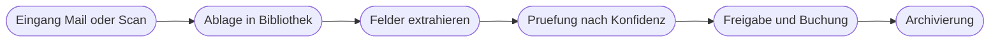

# Kapitel 31 – Dokumentenverarbeitung automatisieren

{{ progress(31) }}

<div class="lernziele" markdown>
<h3>Was du in diesem Kapitel lernst</h3>

- Wie eine Dokumentenstrecke von der Ablage bis zur Buchung **Ende zu Ende** aufgebaut ist
- Der Unterschied zwischen reiner **Texterkennung** und **strukturierter Feldextraktion**
- Wie du in Grundzügen ein **eigenes Dokumentmodell** trainierst und welche Beispieldokumente es braucht
- Wie **Konfidenzwerte** zur Steuergröße werden – mit einer durchgerechneten dreistufigen Behandlung
- Wie du **Prüfschleife, Ablage und Dateibenennung** so gestaltest, dass sie im Alltag durchhalten
- Welche **Aufbewahrungs- und Nachweispflichten** deine Automatisierung mittragen muss
</div>

---

## 31.1 Die Dokumentenstrecke Ende zu Ende

Dokumente sind der Klassiker der Automatisierung: Sie kommen in großer Zahl, sie sind mühsam abzutippen, und die Fehler beim Abtippen sind teuer. Belege, Verträge, Formulare und Lieferscheine folgen dabei fast immer derselben Kette.



Wichtig ist die Trennung der Verantwortlichkeiten: Die Schritte am Anfang und am Ende sind vollständig deterministisch. Nur die Extraktion ist unsicher, und nur sie braucht deshalb eine besondere Behandlung – das Muster aus Kap. 29 gilt hier unverändert.

| Dokumentart | Wie einheitlich | Was extrahiert wird | Automatisierungsgrad |
|---|---|---|---|
| **Eingangsrechnung** | ähnlich aufgebaut, aber je Lieferant anders | Nummer, Datum, Betrag, Steuer, Lieferant | hoch |
| **Lieferschein** | meist tabellarisch | Nummer, Positionen, Mengen, Bestellbezug | hoch |
| **Formular** | festes Layout, wenn selbst gestaltet | die vorgesehenen Felder | sehr hoch |
| **Vertrag** | freier Fließtext | Laufzeit, Kündigungsfrist, Vertragspartner | niedrig |

Verträge sind der Grenzfall. Man kann daraus Felder ziehen, aber die Streuung ist zu groß für eine unbeaufsichtigte Verarbeitung – hier liefert die Automatisierung eine Vorbefüllung, keine Entscheidung.

---

## 31.2 Texterkennung ist nicht Feldextraktion

Zwei Begriffe werden ständig verwechselt, obwohl sie technisch und praktisch weit auseinanderliegen.

**Texterkennung**, meist als **OCR** bezeichnet (optical character recognition, optische Zeichenerkennung), verwandelt ein Bild von Text in echten Text. Am Ende hast du alle Zeichen des Dokuments in Lesereihenfolge – aber ohne jede Bedeutung. Der Wert `1.190,00` ist danach eine Zeichenkette, kein Bruttobetrag.

**Feldextraktion** geht einen Schritt weiter: Sie ordnet gefundene Werte **benannten Feldern** zu. Erst dadurch wird aus einer Zahl auf dem Papier ein Feld `Bruttobetrag` mit dem Wert 1190,00, mit dem der Flow rechnen und vergleichen kann.

| | Texterkennung | Feldextraktion |
|---|---|---|
| Ergebnis | Text ohne Struktur | benannte Felder mit Werten |
| Weiterverarbeitung | Suche, Volltextindex | Bedingungen, Buchung, Abgleich |
| Fehlerbild | falsch gelesene Zeichen | richtig gelesen, falsch zugeordnet |
| Passender Einsatz | Scans durchsuchbar machen | Belege vorerfassen |

!!! warning "Typische Falle: das falsche Feld, sauber gelesen"
    Der gefährlichere Fehler ist nicht das falsch gelesene Zeichen – der fällt meist auf. Gefährlicher ist die falsche **Zuordnung**: Auf einer Rechnung stehen oft mehrere Beträge, und das Modell greift statt des Bruttobetrags den Zwischensumme-Wert ab. Formal ist alles korrekt, die Zahl existiert wirklich auf dem Dokument. Genau deshalb prüfst du kritische Felder nie über die reine Konfidenz, sondern zusätzlich über eine **fachliche Plausibilität**, etwa den Abgleich mit der Bestellung.

---

## 31.3 Ein eigenes Dokumentmodell trainieren

Für Standardbelege reicht ein vorgefertigtes Modell (Kap. 30). Sobald es um eure eigenen Formulare oder um Lieferanten mit sehr eigenwilligen Layouts geht, lohnt sich ein eigenes Modell. Der Weg dorthin ist immer derselbe:

| Schritt | Was du tust | Worauf es ankommt |
|---|---|---|
| 1 Dokumenttyp wählen | strukturiertes Formular oder frei aufgebautes Dokument | die Wahl bestimmt, wie viele Beispiele du brauchst |
| 2 Felder definieren | benennen, was extrahiert werden soll | eindeutige, sprechende Feldnamen, keine Sammelfelder |
| 3 Beispiele sammeln | echte Dokumente in der ganzen Bandbreite | auch die hässlichen Fälle, nicht nur die schönen |
| 4 Markieren | in jedem Beispiel die Felder zuweisen | konsequent immer dasselbe Feld markieren |
| 5 Trainieren | Modell rechnen lassen | dauert Minuten bis Stunden |
| 6 Testen | mit Dokumenten, die **nicht** im Training waren | sonst misst du nur das Auswendiglernen |
| 7 Veröffentlichen | Modell für Flows freigeben | erst danach ist es als Aktion nutzbar |

!!! info "Was gute Beispieldokumente ausmacht"
    Faustregeln aus der Praxis: Rechne mit **mindestens fünf Beispielen je Layout-Variante**, in der Praxis eher mit zehn bis zwanzig. Entscheidend ist nicht die Menge, sondern die **Vielfalt**: unterschiedliche Lieferanten, unterschiedliche Seitenzahlen, Dokumente mit fehlenden Feldern, ein schlechter Scan, ein leicht schiefes Foto. Wer nur perfekte PDF-Dateien trainiert, bekommt ein Modell, das bei der ersten echten Handyaufnahme aussteigt. Und: Verwende **echte** Dokumente aus dem Betrieb, aber kläre vorher, ob dabei personenbezogene Daten verarbeitet werden (Kap. 4).

Schritt 6 wird am häufigsten übersprungen und ist der wichtigste. Ein Modell, das mit denselben Dokumenten getestet wird, mit denen es trainiert wurde, liefert immer glänzende Werte – und sagt nichts über die Realität aus. Halte von Anfang an ein Fünftel deiner Beispiele zurück und benutze sie ausschließlich zum Testen.

---

## 31.4 Konfidenzwerte als Steuergröße

Jedes extrahierte Feld kommt mit einem **Konfidenzwert** zwischen 0 und 1 zurück – der Einschätzung des Modells, wie sicher es sich bei genau diesem Feld ist. Dieser Wert ist deine wichtigste Steuergröße, weil er dir erlaubt, den Aufwand dorthin zu lenken, wo er nötig ist.

Der Standardaufbau ist eine **dreistufige Behandlung**:

!!! example "Dreistufige Behandlung, durchgerechnet"
    Ausgangslage: 200 Eingangsrechnungen pro Woche. Geprüft werden vier Pflichtfelder: Rechnungsnummer, Rechnungsdatum, Bruttobetrag, Lieferant. Maßgeblich ist immer das **niedrigste** der vier Feldkonfidenzen, denn eine Rechnung ist nur so verlässlich wie ihr schwächstes Feld.

    | Stufe | Regel | Behandlung | Anteil | Menge |
    |---|---|---|---|---|
    | hoch | niedrigste Konfidenz ab 0,90 **und** Betrag stimmt mit der Bestellung überein | automatisch vorerfasst, Stichprobe von 5 Prozent | 60 % | 120 |
    | mittel | niedrigste Konfidenz zwischen 0,70 und 0,90 | Vorerfassung mit Prüfaufgabe, Mensch bestätigt oder korrigiert | 30 % | 60 |
    | niedrig | niedrigste Konfidenz unter 0,70 oder ein Pflichtfeld fehlt | keine Vorerfassung, manuelle Erfassung | 10 % | 20 |

    Rechnung des Nutzens: Vor der Automatisierung wurden 200 Rechnungen von Hand erfasst. Danach werden 120 automatisch verarbeitet, 60 nur noch geprüft statt getippt, 20 bleiben wie bisher. Zusätzlich kommen 6 Stichproben aus der hohen Stufe hinzu. Die Sachbearbeitung fasst also nur noch 86 statt 200 Vorgänge an – und die 60 geprüften kosten deutlich weniger Zeit als eine Neuerfassung.

    Wichtig ist die zweite Bedingung in der obersten Stufe. Ohne den Abgleich mit der Bestellung würde eine sauber gelesene, aber falsch zugeordnete Zahl automatisch durchlaufen (Abschnitt 31.2).

Die Schwellen 0,90 und 0,70 sind Startwerte, keine Naturkonstanten. Nach vier bis sechs Wochen schaust du in die Prüfergebnisse: Wurden in der mittleren Stufe fast nie Korrekturen nötig, kannst du die obere Schwelle senken. Rutschten dagegen Fehler durch die hohe Stufe, hebst du sie an. Diese Nachjustierung ist kein Zeichen für einen schlechten Entwurf, sondern der Normalbetrieb.

!!! warning "Wenn die Konfidenz durchgehend mittelmäßig ist"
    Ein häufiges Bild: Fast alle Dokumente landen zwischen 0,75 und 0,85. Dann trennt deine Schwelle nichts mehr, und du hast lediglich eine zweite Warteschlange gebaut. Die Ursache liegt fast nie an der Schwelle, sondern am Modell: zu wenige oder zu einheitliche Beispieldokumente, unscharf definierte Felder oder ein Layout, das sich stark von den Trainingsdaten unterscheidet. Repariere die Ursache, nicht den Schwellenwert.

---

## 31.5 Prüfschleife, Ablage und Benennung

Die Prüfschleife ist der Teil, der über Erfolg oder Scheitern entscheidet – nicht die Erkennungsqualität. Eine Prüfaufgabe muss drei Eigenschaften haben: Sie hat eine **namentliche Zuständigkeit**, sie zeigt das **Originaldokument neben den extrahierten Werten**, und sie hat eine **Frist**. Fehlt eines davon, wächst die Liste, bis niemand mehr hineinschaut (Kap. 27).

```text
Aufbau einer Pruefaufgabe:
Link auf das Originaldokument in der Bibliothek
Extrahierte Felder als bearbeitbare Werte
Kennzeichnung der Felder mit niedriger Konfidenz
Zwei Aktionen: Bestaetigen oder Korrigieren und bestaetigen
Zustaendige Person und Frist in Arbeitstagen
```

Genauso unterschätzt wird die **Dateibenennung**. Sie klingt nach Kosmetik und entscheidet doch darüber, ob man ein Dokument in zwei Jahren wiederfindet. Ein bewährtes Schema setzt sich aus feststehenden Bestandteilen in fester Reihenfolge zusammen:

```text
Schema:    JJJJ-MM-TT_Dokumentart_Lieferant_Belegnummer.pdf
Beispiel:  2026-03-04_Rechnung_Nordlicht-Papier_RE-20719.pdf

Regeln:
Datum immer zuerst und immer im Format JJJJ-MM-TT, dann sortiert die Liste richtig
Keine Umlaute, keine Leerzeichen, keine Sonderzeichen
Bindestrich innerhalb eines Bestandteils, Unterstrich zwischen den Bestandteilen
Fehlende Angabe wird durch das Wort unbekannt ersetzt, nicht weggelassen
```

Die letzte Regel ist die wichtigste: Wenn ein Bestandteil bei fehlendem Wert einfach entfällt, verschieben sich alle folgenden Bestandteile, und jede spätere automatische Auswertung des Dateinamens bricht. Der Platzhalter `unbekannt` hält die Struktur stabil und macht die Lücke gleichzeitig sichtbar.

Für die Ablage selbst gilt: Lege die Ordnerstruktur an der **Suchfrage** aus, nicht am Entstehungsweg. Wer später fragt „Was haben wir 2026 bei Nordlicht Papier gekauft?", braucht Jahr und Lieferant in der Struktur. Wer fragt „Wer hat das freigegeben?", braucht das nicht im Ordner, sondern als Spalte in der Bibliothek. Spalten sind Ordnern fast immer überlegen, weil man nach ihnen filtern kann, ohne die Struktur zu ändern (Kap. 25).

---

## 31.6 Aufbewahrung, Nachweis und Ausnahmen

Bei Belegen endet die Automatisierung nicht bei der Buchung. Steuerlich relevante Dokumente unterliegen **Aufbewahrungspflichten** über mehrere Jahre, und sie müssen **unveränderbar** und **jederzeit lesbar** vorgehalten werden. Für deine Automatisierung folgen daraus drei Anforderungen:

| Anforderung | Was das konkret bedeutet |
|---|---|
| **Original erhalten** | die eingegangene Datei bleibt unverändert liegen, verarbeitet wird eine Kopie |
| **Verarbeitung nachvollziehbar** | wann wurde welches Feld mit welchem Wert und welcher Konfidenz extrahiert, wer hat bestätigt |
| **Löschung geregelt** | nach Ablauf der Frist wird geordnet gelöscht, nicht vergessen |

Die mittlere Zeile ist der Punkt, an dem KI-Verarbeitung besondere Sorgfalt verlangt. Wenn ein Betrag von einem Modell vorgeschlagen und von einem Menschen bestätigt wurde, muss beides nachvollziehbar bleiben – der Vorschlag und die Bestätigung. Speichere deshalb je Dokument einen kleinen Verarbeitungsnachweis mit Zeitpunkt, extrahierten Werten, Konfidenzen, dem eingesetzten Modell und der bestätigenden Person. Diese Protokollierung ist dieselbe, die dir in Kap. 33 für Agenten wieder begegnet.

!!! warning "Ausnahmen und schlechte Scans"
    Jede Dokumentenstrecke braucht einen definierten Weg für Dokumente, die schlicht nicht verarbeitbar sind: unleserliche Fotos, quer eingescannte Seiten, mehrere Belege in einer Datei, Fremdsprachen, handschriftliche Ergänzungen. Diese Fälle dürfen weder den Flow abbrechen noch stillschweigend verschwinden. Der saubere Weg ist ein eigener Status wie `nicht verarbeitbar` mit Grund, Ablage im Originalordner und einer Aufgabe an die zuständige Person. Plane damit, dass es sie gibt – in der Praxis sind es je nach Eingangsweg durchaus einige Prozent, und sie kosten mehr Zeit als alle automatisch verarbeiteten Dokumente zusammen, wenn sie nicht geregelt sind.

---

## Zusammenfassung

- Die Dokumentenstrecke ist außen deterministisch – nur die **Extraktion** ist unsicher und braucht besondere Behandlung.
- **Texterkennung** liefert Zeichen ohne Bedeutung, **Feldextraktion** liefert benannte Felder; der gefährlichste Fehler ist der richtig gelesene, falsch zugeordnete Wert.
- Ein eigenes Modell entsteht in sieben Schritten; entscheidend sind **vielfältige Beispieldokumente** und ein Test mit zurückgehaltenen Dokumenten.
- **Konfidenzwerte** steuern eine dreistufige Behandlung: automatisch, Prüfaufgabe, manuell – maßgeblich ist das schwächste Pflichtfeld plus eine fachliche Plausibilitätsprüfung.
- **Prüfaufgaben** brauchen Zuständigkeit, Originalansicht und Frist; **Dateinamen** brauchen ein festes Schema mit Platzhalter statt Auslassung.
- **Aufbewahrung, Unveränderbarkeit und ein Verarbeitungsnachweis** sind Teil der Automatisierung, ebenso ein definierter Weg für nicht verarbeitbare Dokumente.

---

## Kurzübungen

{{ task(file="tasks/k31_01.yaml") }}

{{ task(file="tasks/k31_02.yaml") }}

{{ task(file="tasks/k31_03.yaml") }}

---

## Workshop

{{ task(file="tasks/workshop_k31.yaml") }}
