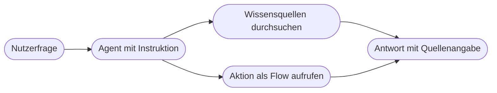

# Kapitel 32 – Eigene Agenten bauen mit Copilot Studio

{{ progress(32) }}

<div class="lernziele" markdown>
<h3>Was du in diesem Kapitel lernst</h3>

- Wie du in **Copilot Studio** einen eigenen Agenten anlegst und wofür Name und Beschreibung zählen
- Wie du **Instruktionen** schreibst, die im Dauerbetrieb tragen
- Wie du **Wissensquellen** anbindest und was dabei mit den Berechtigungen passiert
- Der Unterschied zwischen **Themen mit Trigger-Phrasen** und **generativen Antworten**
- Wie du einen **Power-Automate-Flow als Aktion** des Agenten anbindest
- Wie du testest, veröffentlichst, den Agenten **absicherst** und schlechte Antworten reparierst
</div>

---

## 32.1 Was Copilot Studio ist – und wann sich ein eigener Agent lohnt

**Copilot Studio** ist die Werkbank der Power Platform für eigene Agenten. Was du in Kap. 6 als Anatomie eines Agenten kennengelernt hast – Ziel, Instruktion, Wissen, Werkzeuge – baust du hier zusammen, ohne zu programmieren.

Ein eigener Agent lohnt sich, wenn drei Bedingungen zusammenkommen: Es gibt **wiederkehrende Fragen**, es gibt **eine verlässliche Wissensquelle**, und es gibt **viele Fragende**. Fehlt eine davon, ist der Agent der falsche Weg. Für eine Frage, die dreimal im Jahr gestellt wird, genügt ein gepflegtes Dokument. Für eine Frage, deren Antwort niemand aufgeschrieben hat, hilft auch ein Agent nicht – er erfindet dann eine Antwort (Kap. 5).



Das Anlegen selbst dauert Minuten: `Copilot Studio → Erstellen → Neuer Agent`. Du vergibst einen Namen, eine Beschreibung und die Sprache. Beide Textfelder sind wichtiger, als sie aussehen. Der **Name** erscheint überall dort, wo Menschen mit dem Agenten sprechen – er sollte den Zuständigkeitsbereich nennen, nicht witzig sein. Die **Beschreibung** erklärt in ein bis zwei Sätzen, wofür der Agent zuständig ist und wofür nicht; sie ist die erste Erwartungssteuerung.

| Feld | Schwach | Tragfähig |
|---|---|---|
| Name | Hilfsbereiter Helfer | Reisekosten-Assistent |
| Beschreibung | Beantwortet alle Fragen rund um die Firma | Beantwortet Fragen zur Reisekostenrichtlinie und zum Abrechnungsablauf. Nicht zuständig für Einzelfallentscheidungen und Auszahlungen. |

---

## 32.2 Instruktionen schreiben

Die **Instruktion** ist die dauerhafte Anweisung an den Agenten – das, was du in Kap. 10 als Systemprompt und Custom Instructions kennengelernt hast, hier als festes Feld. Sie unterscheidet sich in einem Punkt grundlegend von einem Prompt im Chat: Sie wird für **jede** Frage jedes Nutzers wirksam, auch für die, die du dir nicht vorgestellt hast.

Eine tragfähige Instruktion beantwortet fünf Fragen: Wer bist du? Für wen arbeitest du? Woher nimmst du deine Antworten? Wie antwortest du? Und vor allem: Was tust du **nicht**?

```text
Du bist der Reisekosten-Assistent der Kandelbach Sanitaer GmbH.
Du hilfst Beschaeftigten bei Fragen zur Reisekostenrichtlinie und zum
Abrechnungsablauf.

Antworten:
- Stuetze dich ausschliesslich auf die hinterlegten Wissensquellen.
- Nenne bei jeder Antwort die Fundstelle, also Dokument und Abschnitt.
- Antworte in hoechstens fuenf Saetzen, sachlich und in der Du-Form.
- Bei Betraegen und Fristen zitiere den Wortlaut der Richtlinie.

Das tust du nicht:
- Du beantwortest keine Fragen zu Gehalt, Arbeitsvertraegen oder Personalakten.
- Du entscheidest keine Einzelfaelle und sagst keine Erstattung zu.
- Du gibst keine steuerliche oder rechtliche Beratung.

Wenn du etwas nicht in den Wissensquellen findest, sage das ausdruecklich und
verweise auf die Reisekostenstelle unter [Kontaktadresse].
```

!!! info "Merksatz"
    Der wertvollste Teil jeder Agenten-Instruktion ist die Liste dessen, was der Agent **nicht** tut. Ohne sie antwortet er auch auf Fragen, für die er nie gedacht war – und zwar mit derselben Selbstsicherheit wie auf die Fragen, für die er gebaut wurde.

!!! tip "Beispiele schlagen Adjektive"
    „Antworte freundlich und präzise" steuert wenig. Ein Beispiel steuert viel: Nimm eine echte Frage, schreibe die Musterantwort daneben und lege beides in die Instruktion. Zwei bis drei solcher Paare verändern das Antwortverhalten spürbarer als jede Formulierungsverfeinerung (Kap. 9).

---

## 32.3 Wissensquellen anbinden

Ein Agent ohne Wissensquellen ist ein allgemeines Sprachmodell mit einer Rollenbeschreibung – er weiß nichts über euer Unternehmen. Erst die Wissensquellen machen ihn nützlich. Copilot Studio kennt mehrere Arten:

| Quelle | Wofür geeignet | Worauf du achten musst |
|---|---|---|
| **SharePoint-Website** | gepflegte Richtlinien, Handbücher, Intranet | Umfang begrenzen, sonst zieht der Agent Veraltetes heran |
| **Hochgeladene Dateien** | abgeschlossene Dokumente, die sich selten ändern | Aktualisierung ist manuell, Versionsstand im Blick behalten |
| **Öffentliche Website** | öffentlich zugängliche Produkt- und Serviceinfos | nur was auch öffentlich sein soll |

Der Punkt, der in der Praxis die meisten Diskussionen auslöst, sind die **Berechtigungen**. Bei einer SharePoint-Quelle gilt in der Regel: Der Agent zeigt einer Person nur Inhalte, auf die diese Person ohnehin Zugriff hat. Die bestehenden Berechtigungen werden also respektiert, nicht ausgehebelt. Bei **hochgeladenen Dateien** ist das anders – eine Datei, die du in den Agenten lädst, ist für alle sichtbar, die den Agenten nutzen dürfen, unabhängig davon, wer auf das Original zugreifen darf.

!!! warning "Typische Falle: die stille Rechteausweitung"
    Genau hier entstehen Datenschutzvorfälle. Jemand lädt eine Übersichtstabelle mit Personaldaten hoch, weil der Agent damit besser antwortet – und öffnet sie damit für den gesamten Nutzerkreis. Regel: **Lade nichts hoch, was nicht ohnehin alle sehen dürfen.** Alles Übrige bindest du als SharePoint-Quelle ein, damit die dortigen Berechtigungen greifen. Bei personenbezogenen Daten kommt die Frage nach Rechtsgrundlage und Zweckbindung dazu (Kap. 4).

Für die Antwortqualität ist die **Qualität der Quelle** ausschlaggebend. Ein Agent auf einer SharePoint-Website mit drei Fassungen derselben Richtlinie aus verschiedenen Jahren wird sie vermischen. Vor dem Anbinden lohnt sich deshalb immer eine Aufräumrunde: Veraltetes archivieren, Dubletten entfernen, Zuständigkeit für die Pflege festlegen.

---

## 32.4 Themen oder generative Antworten

Copilot Studio kann auf zwei Wegen antworten, und du solltest bewusst entscheiden, welcher Weg wofür zuständig ist.

**Themen** sind vorgeplante Gesprächsverläufe. Sie starten über **Trigger-Phrasen** – Beispielformulierungen, an denen der Agent erkennt, dass dieses Thema gemeint ist. Danach folgt ein festgelegter Ablauf: Fragen stellen, Antworten sammeln, eine Aktion auslösen, eine feste Antwort geben.

**Generative Antworten** entstehen dagegen aus den Wissensquellen, ohne vorgeplanten Verlauf. Der Agent sucht, findet und formuliert.

| | Thema | Generative Antwort |
|---|---|---|
| Verlauf | vorgeplant, immer gleich | frei formuliert |
| Zuverlässigkeit | hoch, weil festgelegt | schwankend |
| Aufwand | je Thema spürbar | einmalig für alle Fragen |
| Passend für | verbindliche Auskünfte, Vorgänge mit festen Schritten | breite Wissensfragen |

Die Faustregel lautet: **Alles, was verbindlich ist oder etwas auslöst, gehört in ein Thema.** Eine Krankmeldung, eine Urlaubsanfrage, eine Bestellung – hier willst du einen festen Ablauf mit festen Rückfragen. Alles, was reine Auskunft ist, überlässt du den generativen Antworten.

Trigger-Phrasen brauchen Vielfalt. Menschen fragen nicht so, wie Prozessverantwortliche formulieren. Für ein Thema zur Reisekostenabrechnung genügen `Reisekostenabrechnung einreichen` und `Wie reiche ich eine Reisekostenabrechnung ein` nicht – ergänze `Fahrtkosten abrechnen`, `Beleg für Dienstreise einreichen`, `Wo trage ich meine Hotelrechnung ein`. Fünf bis zehn deutlich unterschiedliche Formulierungen sind ein guter Startwert.

---

## 32.5 Aktionen: einen Flow als Werkzeug anbinden

Der Schritt vom Auskunftsgeber zum handelnden Agenten sind **Aktionen**. Eine Aktion ist ein Werkzeug, das der Agent aufrufen kann – am häufigsten ein Power-Automate-Flow.

Der Ablauf beim Anbinden:

```text
1. Flow bauen mit dem Trigger fuer Copilot
2. Eingaben definieren, zum Beispiel Vorgangsnummer als Text
3. Flow arbeiten lassen, etwa Status in einer Liste nachschlagen
4. Ausgaben definieren, zum Beispiel Status und Liefertermin
5. In Copilot Studio unter Aktionen den Flow auswaehlen
6. Beschreiben, wann der Agent die Aktion nutzen soll
7. Im Testfenster mit einer echten Frage pruefen
```

Punkt 6 ist der entscheidende und wird am häufigsten unterschätzt. Die Beschreibung der Aktion ist das, woran der Agent erkennt, ob dieses Werkzeug zur Frage passt. „Vorgangsstatus" ist zu wenig. Besser: „Ruft den aktuellen Bearbeitungsstatus und den geplanten Liefertermin zu einer Vorgangsnummer ab. Nutze diese Aktion, wenn nach dem Stand einer konkreten Bestellung oder Reklamation gefragt wird und eine Vorgangsnummer vorliegt."

Genauso wichtig sind die **Eingaben**. Fehlt die Vorgangsnummer, darf der Agent sie nicht erfinden, sondern muss nachfragen. Schreibe das ausdrücklich in die Instruktion. Was auf der anderen Seite passiert – Rechte, Protokollierung, Datenverträge zwischen Agent und Flow – vertiefst du in Kap. 33.

---

## 32.6 Testen, veröffentlichen, absichern

Im **Testfenster** rechts in Copilot Studio sprichst du mit dem Agenten, während du ihn baust. Teste nicht nur die Fragen, für die du ihn gebaut hast. Ein brauchbarer Testsatz enthält immer vier Sorten Fragen: die erwartete Standardfrage, eine ungewöhnlich formulierte Variante davon, eine Frage, die knapp außerhalb der Zuständigkeit liegt, und eine, deren Antwort in keiner Wissensquelle steht.

Das **Veröffentlichen** macht den Agenten für andere nutzbar. Üblich sind ein eigener Kanal in Microsoft Teams oder die Einbettung auf einer Website. Die Entscheidung hat Folgen: In Teams handeln Nutzende mit ihrer Identität, auf einer öffentlichen Website in der Regel anonym – und dann darf der Agent keine internen Wissensquellen und keine Aktionen mit Schreibrechten haben.

!!! warning "Absicherung: die vier Fragen vor dem Veröffentlichen"
    **Was darf der Agent nicht?** Steht die Liste in der Instruktion, und hält er sich im Test daran?

    **Was passiert bei Nicht-Wissen?** Der Agent muss sagen, dass er es nicht weiß, statt eine plausible Antwort zu bauen. Prüfe das mit einer bewusst unbeantwortbaren Frage.

    **Wie kommt jemand zu einem Menschen?** Es braucht einen ausdrücklichen Weg – eine Kontaktadresse, ein Thema `Mit einem Menschen sprechen`, ein Verweis auf die zuständige Stelle. Ohne diesen Weg wird der Agent zur Sackgasse.

    **Ist der Themenbereich begrenzt?** Ein Agent, der zu allem etwas sagt, verliert seine Verlässlichkeit. Grenze ihn ein und weise Fragen außerhalb der Zuständigkeit ausdrücklich zurück.

Schlechte Antworten haben fast immer eine von drei Ursachen. Sie zu unterscheiden spart viel Zeit:

| Symptom | Wahrscheinliche Ursache | Was hilft |
|---|---|---|
| Antwort ist inhaltlich falsch oder veraltet | Wissensbasis ist unvollständig, veraltet oder widersprüchlich | Quelle aufräumen, Dubletten entfernen, Pflege festlegen |
| Antwort ist inhaltlich richtig, aber im Ton oder Format unpassend | Instruktion ist zu vage | Format, Länge und Ton konkret vorschreiben |
| Antwort ist beliebig oder weicht aus | fehlende Beispiele und keine Abgrenzung | Musterfragen mit Musterantworten ergänzen, Nicht-Zuständigkeiten benennen |

!!! info "Falls dir Copilot Studio nicht zur Verfügung steht"
    Du kannst dieses Kapitel vollständig ohne Zugang durcharbeiten – der schwierige Teil ist ohnehin nicht das Klicken, sondern der Entwurf. Gehe so vor:

    1. Entwirf den Agenten als **Dokument**: Name, Beschreibung, vollständige Instruktion einschließlich der Nicht-Zuständigkeiten, Liste der Wissensquellen mit Begründung, drei Themen mit je fünf Trigger-Phrasen, eine Aktion mit Ein- und Ausgaben.
    2. Baue ihn in ChatGPT oder Claude nach: als Projekt mit hinterlegten Anweisungen und Dateien oder über Custom Instructions. Lade dort nur unkritische Beispieldokumente hoch.
    3. Teste ihn mit deinem Testsatz aus vier Fragensorten und protokolliere die Antworten.

    Das Ergebnis ist übertragbar: Instruktion, Wissensquellen und Themen sind dieselben Bausteine. Steht Copilot Studio später bereit, ist der Entwurf in einer Stunde eingerichtet.

---

## Zusammenfassung

- Ein eigener Agent lohnt sich nur bei **wiederkehrenden Fragen, verlässlicher Quelle und vielen Fragenden**.
- Die **Instruktion** trägt den Agenten – am wichtigsten ist die ausdrückliche Liste dessen, was er nicht tut.
- **Wissensquellen** entscheiden über die Qualität; hochgeladene Dateien sind für alle Nutzenden sichtbar und können Rechte still ausweiten.
- **Themen mit Trigger-Phrasen** für alles Verbindliche und Auslösende, **generative Antworten** für Auskunftsfragen.
- Ein **Flow als Aktion** macht den Agenten handlungsfähig; die Beschreibung der Aktion entscheidet, ob er sie richtig einsetzt.
- Vor dem Veröffentlichen: Grenzen prüfen, Verhalten bei Nicht-Wissen prüfen, **Weg zum Menschen** sicherstellen, Themenbereich begrenzen.

---

## Kurzübungen

{{ task(file="tasks/k32_01.yaml") }}

{{ task(file="tasks/k32_02.yaml") }}

{{ task(file="tasks/k32_03.yaml") }}

---

## Workshop

{{ task(file="tasks/workshop_k32.yaml") }}
