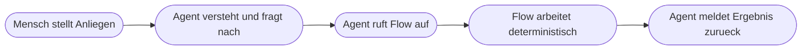
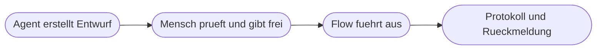

# Kapitel 33 – Agent und Workflow verbinden

{{ progress(33) }}

<div class="lernziele" markdown>
<h3>Was du in diesem Kapitel lernst</h3>

- Die drei **Architekturmuster**: Agent ruft Flow, Flow ruft KI, Agent und Flow nebeneinander mit dem Menschen als Gate
- Was ein **Datenvertrag** an der Übergabestelle ist und was bei fehlenden Werten passieren muss
- Unter welcher **Identität** ein Agent handelt und warum er nie mehr Rechte haben darf als die Person, für die er arbeitet
- Was du **protokollieren** musst, um im Nachhinein erklären zu können, warum etwas passiert ist
- Wie **Notbremse und Abschaltbarkeit** aussehen und wo die Grenzen der Autonomie liegen
- Wie du eine Kombination aus **Agent und Flow** systematisch testest
</div>

---

## 33.1 Drei Architekturmuster

Bis hierher hast du beide Bausteine einzeln gebaut: Flows mit KI-Schritten (Kap. 29–31) und Agenten mit Wissen und Aktionen (Kap. 32). Wenn beide zusammenkommen, gibt es drei sinnvolle Anordnungen. Die Wahl entscheidet über Verlässlichkeit, Aufwand und Risiko.

**Muster 1 – Agent ruft Flow.** Der Mensch spricht mit dem Agenten, der Agent ruft bei Bedarf einen Flow als Werkzeug auf. Der Einstieg ist ein Gespräch, der Ablauf beginnt erst danach.



**Muster 2 – Flow ruft KI.** Ein Ereignis startet den Ablauf, die KI erledigt darin einen unscharfen Teilschritt. Es gibt kein Gespräch. Das ist das Muster aus Kap. 29 und 30.

**Muster 3 – Agent und Flow nebeneinander, Mensch als Gate.** Der Agent bereitet vor, ein Mensch entscheidet, der Flow führt aus. Die beiden Systeme sprechen nicht direkt miteinander – zwischen ihnen sitzt eine Freigabe.



| Muster | Einstieg | Stärke | Risiko | Typischer Fall |
|---|---|---|---|---|
| Agent ruft Flow | Gespräch | fühlt sich natürlich an, deckt viele Varianten ab | Agent wählt das falsche Werkzeug oder erfindet Eingaben | Statusabfrage, Ticket anlegen |
| Flow ruft KI | Ereignis | vorhersehbar, gut testbar, gut protokollierbar | KI-Ausgabe bricht das Format | Eingangspost, Belege |
| Nebeneinander mit Gate | beliebig | höchste Kontrolle | langsamer, Gate kann zum Nadelöhr werden | Kundenkommunikation, Angebote |

!!! info "Merksatz"
    Die Frage lautet nie „Agent oder Flow", sondern: **Wer trägt die Entscheidung?** Trägt sie der Ablauf, nimm Muster 2. Trägt sie ein Mensch, nimm Muster 3. Muster 1 ist die bequemste Variante für Nutzende und die anspruchsvollste in der Absicherung – setze es nur ein, wenn die aufgerufenen Flows für sich genommen ungefährlich sind.

---

## 33.2 Übergabepunkte und Datenverträge

An jeder Stelle, an der Agent und Flow einander etwas übergeben, entsteht eine Bruchstelle. Der Agent arbeitet mit Sprache, der Flow mit Feldern. Was zwischen beiden fließt, braucht deshalb eine feste Vereinbarung: den **Datenvertrag**. Er legt fest, welche Felder in welchem Format übergeben werden, welche davon Pflicht sind und was passiert, wenn ein Wert fehlt.

```text
Datenvertrag: Agent ruft Flow Vorgangsstatus auf

Eingaben vom Agenten an den Flow
  vorgangsnummer   Text, Muster VG- gefolgt von fuenf Ziffern   Pflicht
  anfragende_person Text, Anmeldename der aufrufenden Person     Pflicht
  sprache          Text, de oder en, Standard de                 optional

Ausgaben vom Flow an den Agenten
  gefunden         Wahrheitswert
  status           Text aus fester Liste: offen, in Arbeit, erledigt, storniert
  liefertermin     Datum im Format JJJJ-MM-TT oder null
  hinweis          Text, hoechstens 200 Zeichen

Verhalten bei fehlenden Werten
  Fehlt die Vorgangsnummer: Der Agent fragt nach und ruft den Flow nicht auf.
  Nummer entspricht nicht dem Muster: Der Flow bricht mit einer klaren Meldung ab.
  Vorgang nicht gefunden: gefunden ist falsch, der Agent sagt das und verweist
  auf den Innendienst.
  Kein Liefertermin hinterlegt: liefertermin ist null, der Agent nennt keinen Termin.
```

Die letzte Zeile ist der wichtigste Teil des Vertrags. Ein Agent, der ein leeres Feld bekommt, formuliert daraus im Zweifel eine Auskunft – „voraussichtlich Ende der Woche" ist dann keine Information aus dem System, sondern eine Erfindung. Der Datenvertrag muss deshalb nicht nur sagen, was übergeben wird, sondern auch, **wie über eine Lücke gesprochen wird**.

!!! warning "Typische Falle: der Agent füllt Lücken selbst"
    Fehlt eine Pflichteingabe, neigt ein Agent dazu, sie zu erraten – eine plausible Vorgangsnummer, eine wahrscheinliche Kundennummer. Der Flow läuft dann sauber durch und liefert ein sauberes Ergebnis zum falschen Vorgang. Zwei Maßnahmen zusammen helfen: In der Instruktion steht ausdrücklich, dass fehlende Werte erfragt und nie erfunden werden. Und der Flow prüft die Eingabe selbst gegen ein Muster, statt sich auf den Agenten zu verlassen. Prüfe nie nur auf einer Seite der Übergabe.

---

## 33.3 Identität und Rechte: wer handelt hier eigentlich?

Wenn ein Agent einen Flow aufruft und dieser Flow eine Liste ändert, eine Mail sendet oder ein Dokument ablegt – **unter wessen Namen** geschieht das? Diese Frage klingt technisch und ist in Wahrheit die zentrale Governance-Frage des ganzen Blocks.

In der Power Platform hängt eine Aktion an einer **Verbindung**, und eine Verbindung gehört einer Person oder einem Dienstkonto (Kap. 21). Wer den Flow angelegt und die Verbindung hergestellt hat, unter dessen Rechten läuft er in der Regel – unabhängig davon, wer den Agenten anspricht. Daraus folgen drei unangenehme Möglichkeiten:

| Konstellation | Was passiert | Bewertung |
|---|---|---|
| Flow läuft unter der Verbindung der bauenden Person | alle Nutzenden handeln mit deren Rechten | gefährlich, wenn diese Person mehr darf als die Nutzenden |
| Flow läuft unter einem Dienstkonto | Rechte sind gebündelt und dokumentierbar | gut, wenn das Konto minimal berechtigt ist |
| Flow prüft die Berechtigung der anfragenden Person selbst | Rechte werden je Aufruf geprüft | am sichersten, aber aufwendiger |

!!! warning "Die Grundregel"
    **Ein Agent darf nie mehr Rechte haben als die Person, für die er gerade arbeitet.** Sonst wird er zum Umweg um das Berechtigungskonzept: Wer die Personalakten nicht sehen darf, fragt eben den Agenten, dessen Flow unter einem hoch berechtigten Konto läuft. Technisch funktioniert alles, fachlich ist es ein Datenschutzvorfall (Kap. 4).

Praktisch heißt das: Gib dem Flow ein Dienstkonto mit **genau den** Rechten, die für seine Aufgabe nötig sind, und nicht mehr. Übergib die anfragende Person als Pflichtfeld im Datenvertrag und lass den Flow prüfen, ob diese Person den angefragten Vorgang überhaupt sehen darf. Und begrenze, wer den Agenten nutzen darf – ein Agent, der in Teams für alle freigegeben ist, ist so berechtigt wie sein am weitesten reichender Flow.

---

## 33.4 Protokollierung und Auditierbarkeit

Drei Wochen nach einem Vorfall steht die Frage im Raum: Warum hat das System das getan? Ohne Protokoll ist die ehrliche Antwort „das wissen wir nicht" – und die ist bei personenbezogenen Daten, bei Geld und bei rechtsrelevanten Vorgängen nicht tragbar (Kap. 3).

Der Ausführungsverlauf von Power Automate zeigt, **dass** ein Zweig genommen wurde. Er erklärt nicht, **warum**. Bei KI-gestützten Abläufen brauchst du deshalb ein eigenes, fachliches Protokoll. Sinnvoll ist eine einfache SharePoint-Liste, in die jeder Vorgang eine Zeile schreibt:

| Feld | Warum es gebraucht wird |
|---|---|
| Zeitpunkt | Zuordnung zu Vorfällen und Zeiträumen |
| Auslöser und anfragende Person | wer hat es angestoßen, unter wessen Identität |
| Eingabe an die KI | ohne sie ist die Ausgabe nicht bewertbar |
| Ausgabe der KI im Wortlaut | die eigentliche Erklärung der Entscheidung |
| Konfidenz oder Sicherheitsangabe | zeigt, ob die Schwelle richtig gesetzt war |
| Verwendetes Modell und Promptstand | ohne Version ist nichts reproduzierbar |
| Abgeleitete Entscheidung | was der Ablauf daraus gemacht hat |
| Freigebende Person und Zeitpunkt | wer hat die Verantwortung übernommen |

Die vorletzte Zeile wird am häufigsten vergessen und am meisten gebraucht. Prompts werden geändert, Modelle werden von den Anbietern aktualisiert. Ohne Angabe, welcher Promptstand und welches Modell am fraglichen Tag im Einsatz waren, lässt sich ein altes Ergebnis nicht nachvollziehen.

!!! warning "Protokolle sind selbst datenschutzrelevant"
    Ein Protokoll, das Eingaben im Wortlaut speichert, enthält damit auch personenbezogene Daten – manchmal mehr als das Zielsystem. Es braucht deshalb dieselbe Sorgfalt: begrenzter Zugriff, festgelegte Aufbewahrungsdauer, geregelte Löschung. Protokolliere so viel wie nötig und so wenig wie möglich, und kläre den Umfang mit den Zuständigen für Datenschutz und gegebenenfalls mit der Mitbestimmung (Kap. 4).

---

## 33.5 Kontrolle, Notbremse, Grenzen der Autonomie

Ein Agent mit Aktionen ist kein Chatfenster mehr. Er handelt – und was handelt, muss anhaltbar sein.

Die **Notbremse** ist keine Metapher, sondern eine konkrete Vorbereitung. Sie besteht aus vier Dingen, die vor dem Produktivgang geklärt sein müssen:

```text
1. Wer darf abschalten
   Zwei namentlich benannte Personen, davon eine als Vertretung.
2. Wie wird abgeschaltet
   Agent depublizieren oder Flow deaktivieren. Der Weg ist aufgeschrieben und
   einmal geprobt worden.
3. Was passiert mit laufenden Vorgaengen
   Angefangene Faelle werden aufgelistet und manuell abgearbeitet.
4. Wie erfahren die Nutzenden davon
   Feste Nachricht im Teams-Kanal und Verweis auf den manuellen Weg.
```

Punkt 2 ist der, der in der Praxis scheitert. Wenn die einzige Person, die abschalten kann, im Urlaub ist, gibt es keine Notbremse. Und ein Abschaltweg, der nie erprobt wurde, ist im Ernstfall eine Vermutung.

Die **Grenzen der Autonomie** ziehst du an drei Stellen. Erstens bei der Außenwirkung: Alles, was das Unternehmen nach außen bindet, braucht ein Gate (Kap. 27). Zweitens bei der Unumkehrbarkeit: Was sich nicht zurücknehmen lässt – Löschungen, Zahlungen, Kündigungen –, wird nicht automatisch ausgeführt. Drittens bei der Menge: Ein Agent, der einen Datensatz ändert, ist etwas anderes als einer, der vierhundert ändert. Eine schlichte Mengenbegrenzung je Aufruf ist eine der wirksamsten Sicherungen überhaupt.

!!! info "Fehlverhalten ist selten spektakulär"
    Die typische Fehlfunktion ist nicht der Agent, der Amok läuft, sondern der, der leise Unsinn macht: Er ordnet über Wochen eine Kategorie systematisch falsch zu, oder er nennt einen Termin, den es nicht gibt. Deshalb braucht es neben der Notbremse eine **regelmäßige Sichtprüfung** – eine wöchentliche Stichprobe aus dem Protokoll, angesehen von jemandem, der die Fälle fachlich beurteilen kann. Ohne diese Routine bemerkst du Fehlverhalten erst durch eine Beschwerde.

---

## 33.6 Agent und Flow zusammen testen

Beide Teile einzeln zu testen genügt nicht. Fehler entstehen fast immer an der Naht. Ein tragfähiger Testplan hat vier Ebenen:

| Ebene | Was du prüfst | Beispielhafte Testfälle |
|---|---|---|
| **Flow allein** | Verhält sich der Flow bei gültigen und ungültigen Eingaben korrekt? | gültige Nummer, unbekannte Nummer, leeres Feld, falsches Format |
| **Agent allein** | Antwortet er im Rahmen, gibt er Nicht-Wissen zu? | Standardfrage, Frage außerhalb, unbeantwortbare Frage |
| **Übergabe** | Hält der Datenvertrag in beide Richtungen? | fehlende Pflichteingabe, `null` in der Rückgabe, unerwarteter Statuswert |
| **Ende zu Ende** | Kommt beim Menschen das Richtige an? | vollständiger Durchlauf mit Protokollprüfung |

Die dritte Ebene ist die wertvollste und wird am häufigsten ausgelassen. Teste dort gezielt die unangenehmen Fälle: Was sagt der Agent, wenn der Flow `gefunden = falsch` zurückgibt? Was sagt er, wenn der Liefertermin `null` ist? Was tut er, wenn der Flow gar nicht antwortet? In allen drei Fällen ist die einzig akzeptable Antwort eine ehrliche – und die musst du in der Instruktion vorschreiben und im Test nachweisen.

Führe jeden Testfall zweimal durch. Der Agent ist nichtdeterministisch (Kap. 5), ein einzelner erfolgreicher Durchlauf beweist nichts. Für dein eigenes Projekt in Block 7 legst du diese Testfälle vorab schriftlich fest (Kap. 36) und weist sie bei der Abnahme nach (Kap. 37).

---

## Zusammenfassung

- Drei Muster stehen zur Wahl: **Agent ruft Flow**, **Flow ruft KI**, **Agent und Flow nebeneinander mit dem Menschen als Gate**; entscheidend ist, wer die Entscheidung trägt.
- Jede Übergabestelle braucht einen **Datenvertrag** mit Feldern, Formaten, Pflichtangaben und einer Regel für fehlende Werte.
- Ein Agent darf **nie mehr Rechte haben** als die Person, für die er arbeitet – sonst wird er zum Umweg um das Berechtigungskonzept.
- Das fachliche **Protokoll** muss Eingabe, KI-Ausgabe, Konfidenz, Modell- und Promptstand, Entscheidung und Freigabe festhalten – und ist selbst datenschutzrelevant.
- **Notbremse** heißt: benannte Personen, erprobter Abschaltweg, Umgang mit laufenden Vorgängen, Information der Nutzenden.
- Getestet wird auf vier Ebenen; die wertvollste ist die **Übergabe**, und jeder Testfall läuft mindestens zweimal.

---

## Kurzübungen

{{ task(file="tasks/k33_01.yaml") }}

{{ task(file="tasks/k33_02.yaml") }}

{{ task(file="tasks/k33_03.yaml") }}

---

## Workshop

{{ task(file="tasks/workshop_k33.yaml") }}
