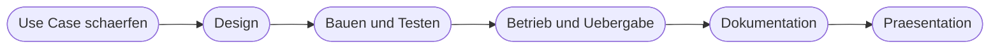

# Kapitel 35 – Den eigenen Use Case auswählen und schärfen

{{ progress(35) }}

<div class="lernziele" markdown>
<h3>Was du in diesem Kapitel lernst</h3>

- Wie dein Projekt in **sechs Etappen** abläuft und was am Ende vorliegen muss
- Nach welchen **Auswahlkriterien** du ein in der verfügbaren Zeit machbares Vorhaben erkennst
- Wie du den **Scope** festlegst – vor allem über eine ausdrückliche **Nicht-Ziele-Liste**
- Wie du den **Ist-Prozess** kurz und ehrlich aufnimmst, ohne in eine Prozessanalyse abzugleiten
- Wie aus einem Zielbild ein **messbares Erfolgskriterium** wird
- Wie du den **Projektsteckbrief** als Startdokument aufsetzt und typische Scope-Fallen vermeidest
</div>

---

## 35.1 Der Rahmen: dein Projekt in sechs Etappen

Ab hier hörst du auf, Beispiele nachzubauen. Du wählst einen **eigenen Workflow mit KI-Unterstützung**, planst ihn, baust ihn, dokumentierst ihn und stellst ihn vor. Die Kapitel 35 bis 40 sind die Etappen dieses einen Projekts.



Diese Kapitel liefern keine neuen Werkzeugfunktionen mehr. Alles Handwerkliche hast du: Prozessaufnahme und Automatisierungspotenzial (Kap. 17), Trigger, Aktionen und Logik (Kap. 18, 19), Power Automate von der ersten Aktion bis zur Fehlerbehandlung (Kap. 21–28), KI-Bausteine im Flow und eigene Agenten (Kap. 29–33), Ideenbewertung und Steckbrief (Kap. 34). Was jetzt dazukommt, ist **Methodik**: Vorlagen, Reihenfolgen und Qualitätskriterien, mit denen aus einer Idee ein Ergebnis wird, das jemand anders weiterbetreiben kann.

!!! info "Merksatz"
    Der häufigste Grund, warum eine Projektarbeit scheitert, ist nicht fehlende Technik. Es ist ein **zu großer oder zu unscharfer Zuschnitt**. Ein kleines, fertiges und dokumentiertes Ergebnis ist deutlich mehr wert als ein großes, halb gebautes.

---

## 35.2 Auswahlkriterien für ein machbares Projekt

Du hast in Kapitel 34 Ideen bewertet und priorisiert. Diese Bewertung fragt nach **Nutzen, Aufwand, Risiko und Akzeptanz**. Für die Projektarbeit kommt eine zweite, härtere Prüfung dazu: Lässt sich das Vorhaben in der Zeit, die du hast, tatsächlich zu Ende bringen? Fünf Kriterien entscheiden darüber.

| Kriterium | Prüffrage | Wenn nicht erfüllt |
|---|---|---|
| **Datenzugriff vorhanden** | Kommst du heute – ohne neue Freigabe – an die Daten und Systeme heran? | Ersatzquelle wählen, z. B. eine eigene SharePoint-Liste oder Excel-Datei mit Testdaten |
| **Prozess verstanden** | Kannst du den Ablauf ohne Rückfrage bei Dritten in acht Schritten aufschreiben? | anderen Prozess wählen oder nur den Teil nehmen, den du selbst ausführst |
| **Ergebnis prüfbar** | Kannst du bei einem Durchlauf selbst beurteilen, ob das Ergebnis richtig ist? | Aufgabe zu unscharf, engeren Ausschnitt suchen |
| **Rechtlich unkritisch** | Keine Bewerberauswahl, keine Bonitätsentscheidung, keine Gesundheitsdaten (Kap. 4, Kap. 14) | Use Case wechseln oder auf einen reinen Entwurfsschritt mit Freigabe reduzieren |
| **Kein Wartezustand durch Dritte** | Kommst du voran, ohne auf eine Genehmigung, eine Lizenz oder eine IT-Einrichtung zu warten? | Vorhaben so umbauen, dass der wartende Teil ein Nicht-Ziel wird |

!!! warning "Typische Falle"
    „Die IT richtet mir bis nächste Woche den Zugang ein" ist der klassische Projektkiller. Solange ein Zugang nicht existiert, ist er **nicht** Teil deines Plans. Baue dein Projekt so, dass es mit den Zugängen läuft, die du **heute** hast – und notiere den fehlenden Zugang als Annahme (Kap. 36).

!!! tip "Der Machbarkeits-Schnelltest"
    Beantworte alle fünf Prüffragen mit Ja, Teilweise oder Nein. Ein einziges Nein bei Datenzugriff, Rechtslage oder Fremdabhängigkeit reicht aus, um die Idee für dieses Projekt zu verwerfen – nicht für immer, aber für jetzt. Zwei „Teilweise" sind ein Hinweis, den Zuschnitt zu verkleinern.

---

## 35.3 Scope festlegen – die Nicht-Ziele-Liste

**Scope** heißt: Was gehört zum Projekt und was ausdrücklich nicht. Der zweite Teil ist der wichtigere. Ohne aufgeschriebene Nicht-Ziele wächst ein Vorhaben während der Umsetzung immer weiter – jeder gute Zusatzwunsch klingt einzeln vernünftig.

| Im Scope (Beispiel Rechnungseingang) | Ausdrücklich nicht im Scope |
|---|---|
| Mails an ein Sammelpostfach als Auslöser | andere Eingangskanäle wie Post oder Portal-Downloads |
| PDF-Anhänge auf SharePoint ablegen | Ablösung der bestehenden Ordnerstruktur |
| KI liest Rechnungsnummer, Betrag, Lieferant aus | Kontierungsvorschlag oder Buchung im Fachsystem |
| Eintrag in einer Prüfliste mit Status | Anbindung an das ERP-System |
| Benachrichtigung an die zuständige Person | automatische Freigabe ohne menschliche Prüfung |

Eine Nicht-Ziel-Zeile hat immer zwei Teile: **was** nicht gemacht wird und **warum**. „Keine ERP-Anbindung, weil kein Zugang und kein Premium-Connector verfügbar ist" ist eine Entscheidung. „Keine ERP-Anbindung" allein ist eine Lücke, die dir später jemand als Versäumnis vorhält.

!!! example "Ein zu großes Vorhaben auf einen sinnvollen ersten Schnitt reduzieren"
    Ausgangsidee: „Wir automatisieren die komplette Urlaubsverwaltung inklusive Vertretungsregelung, Kalendersynchronisation und Resturlaubsberechnung."

    Erster Schnitt in vier Reduktionsschritten:

    1. **Ein Kanal statt aller:** nur Anträge über ein Microsoft Form, nicht per Mail und nicht per Zuruf.
    2. **Ein Fall statt aller:** nur reguläre Urlaubsanträge, keine Sonderurlaube, keine Krankmeldungen.
    3. **Ein Schritt weniger:** Resturlaubsberechnung bleibt in der bestehenden Excel-Datei, der Flow liest sie nur.
    4. **Mensch bleibt im Entscheidungspunkt:** der Flow erzeugt die Genehmigungsanfrage, die Führungskraft entscheidet.

    Übrig bleibt ein Projekt mit Trigger, Datenquelle, KI-Zusammenfassung des Antrags, Genehmigung und Rückmeldung – in der verfügbaren Zeit baubar und prüfbar.

---

## 35.4 Ist-Prozess kurz und ehrlich aufnehmen

Die Prozessaufnahme selbst kennst du aus Kapitel 17. Für die Projektarbeit gilt eine bewusst enge Fassung: **maximal eine Seite**. Du brauchst keine vollständige Prozesslandkarte, sondern die Grundlage, um später den Nutzen belegen zu können.

Halte fünf Dinge fest: den Auslöser, die Schritte in der Reihenfolge, wer sie ausführt, wo ein Medienbruch liegt (Mail zu Excel, Papier zu System), und wie lange ein Durchlauf **realistisch** dauert.

!!! warning "Ehrlich heißt: auch das Unangenehme"
    Notiere die Stellen, an denen der Prozess heute schlecht läuft, so wie sie sind: „In etwa jedem fünften Fall fehlt eine Angabe, dann geht eine Rückfrage-Mail raus und der Fall liegt zwei Tage." Wer den Ist-Zustand schönt, bekommt später ein Zielbild, das den echten Schmerz nicht trifft – und beim Vorstellen des Ergebnisses keine Zahl, mit der man den Nutzen zeigen kann (Kap. 40).

Für die Zeitmessung reicht eine **ehrliche Schätzung mit Herkunft**: „acht Minuten pro Fall, gemessen an fünf Fällen am Dienstag" ist belastbar. „ungefähr eine halbe Stunde, gefühlt" ist es nicht – und du wirst diese Zahl in der Nutzenrechnung brauchen.

---

## 35.5 Zielbild und messbares Erfolgskriterium

Das **Zielbild** beschreibt den Soll-Zustand in drei bis fünf Sätzen aus Sicht der Nutzenden: Was passiert nach dem Auslöser, was übernimmt der Flow, was entscheidet weiterhin ein Mensch, was kommt am Ende heraus.

Das **Erfolgskriterium** ist etwas anderes: ein einzelner, überprüfbarer Satz, an dem du am Ende selbst feststellen kannst, ob das Projekt sein Ziel erreicht hat.

| Vage formuliert | Messbar formuliert |
|---|---|
| „Der Prozess wird schneller." | „Ein Fall benötigt statt 8 Minuten Handarbeit maximal 2 Minuten Prüfzeit." |
| „Die KI klassifiziert zuverlässig." | „Bei 20 Testfällen ist die Kategorie in mindestens 17 Fällen korrekt." |
| „Weniger Fehler." | „Kein Fall bleibt länger als 24 Stunden unbearbeitet liegen, gemessen über 10 Durchläufe." |
| „Die Kollegen sind entlastet." | „Niemand muss Daten aus der Mail von Hand in die Liste übertragen." |

Ein gutes Erfolgskriterium hat drei Bestandteile: eine **Größe** (Zeit, Anzahl, Trefferquote), einen **Zielwert** und eine **Messmethode**, die du selbst durchführen kannst. Ohne Messmethode ist der Zielwert nur eine Behauptung.

!!! info "Ein Kriterium, nicht fünf"
    Nimm genau ein Erfolgskriterium als Hauptmaßstab. Weitere Wirkungen kannst du als Nebeneffekte notieren. Fünf gleichrangige Kriterien führen dazu, dass am Ende drei erfüllt sind und niemand sagen kann, ob das Projekt erfolgreich war.

---

## 35.6 Der Projektsteckbrief als Startdokument

Der Steckbrief aus Kapitel 34 diente dem Vergleich mehrerer Ideen. Jetzt wird er zum **Startdokument deines Projekts**: eine Seite, die du in den folgenden Etappen fortschreibst und die später zum Kern deiner Dokumentation wird (Kap. 39).

```text
PROJEKTSTECKBRIEF

Projektname:        [Kurzname, unter dem alle das Projekt kennen]
Bereich / Prozess:  [Abteilung und betroffener Prozess]
Verantwortlich:     [Name] , Vertretung: [Name]

Problem heute:      [2 bis 3 Saetze, was konkret weh tut]
Ist-Aufwand:        [Zeit pro Fall] x [Faelle pro Woche] , Quelle: [wie gemessen]

Zielbild:           [3 bis 5 Saetze Soll-Zustand aus Nutzersicht]
Erfolgskriterium:   [Groesse] erreicht [Zielwert] , gemessen durch [Messmethode]

Im Scope:
  - [Punkt 1]
  - [Punkt 2]
  - [Punkt 3]
Nicht im Scope:
  - [Nicht-Ziel 1] , weil [Grund]
  - [Nicht-Ziel 2] , weil [Grund]
  - [Nicht-Ziel 3] , weil [Grund]

Datenquellen:       [Liste] , Zugang vorhanden: [ja / nein]
KI-Anteil:          [welche Aufgabe die KI uebernimmt]
Menschlicher Entscheidungspunkt: [wo genau wird freigegeben]
Rechtlicher Hinweis: [personenbezogene Daten ja/nein, Kap. 4 geprueft]

Offene Annahmen:    [Annahme 1] , [Annahme 2]
Groesstes Risiko:   [Risiko] , Gegenmassnahme: [Massnahme]
```

### Typische Scope-Fallen

| Falle | Woran du sie erkennst | Gegenmittel |
|---|---|---|
| **Zu groß** | Der Ist-Prozess hat mehr als zehn Schritte oder mehr als drei Beteiligte | einen Teilprozess herausschneiden, Rest als Nicht-Ziel |
| **Zu vage** | Das Erfolgskriterium enthält kein Substantiv, das man zählen kann | Größe, Zielwert und Messmethode ergänzen |
| **Fremde Freigaben** | Im Plan steht „sobald genehmigt" oder „wenn der Betriebsrat zustimmt" | Vorhaben auf den freigabefreien Teil reduzieren |
| **Kein Datenzugriff** | Der Connector wird dir nicht angezeigt oder du hast keine Leserechte | Ersatzquelle mit Testdaten aufbauen, Anbindung als Ausblick |
| **Kein Prüfmaßstab** | Du kannst nicht sagen, wann ein Durchlauf „richtig" war | einen Ausschnitt wählen, dessen Ergebnis du fachlich beurteilen kannst |

!!! tip "Selbstprüfung vor dem Weiterarbeiten"
    Lies deinen Steckbrief einer Person vor, die den Prozess nicht kennt. Kann sie danach in eigenen Worten sagen, was der Flow tun soll, was er nicht tun soll und woran man Erfolg erkennt, ist der Zuschnitt tragfähig. Stockt sie an einer Stelle, ist genau dort dein Scope noch unscharf.

---

## Zusammenfassung

- Die Kapitel 35 bis 40 sind die **sechs Etappen eines eigenen Projekts** – Methodik und Vorlagen, keine neuen Werkzeugfunktionen.
- Fünf **Auswahlkriterien** entscheiden über Machbarkeit: Datenzugriff, verstandener Prozess, prüfbares Ergebnis, unkritische Rechtslage, keine Fremdabhängigkeit.
- Scope heißt vor allem **Nicht-Ziele aufschreiben** – jeweils mit Begründung, sonst wirkt es später wie eine Lücke.
- Der **Ist-Prozess** wird kurz und ehrlich aufgenommen, mit einer Zeitangabe, deren Herkunft du benennen kannst.
- Ein **Erfolgskriterium** braucht Größe, Zielwert und Messmethode – und es gibt genau eines davon.
- Der **Projektsteckbrief** ist das Startdokument, das du in allen weiteren Etappen fortschreibst.

---

## Kurzübungen

{{ task(file="tasks/k35_01.yaml") }}

{{ task(file="tasks/k35_02.yaml") }}

{{ task(file="tasks/k35_03.yaml") }}

---

## Workshop

{{ task(file="tasks/workshop_k35.yaml") }}
