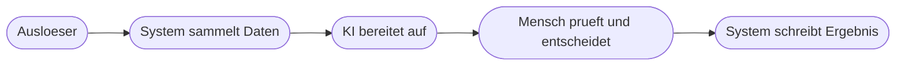

# Kapitel 36 – Planung: Vom Konzept zum Automatisierungsdesign

{{ progress(36) }}

<div class="lernziele" markdown>
<h3>Was du in diesem Kapitel lernst</h3>

- Wie du aus dem Ist-Prozess einen **Soll-Prozess** modellierst, der bewusst anders aussieht
- Wie du daraus ein **Flow-Design** ableitest: Trigger, Schritte, Datenquellen, Entscheidungen, KI-Stellen, Fehlerpfade, Freigaben
- Wie du **Zugänge und Berechtigungen** vorab klärst, statt sie beim Bauen zu entdecken
- Warum du **Testfälle vor dem Bauen** definierst – inklusive Grenz- und Negativfälle
- Wie du **Meilensteine**, Annahmen und Risiken realistisch aufschreibst
- Wie eine **Datenschutz-Vorprüfung** Teil der Planung wird, nicht ein Nachgedanke
</div>

---

## 36.1 Vom Ist zum Soll

Der Ist-Prozess aus Kapitel 35 beschreibt, wie heute gearbeitet wird. Der **Soll-Prozess** beschreibt den Ablauf nach der Automatisierung – und er ist keine Kopie mit weniger Handarbeit. Gute Soll-Prozesse verändern die Reihenfolge, bündeln Prüfungen und verschieben Entscheidungen an eine Stelle, an der die nötigen Informationen schon vorliegen.



Drei Fragen führen vom Ist zum Soll: Welche Schritte fallen **komplett weg**, weil sie nur der Weiterleitung von Informationen dienten? Welche übernimmt der Flow **unverändert**, nur eben automatisch? Und welche bleiben beim Menschen, weil sie Verantwortung tragen oder Ausnahmen betreffen?

!!! info "Merksatz"
    Wer den Ist-Prozess eins zu eins automatisiert, automatisiert auch seine Umwege. Sieh den Soll-Prozess als Neuentwurf mit dem Wissen, dass Datentransport nichts kostet.

---

## 36.2 Vom Soll-Prozess zum Flow-Design

Das **Flow-Design** ist die technische Übersetzung des Soll-Prozesses – auf Papier, vor dem ersten Klick in Power Automate. Sieben Bestandteile gehören hinein.

| Bestandteil | Was du festlegst | Typische Entscheidung |
|---|---|---|
| **Trigger** | was den Flow startet (Kap. 18) | Ereignis, Zeitplan, Formular oder manuell |
| **Schritte** | die Aktionen in Reihenfolge, benannt und lesbar (Kap. 19) | wie fein die Schritte geschnitten sind |
| **Datenquellen** | woher Daten kommen und wohin sie geschrieben werden | SharePoint-Liste, Excel-Tabelle, Postfach |
| **Entscheidungspunkte** | wo verzweigt wird und nach welcher Regel (Kap. 24) | Bedingung, Switch oder Filter |
| **KI-Stellen** | welche Aufgabe die KI übernimmt und in welchem Format sie antwortet (Kap. 29, 30) | klassifizieren, extrahieren, zusammenfassen, formulieren |
| **Fehlerpfade** | was passiert, wenn ein Schritt scheitert (Kap. 28) | Wiederholung, Benachrichtigung, Abbruch mit Hinweis |
| **Menschliche Freigaben** | wo ein Mensch entscheidet und wie lange er Zeit hat (Kap. 27) | Genehmigungsaktion, Adaptive Card, Erinnerung |

Halte das Design in einem einzigen Blatt fest. Diese Vorlage füllst du aus und schreibst sie in der Bauphase fort:

```text
FLOW-DESIGN-BLATT

Flow-Name:        [sprechender Name, z. B. Rechnungseingang Vorsortierung]
Trigger:          [Art] , genau: [Ereignis oder Zeitplan]
Trigger-Bedingung: [Einschraenkung, damit der Flow nicht zu oft laeuft]

Schritte:
  1. [Aktion] -> Ergebnis: [Feld oder Wert]
  2. KI-Stelle: [Aufgabe] , Ausgabeformat: [z. B. drei Zeilen mit fester Bezeichnung]
  3. Entscheidungspunkt: WENN [Bedingung] DANN [Zweig A] SONST [Zweig B]
  4. Freigabe: [wer entscheidet] , Frist: [Zeit] , Erinnerung nach: [Zeit]
  5. [Aktion] -> Ergebnis: [Eintrag oder Ablage]

Datenquellen:
  Lesen:    [Quelle] , Zugang: [vorhanden / fehlt]
  Schreiben:[Ziel] , Rechte: [vorhanden / fehlt]

Fehlerpfade:
  Schritt [Nr] scheitert -> [Reaktion] , Benachrichtigung an: [Person]
  KI-Antwort unbrauchbar -> [Rueckfallverhalten]

Nicht im Design enthalten: [Verweis auf die Nicht-Ziele aus dem Steckbrief]
```

!!! warning "Typische Falle"
    Ein Design ohne Fehlerpfade ist kein Design, sondern ein Wunsch. Erfahrungsgemäß entstehen die meisten Nacharbeiten nicht am Normalfall, sondern an der Frage „was passiert, wenn das Feld leer ist". Notiere für jeden Schritt, der auf ein anderes System zugreift, ein Verhalten für den Fehlerfall.

---

## 36.3 Zugänge, Berechtigungen und Datenschutz-Vorprüfung

Zugänge klärst du **vor** dem Bauen, weil sie der häufigste Grund für Verzögerungen sind. Drei Fragen pro Datenquelle: Kannst du die Quelle heute öffnen? Darfst du dort schreiben? Unter welchem Konto läuft die Verbindung, und existiert dieses Konto in zwei Monaten noch (Kap. 21, Kap. 25)?

!!! info "Falls dir ein Connector fehlt"
    Wird dir eine Verbindung nicht angezeigt oder verlangt sie eine Premium-Lizenz, plane ohne sie. Gleichwertige Ersatzwege: eine SharePoint-Liste oder Excel-Tabelle als Zwischenspeicher, ein manueller Import einmal täglich, oder ein Zapier- bzw. Make-Aufbau im kostenfreien Tarif. Notiere den fehlenden Connector als Annahme – er ist ein Thema für den Ausblick, nicht für dein Projekt.

Die **Datenschutz-Vorprüfung** gehört in die Planung, weil sie das Design verändern kann. Sie ist keine Rechtsprüfung, sondern eine strukturierte Selbstprüfung auf Basis von Kapitel 4.

| Prüffrage | Wenn Ja, dann |
|---|---|
| Verarbeitet der Flow personenbezogene Daten (Namen, Mailadressen, Beurteilungen)? | Datenarten auflisten und im Steckbrief vermerken |
| Gehen Daten an ein Werkzeug außerhalb der freigegebenen M365-Umgebung? | auf freigegebene Dienste umplanen oder Daten vorher reduzieren |
| Werden Daten länger gespeichert als für den Zweck nötig? | Aufbewahrung und Löschung im Design festlegen |
| Betrifft der Prozess Beurteilung oder Auswahl von Menschen? | Vorhaben umbauen, sodass die KI nur Entwürfe liefert und ein Mensch entscheidet |
| Sehen durch die neue Ablage plötzlich mehr Personen die Daten als vorher? | Berechtigungen der Zielablage vor dem Bauen anpassen |

!!! tip "Datensparsamkeit als Designmittel"
    Prüfe für jede KI-Stelle, welche Felder die KI wirklich braucht. Oft genügt der Text ohne Absendernamen, oder eine Kundennummer statt des Klarnamens. Was nicht im Prompt steht, muss nicht geschützt werden – und das Ergebnis wird dadurch selten schlechter.

---

## 36.4 Testfälle vor dem Bauen definieren

Testfälle vor dem Bauen zu schreiben, fühlt sich verkehrt an und ist der wirksamste Einzelschritt dieser Etappe. Wer erst nach dem Bauen testet, testet gegen das, was der Flow tut – nicht gegen das, was er tun sollte.

| Fallart | Was du prüfst | Beispiel |
|---|---|---|
| **Normalfall** | der erwartete Standardablauf | vollständige Rechnung als PDF im Postfach |
| **Grenzfall** | zulässig, aber am Rand | Betrag mit Nachkommastelle, Umlaute im Lieferantennamen, zwei Anhänge |
| **Negativfall** | darf nicht durchlaufen | Mail ohne Anhang, unlesbarer Scan, doppelte Rechnungsnummer |
| **KI-Zweifelsfall** | KI-Ergebnis ist unsicher | Text passt zu zwei Kategorien, Feld nicht erkennbar |

```text
TESTFALL-TABELLE

| Nr | Fallart | Eingabe | Erwartetes Ergebnis | Ergebnis | Datum |
|----|---------|---------|---------------------|----------|-------|
| 1  | Normal  | [Beschreibung der Eingabe] | [was genau passieren soll] | offen | |
| 2  | Grenz   | [Beschreibung] | [erwartetes Verhalten] | offen | |
| 3  | Negativ | [Beschreibung] | [Abbruch mit Hinweis an Person X] | offen | |
| 4  | KI-Zweifel | [Beschreibung] | [Zuweisung zur Pruefung, kein Automatik-Abschluss] | offen | |
```

Plane mindestens sechs Testfälle: zwei Normalfälle, zwei Grenzfälle, ein Negativfall, ein KI-Zweifelsfall. Das erwartete Ergebnis muss so konkret sein, dass zwei Personen unabhängig zum gleichen Urteil kommen – „funktioniert" ist kein erwartetes Ergebnis, „Eintrag in Liste mit Status Prüfung offen und Mail an Sachbearbeitung" schon.

---

## 36.5 Meilensteine, Annahmen und Risiken

Ein Zeitplan für wenige Arbeitstage braucht keine Projektsoftware, aber vier Meilensteine mit einer klaren Abschlussbedingung.

| Meilenstein | Abschlussbedingung | Anteil am Zeitbudget |
|---|---|---|
| **M1 Skelett läuft** | Trigger löst aus, letzter Schritt wird erreicht, ohne fachliche Logik | etwa ein Fünftel |
| **M2 Fachlogik steht** | Entscheidungspunkte und KI-Stelle liefern plausible Ergebnisse | etwa zwei Fünftel |
| **M3 Testfälle bestanden** | alle Testfälle abgehakt, Fehlerpfade geprüft | etwa ein Fünftel |
| **M4 Übergabefähig** | Betriebsblatt und Dokumentation liegen vor (Kap. 38, 39) | etwa ein Fünftel |

Plane die zweite Hälfte deines Zeitbudgets nicht mit Bauen zu, sondern mit Testen, Dokumentieren und Aufräumen. **Annahmen** sind Dinge, die du glaubst, aber nicht geprüft hast – schreibe sie auf, sonst werden sie später zu Überraschungen: „Ich nehme an, dass alle Rechnungen als PDF kommen." **Risiken** sind mögliche Ereignisse mit Gegenmaßnahme: „Der KI-Baustein liest Beträge bei schlechten Scans falsch – Gegenmaßnahme: Betrag bleibt Pflichtfeld in der menschlichen Prüfung."

!!! warning "Häufiges Missverständnis"
    „Risiko: Der Flow könnte Fehler machen" ist kein Risiko, sondern eine Selbstverständlichkeit. Ein brauchbar formuliertes Risiko benennt **ein konkretes Ereignis**, **seine Folge** und **eine Gegenmaßnahme, die du selbst umsetzen kannst**.

---

## 36.6 Ein vollständiges Beispiel-Design

Zur Illustration ein kleines, realistisch zugeschnittenes Projekt: Anfragen aus einem Kontaktformular vorsortieren.

```text
Flow-Name:        Kontaktanfragen Vorsortierung
Trigger:          Neue Antwort in Microsoft Forms
Trigger-Bedingung: keine, das Formular wird nur fuer diesen Zweck genutzt

Schritte:
  1. Antwortdetails abrufen -> Felder: Name, Firma, Anliegen, Wunschtermin
  2. KI-Stelle: Anliegen einer von vier Kategorien zuordnen
     Ausgabeformat: Kategorie, Dringlichkeit hoch oder normal, Zusammenfassung
     in maximal zwei Saetzen
  3. Entscheidungspunkt: WENN Dringlichkeit hoch DANN Teams-Nachricht an
     Bereitschaft SONST nur Listeneintrag
  4. Eintrag in SharePoint-Liste Anfragen mit Status Neu
  5. Freigabe: Teamleitung bestaetigt Kategorie, Frist 1 Arbeitstag,
     Erinnerung nach 4 Stunden
  6. Bestaetigungsmail an den Absender

Datenquellen:
  Lesen: Forms-Antworten , Schreiben: SharePoint-Liste Anfragen

Fehlerpfade:
  Schritt 2 scheitert -> Kategorie auf Unklar, Eintrag trotzdem anlegen,
    Hinweis an Teamleitung
  Schritt 4 scheitert -> Wiederholung, danach Mail an Flow-Verantwortliche

Erfolgskriterium: Bei 20 Testanfragen ist die Kategorie in mindestens
  17 Faellen korrekt und keine Anfrage bleibt ohne Eingangsbestaetigung.
```

!!! example "Was dieses Design gut macht"
    Es hat genau **eine** KI-Stelle mit erzwungenem Ausgabeformat, einen einzigen Entscheidungspunkt, einen menschlichen Freigabeschritt mit Frist, und für jeden kritischen Schritt ein definiertes Verhalten im Fehlerfall. Der Flow bleibt auch dann brauchbar, wenn die KI-Stelle ausfällt: Die Anfrage landet trotzdem in der Liste, nur ohne Kategorie. Genau dieses Muster – **verlässliche Automatisierung außen, KI innen** (Kap. 29) – solltest du in deinem eigenen Design wiederfinden.

---

## Zusammenfassung

- Der **Soll-Prozess** ist ein Neuentwurf, keine Abschrift des Ist-Prozesses mit weniger Handarbeit.
- Ein **Flow-Design** legt sieben Dinge fest: Trigger, Schritte, Datenquellen, Entscheidungspunkte, KI-Stellen, Fehlerpfade, menschliche Freigaben.
- **Zugänge und Berechtigungen** werden vorab geklärt; fehlende Connectoren werden zur Annahme, nicht zum Plan.
- Die **Datenschutz-Vorprüfung** ist Teil der Planung und kann das Design verändern – Datensparsamkeit ist dabei ein Designmittel.
- **Testfälle vor dem Bauen** verhindern, dass du am Ende nur prüfst, was der Flow ohnehin tut.
- Vier **Meilensteine** mit Abschlussbedingung, plus aufgeschriebene Annahmen und Risiken mit Gegenmaßnahme.

---

## Kurzübungen

{{ task(file="tasks/k36_01.yaml") }}

{{ task(file="tasks/k36_02.yaml") }}

{{ task(file="tasks/k36_03.yaml") }}

---

## Workshop

{{ task(file="tasks/workshop_k36.yaml") }}
