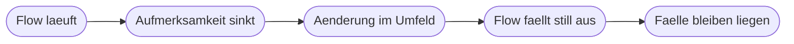

# Kapitel 38 – Betrieb und Übergabe: Governance im Kleinen

{{ progress(38) }}

<div class="lernziele" markdown>
<h3>Was du in diesem Kapitel lernst</h3>

- Warum ein Flow ohne zuständige Person ein **Risiko** ist und kein Nutzen
- Wie du **Verantwortung, Vertretung und Konto** festlegst – und was bei Personalwechsel passiert
- Wie **Monitoring** und automatische **Fehlerbenachrichtigung** aussehen, damit Ausfälle auffallen
- Wie du mit **Änderungen** an angebundenen Systemen umgehst und den **Datenschutz-Check** vor dem Live-Gang führst
- Wie **Rollout, Einweisung** und ein **Rückfallweg** für den Ausfall aussehen
- Wann du die **IT einbinden** musst und wie du **Schatten-IT** vermeidest – inklusive Abschaltplan
</div>

---

## 38.1 Ein Flow ohne Zuständigkeit ist ein Risiko

Ein funktionierender Flow verschwindet aus der Aufmerksamkeit. Genau das ist gewollt – und genau das macht ihn gefährlich. Nach einigen Monaten arbeiten Kollegen darauf, ohne zu wissen, dass er existiert. Bleibt er dann stehen, merkt es zuerst niemand, dann alle gleichzeitig.



Die schlimmste Variante ist der **stille Ausfall**: Der Flow läuft weiter, verarbeitet aber falsch – weil ein Feld umbenannt wurde und nun leer ankommt. Es gibt keine Fehlermeldung, nur zunehmend nutzlose Einträge.

!!! info "Merksatz"
    Ein Flow, für den niemand zuständig ist, ist ein Risiko, kein Nutzen. Übergabe heißt nicht „ich habe es erzählt", sondern: Es gibt eine Person, ein Betriebsblatt und einen Weg, den Ausfall zu bemerken.

---

## 38.2 Verantwortung, Konto und Vertretung

Governance im Kleinen bedeutet: vier Rollen benennen, auch wenn drei davon dieselbe Person sind. Aufgeschrieben ist entscheidend, nicht die Organisationsgröße.

| Rolle | Aufgabe | Wichtig |
|---|---|---|
| **Verantwortliche Person** | fachliche Zuständigkeit, entscheidet über Änderungen | genau eine Person, kein Team |
| **Vertretung** | übernimmt bei Abwesenheit, kennt das Betriebsblatt | muss die Zugänge tatsächlich haben |
| **Technischer Kontakt** | prüft Verbindungen, ändert den Flow | oft dieselbe Person, bei IT-Nähe die IT |
| **Nutzende** | arbeiten mit dem Ergebnis, melden Auffälligkeiten | brauchen einen Meldeweg, der ankommt |

Die unangenehmste Frage ist die nach dem **Konto**. Ein Flow läuft mit den Verbindungen der Person, die ihn erstellt hat. Verlässt diese Person das Unternehmen oder wechselt die Abteilung, wird das Konto deaktiviert – und der Flow bricht ab, oft ohne dass jemand den Zusammenhang erkennt.

| Situation | Folge | Vorsorge |
|---|---|---|
| Flow läuft unter deinem persönlichen Konto | bricht bei Deaktivierung oder Passwortwechsel ab | im Betriebsblatt vermerken, Miteigentümer ergänzen |
| Verbindung zu einem Postfach über dein Konto | Nachfolger sieht die Verbindung nicht | Freigabe über eine Gruppe oder ein Funktionspostfach |
| Flow liegt in deinem persönlichen Bereich | niemand kann ihn nach dem Ausscheiden öffnen | Flow teilen oder in eine geteilte Lösung legen |
| Niemand kennt die verwendeten Prompts | Verhalten lässt sich nicht nachvollziehen | Prompts in die Dokumentation aufnehmen (Kap. 39) |

!!! warning "Typische Falle"
    „Ich bin ja da" ist keine Betriebsregelung, sondern eine Zeitbombe mit unbekannter Laufzeit. Wenn dein Flow für andere arbeitet, muss er auch ohne dich weiterlaufen oder wenigstens ohne dich abschaltbar sein.

---

## 38.3 Monitoring und Fehlerbenachrichtigung

Monitoring in dieser Größenordnung heißt nicht Überwachungssystem, sondern drei Dinge: Der Flow meldet sich, wenn ein Schritt scheitert. Jemand schaut in festen Abständen in den Ausführungsverlauf. Und es gibt einen Wert, an dem man einen stillen Ausfall erkennt.

Die technischen Bausteine kennst du aus Kapitel 28: einen `Bereich` um die kritischen Schritte, dahinter eine Aktion mit der Einstellung `Nach Fehler ausführen`, die eine Nachricht an die verantwortliche Person schickt. Wichtig ist der **Inhalt** der Nachricht.

```text
Betreff: Flow [Flowname] fehlgeschlagen
Inhalt:
  Zeitpunkt:        [Zeit des Fehlers]
  Betroffener Fall: [Kennzeichen, z. B. Rechnungsnummer oder Vorgangs-ID]
  Fehlgeschlagener Schritt: [Name der Aktion]
  Fehlermeldung:    [Meldung]
  Was zu tun ist:   Fall [Kennzeichen] von Hand bearbeiten und im
                    Betriebsblatt eintragen.
  Link zum Ausfuehrungsverlauf: [Verweis]
```

Eine Fehlermail ohne Fallkennzeichen ist fast nutzlos: Man weiß, dass etwas schiefging, aber nicht, welcher Vorgang nachgearbeitet werden muss.

!!! tip "Gegen den stillen Ausfall"
    Vereinbare eine einfache Plausibilitätsprüfung, die dir ein Ausbleiben zeigt: „Wenn zwischen 8 und 18 Uhr kein einziger neuer Eintrag entsteht, stimmt etwas nicht." Ein geplanter Flow, der einmal täglich zählt und bei Null eine Nachricht sendet, kostet zehn Minuten und ist der wirksamste einzelne Betriebsbaustein.

---

## 38.4 Änderungen und der Datenschutz-Check vor dem Live-Gang

Dein Flow hängt an Systemen, die andere ändern: Spaltennamen in einer Liste, ein umgebautes Formular, eine neue Ordnerstruktur, ein Postfach, das zur geteilten Ressource wird. Jede dieser Änderungen kann deinen Flow lautlos beschädigen. Vorsorge ist unspektakulär: Notiere im Betriebsblatt, **an welchen fremden Objekten** dein Flow hängt, und informiere die dafür zuständigen Personen, dass dort eine Automatisierung mitliest. Wer nicht weiß, dass etwas an seiner Liste hängt, nimmt Rücksicht nicht.

Vor dem Live-Gang gehst du eine Checkliste durch. Sie ersetzt keine Rechtsprüfung, verhindert aber die typischen Fehler (Grundlagen in Kap. 4, Vorprüfung in Kap. 36).

```text
DATENSCHUTZ-CHECK VOR DEM LIVE-GANG

[ ] Verarbeitete Datenarten sind aufgelistet, personenbezogene Felder markiert
[ ] Jedes Feld hat einen Zweck, ueberfluessige Felder sind entfernt
[ ] Die KI-Stelle bekommt nur die Felder, die sie fuer ihre Aufgabe braucht
[ ] Es werden keine Daten an Werkzeuge ausserhalb der freigegebenen
    Umgebung gegeben
[ ] Die Zielablage hat die richtigen Berechtigungen, nicht mehr Personen als
    vorher sehen die Daten
[ ] Aufbewahrung und Loeschung sind festgelegt, auch fuer Testdaten und
    Protokolle
[ ] Alle Testdaten sind aus produktiven Ablagen entfernt
[ ] Betroffene wissen, dass der Vorgang automatisiert unterstuetzt wird
[ ] Es findet keine automatische Entscheidung ueber Personen statt
[ ] Bei Unsicherheit: Datenschutzbeauftragte Person gefragt , Datum: [Datum]
```

!!! warning "Häufiges Missverständnis"
    „Das sind ja nur interne Daten" ist die häufigste Fehleinschätzung. Namen von Kolleginnen, Krankmeldungen, Leistungsdaten und Beurteilungen sind personenbezogene Daten – auch wenn sie das Unternehmen nie verlassen. Der Unterschied liegt nicht innen oder außen, sondern in Zweck, Rechtsgrundlage und Zugriff.

---

## 38.5 Rollout, Einweisung und Rückfallweg

Der Live-Gang ist ein eigener Schritt, kein Nebeneffekt des letzten Tests. Vier Handgriffe gehören dazu: Empfänger von deiner Testadresse auf die echten Personen umstellen, Testablagen von produktiven trennen, Testdaten entfernen, und den Flow in den ersten Tagen bewusst beobachten.

Die **Einweisung** der Nutzenden braucht keine Schulungsunterlage, sondern eine halbe Seite mit vier Punkten: Was passiert jetzt automatisch, was musst du weiterhin selbst tun, woran erkennst du ein Problem, und an wen wendest du dich. Formuliere aus Sicht der Nutzenden, nicht aus Sicht des Flows.

Der **Rückfallweg** ist der Teil, den fast alle vergessen. Es muss beschrieben sein, wie der Prozess ohne den Flow weiterläuft – als manueller Notbetrieb.

```text
RUECKFALLWEG BEI AUSFALL

Erkennungsmerkmal:  [woran man merkt, dass der Flow nicht laeuft]
Sofortmassnahme:    [was sofort zu tun ist, z. B. Postfach von Hand pruefen]
Manueller Ablauf:   1. [Schritt]  2. [Schritt]  3. [Schritt]
Nacharbeit danach:  [welche Faelle nachgezogen werden muessen und wie]
Zustaendig:         [Person] , Vertretung: [Person]
Wie lange tragbar:  [Zeitraum, ab wann eskaliert wird und an wen]
```

!!! example "Warum der Rückfallweg praktisch wichtig ist"
    Ein Flow sortiert Anfragen aus einem Formular vor. Nach einem Umbau des Formulars fällt er aus. Ohne Rückfallweg passiert Folgendes: Die Anfragen kommen weiter an, niemand schaut in das Formular selbst, weil das seit Monaten der Flow tat, und nach vier Tagen sind zwanzig Anfragen unbeantwortet. Mit Rückfallweg steht auf einer halben Seite: „Formularantworten in Forms direkt öffnen, Kategorie von Hand in die Liste eintragen, tragbar für maximal fünf Arbeitstage, danach Meldung an die Bereichsleitung." Der Ausfall bleibt lästig, aber er wird kein Schaden.

---

## 38.6 Betriebsblatt, Abschaltplan und die Grenze zur IT

Alles Betriebsrelevante gehört auf ein Blatt, das dort liegt, wo man es sucht – neben dem Flow, in der Dokumentation, im Teamkanal.

```text
BETRIEBSBLATT

Flow-Name:            [Name]           Stand: [Datum]
Zweck in einem Satz:  [Zweck]
Verantwortlich:       [Name]   Vertretung: [Name]
Technischer Kontakt:  [Name]
Laeuft unter Konto:   [Konto oder Verbindung]  Miteigentuemer: [Name]
Ausfuehrung:          [Trigger und typische Haeufigkeit]

Abhaengigkeiten:      [Liste fremder Objekte: Listen, Postfaecher, Formulare]
                      Zustaendige Personen dort informiert: [ja / nein]
Fehlerbenachrichtigung: geht an [Person] , Pruefrhythmus Verlauf: [z. B. montags]
Bekannte Grenzen:     [was der Flow nicht kann, Verweis auf Nicht-Ziele]
Rueckfallweg:         [Verweis auf das Rueckfallblatt]
Aenderungshistorie:   [Datum] [Aenderung] [von wem]
Abschaltung:          Wer darf abschalten: [Name] , wie: [Weg]
                      Was danach zu tun ist: [Aufraeumschritte]
```

Ein **Abschaltplan** klingt pessimistisch und ist Zeichen von Reife. Er beantwortet: Wer darf abschalten, wie schaltet man ab (Flow deaktivieren, nicht löschen), was passiert mit laufenden Fällen, welche Ablagen und Verbindungen werden aufgeräumt, und wer wird informiert. Ein deaktivierter, dokumentierter Flow ist harmlos. Ein halb gelöschter mit verwaisten Verbindungen und Testlisten ist genau die **Schatten-IT**, die niemand haben will: technische Lösungen, die produktiv genutzt werden, aber weder dokumentiert noch der IT bekannt sind.

| Situation | Selbst betreiben genügt | IT einbinden |
|---|---|---|
| Nur eigene Daten, nur du als Nutzer | ja | nein |
| Mehrere Abteilungen arbeiten damit | nein | ja, Zuständigkeit und Umgebung klären |
| Externe Schnittstelle, HTTP-Aufruf, API-Schlüssel | nein | ja, Sicherheit und Geheimnisverwaltung |
| Personenbezogene Daten in größerem Umfang | nein | ja, gemeinsam mit dem Datenschutz |
| Prozess ist geschäftskritisch oder fristgebunden | nein | ja, Betrieb und Vertretung müssen belastbar sein |
| Premium-Connector oder Lizenz nötig | nein | ja, Lizenzentscheidung liegt nicht bei dir |

!!! tip "Selbstprüfung vor der Übergabe"
    Stelle dir vor, du bist ab morgen vier Wochen nicht erreichbar. Kann jemand mit deinem Betriebsblatt erkennen, was der Flow tut, dass er ausgefallen ist, was dann zu tun ist und wie man ihn abschaltet? Wenn du bei einer dieser vier Fragen zögerst, fehlt genau dort eine Zeile.

---

## Zusammenfassung

- Ein Flow ohne zuständige Person ist ein **Risiko**; der gefährlichste Fall ist der **stille Ausfall** mit falschen Ergebnissen.
- Benenne **Verantwortliche, Vertretung, technischen Kontakt** und kläre, **unter welchem Konto** der Flow läuft – Personalwechsel ist der häufigste Abbruchgrund.
- **Fehlerbenachrichtigungen** müssen Fallkennzeichen, Schritt und Handlungsanweisung enthalten; eine Zählprüfung deckt stille Ausfälle auf.
- Notiere **Abhängigkeiten** von fremden Objekten und informiere die dort zuständigen Personen; vor dem Live-Gang läuft der **Datenschutz-Check**.
- **Rollout** heißt Empfänger umstellen, Testdaten entfernen, einweisen – und einen **Rückfallweg** für den manuellen Notbetrieb bereitstellen.
- **Betriebsblatt und Abschaltplan** verhindern Schatten-IT; bei mehreren Abteilungen, Schnittstellen oder kritischen Prozessen gehört die **IT** eingebunden.

---

## Kurzübungen

{{ task(file="tasks/k38_01.yaml") }}

{{ task(file="tasks/k38_02.yaml") }}

{{ task(file="tasks/k38_03.yaml") }}

---

## Workshop

{{ task(file="tasks/workshop_k38.yaml") }}
