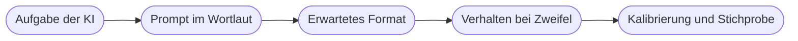

# Kapitel 39 – Dokumentation der Projektarbeit

{{ progress(39) }}

<div class="lernziele" markdown>
<h3>Was du in diesem Kapitel lernst</h3>

- Für **wen** du dokumentierst – Nachfolgende, IT und Fachbereich lesen unterschiedlich
- Welche **neun Abschnitte** eine vollständige Projektdokumentation enthält
- Wie du **KI-Bausteine mit den verwendeten Prompts** nachvollziehbar festhältst
- Wie du den **Testnachweis** und die **Bewertung gegen das Erfolgskriterium** aufschreibst
- Welchen **Umfang** eine gute Doku hat und wie du Diagramme und Bilder sinnvoll einsetzt
- Wie du **KI beim Dokumentieren** nutzt – und warum eine erfundene Beschreibung schlimmer ist als keine
</div>

---

## 39.1 Für wen du dokumentierst

Eine Doku, die für niemanden Bestimmten geschrieben ist, wird von niemandem gelesen. Drei Gruppen greifen darauf zu, mit völlig unterschiedlichen Fragen.

| Zielgruppe | Kernfrage | Was sie braucht |
|---|---|---|
| **Nachfolgende** | Wie funktioniert das und wie ändere ich es, ohne es zu zerstören? | Schrittfolge, Prompts, Feldnamen, bekannte Grenzen |
| **IT** | Was hängt wo dran und wer haftet für den Betrieb? | Datenquellen, Konten und Verbindungen, Schnittstellen, Berechtigungen |
| **Fachbereich** | Was passiert jetzt automatisch, was muss ich noch selbst tun? | Zweck, Nutzen, Ablauf in Alltagssprache, Meldeweg bei Problemen |

Löse das nicht mit drei Dokumenten, sondern mit einer klaren Gliederung: Die vorderen Abschnitte sind für den Fachbereich lesbar, die mittleren technisch, die hinteren betrieblich. Jeder findet seinen Teil, ohne den Rest lesen zu müssen.

!!! info "Merksatz"
    Die Doku ist für die Person geschrieben, die dein Projekt in einem Jahr übernimmt und dich nicht fragen kann. Diese Person kennt den Prozess vielleicht, aber nicht deine Entscheidungen – und schon gar nicht die Gründe dafür.

---

## 39.2 Die Gliederung als Vorlage

Neun Abschnitte, in dieser Reihenfolge. Du hast die meisten Inhalte schon: Steckbrief (Kap. 35), Design und Testfälle (Kap. 36), Protokoll und Kalibrierung (Kap. 37), Betriebsblatt (Kap. 38). Dokumentieren heißt hier zusammenführen und einordnen, nicht neu erfinden.

```text
DOKUMENTATION [Projektname]                       Stand: [Datum]
Verfasst von: [Name]

1. ZIEL UND NUTZEN
   Problem heute, Zielbild, Erfolgskriterium, betroffene Personen

2. IST- UND SOLL-PROZESS
   Ist-Ablauf mit Aufwand, Soll-Ablauf, was wegfaellt und was
   beim Menschen bleibt

3. ARCHITEKTUR UND FLOW-BESCHREIBUNG
   Trigger und Trigger-Bedingung, Schritte in Reihenfolge mit Zweck,
   Entscheidungspunkte und Regeln, Freigabeschritte mit Fristen

4. EINGESETZTE KI-BAUSTEINE
   Aufgabe der KI, verwendeter Baustein, vollstaendiger Prompt im
   Wortlaut, erwartetes Ausgabeformat, Verhalten bei unklarer Antwort

5. DATENQUELLEN UND BERECHTIGUNGEN
   Gelesene und geschriebene Quellen mit Feldnamen, verwendete
   Verbindungen und Konten, Datenschutz-Einordnung

6. TESTNACHWEIS
   Testfall-Tabelle mit Ergebnis und Datum, Stichprobe des
   KI-Anteils mit Trefferquote und Fehlerrichtung

7. BETRIEBSHINWEISE UND FEHLERBEHANDLUNG
   Verantwortliche und Vertretung, Monitoring, Fehlerbenachrichtigung,
   Rueckfallweg, Abschaltplan

8. GRENZEN UND OFFENE PUNKTE
   Nicht-Ziele mit Begruendung, bekannte Schwaechen, geparkte Punkte

9. BEWERTUNG DES ERGEBNISSES
   Erfolgskriterium erreicht ja oder nein mit Messwerten,
   Nutzenrechnung, was du beim naechsten Mal anders machen wuerdest
```

Abschnitt 8 ist der, der am häufigsten fehlt und am meisten wert ist. Eine offen benannte Grenze schützt Nachfolgende vor falschen Erwartungen – eine verschwiegene Grenze wird zum Fehler, den sie dir zuschreiben.

---

## 39.3 KI-Bausteine nachvollziehbar festhalten

Bei klassischen Flow-Schritten kann man im Werkzeug nachsehen, was konfiguriert ist. Beim KI-Anteil geht das nur eingeschränkt: Der Prompt ist zwar hinterlegt, aber **warum** er so formuliert ist, steht nirgends. Genau das ist der Teil, der ohne Doku verloren geht.

Dokumentiere jede KI-Stelle mit fünf Angaben: Aufgabe, verwendeter Baustein, Prompt im vollständigen Wortlaut, erwartetes Ausgabeformat, Verhalten bei unklarer oder fehlender Antwort. Ergänze zwei Sätze zur Kalibrierung: Was war die erste Fassung, was hast du geändert und warum.



!!! warning "Typische Falle"
    „Die KI kategorisiert die Anfrage" ist keine Dokumentation eines KI-Bausteins. Wer den Prompt nicht im Wortlaut findet, kann das Verhalten weder nachvollziehen noch verbessern – und ändert bei der ersten Beschwerde blind daran herum. Kopiere den Prompt vollständig hinein, auch wenn er lang ist.

---

## 39.4 Umfang, Sprache und Diagramme

Für ein Projekt dieser Größe sind **sechs bis zwölf Seiten** ein guter Umfang, Anhänge nicht mitgerechnet. Weniger ist meist unvollständig, deutlich mehr wird nicht gelesen. Entscheidend ist nicht die Seitenzahl, sondern ob jeder Abschnitt seine Kernfrage beantwortet.

| Schwach formuliert | Nachvollziehbar formuliert |
|---|---|
| „Der Flow verarbeitet die eingehenden Daten." | „Bei jeder neuen Formularantwort liest der Flow die Felder Name, Firma und Anliegen aus." |
| „Bei Fehlern wird informiert." | „Scheitert Schritt 4, sendet der Flow eine Mail an A. Beispiel mit Formular-ID und Fehlermeldung." |
| „Die Erkennung funktioniert gut." | „Bei 20 Testfällen war die Kategorie 18-mal korrekt; die zwei Fehler betrafen Mischanfragen." |
| „Sensible Daten werden beachtet." | „Der Prompt erhält nur den Text des Anliegens, nicht Name und Mailadresse." |
| „Perspektivisch ist eine ERP-Anbindung denkbar." | „Nicht umgesetzt: ERP-Anbindung, weil kein Zugang und kein Premium-Connector vorliegt." |

Bei **Diagrammen** gilt: eines pro Aussage. Ein Ablaufdiagramm des Soll-Prozesses und eine Übersicht der Datenflüsse reichen fast immer. Diagramme, die den Flow eins zu eins nachzeichnen, veralten mit jeder Änderung und stiften dann Verwirrung.

**Bildschirmfotos** sind nur an drei Stellen sinnvoll: bei einer Konfiguration, die man sonst nicht findet, bei einem Ergebnis, das man sehen muss, um es zu verstehen, und bei einem Fehlerbild, das wiederkehrt. Achte darauf, dass keine personenbezogenen Daten sichtbar sind – nutze Aufnahmen aus deiner Testumgebung.

!!! tip "Der Feldnamen-Test"
    Suche in deiner Doku nach den konkreten Namen: Liste, Spalte, Ordner, Formularfeld, Aktion. Kommen sie nicht vor, ist der Text zu allgemein, um damit zu arbeiten. Umgekehrt gilt: Wenn ein Absatz nur aus Feldnamen besteht, fehlt der Zweck.

---

## 39.5 Bewertung gegen das Erfolgskriterium

Der letzte Abschnitt ist eine **Selbstprüfung** und der ehrlichste Teil der Arbeit. Du hast in Kapitel 35 ein messbares Erfolgskriterium formuliert. Jetzt trägst du den gemessenen Wert daneben.

| Bestandteil | Was hineingehört |
|---|---|
| **Kriterium** | der Satz aus dem Steckbrief, unverändert zitiert |
| **Messung** | wie und wann gemessen wurde, mit Anzahl der Fälle |
| **Ergebnis** | der Wert, auch wenn er das Ziel verfehlt |
| **Einordnung** | erreicht, teilweise erreicht oder nicht erreicht – mit Begründung |
| **Nutzenrechnung** | Zeit vorher gegen Zeit nachher, Rechenweg offen gelegt |
| **Rückblick** | was du beim nächsten Mal anders machen würdest |

!!! example "Eine belastbare Bewertung"
    „Kriterium: Bei 15 Testrechnungen werden Nummer, Betrag und Lieferant in mindestens 13 Fällen korrekt ausgelesen, Prüfzeit unter 2 Minuten je Rechnung.

    Messung am 12. März mit 15 vorbereiteten Testrechnungen, Prüfzeit bei 5 Fällen mit der Stoppuhr.

    Ergebnis: 12 von 15 vollständig korrekt, in 2 weiteren Fällen war nur der Lieferantenname unvollständig, 1 Fall wurde nicht erkannt. Prüfzeit im Mittel 1 Minute 40 Sekunden.

    Einordnung: teilweise erreicht. Die Trefferquote liegt knapp unter dem Ziel, die Zeitvorgabe ist erfüllt. Alle drei Abweichungen betrafen Rechnungen mit Firmennamen in zwei Zeilen. Diese Grenze ist in Abschnitt 8 aufgenommen; der Betrag war in allen 15 Fällen korrekt, deshalb bleibt der Nutzen erhalten.

    Nutzen: vorher etwa 8 Minuten je Rechnung (gemessen an 5 Fällen), jetzt unter 2 Minuten Prüfzeit; bei etwa 40 Rechnungen pro Woche entspricht das gut 4 Stunden weniger Handarbeit."

    Diese Bewertung ist stärker als ein „Ziel erreicht", weil sie prüfbar ist und die Abweichung erklärt.

---

## 39.6 KI beim Dokumentieren nutzen

Dokumentieren ist eine Textaufgabe, also genau das, wofür KI-Werkzeuge taugen (Kap. 12). Sinnvoll ist die Reihenfolge **du lieferst die Substanz, die KI formt sie**, nie umgekehrt.

| Gut geeignet | Ungeeignet |
|---|---|
| aus deinen Stichworten einen lesbaren Abschnitt formulieren | die Flow-Beschreibung „aus dem Kontext" erzeugen lassen |
| einen technischen Absatz für den Fachbereich verständlich umschreiben | Testergebnisse oder Zahlen ergänzen lassen |
| die Gliederung auf Lücken prüfen: welche Kernfrage bleibt offen? | die Bewertung gegen das Erfolgskriterium formulieren lassen |
| Fragen sammeln, die Nachfolgende stellen würden | Prompts „rekonstruieren" lassen, die du nicht gesichert hast |

```text
Ich schreibe die Dokumentation fuer einen kleinen Automatisierungs-Workflow.
Hier sind meine Stichpunkte zu Abschnitt [Nummer und Titel].
Formuliere daraus einen zusammenhaengenden Text fuer die Zielgruppe
[Nachfolgende / IT / Fachbereich].
Regeln: Ergaenze keine Inhalte, die nicht in meinen Stichpunkten stehen.
Markiere jede Stelle, an der dir eine Angabe fehlt, mit LUECKE und einer
kurzen Frage. Verwende keine Werbesprache.
Stichpunkte:
[deine Stichpunkte]
```

Die Anweisung „ergänze keine Inhalte" ist der wichtigste Teil. Ohne sie füllt das Werkzeug Lücken mit plausiblen Erfindungen – Feldnamen, die es nicht gibt, Prüfschritte, die niemand gebaut hat, Zahlen, die nie gemessen wurden.

!!! warning "Eine erfundene Beschreibung ist schlimmer als keine"
    Eine fehlende Angabe merkt der nächste Leser sofort und fragt nach. Eine falsche Angabe glaubt er – und baut darauf auf. Deshalb gilt für jeden KI-erzeugten Satz deiner Doku eine **Prüfpflicht**: Jede Aussage über Feldnamen, Schrittfolgen, Prompts, Zahlen und Zuständigkeiten musst du gegen das tatsächliche Werkzeug und deine Protokolle abgleichen, bevor sie stehen bleibt. Lieber ein Satz „Zu diesem Punkt liegt keine Messung vor" als eine erfundene Trefferquote.

---

## Zusammenfassung

- Dokumentiert wird für **drei Zielgruppen** – Nachfolgende, IT, Fachbereich – in einer Gliederung, in der jede ihren Teil findet.
- Die **neun Abschnitte** reichen von Ziel und Nutzen über Flow-Beschreibung, KI-Bausteine und Testnachweis bis zur Bewertung.
- **KI-Stellen** brauchen den Prompt im vollständigen Wortlaut, das erwartete Format und das Verhalten im Zweifelsfall.
- **Sechs bis zwölf Seiten**, konkrete Feld- und Aktionsnamen, sparsam eingesetzte Diagramme und Bildschirmfotos ohne echte Daten.
- Die **Bewertung** zitiert das Erfolgskriterium, nennt Messweg und Ergebnis – auch bei Zielverfehlung – und legt die Nutzenrechnung offen.
- **KI hilft beim Formulieren, nicht beim Erfinden**: Anweisung „ergänze nichts", Lücken markieren, jede Angabe gegenprüfen.

---

## Kurzübungen

{{ task(file="tasks/k39_01.yaml") }}

{{ task(file="tasks/k39_02.yaml") }}

{{ task(file="tasks/k39_03.yaml") }}

---

## Workshop

{{ task(file="tasks/workshop_k39.yaml") }}
