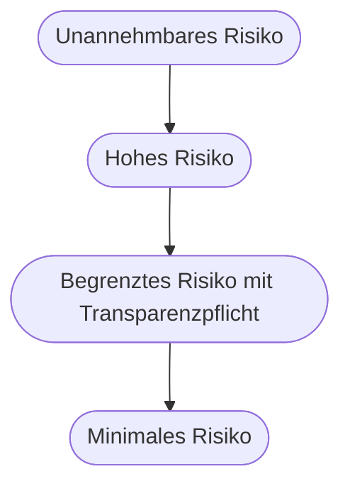

# Kapitel 4 – Rechtliche Grundlagen und Datenschutz

{{ progress(4) }}

<div class="lernziele" markdown>
<h3>Was du in diesem Kapitel lernst</h3>

- Wie der **EU AI Act** KI-Systeme in **Risikoklassen** einteilt und welche Praktiken verboten sind
- Welche Pflichten bei **Hochrisiko**-Anwendungen gelten, besonders bei der Auswahl von Beschäftigten
- Die **DSGVO**-Grundbegriffe für den KI-Alltag: personenbezogene Daten, Rechtsgrundlage, Zweckbindung, Datenminimierung, Auskunft und Löschung
- Warum **Auftragsverarbeitung** und **automatisierte Einzelentscheidung** genau die Punkte sind, an denen KI-Projekte stolpern
- Was **Urheberrecht**, **Geschäftsgeheimnisse** und die **Mitbestimmung** des Betriebsrats für dich bedeuten
- Konkrete **Leitplanken**, was in einen Prompt darf und was nicht
</div>

---

## 4.1 Vier Rechtsfelder treffen auf ein Eingabefeld

Wenn du einen Text in ein KI-Werkzeug kopierst, berührst du in diesem einen Moment vier voneinander unabhängige Rechtsbereiche. Das ist der Grund, warum die Frage „darf ich das?" sich nicht mit einem Satz beantworten lässt.

| Rechtsfeld | Kernfrage | Wen es schützt |
|---|---|---|
| EU AI Act | Welche Art von KI-System setze ich für welchen Zweck ein? | betroffene Personen und Grundrechte |
| DSGVO | Verarbeite ich Daten, die zu einer Person gehören? | die betroffene Person |
| Urheberrecht | Nutze ich fremde geschützte Inhalte oder gebe ich sie weiter? | Urheber und Rechteinhaber |
| Geschäftsgeheimnisschutz | Gebe ich Wissen des Unternehmens nach außen? | das eigene Unternehmen |

Dazu kommt in Deutschland die **Mitbestimmung**: Wo Beschäftigte betroffen sind, hat der Betriebsrat eigene Rechte, unabhängig davon, ob Datenschutz und AI Act eingehalten sind.

!!! info "Merksatz"
    Der AI Act fragt nach dem **Zweck** des Systems. Die DSGVO fragt nach den **Daten**. Das Urheberrecht fragt nach der **Herkunft** der Inhalte. Der Geheimnisschutz fragt nach der **Richtung** des Datenflusses. Vier verschiedene Fragen – und vier verschiedene Antworten, die alle „Nein" lauten können.

---

## 4.2 Der EU AI Act: Risikoklassen und Zeitplan

Der **EU AI Act** ist die europäische Verordnung über Künstliche Intelligenz. Sie regelt nicht die Technik, sondern den **Einsatzzweck**: Dasselbe Sprachmodell kann harmlos oder hochriskant sein, je nachdem, wofür du es verwendest. Die Verordnung ist am 1. August 2024 in Kraft getreten und gilt gestaffelt.



**Unannehmbares Risiko – verboten.** Dazu gehören unter anderem: soziale Bewertung von Menschen durch Behörden oder Unternehmen (**Social Scoring**), das Ausnutzen von Schwächen bestimmter Gruppen durch manipulative Techniken, das ungezielte Auslesen von Gesichtsbildern aus dem Internet zum Aufbau von Erkennungsdatenbanken, das Ableiten sensibler Merkmale aus biometrischen Daten sowie **Emotionserkennung am Arbeitsplatz und in Bildungseinrichtungen**. Der letzte Punkt ist der praxisrelevanteste: Ein Werkzeug, das die Stimmung von Beschäftigten aus Stimme, Gesicht oder Text bewertet, ist nicht diskutabel, sondern unzulässig.

**Hohes Risiko – erlaubt, aber mit umfangreichen Pflichten.** Hier landen Anwendungen, die über Lebenschancen entscheiden. Für Büro und Verwaltung besonders wichtig ist der Bereich **Beschäftigung**: Systeme zur Einstellung oder Auswahl von Personen, zum Filtern und Bewerten von Bewerbungen, zu Entscheidungen über Beförderung oder Kündigung, zur Zuweisung von Aufgaben sowie zur Überwachung und Bewertung von Arbeitsleistung. Weitere Hochrisiko-Felder sind Bildung und Prüfungen, Kreditwürdigkeit, Zugang zu wesentlichen öffentlichen Leistungen, kritische Infrastruktur, Strafverfolgung und Migration.

**Begrenztes Risiko – Transparenzpflicht.** Wer mit einem KI-System interagiert, muss das erkennen können. Ein Chatbot muss sich als solcher ausweisen. Künstlich erzeugte oder manipulierte Bild-, Ton- und Videoinhalte müssen als solche gekennzeichnet werden. Auch bei veröffentlichten, KI-erzeugten Texten zu Themen von öffentlichem Interesse gilt eine Offenlegungspflicht, sofern kein Mensch die inhaltliche Verantwortung übernommen hat.

**Minimales Risiko.** Der große Rest – Zusammenfassungen, Textentwürfe, Formelvorschläge, Kategorisierung interner Mails. Hier gelten keine besonderen Pflichten aus dem AI Act. Die DSGVO gilt trotzdem.

| Zeitpunkt | Was greift |
|---|---|
| 1. August 2024 | Verordnung in Kraft |
| 2. Februar 2025 | Verbotene Praktiken; Pflicht, für ausreichende **KI-Kompetenz** der Beschäftigten zu sorgen |
| 2. August 2025 | Pflichten für Anbieter von Modellen mit allgemeinem Verwendungszweck, Aufsichtsstrukturen, Sanktionen |
| 2. August 2026 | allgemeine Anwendbarkeit, unter anderem Transparenzpflichten und Hochrisiko-Systeme aus dem Anwendungsanhang |
| 2. August 2027 | Hochrisiko-KI, die in regulierte Produkte eingebaut ist |

Wichtig für die Einordnung deiner eigenen Rolle: Der AI Act unterscheidet zwischen dem **Anbieter**, der ein System entwickelt und auf den Markt bringt, und dem **Betreiber**, der es einsetzt. Als Fachanwenderin oder Fachanwender bist du in der Regel auf der Betreiberseite – deine Pflichten sind deutlich geringer, aber nicht null. Dazu gehören: Einsatz gemäß Anleitung, Sicherstellung menschlicher Aufsicht, Information der betroffenen Beschäftigten und ausreichende KI-Kompetenz. Baust du dagegen einen eigenen Agenten und stellst ihn anderen bereit (Kapitel 32), kann sich diese Rolle verschieben.

---

## 4.3 DSGVO: die Fragen vor dem ersten Prompt

Die **DSGVO** ist die Datenschutz-Grundverordnung. Sie greift, sobald **personenbezogene Daten** verarbeitet werden – also alle Informationen, die sich auf eine identifizierbare natürliche Person beziehen. Der Begriff ist weiter gefasst, als die meisten annehmen: Nicht nur Name und Adresse, sondern auch Kundennummer, Personalnummer, IP-Adresse, Bewerbungsunterlagen, Gesprächsprotokolle, Krankmeldungen oder ein Freitextfeld, aus dem eine Person erkennbar wird.

Sechs Prüffragen deckt das Wesentliche ab:

```text
1 Rechtsgrundlage:   Warum darf ich diese Daten ueberhaupt verarbeiten?
                     Vertrag, gesetzliche Pflicht, berechtigtes Interesse
                     oder Einwilligung.
2 Zweckbindung:      Wurden die Daten fuer diesen Zweck erhoben?
                     Bewerbungsdaten fuer die Auswahl, nicht zum Training.
3 Datenminimierung:  Brauche ich wirklich alle Felder oder genuegt ein Auszug?
4 Speicherbegrenzung: Wie lange bleiben die Daten beim Anbieter?
5 Betroffenenrechte: Kann ich Auskunft geben, berichtigen und loeschen?
6 Auftragsverarbeitung: Gibt es einen Vertrag mit dem Anbieter des Werkzeugs?
```

Besonders schützt die DSGVO **besondere Kategorien** personenbezogener Daten: Gesundheit, Religion, Gewerkschaftszugehörigkeit, politische Meinung, sexuelle Orientierung, ethnische Herkunft, biometrische Daten. Diese Angaben gehören nur in ein KI-Werkzeug, wenn eine ausdrückliche Grundlage dafür geprüft und dokumentiert wurde – im Alltag heißt das praktisch: nicht.

Der Punkt, der in der Praxis am häufigsten übersehen wird, ist die **Auftragsverarbeitung**. Nutzt du ein externes Werkzeug für personenbezogene Daten, verarbeitet der Anbieter diese Daten in deinem Auftrag. Dafür braucht es einen **Auftragsverarbeitungsvertrag**, und es muss geklärt sein, ob Daten in Länder außerhalb der EU übertragen werden und ob sie zur Verbesserung der Modelle verwendet werden. Bei einem privat genutzten Konto in einem öffentlichen Werkzeug existiert dieser Vertrag nicht – und genau daran scheitert der Einsatz, nicht an der Technik.

!!! warning "Typische Falle"
    „Ich habe nur die Namen weggelassen" ist selten ausreichend. Sobald Standort, Abteilung, Eintrittsdatum, Kundennummer oder eine ungewöhnliche Fallkonstellation im Text bleiben, ist die Person wieder identifizierbar – aus einem Satz wie „die einzige Teilzeitkraft im Einkauf in der Filiale Nord" wird sie sofort erkennbar. Echte **Anonymisierung** bedeutet, dass ein Rückschluss auch mit Zusatzwissen nicht mehr möglich ist. Alles darunter ist **Pseudonymisierung** und bleibt personenbezogen.

---

## 4.4 Automatisierte Einzelentscheidung und der Hochrisiko-Fall Personal

Artikel 22 DSGVO regelt einen Fall, der für Automatisierung zentral ist: Eine Person hat grundsätzlich das Recht, **nicht** einer ausschließlich automatisierten Entscheidung unterworfen zu werden, die für sie rechtliche Wirkung hat oder sie in ähnlicher Weise erheblich beeinträchtigt. Ausnahmen gibt es nur in engen Grenzen, etwa bei ausdrücklicher Einwilligung oder gesetzlicher Erlaubnis – und dann mit zusätzlichen Schutzmaßnahmen wie dem Recht auf menschliches Eingreifen.

Entscheidend ist das Wort **ausschließlich**. Ein Mensch, der den Vorschlag der KI ungeprüft durchklickt, verwandelt eine automatisierte Entscheidung nicht in eine menschliche. Damit die Beteiligung zählt, muss sie inhaltlich echt sein: Zugriff auf die Grundlagen, Kompetenz zur Beurteilung, tatsächliche Befugnis zum Abweichen.

!!! example "Bewerbungssichtung – drei Varianten"
    Eine Personalabteilung erhält 120 Bewerbungen auf eine Stelle.

    - **Unzulässig riskant:** Ein System bildet eine Rangfolge, die unteren 80 werden automatisch abgelehnt. Das ist eine automatisierte Einzelentscheidung mit erheblicher Wirkung – und zugleich eine Hochrisiko-Anwendung nach dem AI Act.
    - **Kritisch, aber gestaltbar:** Das System extrahiert nur objektive Angaben aus den Unterlagen – vorhandener Abschluss, Berufsjahre, Sprachkenntnisse – und stellt sie tabellarisch dar. Die Auswahl trifft ein Mensch anhand vorher festgelegter Kriterien. Transparenz gegenüber Bewerbenden, Protokollierung und Mitbestimmung sind trotzdem zu klären.
    - **Unproblematisch:** KI hilft beim Formulieren der Stellenanzeige und beim Prüfen auf diskriminierende Sprache. Hier wird über niemanden entschieden.

    Den Bereich HR mit allen Details bearbeitest du in Kapitel 14.

Dasselbe Muster gilt über HR hinaus: Automatische Ablehnung einer Kulanzanfrage, automatische Sperrung eines Kundenkontos, automatische Zuweisung einer Leistungsbewertung – überall dort ist die Frage nach Artikel 22 zu stellen, bevor der Ablauf gebaut wird.

---

## 4.5 Urheberrecht, Geschäftsgeheimnisse und Mitbestimmung

**Urheberrecht** wirkt in zwei Richtungen. Bei der **Eingabe** gilt: Fremde geschützte Texte, Bilder, Fotos oder Vertragswerke in ein öffentliches Werkzeug zu kopieren, kann Nutzungsrechte verletzen oder gegen Lizenzbedingungen verstoßen. Bei der **Ausgabe** gilt: Rein maschinell erzeugte Inhalte sind in Deutschland regelmäßig **nicht** urheberrechtlich geschützt, weil eine persönliche geistige Schöpfung fehlt. Für dich hat das zwei Folgen. Erstens: Ein KI-erzeugtes Logo oder ein KI-Text kann dir nicht als eigenes Werk gehören, andere dürfen es verwenden. Zweitens: Die Ausgabe kann fremde geschützte Elemente enthalten – deshalb sind KI-Bilder mit erkennbaren Marken, Charakteren oder Stilkopien in kommerzieller Verwendung heikel.

**Geschäftsgeheimnisse** verdienen besondere Aufmerksamkeit, weil hier ein Detail viele überrascht: Der gesetzliche Schutz eines Geschäftsgeheimnisses setzt voraus, dass das Unternehmen **angemessene Geheimhaltungsmaßnahmen** getroffen hat. Wer Kalkulationen, Preisstrategien, Quellcode, Vertragsentwürfe oder Kundenlisten in ein öffentliches Werkzeug eingibt, kann diese Voraussetzung untergraben – das Geheimnis verliert unter Umständen seinen Schutz, ganz unabhängig davon, ob es tatsächlich abfließt. Zusätzlich verletzt eine solche Eingabe häufig Vertraulichkeitsvereinbarungen mit Kunden oder Lieferanten.

**Mitbestimmung.** In Deutschland ist der Betriebsrat kein Formalismus, sondern oft der entscheidende Weg zur Umsetzung. Relevant sind vor allem drei Punkte:

| Regelung | Worum es geht | Praktische Folge |
|---|---|---|
| § 87 Abs. 1 Nr. 6 BetrVG | technische Einrichtungen, die geeignet sind, Verhalten oder Leistung zu überwachen | mitbestimmungspflichtig, unabhängig von der Absicht; ein Protokoll mit Bearbeitungszeiten pro Person genügt |
| § 90 BetrVG | Unterrichtung und Beratung bei Planung von Arbeitsverfahren und technischen Anlagen | der Betriebsrat ist **vor** der Einführung einzubeziehen, nicht danach |
| § 95 Abs. 2a und § 80 Abs. 3 BetrVG | Auswahlrichtlinien gelten auch bei KI-Einsatz; für die Beurteilung von KI kann der Betriebsrat einen Sachverständigen hinzuziehen | Auswahl- und Beurteilungsverfahren mit KI sind mitbestimmt |

!!! tip "Der Betriebsrat als Verbündeter"
    Frühe Einbindung wirkt in beide Richtungen. Sie verhindert, dass ein fertig gebauter Ablauf kurz vor dem Start gestoppt wird, und sie liefert dir die Argumente, die deine Kolleginnen und Kollegen tatsächlich interessieren: Wird Leistung gemessen? Wer sieht die Protokolle? Was passiert mit den Daten? Häufig entsteht daraus eine **Betriebsvereinbarung**, die den Einsatz für alle Beteiligten planbar macht.

---

## 4.6 Leitplanken: was darf in einen Prompt und was nicht

Diese Liste ist der praktische Kern des Kapitels. Sie ersetzt keine Richtlinie deines Arbeitgebers – existiert dort eine, hat sie Vorrang.

**Darf in der Regel hinein:**

- allgemeine Fach- und Sachfragen ohne Bezug zu konkreten Personen oder Vorgängen
- eigene Textentwürfe ohne personenbezogene und vertrauliche Inhalte
- veröffentlichte Unternehmensinhalte, etwa Website- oder Broschürentexte
- Beispieldaten, die du selbst erfunden hast
- geschwärzte oder wirklich anonymisierte Fallbeschreibungen
- Struktur- und Formatvorgaben, Formelfragen, Erklärbitten zu Fehlermeldungen

**Darf nicht hinein, solange es keine geprüfte Freigabe und keinen Auftragsverarbeitungsvertrag gibt:**

- Namen, Kontaktdaten, Personal- oder Kundennummern realer Personen
- Bewerbungsunterlagen, Zeugnisse, Beurteilungen, Abmahnungen, Krankmeldungen
- Gesundheitsdaten und alle weiteren besonderen Kategorien
- Gehalts-, Kalkulations-, Margen- und Preisstrategiedaten
- Vertragsentwürfe, Angebote und Unterlagen Dritter mit Vertraulichkeitsvereinbarung
- Zugangsdaten, Schlüssel, interne Systemadressen
- vollständige Kundenlisten oder Datenbankauszüge
- Protokolle, aus denen sich Leistung einzelner Personen ableiten lässt

Bei Zweifeln hilft ein einfacher Ablauf: **ersetzen, kürzen, fragen.** Ersetze Namen und Kennungen durch Rollen wie „Kunde A" oder „Mitarbeiterin B". Kürze auf die Angaben, die für die Antwort tatsächlich nötig sind. Und wenn danach noch Unbehagen bleibt, frage die Datenschutzbeauftragte, bevor du sendest – nicht danach.

Eine Einschränkung ist dabei entscheidend: Dieselbe Eingabe kann je Werkzeug unterschiedlich zu bewerten sein. Ein von der IT bereitgestellter, vertraglich abgesicherter Dienst in der Unternehmensumgebung ist etwas anderes als ein privates Konto in einem öffentlichen Chat. Verlasse dich dabei nicht auf die Werbeaussagen der Oberfläche, sondern auf die Auskunft deiner IT, welcher Dienst für welche Datenarten freigegeben ist. Was Copilot in Microsoft 365 dabei von öffentlichen Werkzeugen unterscheidet, vertiefst du in Kapitel 7 und Kapitel 11.

---

## Zusammenfassung

- Vier Rechtsfelder wirken gleichzeitig: **AI Act** fragt nach dem Zweck, **DSGVO** nach den Daten, **Urheberrecht** nach der Herkunft, **Geheimnisschutz** nach der Richtung.
- Der **EU AI Act** ordnet nach Risiko: verbotene Praktiken, **Hochrisiko** (unter anderem Beschäftigtenauswahl und Leistungsbewertung), Transparenzpflichten, minimales Risiko – gestaffelt anwendbar ab 2024, 2025, 2026 und 2027.
- Die **DSGVO** verlangt Rechtsgrundlage, Zweckbindung, Datenminimierung, Löschbarkeit, Auskunftsfähigkeit und einen **Auftragsverarbeitungsvertrag** mit dem Anbieter.
- **Artikel 22 DSGVO**: keine ausschließlich automatisierte Entscheidung mit erheblicher Wirkung – und eine ungeprüfte Freigabe zählt nicht als menschliche Beteiligung.
- KI-Ausgaben sind meist **nicht** urheberrechtlich geschützt; Eingaben in öffentliche Werkzeuge können den Schutz von **Geschäftsgeheimnissen** gefährden; der **Betriebsrat** ist vor der Einführung einzubeziehen.
- Die Leitplanken lauten **ersetzen, kürzen, fragen** – und im Zweifel entscheiden Datenschutz- und Rechtsabteilung, nicht das Bauchgefühl.

---

## Kurzübungen

{{ task(file="tasks/k04_01.yaml") }}

{{ task(file="tasks/k04_02.yaml") }}

{{ task(file="tasks/k04_03.yaml") }}

---

## Workshop

{{ task(file="tasks/workshop_k04.yaml") }}
