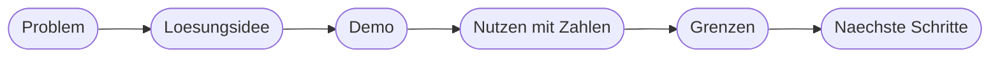

# Kapitel 40 – Präsentation und Ausblick

{{ progress(40) }}

<div class="lernziele" markdown>
<h3>Was du in diesem Kapitel lernst</h3>

- Wie eine **Zehn-Minuten-Präsentation** aufgebaut ist: Problem, Lösung, Demo, Nutzen, Grenzen, nächste Schritte
- Wie du eine **Live-Demo absicherst** und eine Rückfallebene vorbereitest
- Wie du **Nutzen belegst statt behauptest**
- Wie du mit **kritischen Fragen** umgehst – mit einer Haltung, die trägt
- Wie du deine **Prompt- und Flow-Bibliothek** pflegst und deine Kompetenz weiterentwickelst
- Welche **Entwicklungen** du im Blick behalten solltest und wie deine **ersten 90 Tage** aussehen
</div>

---

## 40.1 Die Storyline einer Zehn-Minuten-Präsentation

Zehn Minuten sind kurz, und sie werden noch kürzer, wenn die Demo hängt. Deshalb bekommt jeder Teil ein festes Zeitfenster und eine einzige Aufgabe.

| Teil | Zeit | Aufgabe | Häufigster Fehler |
|---|---|---|---|
| **Problem und Ausgangslage** | 1–2 min | den Schmerz greifbar machen | zu lange Vorrede zum Unternehmen |
| **Lösungsidee** | 1–2 min | in drei Sätzen erklären, was gebaut wurde | technische Details statt Wirkung |
| **Demo** | 3–4 min | einen Durchlauf zeigen | zu viele Klicks, zu viele Sonderfälle |
| **Nutzen mit Zahlen** | 1–2 min | Wirkung belegen | behaupten statt rechnen |
| **Grenzen und Risiken** | 1 min | Vertrauen schaffen | weglassen aus Sorge um den Eindruck |
| **Nächste Schritte** | 1 min | zeigen, dass es weitergeht | vage Absichtserklärungen |



```text
STORYLINE

Einstiegssatz:   [ein Satz, der das Problem konkret macht, ohne Fachjargon]
Ausgangslage:    [Zahl oder Beispiel: Faelle pro Woche, Zeit pro Fall]
Loesung in 3 Saetzen:
  1. Ausgeloest wird der Ablauf durch [Trigger].
  2. Automatisch passiert [Kernschritte inkl. KI-Anteil].
  3. Entschieden wird weiterhin von [Person] an der Stelle [Entscheidung].
Demo-Ablauf:     1. [Ausgangszustand zeigen]  2. [Auslesen]  3. [Ergebnis zeigen]
Nutzenaussage:   Vorher [Wert] , nachher [Wert] , gemessen an [Anzahl] Faellen
Grenzen:         [Grenze 1] , [Grenze 2] , bewusst nicht automatisiert: [Punkt]
Naechste Schritte: [Schritt] bis [Zeitpunkt] , verantwortlich [Person]
Schlusssatz:     [ein Satz, der Nutzen und Verantwortung verbindet]
```

Der **Einstiegssatz** entscheidet über die Aufmerksamkeit. „Jede Reklamation lag bei uns im Durchschnitt zwei Tage, bevor überhaupt jemand sie gelesen hatte" wirkt sofort. „Ich möchte Ihnen heute mein Automatisierungsprojekt vorstellen" verschenkt die erste Minute.

!!! info "Merksatz"
    Die Demo ist nicht der Höhepunkt, sondern der Beweis. Der Höhepunkt ist der belegte Nutzen. Eine schöne Demo ohne Zahl bleibt eine Vorführung; eine Zahl ohne Demo bleibt eine Behauptung. Du brauchst beides, in dieser Reihenfolge.

---

## 40.2 Die Live-Demo absichern

Live-Demos scheitern selten am Flow. Sie scheitern an Anmeldefenstern, langen Ladezeiten, einem Trigger, der ein paar Minuten braucht, und daran, dass genau jetzt eine echte Mail dazwischenkommt.

| Regel | Warum |
|---|---|
| **Vorher testen, am selben Gerät und Netz** | die meisten Überraschungen sind Umgebungsprobleme |
| **Testdaten vorbereiten und benennen** | du musst nicht tippen, sondern nur auslösen |
| **Kurze Wege** | Tabs vorher öffnen, Zielansicht bereitlegen, nichts suchen |
| **Aufzeichnung als Rückfallebene** | ein zweiminütiges Video des Durchlaufs rettet die Demo |
| **Keine Echtdaten** | keine Kundennamen, keine Kollegennamen, keine echten Beträge |
| **Wartezeit einplanen** | ein Trigger, der langsam auslöst, wird zur Stille im Raum |

Der beste Schutz gegen Wartezeit ist eine Demo in zwei Teilen: Du löst den Durchlauf am Anfang der Präsentation aus und zeigst währenddessen Lösungsidee und Nutzen. Wenn du zur Demo kommst, ist das Ergebnis schon da – und du zeigst zusätzlich einen vorbereiteten, bereits abgeschlossenen Fall.

!!! warning "Typische Falle"
    Der Wunsch, „auch noch den Sonderfall" zu zeigen. Jeder zusätzliche gezeigte Fall verdoppelt das Risiko und halbiert die verbleibende Zeit für den Nutzenteil. Zeige **einen** Durchlauf vollständig und erwähne die Sonderfälle mündlich.

!!! tip "Der Probelauf mit Stoppuhr"
    Halte die Präsentation einmal komplett, mit Stoppuhr und laut gesprochen. Fast alle Präsentationen sind beim ersten Probelauf zu lang, und fast immer ist der Grund derselbe: zu viel Vorrede vor dem Problem. Kürze vorne, nicht hinten – Grenzen und nächste Schritte sind der Teil, der Souveränität zeigt.

---

## 40.3 Nutzen belegen statt behaupten

Eine Nutzenaussage ist belastbar, wenn drei Dinge sichtbar sind: der Ausgangswert, der neue Wert und wie beides gemessen wurde. Rechne offen und in kleinen Zahlen – hochgerechnete Jahreseffekte wirken beeindruckend und sind der schnellste Weg in eine Diskussion über deine Annahmen statt über dein Ergebnis.

| Behauptet | Belegt |
|---|---|
| „Spart massiv Zeit." | „8 Minuten je Fall vorher, unter 2 Minuten Prüfzeit jetzt, gemessen an 5 Fällen." |
| „Weniger Fehler." | „In 15 Testfällen wurde kein Betrag falsch übernommen; vorher gab es monatlich zwei Korrekturbuchungen." |
| „Die KI erkennt alles zuverlässig." | „18 von 20 Kategorien korrekt; die 2 Fehler betrafen Mischanfragen und gehen zur Prüfung." |
| „Alle sind begeistert." | „Zwei von drei Personen im Team nutzen die Liste seit dem Start; eine wartet auf den zweiten Eingangskanal." |
| „Amortisiert sich in wenigen Wochen." | „Bau- und Testaufwand etwa 12 Stunden; bei 40 Fällen pro Woche und 6 Minuten Einsparung ist das nach etwa 3 Wochen ausgeglichen." |

!!! example "Nutzen ohne Zeiteinsparung"
    Nicht jedes Projekt spart Zeit – und das ist kein Mangel. Belege dann die Wirkung, die tatsächlich eintritt: „Kein Fall bleibt mehr unbemerkt liegen, weil jeder Eingang sofort einen Eintrag mit Status erzeugt; vorher wurden Fälle über das Postfach verfolgt und in zwei Fällen im letzten Quartal übersehen." Qualität, Nachvollziehbarkeit und Entlastung von unangenehmer Routine sind genauso gültige Nutzenarten wie gesparte Minuten (Kap. 3).

---

## 40.4 Mit kritischen Fragen umgehen

Kritische Fragen sind ein gutes Zeichen: Sie bedeuten, dass jemand über den Einsatz nachdenkt. Die tragende Haltung ist einfach – du hast Entscheidungen getroffen, du kannst sie begründen, und du kennst die Grenzen deiner Lösung besser als alle im Raum.

| Typische Frage | Gute Antworthaltung |
|---|---|
| „Was ist, wenn die KI sich irrt?" | „Deshalb entscheidet an dieser Stelle ein Mensch. Unklare Fälle gehen mit Status Prüfung erforderlich in die Liste, sie verschwinden nicht." |
| „Ist das datenschutzkonform?" | „Der Prompt bekommt nur den Anliegentext ohne Namen. Der Datenschutz-Check ist dokumentiert; bei einer Ausweitung würde ich die zuständige Stelle einbeziehen." |
| „Wer macht das, wenn du weg bist?" | „Verantwortlich ist X, Vertretung Y mit eigenem Zugriff. Betriebsblatt und Rückfallweg liegen vor." |
| „Warum habt ihr nicht gleich alles automatisiert?" | „Das haben wir bewusst nicht automatisiert, weil die Freigabe eine Verantwortungsentscheidung ist und ein Fehler dort teurer wäre als die eingesparte Minute." |
| „Das rechnet sich doch nicht." | „Bei 40 Fällen pro Woche und 6 Minuten Einsparung ist der Aufwand nach etwa 3 Wochen ausgeglichen. Hier ist die Rechnung." |
| „Kann das nicht viel mehr?" | „Ja, technisch. Ich habe absichtlich klein angefangen, damit das Ergebnis prüfbar bleibt. Die nächsten Schritte stehen fest." |

Drei Sätze, die immer funktionieren: „Das haben wir bewusst nicht automatisiert, weil …", „Das weiß ich nicht, ich prüfe es und melde mich" und „Diese Grenze ist bekannt und dokumentiert". Was **nicht** funktioniert: eine Grenze wegdiskutieren, eine Zahl im Moment erfinden oder eine Frage als Angriff behandeln.

!!! warning "Häufiges Missverständnis"
    Grenzen zu nennen wirkt nicht schwach, sondern kompetent. Wer ausschließlich Erfolge zeigt, weckt Misstrauen – jeder im Raum weiß, dass jede Automatisierung Grenzen hat. Nenne sie selbst, dann bestimmst du, in welchem Licht sie stehen.

---

## 40.5 Nach dem Kurs: Bibliothek, Kompetenz, Entwicklungen

Das Wissen aus diesem Kurs verfällt nicht, aber es verstaubt, wenn du es nicht anwendest. Drei Dinge halten es lebendig.

**Deine Prompt- und Flow-Bibliothek.** Du hast in Kapitel 9 und 10 begonnen, Prompts zu sammeln. Führe sie weiter als eigene Sammlung – eine Liste, ein OneNote, eine SharePoint-Liste – mit jeweils vier Angaben: Zweck, Prompt im Wortlaut, wo eingesetzt, was du geändert hast und warum. Dieselbe Logik für Flows: Zweck, Trigger, Besonderheiten, Fallen. Nach einem halben Jahr ist das dein wertvollster Besitz aus diesem Kurs, weil es deine Erfahrung enthält und nicht das Wissen aus einem Handbuch.

**Deine Kompetenz.** Der wirksamste Weg ist nicht der nächste Kurs, sondern der nächste kleine Use Case – am besten einer, der einer anderen Person hilft. Erklären festigt mehr als Lesen: Wer im Team zeigt, wie ein Flow aufgebaut ist, merkt sofort, welche Stellen er selbst noch nicht durchdrungen hat.

**Die Entwicklungen.** Der Bereich verändert sich schnell. Drei Richtungen sind absehbar:

| Entwicklung | Was das bedeutet | Was daraus für dich folgt |
|---|---|---|
| **Agenten-Ökosysteme** | Agenten rufen andere Agenten und Werkzeuge auf, statt einzelne Aufgaben zu lösen | die Frage „wer handelt hier eigentlich" wird wichtiger (Kap. 33) |
| **Tiefere Integration** | KI-Funktionen sitzen direkt in den Fachanwendungen, nicht in einem Chatfenster | weniger Bastelei, mehr Bedarf an Regeln und Freigaben |
| **Mehr Autonomie** | Systeme handeln über mehrere Schritte selbstständig | Kontrollpunkte, Protokollierung und Abschaltbarkeit werden zur Pflicht, nicht zur Kür |

!!! info "Die Konstante hinter allen Entwicklungen"
    Je mehr ein System selbst tut, desto wichtiger wird die Frage, wo ein Mensch prüft und wer verantwortet. Die Werkzeuge in diesem Kurs werden sich ändern, vermutlich schnell. Die Fragen bleiben: Was passiert im Fehlerfall? Wer ist zuständig? Wie merken wir, dass es schiefgeht? Wie schalten wir es ab?

---

## 40.6 Die ersten 90 Tage – und der Bogen zurück

Ein Plan mit drei Etappen genügt und hat mehr Wirkung als ein Vorsatz.

| Zeitraum | Ziel | Konkret |
|---|---|---|
| **Tage 1–30** | Bestehendes sichern | Projektdoku ablegen, wo andere sie finden; Betriebsblatt aktuell halten; Prompt-Bibliothek anlegen |
| **Tage 31–60** | Zweiten Use Case umsetzen | einen kleinen Kandidaten aus deiner Liste (Kap. 34) mit Steckbrief, Design und Testfällen durchziehen |
| **Tage 61–90** | Wissen weitergeben | einer Kollegin einen Flow erklären und mit ihr gemeinsam einen kleinen bauen; Erfahrungen in die Bibliothek zurückschreiben |

Setze dir dafür drei feste Termine in den Kalender – ohne Termin passiert es nicht. Und behalte die Reihenfolge: sichern, dann erweitern, dann teilen. Wer sofort das nächste große Vorhaben startet, verliert das erste.

Damit schließt sich der Bogen zu den ersten beiden Kapiteln. In Kapitel 1 stand die Unterscheidung zwischen einem System, das festen Regeln folgt, und einem, das aus Daten Wahrscheinlichkeiten ableitet. In Kapitel 2 kam die Einordnung dazu, welche Technologie zu welcher Aufgabe passt. Dein Projekt ist die Anwendung genau dieser beiden Einsichten: **verlässliche Automatisierung außen, KI innen, Mensch an den Entscheidungspunkten.** Der Flow transportiert Daten und hält Regeln ein, weil man sich darauf verlassen kann. Der KI-Baustein übernimmt das, was sich nicht in Regeln fassen lässt – und liefert deshalb Vorschläge, keine Wahrheiten. Und an den Stellen, an denen Verantwortung entsteht, steht ein Mensch.

!!! tip "Der letzte Merksatz"
    Du brauchst keine großen Systeme, um wirksam zu sein. Ein sauber zugeschnittener, getesteter, dokumentierter und betreuter Ablauf verändert einen Arbeitsalltag mehr als eine Strategie, die niemand umsetzt. Und die Fähigkeit, die dich dabei am weitesten trägt, ist nicht das Beherrschen eines Werkzeugs, sondern die Gewohnheit zu fragen: Was passiert, wenn es schiefgeht – und wer merkt es?

---

## Zusammenfassung

- Die **Zehn-Minuten-Storyline**: Problem, Lösungsidee, Demo, Nutzen mit Zahlen, Grenzen, nächste Schritte – jeder Teil mit festem Zeitfenster.
- Die **Live-Demo** wird vorher am selben Gerät getestet, läuft mit vorbereiteten Testdaten und hat eine Aufzeichnung als Rückfallebene.
- **Nutzen belegen** heißt: Ausgangswert, neuer Wert, Messweg – kleine geprüfte Zahlen statt hochgerechneter Jahreseffekte.
- Bei **kritischen Fragen** trägt die Haltung „das haben wir bewusst nicht automatisiert, weil …"; Grenzen selbst zu nennen wirkt kompetent.
- Nach dem Kurs: **Prompt- und Flow-Bibliothek** pflegen, den nächsten kleinen Use Case umsetzen, Wissen weitergeben.
- Mehr Autonomie bedeutet mehr **Kontrollbedarf** – die Konstante bleibt: verlässliche Automatisierung außen, KI innen, Mensch an den Entscheidungspunkten.

---

## Kurzübungen

{{ task(file="tasks/k40_01.yaml") }}

{{ task(file="tasks/k40_02.yaml") }}

{{ task(file="tasks/k40_03.yaml") }}

---

## Workshop

{{ task(file="tasks/workshop_k40.yaml") }}
