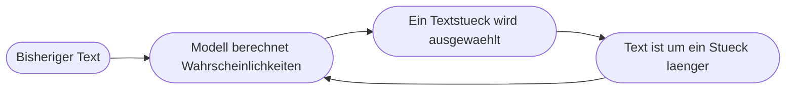

# Kapitel 5 – Wie Sprachmodelle arbeiten

{{ progress(5) }}

<h3>Was du in diesem Kapitel lernst</h3>

- Was ein **großes Sprachmodell** tatsächlich berechnet – und warum das kein Nachschlagen in einer Datenbank ist
- Was **Token** sind und warum daraus Schwächen beim Zählen, Buchstabieren und exakten Rechnen folgen
- Wie das **Kontextfenster** funktioniert und warum lange Chats an Qualität verlieren
- Warum der **Trainingsstichtag** dafür sorgt, dass das Modell dein Unternehmen und die letzte Woche nicht kennt
- Was **Temperatur** bedeutet und warum dieselbe Frage unterschiedliche Antworten liefert
- Warum **Halluzinationen** systembedingt sind und mit welchen Gegenmitteln du sie klein hältst

---

## 5.1 Was ein Sprachmodell wirklich tut

Hinter Copilot, ChatGPT und Claude steckt ein **großes Sprachmodell** (Large Language Model, kurz LLM) – ein statistisches Modell, das auf riesigen Textmengen trainiert wurde. Seine einzige Grundoperation ist verblüffend schlicht:

> Gegeben der Text, der bisher da steht: Welches nächste Textstück ist am wahrscheinlichsten?

Das Modell berechnet dafür eine Wahrscheinlichkeit für sehr viele mögliche Fortsetzungen, wählt eine davon aus, hängt sie an – und beginnt von vorn. Ein längerer Antworttext entsteht also Stück für Stück, nicht als fertiger Gedanke.

Es gibt in diesem Ablauf **keine Datenbank**, in der Antworten stehen, und **keine Prüfinstanz**, die vor der Ausgabe kontrolliert, ob das Gesagte stimmt. Das Modell hat kein Modell von „wahr" und „falsch", sondern von „passt sprachlich gut zusammen".

!!! info "Merksatz"
    Ein Sprachmodell ist kein Wissensspeicher, sondern ein **Fortsetzungsrechner**. Dass dabei sehr oft Richtiges herauskommt, liegt daran, dass in den Trainingstexten Richtiges häufiger vorkam als Falsches – nicht daran, dass das Modell nachgeschlagen hätte.

Damit ist auch klar, warum die Einordnung aus Kapitel 1 gilt: Diese Systeme sind **schwache KI**. Sie sind sprachlich stark und inhaltlich ungesichert. Alles Weitere in diesem Kapitel folgt aus dieser einen Bauweise.

---

## 5.2 Token: die Bausteine, mit denen gerechnet wird

Das Modell arbeitet nicht mit Wörtern und schon gar nicht mit Buchstaben, sondern mit **Token** – kleinen Textbausteinen. Ein Token kann ein ganzes kurzes Wort sein, häufiger aber ein Wortteil, eine Endung, ein Satzzeichen oder ein Leerzeichen mit dem folgenden Wortanfang. Als grobe Faustregel entsprechen im Deutschen einige wenige Zeichen einem Token; lange zusammengesetzte Wörter werden in mehrere Stücke zerlegt.

| Eingabe | Zerlegung (schematisch) | Was daraus folgt |
|---|---|---|
| `Rechnung` | `Rech` + `nung` | Das Modell „sieht" die Buchstabenfolge nicht als Kette einzelner Buchstaben |
| `Rechnungseingangsprüfung` | 5–7 Stücke | Seltene lange Wörter werden stark zerlegt und schlechter getroffen |
| `4837` | z. B. `48` + `37` | Zahlen zerfallen in Bruchstücke, Stellenwerte gehen verloren |
| `RG-2024-00871` | mehrere Stücke | Belegnummern und Kürzel werden leicht verfälscht |

Daraus folgen drei ganz praktische Schwächen:

- **Zählen und Buchstabieren.** Fragen wie „Wie viele r stecken in *Terminvereinbarung*?" oder „Schreibe das Wort rückwärts" treffen das Modell an seiner schwächsten Stelle, weil es die Einzelbuchstaben gar nicht als Einheiten verarbeitet.
- **Exaktes Rechnen.** Bei `4837 mal 926` erzeugt das Modell die **plausibelste Zifferfolge**, es rechnet nicht. Die Größenordnung stimmt meist, die letzten Stellen oft nicht.
- **Genaue Zeichenketten.** Kundennummern, IBANs, Artikelnummern oder Aktenzeichen werden beim Abschreiben gern still verändert.

!!! warning "Typische Falle"
    Ein falsches Rechenergebnis sieht genauso souverän aus wie ein richtiges. Lass Zahlen deshalb nie vom Sprachmodell selbst ausrechnen, wenn es auf Genauigkeit ankommt. Nutze Excel, den Taschenrechner – oder ein Werkzeug, das das Modell an einen echten Rechner anbindet. Genau das unterscheidet einen reinen Chat von einem **Agenten mit Werkzeugen** (Kap. 6). Wie du mit Zahlen in Excel sinnvoll arbeitest, vertiefst du in Kapitel 13.

Token sind außerdem die **Abrechnungs- und Größeneinheit**: Anbieter messen Verbrauch, Grenzen und Kosten in Token. Das wird relevant, sobald du KI-Bausteine in automatisierte Abläufe einbaust (Kap. 29, Kap. 30).

---

## 5.3 Das Kontextfenster: das Arbeitsgedächtnis

Das **Kontextfenster** ist die Menge an Text, die das Modell bei einer einzelnen Antwort gleichzeitig überblicken kann. Es ist begrenzt – und es enthält deutlich mehr als nur deine letzte Frage.

| Was im Kontextfenster liegt | Beispiel |
|---|---|
| Systemvorgaben des Anbieters | Verhaltensregeln des Produkts, für dich unsichtbar |
| Deine eigenen Dauer-Anweisungen | Custom Instructions, Agenten-Instruktion (Kap. 10) |
| Der bisherige Gesprächsverlauf | alle Fragen und Antworten dieses Chats |
| Beigefügte Inhalte | hochgeladene Datei, markierte Textstelle, gefundene Dokumente |
| Deine aktuelle Frage | der eigentliche Prompt |
| Die entstehende Antwort | wächst während der Ausgabe mit hinein |

Ist das Fenster voll, muss etwas weichen. Die Werkzeuge kürzen oder verdichten dann ältere Teile des Gesprächs. Das erklärt Beobachtungen, die fast alle Nutzenden kennen:

- Nach vielen Nachrichten „vergisst" das Werkzeug eine Vorgabe vom Anfang.
- Ein sehr langer Chat wird zäh, wiederholt sich oder driftet vom Thema ab.
- Ein frischer Chat mit einem gut formulierten Prompt liefert plötzlich wieder saubere Ergebnisse.

!!! tip "Praxisregeln zum Kontextfenster"
    - **Ein Thema, ein Chat.** Für eine neue Aufgabe lieber neu anfangen, statt anzuhängen.
    - **Wichtiges wiederholen.** Zentrale Vorgaben am Ende eines langen Chats noch einmal kurz nennen.
    - **Gezielt füttern.** Nicht das 80-seitige Handbuch anhängen, sondern die drei relevanten Seiten.
    - **Zwischenstände sichern.** Ein gutes Ergebnis kopierst du heraus, statt darauf zu vertrauen, dass es im Chat erhalten bleibt.

Wichtig: Das Kontextfenster ist **kein Gedächtnis über Chats hinweg**. Was ein Werkzeug sich dauerhaft merkt, ist eine zusätzliche Funktion – dazu mehr in Kapitel 6.

---

## 5.4 Trainingsstichtag: das Modell lebt in der Vergangenheit

Ein Modell wird zu einem bestimmten Zeitpunkt trainiert. Alles, was danach passiert ist, steckt nicht in ihm. Diesen Zeitpunkt nennt man **Trainingsstichtag** (englisch *knowledge cutoff*).

Zwei Lücken folgen daraus, und sie sind unterschiedlich:

- Die **Zeitlücke**: aktuelle Ereignisse, neue Gesetzesfassungen, geänderte Preise, neue Produktversionen.
- Die **Interne Lücke**: dein Unternehmen. Deine Prozesse, Kundennamen, Reisekostenrichtlinie oder Artikelstammdaten waren nie Trainingsmaterial – egal wie aktuell das Modell ist.

Beide Lücken schließt du auf verschiedenen Wegen. Gegen die Zeitlücke hilft eine **Websuche**, die viele Werkzeuge automatisch anstoßen; dann hängt die Qualität aber an den gefundenen Quellen, und du musst sie prüfen. Gegen die interne Lücke hilft nur, dem Modell die Information **mitzugeben** – als Anhang, als eingefügter Text oder über eine angebundene Wissensquelle (Kap. 6, Kap. 11).

!!! warning "Häufiges Missverständnis"
    Die Frage „Bis wann reichen deine Daten?" ist keine verlässliche Auskunft. Das Modell erzeugt auch hier nur eine plausible Antwort und liegt beim eigenen Stichtag regelmäßig daneben. Verlass dich stattdessen auf die Angabe des Anbieters – und prüfe bei allem Zeitkritischen die Quelle selbst.

---

## 5.5 Temperatur: warum dieselbe Frage verschiedene Antworten liefert

Wenn das Modell das nächste Textstück auswählt, nimmt es nicht immer das wahrscheinlichste, sondern würfelt unter den wahrscheinlichen Kandidaten. Wie stark gewürfelt wird, steuert ein Parameter, der meist **Temperatur** heißt.

| Einstellung | Verhalten | Passt zu |
|---|---|---|
| Niedrig | nah am Wahrscheinlichsten, wiederholbar, nüchtern | Klassifizieren, Extrahieren, feste Formate, Abläufe |
| Mittel | ausgewogen, natürliche Sprache | Zusammenfassungen, Antwortentwürfe, Standardtexte |
| Hoch | variantenreich, überraschend, manchmal abwegig | Ideensammlung, Formulierungsalternativen, Brainstorming |

In den Chat-Oberflächen von Copilot, ChatGPT und Claude kannst du diesen Wert normalerweise nicht direkt einstellen. Sichtbar und einstellbar wird er dort, wo du KI in eigene Bausteine einbaust – etwa in Copilot Studio (Kap. 32) oder bei KI-Aktionen in Power Automate (Kap. 30). Manche Oberflächen bieten stattdessen Voreinstellungen wie „präzise" oder „kreativ", die im Kern dasselbe tun.

Was das für dich bedeutet: Zweimal dieselbe Frage kann zwei unterschiedliche Antworten liefern, ohne dass etwas kaputt ist. Für kreative Aufgaben ist das ein Vorteil – du kannst dieselbe Anfrage bewusst mehrfach stellen und die beste Variante wählen. Für Abläufe ist es ein Risiko: Verlass dich nie darauf, dass die Ausgabe morgen wortgleich aussieht. Erzwinge stattdessen ein festes Ausgabeformat (Kap. 10) und prüfe es maschinell weiter (Kap. 29).

---

## 5.6 Halluzinationen: kein Defekt, sondern die Bauart

Als **Halluzination** bezeichnet man eine erfundene, aber überzeugend formulierte Aussage. Sie ist die logische Folge aus Abschnitt 5.1: Wenn ein System immer die plausibelste Fortsetzung erzeugt, dann erzeugt es auch dort eine, wo es nichts weiß. Eine Lücke im Wissen sieht für das Modell aus wie jede andere Textstelle, an der es weitergehen muss.

| Erscheinungsform | Typisches Beispiel | Gegenmittel |
|---|---|---|
| Erfundene Quelle | Studie, Autor oder Jahreszahl, die es nicht gibt | Quellen selbst öffnen und prüfen; wörtliche Zitate anfordern |
| Erfundene Regelung | „Nach Paragraph 12 Absatz 3 gilt …" | Rechtliches immer im Originaltext gegenprüfen (Kap. 4) |
| Erfundene Interna | vermeintliche Firmenrichtlinie, die nie existierte | Interne Unterlagen mitgeben statt Wissen zu erwarten |
| Erfundene Details | Funktionen einer Software, die es nicht gibt | An der Oberfläche des Produkts nachsehen |
| Stille Auslassung | ein Punkt der Vorlage fehlt kommentarlos | Checkliste gegenlesen, Vollständigkeit einfordern |

Die Gefahr liegt nicht in der Falschaussage selbst, sondern in ihrer **Form**: Sie klingt genau wie eine richtige Antwort. Der Tonfall des Modells trägt keine Information über Sicherheit.

!!! example "Halluzinationen klein halten – vier Handgriffe"
    1. **Material mitliefern.** „Beantworte ausschließlich auf Basis des folgenden Textes." Alles, was du mitgibst, muss das Modell nicht erfinden.
    2. **Unsicherheit erlauben.** „Wenn die Information im Text nicht enthalten ist, schreibe: nicht enthalten." Ohne diese Erlaubnis füllt das Modell die Lücke.
    3. **Belege verlangen.** „Zitiere zu jeder Aussage die Textstelle wörtlich." Erfundene Zitate fallen beim Nachschlagen sofort auf.
    4. **Aufteilen.** Erst Fakten sammeln lassen, dann prüfen, dann formulieren lassen. Ein großer Auftrag verdeckt Fehler, drei kleine legen sie offen.

Vollständig verschwinden Halluzinationen dadurch nicht. Deshalb gilt die Grundregel dieses Kurses: KI liefert **Entwürfe**, die Freigabe bleibt beim Menschen (Kap. 3, Kap. 8).

---

## Zusammenfassung

- Ein Sprachmodell berechnet Schritt für Schritt die **wahrscheinlichste Fortsetzung** eines Textes – es schlägt nichts nach und prüft nichts.
- Es arbeitet mit **Token**, nicht mit Buchstaben oder Zahlen; daraus folgen Schwächen beim Zählen, Buchstabieren, exakten Rechnen und beim Übernehmen von Nummern.
- Das **Kontextfenster** ist ein begrenztes Arbeitsgedächtnis für einen Chat: Lange Gespräche verlieren Vorgaben, gezielt gefütterte kurze Gespräche sind besser.
- Der **Trainingsstichtag** erzeugt zwei Lücken – Aktualität und internes Wissen. Die erste schließt eine Websuche, die zweite nur dein eigener Input.
- Die **Temperatur** erklärt schwankende Antworten: gut für Ideen, riskant für Abläufe, dort mit festen Formaten arbeiten.
- **Halluzinationen** sind systembedingt. Material mitgeben, Unsicherheit erlauben, Belege verlangen und aufteilen senken das Risiko – Verantwortung bleibt beim Menschen.

---

## Kurzübungen

{{ task(file="tasks/k05_01.yaml") }}

{{ task(file="tasks/k05_02.yaml") }}

{{ task(file="tasks/k05_03.yaml") }}

---

## Workshop

{{ task(file="tasks/workshop_k05.yaml") }}
