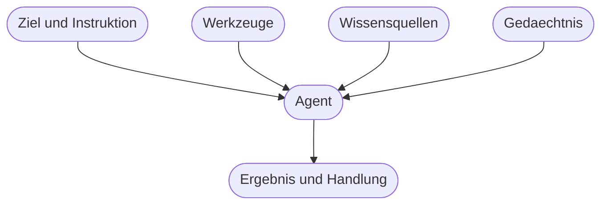
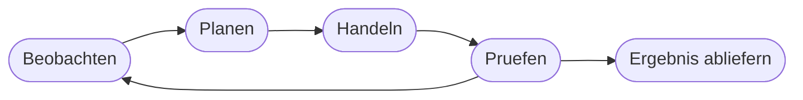

# Kapitel 6 – Vom Chatbot zum Agenten

{{ progress(6) }}

<div class="lernziele" markdown>
<h3>Was du in diesem Kapitel lernst</h3>

- Worin sich **Chat**, **Assistent** und **Agent** unterscheiden – und warum die Grenze nicht am Produktnamen verläuft
- Die fünf Bausteine der **Agenten-Anatomie**: Ziel und Instruktion, Werkzeuge, Wissen, Gedächtnis, Arbeitsschleife
- Wie eine **Wissensanbindung** funktioniert, wenn ein Agent in eigenen Dokumenten nachschlägt
- Was ein Agent sich **merken** kann und wo das nützlich beziehungsweise heikel wird
- Die Schleife **Beobachten – Planen – Handeln – Prüfen** und warum jeder Durchlauf neue Fehlerquellen mitbringt
- Die **Autonomiestufen** von Vorschlag bis eigenständigem Handeln und wann sich ein Agent überhaupt lohnt
</div>

---

## 6.1 Chat, Assistent, Agent

In der Werbung heißt inzwischen fast alles „Agent". Für die Praxis brauchst du eine schärfere Unterscheidung. Sie hängt an einer einzigen Frage: **Was kann das System außer Text erzeugen noch tun?**

| Stufe | Was es tut | Was es nicht tut | Beispiel |
|---|---|---|---|
| **Chat** | antwortet auf Eingaben, erzeugt Text | nichts abrufen, nichts auslösen | ein Sprachmodell pur, wie in Kapitel 5 beschrieben |
| **Assistent** | antwortet mit Zugriff auf Kontext: geöffnetes Dokument, Postfach, Websuche | nicht selbst handeln, nichts verändern | Copilot fasst den E-Mail-Verlauf zusammen |
| **Agent** | verfolgt ein Ziel über mehrere Schritte, nutzt Werkzeuge, prüft Zwischenergebnisse | ohne Auftrag und Grenzen arbeiten | Agent sammelt Angaben, legt einen Eintrag an, benachrichtigt den Fachbereich |

Der entscheidende Sprung liegt zwischen Assistent und Agent: Ein Assistent **antwortet**, ein Agent **arbeitet ab**. Er zerlegt einen Auftrag selbst in Schritte, holt sich Informationen, ruft Werkzeuge auf und entscheidet, wann er fertig ist.

!!! info "Merksatz"
    Ein Agent ist ein Sprachmodell **plus** vier Dinge: ein dauerhaftes Ziel, Werkzeuge, Zugang zu Wissen und eine Schleife, in der es sich selbst korrigiert. Nimm eines davon weg, ist es wieder ein Chat mit gutem Prompt.

---

## 6.2 Die Anatomie eines Agenten

Jeder Agent, egal ob in Copilot Studio gebaut (Kap. 32) oder als fertiges Produkt gekauft, besteht aus denselben Bausteinen.



| Baustein | Was er leistet | Wenn er fehlt |
|---|---|---|
| **Ziel und Instruktion** | dauerhafte Beschreibung von Aufgabe, Rolle, Tonfall, Grenzen | der Agent macht bei jedem Aufruf etwas anderes |
| **Werkzeuge (Tools)** | Aktionen in anderen Systemen: suchen, rechnen, Mail senden, Datensatz anlegen | der Agent kann nur reden |
| **Wissensquellen** | Zugriff auf Dokumente, Listen, Intranet, Websuche | der Agent kennt dein Unternehmen nicht (Kap. 5) |
| **Gedächtnis** | Erinnerung innerhalb eines Vorgangs und über Vorgänge hinweg | jedes Gespräch beginnt bei null |
| **Arbeitsschleife** | mehrere Schritte hintereinander mit Zwischenprüfung | nur eine einzige Antwort, keine Korrektur |

**Ziel und Instruktion** sind der wichtigste und zugleich am meisten unterschätzte Baustein. Sie sind kein Prompt für einen einzelnen Fall, sondern eine Dauervorgabe für alle Fälle: Wer bist du, was ist deine Aufgabe, was tust du auf keinen Fall, was tust du bei Unsicherheit. Wie du solche Instruktionen schreibst, ist Thema von Kapitel 10.

**Werkzeuge** lösen genau die Probleme aus Kapitel 5. Ein Modell kann nicht rechnen – ein Agent mit Taschenrechner-Werkzeug schon, weil er die Rechnung abgibt und nur das Ergebnis übernimmt. Ein Modell kennt den heutigen Tag nicht sicher – ein Agent mit Kalenderzugriff schon.

!!! warning "Typische Falle"
    Ein Werkzeug macht den Agenten nicht zuverlässiger, sondern nur mächtiger. Die **Entscheidung**, welches Werkzeug wann mit welchen Werten aufgerufen wird, trifft weiterhin das Sprachmodell – also ein statistisches System. Ein Agent, der Mails verschicken darf, verschickt irgendwann auch eine falsche. Deshalb gehören Werkzeuge mit Außenwirkung hinter eine Freigabe (Abschnitt 6.6, Kap. 33).

---

## 6.3 Wissensanbindung: nachschlagen statt raten

Damit ein Agent Fragen zu euren Unterlagen beantworten kann, muss man ihm die Unterlagen zugänglich machen. Das übliche Verfahren heißt **RAG** (Retrieval Augmented Generation, sinngemäß „Erzeugen mit vorgeschaltetem Suchen"). In einfachen Worten:

```text
1. Vorbereitung: Alle Dokumente werden in kleine Abschnitte zerlegt
   und so abgelegt, dass man inhaltlich aehnliche Abschnitte finden kann.
2. Frage: Der Nutzer fragt nach der Regelung fuer Auslandsreisen.
3. Suchen: Das System sucht die passenden Abschnitte heraus,
   zum Beispiel drei Absaetze aus der Reisekostenrichtlinie.
4. Mitgeben: Diese Abschnitte werden zusammen mit der Frage
   an das Sprachmodell uebergeben.
5. Antworten: Das Modell formuliert die Antwort aus dem mitgegebenen Text
   und nennt die Fundstelle.
```

Der Trick ist unspektakulär und wirkungsvoll: Das Modell muss nichts wissen, es muss nur **zusammenfassen, was man ihm vorlegt**. Damit sinkt das Halluzinationsrisiko deutlich – nicht weil das Modell besser wird, sondern weil die Lücke kleiner wird.

Gute Wissensanbindung erkennst du daran, dass der Agent **Fundstellen** nennt und „steht so nicht in den Unterlagen" sagt, wenn nichts passt. Antwortet er auch dann flüssig, wenn die Quelle nichts hergibt, ist die Anbindung entweder nicht aktiv oder zu schwach gewichtet – dann bekommst du wieder Textwahrscheinlichkeit statt Auskunft.

Zwei Grenzen sind wichtig. Erstens ist die Antwort nur so gut wie die Ablage: Veraltete Fassungen im gleichen Ordner werden genauso gefunden wie die gültige. Zweitens gelten **Berechtigungen** – ein sauber eingerichteter Agent zeigt nur, was die fragende Person ohnehin sehen dürfte. Wie das bei Copilot in Microsoft 365 konkret aussieht, siehst du in Kapitel 11.

---

## 6.4 Gedächtnis: was bleibt, was verfällt

Beim Gedächtnis werden regelmäßig drei Dinge verwechselt:

- **Kurzzeitgedächtnis** ist schlicht das Kontextfenster (Kap. 5): alles, was in diesem Vorgang bisher gesagt wurde. Es endet mit dem Chat.
- **Projekt- oder Arbeitsraum-Gedächtnis** ist ein abgegrenzter Bereich mit dauerhaften Anweisungen und Dateien, der für alle Gespräche darin gilt – etwa Projekte in ChatGPT oder Claude (Kap. 7).
- **Langzeitgedächtnis** ist eine ausdrückliche Merkfunktion: Das Werkzeug speichert Fakten über dich („arbeitet im Einkauf", „bevorzugt kurze Antworten") und nutzt sie in späteren Chats.

| Art | Reichweite | Nutzen | Risiko |
|---|---|---|---|
| Kurzzeit | ein Chat | kein Wiederholen von Kontext | geht verloren, verwässert bei Länge |
| Projektraum | alle Chats eines Projekts | konsistente Vorgaben und Dateien | falsche Altlast wirkt lange nach |
| Langzeit | alle Chats des Kontos | weniger Tipparbeit | speichert womöglich Vertrauliches dauerhaft |

!!! warning "Bevor du die Merkfunktion nutzt"
    Alles, was gespeichert wird, wird in künftigen Antworten mitverwendet – auch dann, wenn es überholt ist oder nicht für alle Beteiligten gedacht war. Sieh dir an, was dein Werkzeug gespeichert hat, und räume regelmäßig auf. Personenbezogene Angaben über **Dritte** gehören nicht ins Langzeitgedächtnis (Kap. 4).

---

## 6.5 Die Arbeitsschleife: Beobachten, Planen, Handeln, Prüfen

Das eigentlich Neue an Agenten ist nicht der Zugriff auf Werkzeuge, sondern dass sie **mehrfach durchlaufen**, bevor sie ein Ergebnis abliefern.



Ein Beispiel, Schritt für Schritt: Ein Agent soll offene Rückfragen aus dem Support-Postfach zusammenstellen.

```text
Beobachten: 34 ungelesene Mails im Postfach, Zeitraum letzte 5 Tage.
Planen:     Erst filtern nach Rueckfragen, dann je Fall Kernanliegen ziehen,
            dann nach Dringlichkeit sortieren.
Handeln:    Werkzeug Postfach durchsuchen aufrufen, Ergebnis 12 Treffer.
Pruefen:    2 Treffer sind Abwesenheitsnotizen, also keine Rueckfragen.
Beobachten: 10 relevante Faelle.
Handeln:    Zusammenfassung je Fall erstellen, Liste sortieren.
Pruefen:    Alle 10 Faelle enthalten Absender, Anliegen und Datum. Fertig.
```

Diese Schleife ist der Grund für die Stärke von Agenten – und für ihre unangenehmste Eigenschaft: **Fehler vervielfachen sich.** Wenn Schritt 1 eine Mail falsch einordnet, baut Schritt 4 darauf auf. Ein einzelner Chat produziert eine prüfbare Antwort, ein Agent produziert eine Kette, von der du meist nur das Ende siehst.

!!! tip "Deshalb gilt bei Agenten"
    Lass dir das **Vorgehen** ausgeben, nicht nur das Ergebnis: welche Quellen genutzt, welche Fälle aussortiert, welche Annahmen getroffen wurden. Ein Agent, dessen Zwischenschritte du nicht sehen kannst, ist im Betrieb kaum zu verantworten. Protokollierung und Nachvollziehbarkeit vertiefst du in Kapitel 33.

---

## 6.6 Autonomiestufen – und wann sich ein Agent lohnt

Nicht jeder Agent darf gleich viel. Es hilft, bewusst eine Stufe zu wählen, statt sie sich ergeben zu lassen.

| Stufe | Bezeichnung | Der Mensch … | Beispiel |
|---|---|---|---|
| 0 | Vorschlag | fragt, entscheidet, macht alles selbst | Textentwurf im Chat |
| 1 | Entwurf im System | prüft und schickt selbst ab | Copilot schreibt den Antwortentwurf in Outlook |
| 2 | Handeln mit Freigabe | gibt jeden Vorgang frei | Agent legt Ticket an, nach Klick auf Genehmigen |
| 3 | Handeln mit Einspruchsrecht | wird informiert, kann stoppen | Agent verschickt Eingangsbestätigungen, Fachbereich sieht mit |
| 4 | Eigenständiges Handeln | kontrolliert nur Stichproben | Agent sortiert Postfach vollautomatisch |

Die Stufe richtet sich nach der **Fehlerfolge**, nicht nach der technischen Machbarkeit. Faustregel: Je schwerer ein Fehler rückgängig zu machen ist und je mehr Außenwirkung er hat, desto niedriger die Stufe. Interne Vorsortierung darf Stufe 3 sein, Kundenkommunikation und alles mit rechtlicher Wirkung bleibt bei Stufe 1 oder 2.

!!! example "Lohnt sich hier ein Agent? Fünf Fragen"
    1. **Mehrschrittig?** Braucht die Aufgabe mehrere Arbeitsschritte und Quellen – oder reicht eine gute Frage im Chat?
    2. **Wiederkehrend?** Fällt sie oft genug an, dass sich das Einrichten und Pflegen lohnt?
    3. **Variabel?** Ist jeder Fall etwas anders? Wenn nicht, ist ein regelbasierter Ablauf besser.
    4. **Prüfbar?** Kann jemand am Ergebnis erkennen, ob es stimmt?
    5. **Rückholbar?** Lässt sich ein Fehler ohne Schaden korrigieren?

    Klare Absage: Wenn die Aufgabe **immer gleich** abläuft und keine Sprache oder Beurteilung enthält, nimm einen normalen automatisierten Ablauf – der ist billiger, schneller und vorhersehbar (Kap. 17, Kap. 29). Wenn sie **einmalig** ist, nimm den Chat. Ein Agent lohnt sich in der Mitte: wiederkehrend, sprachlastig, mit Varianz.

Damit ist die Landkarte gesteckt. Welche Produkte diese Bausteine heute wie umsetzen, siehst du im nächsten Kapitel; welche Rollen sich damit sinnvoll besetzen lassen, in Kapitel 8.

---

## Zusammenfassung

- Ein **Chat** antwortet, ein **Assistent** antwortet mit Kontext, ein **Agent** verfolgt ein Ziel über mehrere Schritte und handelt.
- Die Anatomie besteht aus **Ziel und Instruktion, Werkzeugen, Wissensquellen, Gedächtnis und Arbeitsschleife**.
- **Wissensanbindung (RAG)** heißt: erst passende Textstellen suchen, dann daraus formulieren lassen – das senkt Halluzinationen, ersetzt aber keine gepflegte Ablage.
- **Gedächtnis** gibt es in drei Reichweiten; das Langzeitgedächtnis ist bequem und datenschutzrechtlich heikel.
- Die Schleife **Beobachten – Planen – Handeln – Prüfen** macht Agenten stark und ihre Fehler schwerer erkennbar: Zwischenschritte sichtbar machen.
- Die **Autonomiestufe** richtet sich nach der Fehlerfolge; ein Agent lohnt sich bei wiederkehrenden, sprachlastigen Aufgaben mit Varianz – sonst genügt Chat oder ein regelbasierter Ablauf.

---

## Kurzübungen

{{ task(file="tasks/k06_01.yaml") }}

{{ task(file="tasks/k06_02.yaml") }}

{{ task(file="tasks/k06_03.yaml") }}

---

## Workshop

{{ task(file="tasks/workshop_k06.yaml") }}
