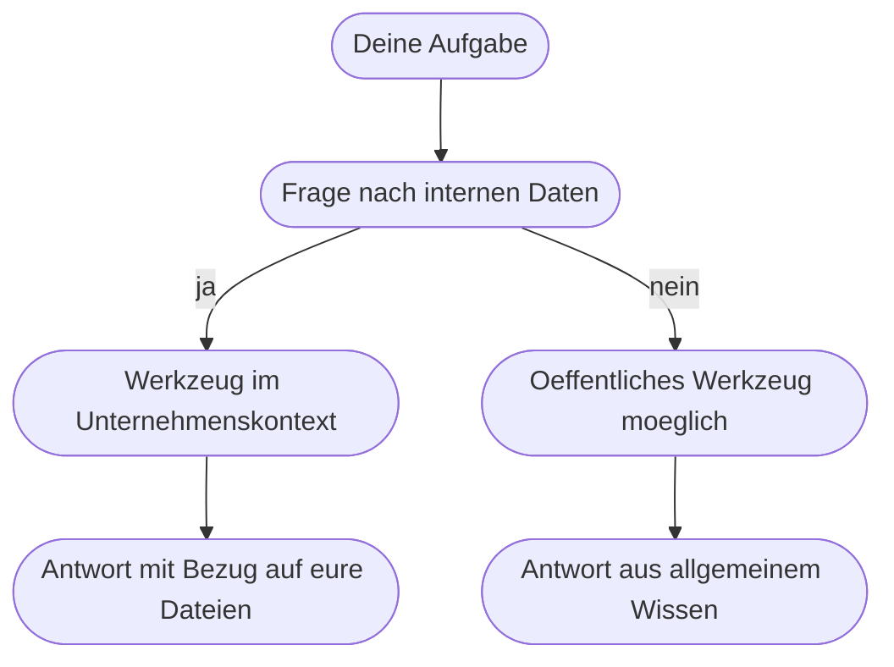

# Kapitel 7 – Die Agenten-Landschaft: Copilot, ChatGPT, Claude & Co.

{{ progress(7) }}

<h3>Was du in diesem Kapitel lernst</h3>

- Warum die wichtigste Trennlinie nicht zwischen Anbietern verläuft, sondern zwischen **Zugriff auf Unternehmensdaten** und **öffentlichen Werkzeugen**
- Wie **Microsoft Copilot** in Microsoft 365 aufgebaut ist und was **Copilot Chat** davon unterscheidet
- Was **ChatGPT** mit Projekten und Custom GPTs bietet und wo geschäftliche und private Nutzung auseinanderfallen
- Was **Claude** mit Projects anders macht und welche Rolle **Gemini** spielt
- Was mit den Daten passiert, die du eingibst – und welche Fragen du dazu selbst klären musst
- Ein **Auswahlraster**, mit dem du für eine konkrete Aufgabe das passende Werkzeug bestimmst

---

## 7.1 Die entscheidende Trennlinie

Wer Werkzeuge vergleicht, vergleicht meist Funktionen. Im Unternehmen zählt zuerst etwas anderes: **Worauf darf das Werkzeug zugreifen, und wo landen deine Eingaben?** Daraus ergeben sich zwei Welten.

| | Werkzeug im Unternehmenskontext | Öffentliches Werkzeug |
|---|---|---|
| Beispiel | Copilot mit M365-Lizenz, firmeneigener Agent | privates ChatGPT-Konto, Claude ohne Firmenvertrag |
| Datenzugriff | eure Mails, Dateien, Chats – im Rahmen der Berechtigungen | nur das, was du in den Prompt schreibst |
| Vertragslage | über den Unternehmensvertrag geregelt | Vertrag zwischen dir und dem Anbieter |
| Typischer Einsatz | Alltagsarbeit an echten Vorgängen | allgemeine Texte, Lernen, Ideensammlung |
| Größtes Risiko | zu weit gefasste Berechtigungen | Weitergabe vertraulicher Inhalte |

!!! info "Merksatz"
    Die Frage lautet nie „Welches Werkzeug ist das beste?", sondern **„Welches Werkzeug darf diese Aufgabe mit diesen Daten übernehmen?"**. Ein Werkzeug ohne Zugriff auf eure Ablage kann eure Vorgänge nicht kennen (Kap. 5). Ein Werkzeug mit Zugriff braucht saubere Berechtigungen.

Ein Hinweis zur Haltbarkeit dieses Kapitels: Die Produkte ändern sich schnell – Funktionsnamen, Paketzuschnitte und Verfügbarkeiten verschieben sich mehrmals pro Jahr. Die **Unterscheidungslogik** in diesem Kapitel bleibt stabil, die Detailfunktionen prüfst du bei Bedarf in der Oberfläche oder der Anbieterdokumentation nach.

---

## 7.2 Microsoft Copilot in Microsoft 365

Copilot ist kein einzelnes Produkt, sondern eine Familie. Für den Arbeitsalltag sind drei Erscheinungsformen wichtig:

- **Copilot in den Apps**: direkt in Word, Excel, Outlook, PowerPoint und Teams. Der Bezugspunkt ist das, woran du gerade arbeitest – das offene Dokument, der Mail-Verlauf, die Besprechung.
- **Copilot Chat**: ein eigenes Chatfenster im Browser oder in Teams. Je nach Lizenz arbeitet es nur mit allgemeinem Wissen und Webinhalten oder zusätzlich mit euren Unternehmensdaten.
- **Eigene Agenten**: mit Copilot Studio gebaute Agenten, die auf definierte Wissensquellen und Aktionen zugreifen (Kap. 32).

Der eigentliche Unterschied zu allen anderen Werkzeugen ist der **Kontextzugriff**: Copilot kann in dem Umfang auf Mails, Dateien, Chats und Kalender zugreifen, in dem du selbst darauf zugreifen darfst. Es entsteht kein neues Berechtigungssystem – aber bestehende Nachlässigkeiten werden sichtbar.

!!! warning "Häufiges Missverständnis"
    „Copilot zeigt mir Dokumente, die ich nicht sehen dürfte." Fast immer stimmt das nicht: Copilot zeigt Dokumente, für die du **formal berechtigt** bist, die du bisher nur nie gefunden hast – etwa eine für alle freigegebene SharePoint-Bibliothek. Das ist kein KI-Problem, sondern ein Berechtigungsproblem, das die KI nur sichtbar macht. Details in Kapitel 11.

Weil Copilot Chat und Copilot mit Datenzugriff gleich aussehen, lohnt ein bewusster Blick: Wenn ein Chat auf deine Nachfrage nach einem konkreten internen Dokument nichts findet, arbeitest du vermutlich in der Variante ohne Unternehmenszugriff.

---

## 7.3 ChatGPT: Projekte und Custom GPTs

ChatGPT von OpenAI ist das bekannteste öffentliche Werkzeug und in mehreren Kontovarianten verfügbar – von kostenlos über persönliche Bezahlpakete bis zu Team- und Unternehmensverträgen. Für die Arbeit sind drei Bausteine relevant:

- **Custom Instructions**: dauerhafte Angaben zu Person, Aufgabengebiet und gewünschtem Antwortstil, die in jedem Chat mitgelten (Kap. 10).
- **Projekte**: abgegrenzte Arbeitsräume mit eigenen Anweisungen und hinterlegten Dateien. Alle Chats im Projekt teilen diesen Rahmen – praktisch für eine wiederkehrende Aufgabe mit festen Unterlagen.
- **Custom GPTs**: konfigurierte Varianten mit fester Instruktion und eigenem Wissen, die man teilen kann. Faktisch ein einfacher Agent nach der Anatomie aus Kapitel 6, ohne dass man etwas programmieren muss.

Dazu kommen Funktionen wie Websuche, Dateianalyse und ein Modus, in dem Berechnungen in einer echten Rechenumgebung ausgeführt werden – letzteres entschärft die Rechenschwäche aus Kapitel 5, weil nicht mehr das Modell rechnet.

!!! tip "Der wichtigste Unterschied ist der Vertrag, nicht die Funktion"
    Ob du ChatGPT geschäftlich nutzen darfst, hängt nicht davon ab, was das Werkzeug kann, sondern davon, ob dein Arbeitgeber einen entsprechenden Vertrag hat und die Nutzung freigegeben ist. Ein privates Konto ist auch dann ein privates Konto, wenn du damit dienstliche Texte schreibst.

---

## 7.4 Claude – und Gemini als Randnotiz

**Claude** von Anthropic ist im Aufbau vergleichbar: Chat, dauerhafte Anweisungen, Dateianalyse und **Projects** als Arbeitsräume mit hinterlegten Unterlagen und projektweiter Instruktion. In der Praxis wird Claude oft für Arbeiten an längeren, zusammenhängenden Texten geschätzt – Vertragsentwürfe durchsehen, Richtlinien vergleichen, lange Protokolle strukturieren. Das ist eine Erfahrungstendenz, keine harte Eigenschaft, und sie verschiebt sich mit jeder Modellgeneration.

**Gemini** von Google folgt derselben Logik im Google-Umfeld: Chat plus Anbindung an Workspace-Dienste. Für Unternehmen, die mit Microsoft 365 arbeiten, ist es meist nur dann ein Thema, wenn es bereits Google-Dienste im Einsatz gibt.

| Werkzeug | Arbeitsraum-Funktion | Typische Stärke im Alltag | Zugriff auf eure Ablage |
|---|---|---|---|
| Copilot (M365) | eigene Agenten über Copilot Studio | Vorgänge in Outlook, Teams, Word, Excel | ja, im Rahmen der Berechtigungen |
| ChatGPT | Projekte, Custom GPTs | breite Aufgabenvielfalt, gute Werkzeuganbindung | nein, außer über eingerichtete Verbindungen |
| Claude | Projects | lange Texte und Dokumentarbeit | nein, außer über eingerichtete Verbindungen |
| Gemini | Gems | Google-Workspace-Umfeld | im Google-Umfeld |

In diesem Kapitel steht bewusst keine Rangliste: Vergleichstests veralten innerhalb von Wochen, und die Unterschiede zwischen den führenden Werkzeugen sind bei Standardaufgaben – zusammenfassen, formulieren, strukturieren – geringer als der Unterschied zwischen einem schlechten und einem guten Prompt (Kap. 9). Investiere deine Zeit lieber dort.

---

## 7.5 Was mit deinen Eingaben passiert

Diese Frage entscheidet in vielen Unternehmen über die Freigabe. Sie zerfällt in vier Teilfragen, die du für jedes eingesetzte Werkzeug beantworten können solltest:

1. **Wird mit meinen Eingaben trainiert?** Bei geschäftlichen Verträgen ist das üblicherweise ausgeschlossen, bei kostenlosen Privatkonten häufig nicht – teils abschaltbar.
2. **Wie lange werden Eingaben gespeichert?** Chatverläufe bleiben in der Regel im Konto, bis sie gelöscht werden; zusätzlich gibt es Aufbewahrung beim Anbieter.
3. **Wo wird verarbeitet?** Für personenbezogene Daten relevant, weil der Verarbeitungsort Teil der datenschutzrechtlichen Bewertung ist (Kap. 4).
4. **Wer kann mitlesen?** Im Unternehmenskontext gibt es Protokollierung und Administration; das ist gewollt, sollte aber bekannt sein.

!!! warning "Die Leitplanke für den Alltag"
    Unabhängig vom Anbieter gilt: **Was du nicht in eine externe E-Mail schreiben würdest, schreibst du auch nicht in ein öffentliches KI-Werkzeug.** Personenbezogene Daten, Gesundheitsdaten, Bewerbungsunterlagen, Vertragsentwürfe, Preiskalkulationen und Zugangsdaten gehören nicht hinein. Wenn du das Material brauchst: anonymisieren, kürzen oder in ein freigegebenes Werkzeug wechseln (Kap. 4).

Zur **Kosten- und Lizenzlogik** genügt fürs Erste das Muster, ohne Zahlen: Öffentliche Werkzeuge haben meist eine kostenlose Basisstufe, ein Bezahlpaket pro Person und Monat und darüber Team- oder Unternehmensverträge mit zusätzlichen Zusicherungen. Copilot mit Zugriff auf Unternehmensdaten ist eine kostenpflichtige Zusatzlizenz zur bestehenden Microsoft-365-Lizenz. KI in Abläufen wird oft nach Verbrauch abgerechnet (Kap. 30). Merke dir vor allem: Die Nutzung eines Werkzeugs im Unternehmenskontext ist selten eine reine Funktionsfrage, sondern fast immer auch eine Lizenz- und Freigabefrage.

---

## 7.6 Auswahlraster nach Aufgabentyp

Statt „welches Werkzeug nehme ich" fragst du besser: „Was für eine Aufgabe habe ich?" Das Raster führt dich in wenigen Schritten zur Antwort.

| Aufgabentyp | Beispiel | Passendes Werkzeug | Warum |
|---|---|---|---|
| Vorgang im Postfach oder Kalender | Mail-Verlauf zusammenfassen, Termin vorbereiten | Copilot in der App | braucht den echten Kontext |
| Arbeit an einem internen Dokument | Angebot umschreiben, Protokoll straffen | Copilot in Word, alternativ öffentliches Werkzeug mit **anonymisiertem** Text | Zugriff oder bewusste Anonymisierung |
| Auskunft aus internen Unterlagen | Frage zur Reisekostenregelung | Copilot mit Datenzugriff oder eigener Agent (Kap. 32) | Wissensanbindung nötig (Kap. 6) |
| Allgemeines Formulieren und Strukturieren | Gliederung, Textvarianten, Erklärung | jedes verfügbare Werkzeug | keine internen Daten im Spiel |
| Wiederkehrende Aufgabe mit festen Unterlagen | monatlicher Report nach gleichem Muster | Projekt in ChatGPT oder Claude, Custom GPT | Arbeitsraum mit fester Instruktion |
| Lange Dokumente durcharbeiten | Vertragsentwurf, Richtlinienvergleich | Claude Projects oder ChatGPT-Projekt | Stärke bei langen Texten |
| Schritt in einem automatisierten Ablauf | eingehende Anfrage einsortieren | KI-Aktion in Power Automate (Kap. 30) | läuft ohne Mensch am Chatfenster |

!!! example "Selbsttest in drei Fragen"
    Nimm eine Aufgabe von heute und beantworte der Reihe nach:

    1. **Stecken interne oder personenbezogene Daten drin?** Wenn ja: nur freigegebenes Werkzeug oder anonymisieren.
    2. **Braucht die Antwort Zugriff auf eure Ablage?** Wenn ja: Copilot mit Datenzugriff oder ein eigener Agent, sonst geht jedes Werkzeug.
    3. **Kommt die Aufgabe wieder?** Wenn ja: als Projekt oder Vorlage einrichten (Kap. 9, Kap. 10), statt jedes Mal neu zu tippen.

    Erst danach ist die Produktwahl überhaupt eine sinnvolle Frage – und dann oft eine kleine.

---

## Zusammenfassung

- Die wichtigste Unterscheidung ist nicht der Anbieter, sondern **Zugriff auf Unternehmensdaten ja oder nein**.
- **Copilot** sitzt in den M365-Apps und arbeitet im Rahmen deiner bestehenden Berechtigungen; Copilot Chat gibt es mit und ohne Unternehmenszugriff.
- **ChatGPT** bietet Custom Instructions, Projekte und Custom GPTs – Letztere sind einfache Agenten ohne Programmierung.
- **Claude** setzt mit Projects auf denselben Arbeitsraum-Gedanken und wird oft für lange Dokumente genutzt; **Gemini** ist vor allem im Google-Umfeld relevant.
- Bei **Daten** klärst du vier Fragen: Training, Speicherdauer, Verarbeitungsort, Einsichtnahme – und hältst dich an die Leitplanke für vertrauliche Inhalte.
- Das **Auswahlraster** geht vom Aufgabentyp aus: erst Daten, dann Kontextbedarf, dann Wiederholung – die Produktfrage kommt zuletzt.

---

## Kurzübungen

{{ task(file="tasks/k07_01.yaml") }}

{{ task(file="tasks/k07_02.yaml") }}

{{ task(file="tasks/k07_03.yaml") }}

---

## Workshop

{{ task(file="tasks/workshop_k07.yaml") }}
