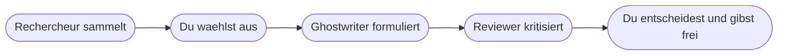

# Kapitel 8 – Rollen, Grenzen und Anwendungsbereiche

{{ progress(8) }}

<div class="lernziele" markdown>
<h3>Was du in diesem Kapitel lernst</h3>

- Warum eine klar zugewiesene **Rolle** die Qualität von KI-Ergebnissen stärker verändert als die Wahl des Werkzeugs
- Sieben bewährte **Rollenmuster** vom Rechercheur bis zum Tutor – jeweils mit einsatzfertigem Beispielprompt
- Wie du Rollen zu einer **Kette** verbindest, statt einen einzigen großen Auftrag zu stellen
- Die **harten Grenzen**: exaktes Rechnen, Aktualität, Rechtsverbindlichkeit, Vertraulichkeit, Verantwortung
- Einen **Eignungs-Check**, mit dem du für jede beliebige Aufgabe entscheidest, ob und wie KI sie übernimmt
- Warum die **Verantwortung** auch bei perfekter Ausgabe beim Menschen bleibt
</div>

---

## 8.1 Warum eine Rolle so viel bewirkt

Ein Sprachmodell erzeugt die wahrscheinlichste Fortsetzung deiner Eingabe (Kap. 5). Eine vage Eingabe hat viele plausible Fortsetzungen – das Ergebnis wird durchschnittlich. Eine Rollenzuweisung engt den Raum ein: „Antworte als kritischer Prüfer" führt zu anderen Fortsetzungen als „Antworte als Werbetexter", ohne dass sich am Modell irgendetwas ändert.

Wichtiger als der Effekt auf die Formulierung ist aber der Effekt auf **dich**. Wer eine Rolle vergibt, hat vorher entschieden, was er eigentlich will: Material oder Kritik, Entwurf oder Gegenrede, Struktur oder Erklärung. Genau dieses Entscheiden ist der Hebel.

!!! info "Merksatz"
    Nicht „lass die KI mal drübergehen", sondern **„in welcher Rolle soll sie drübergehen"**. Eine Aufgabe ohne Rolle ist eine Aufgabe ohne Erwartung – und ohne Erwartung kannst du das Ergebnis nicht bewerten.

---

## 8.2 Sieben Rollenmuster

| Rolle | Auftrag an die KI | Du lieferst | Du prüfst |
|---|---|---|---|
| Rechercheur | Material sammeln und ordnen | Fragestellung, Umfang, Quellenrahmen | jede Tatsachenbehauptung |
| Reviewer / Kritiker | Schwächen im fertigen Entwurf finden | den Entwurf, die Prüfkriterien | ob die Kritik zutrifft |
| Ghostwriter | ausformulieren, was du inhaltlich vorgibst | Inhalt, Adressat, Ton | Fakten, Tonfall, Freigabe |
| Sparringspartner | widersprechen, Annahmen angreifen | deine These | ob der Einwand trägt |
| Datenaufbereiter | unstrukturiertes in strukturiertes Material wandeln | Rohdaten, Zielformat | Vollständigkeit, Zahlen |
| Tutor | erklären, abfragen, Verständnis prüfen | dein Wissensstand | ob die Erklärung stimmt |
| Übersetzer | zwischen Sprachen und Fachniveaus übertragen | Ausgangstext, Zielgruppe | Fachbegriffe, Nuancen |

**Rechercheur.** Nützlich zum Auffächern eines Themas, nicht als Faktenquelle. Nutze diese Rolle bevorzugt mit angehängtem Material oder aktivierter Websuche.

```text
Du bist Rechercheur. Sammle zum Thema Einfuehrung eines digitalen
Urlaubsantrags die typischen Argumente dafuer und dagegen.
Ordne sie nach Beschaeftigten, Fuehrungskraeften und IT.
Markiere jede Aussage, die du nicht belegen kannst, mit unbelegt.
```

**Reviewer / Kritiker.** Die unterschätzteste Rolle. Sie funktioniert, weil Kritik an vorliegendem Text kaum Wissen erfordert – das Material liegt ja vor.

```text
Du bist kritischer Reviewer. Pruefe den folgenden Angebotstext auf
Verstaendlichkeit, fehlende Angaben und unklare Zusagen.
Nenne maximal sieben Punkte, jeweils mit Textstelle und Verbesserungsvorschlag.
Lobe nichts.
```

**Ghostwriter.** Der häufigste Einsatz und der mit dem größten Missverständnis: Der Inhalt kommt von dir, nur die Formulierung von der KI.

```text
Du bist Ghostwriter. Formuliere aus meinen Stichpunkten eine Absage an einen
Lieferanten. Sachlich, wertschaetzend, maximal 150 Woerter, keine Begruendung
zu Preisen. Stichpunkte: [Stichpunkte einfuegen]
```

**Sparringspartner.** Wirkt der Neigung entgegen, dass Werkzeuge dir zustimmen. Verlangt ausdrücklich Widerspruch.

```text
Du bist Sparringspartner und vertrittst die Gegenposition.
Meine These: Wir sollten die Rechnungspruefung automatisieren.
Nenne die drei staerksten Gegenargumente und eine Bedingung,
unter der meine These trotzdem richtig waere.
```

**Datenaufbereiter.** Sprachlich unspektakulär, im Alltag der größte Zeitgewinn: aus Freitext eine Struktur machen. Beachte die Grenzen beim Rechnen (Abschnitt 8.4, Kap. 13).

```text
Du bist Datenaufbereiter. Wandle die folgenden Besprechungsnotizen in eine
Tabelle mit den Spalten Aufgabe, Verantwortlich, Frist, Status.
Uebernimm nur, was im Text steht. Fehlende Angaben: offen.
```

**Tutor.** Für eigenes Lernen an einem Thema, das du beurteilen kannst – sonst merkst du falsche Erklärungen nicht.

```text
Du bist Tutor. Erklaere mir das Thema Trigger in Power Automate in drei Stufen:
einfach, mit Beispiel, mit typischen Fehlern.
Stelle mir danach drei Verstaendnisfragen und warte auf meine Antworten.
```

**Übersetzer.** Gemeint ist nicht nur Fremdsprache, sondern auch das Übersetzen zwischen Fachniveaus.

```text
Du bist Uebersetzer. Uebertrage den folgenden IT-Text in eine Sprache,
die ein Sachbearbeiter ohne IT-Hintergrund versteht.
Behalte alle Fachbegriffe bei, erklaere jeden einmal in Klammern.
```

!!! tip "Rollen anpassen, nicht abschreiben"
    Die Prompts oben sind Rohlinge. Ergänze sie um deinen Kontext, dein Format und deine Einschränkungen – das systematische Vorgehen dazu lernst du in Kapitel 9. Was sich bewährt, wandert in deine Prompt-Bibliothek.

---

## 8.3 Rollen zu einer Kette verbinden

Ein einzelner großer Auftrag („Schreib mir ein Konzept für die Digitalisierung des Urlaubsantrags") liefert Mittelmaß, weil er alle Rollen gleichzeitig verlangt. Besser ist eine Kette aus kleinen Aufträgen mit klarer Rollenwechsel-Logik.



Der Mensch steht bewusst zweimal in der Kette: einmal als **Auswahl** (was ist überhaupt relevant und richtig) und einmal als **Freigabe**. Dazwischen darf die KI viel tun. Genau dieses Muster findest du später als Architektur wieder, wenn KI-Bausteine in Abläufen stecken und Freigabepunkte gesetzt werden (Kap. 29, Kap. 33).

!!! example "Derselbe Auftrag, einmal als Kette"
    Statt „Schreib ein Konzept" arbeitest du in vier Schritten: Rechercheur fächert Argumente auf → du streichst alles Unzutreffende und ergänzt eure Rahmenbedingungen → Ghostwriter formuliert daraus einen zweiseitigen Entwurf → Reviewer sucht Lücken und unklare Zusagen. Der Zeitaufwand ist ähnlich, das Ergebnis deutlich belastbarer – und du weißt an jeder Stelle, was du gerade prüfst.

---

## 8.4 Die harten Grenzen

Manche Grenzen verschieben sich mit besseren Modellen. Die folgenden fünf verschieben sich nicht, weil sie nicht an der Leistungsfähigkeit hängen.

| Grenze | Was schiefgeht | Woran du es merkst | Was du stattdessen tust |
|---|---|---|---|
| **Exaktes Rechnen** | Summen, Prozentwerte, Fristen werden plausibel erfunden | Zahlen sehen richtig aus, stimmen aber nicht | Excel, Taschenrechner oder ein Werkzeug mit echter Rechenfunktion (Kap. 5, Kap. 13) |
| **Aktualität** | Stand von gestern wird als heute ausgegeben | keine Quellenangabe, kein Datum | Quelle selbst prüfen, Datum mitgeben, Websuche verlangen |
| **Rechtsverbindlichkeit** | erfundene Paragrafen, unzulässige Zusagen | Formulierungen klingen offiziell | Originaltext prüfen, Fachabteilung einbinden (Kap. 4) |
| **Vertraulichkeit** | interne Daten landen in einem externen Werkzeug | fällt oft gar nicht auf | anonymisieren oder freigegebenes Werkzeug (Kap. 7) |
| **Verantwortung** | niemand fühlt sich für die Ausgabe zuständig | „das kam so von der KI" | namentliche Freigabe, bevor etwas hinausgeht |

Zwei Sonderfälle verdienen eigene Aufmerksamkeit:

- **Zählen und Vollständigkeit.** „Nenne alle 14 Punkte aus dem Protokoll" liefert oft zwölf oder sechzehn. Ein Sprachmodell hat keine sichere Mengenkontrolle. Zähle selbst nach, wenn die Anzahl zählt.
- **Entscheidungen über Menschen.** Bewerberauswahl, Leistungsbewertung, Kreditwürdigkeit: Hier ist der Einsatz nicht nur fachlich heikel, sondern rechtlich stark reguliert (Kap. 4, Kap. 14). Unterstützung beim Formulieren ist etwas anderes als eine Entscheidungsempfehlung.

!!! warning "Der gefährlichste Satz im Umgang mit KI"
    „Das sieht plausibel aus." Plausibilität ist genau das, was ein Sprachmodell optimiert – sie ist deshalb kein Prüfkriterium, sondern das Erzeugnis. Prüfe gegen die Quelle, gegen die Rechnung, gegen die Vorschrift, nicht gegen dein Bauchgefühl.

---

## 8.5 Der Eignungs-Check für eine beliebige Aufgabe

Bevor du eine Aufgabe an ein KI-Werkzeug gibst, gehst du fünf Fragen durch. Jede Antwort ist entweder unkritisch oder verlangt eine Maßnahme.

| Frage | Unkritisch | Maßnahme nötig |
|---|---|---|
| 1. **Daten**: Sind interne oder personenbezogene Inhalte im Spiel? | nein | anonymisieren oder freigegebenes Werkzeug nutzen |
| 2. **Wahrheitsbedarf**: Muss jede Aussage faktisch stimmen? | Entwurf, Ideen | Material mitgeben, Belege verlangen, gegenprüfen |
| 3. **Rechnen**: Hängen Zahlen am Ergebnis? | nein | Zahlen außerhalb rechnen und einsetzen |
| 4. **Prüfbarkeit**: Kann jemand erkennen, ob das Ergebnis stimmt? | ja | Aufgabe zerlegen, bis sie prüfbar wird |
| 5. **Folgen**: Was passiert bei einem unbemerkten Fehler? | gering, rückholbar | Freigabe durch benannte Person, Vier-Augen-Prinzip |

Fällt Frage 4 negativ aus – niemand kann beurteilen, ob das Ergebnis richtig ist – dann ist die Aufgabe **nicht geeignet**, unabhängig von allen anderen Antworten. Eine unprüfbare KI-Ausgabe ist keine Arbeitserleichterung, sondern ein verstecktes Risiko.

!!! info "Verantwortung lässt sich nicht delegieren"
    Ein KI-Werkzeug ist kein Rechtssubjekt und keine Kollegin. Es haftet nicht, es entschuldigt sich nicht, und es kann nicht befragt werden, warum es etwas geschrieben hat. Wer eine Ausgabe verwendet, macht sie sich zu eigen – mit allem, was daran hängt. Das ist keine moralische Zusatzforderung, sondern die schlichte Rechtslage (Kap. 3, Kap. 4).

Der Eignungs-Check begleitet dich durch den Rest des Kurses: bei den Fallbeispielen in Block 3, beim Setzen von Freigabepunkten in Abläufen (Kap. 29) und bei der Auswahl deines eigenen Projekts (Kap. 35).

---

## Zusammenfassung

- Eine klare **Rolle** verbessert Ergebnisse, weil sie den Möglichkeitsraum einengt – und weil sie dich zwingt, deine Erwartung zu klären.
- Die sieben Muster **Rechercheur, Reviewer, Ghostwriter, Sparringspartner, Datenaufbereiter, Tutor, Übersetzer** decken den größten Teil der Bürorealität ab.
- Rollen als **Kette** einzusetzen liefert bessere Ergebnisse als ein einziger großer Auftrag; der Mensch steht bei Auswahl und Freigabe darin.
- Die harten Grenzen sind **exaktes Rechnen, Aktualität, Rechtsverbindlichkeit, Vertraulichkeit und Verantwortung** – sie verschwinden nicht mit besseren Modellen.
- „Sieht plausibel aus" ist kein Prüfkriterium, weil Plausibilität genau das ist, was das System erzeugt.
- Der **Eignungs-Check** prüft Daten, Wahrheitsbedarf, Rechnen, Prüfbarkeit und Fehlerfolgen; fehlende Prüfbarkeit ist ein Ausschlusskriterium.

---

## Kurzübungen

{{ task(file="tasks/k08_01.yaml") }}

{{ task(file="tasks/k08_02.yaml") }}

{{ task(file="tasks/k08_03.yaml") }}

---

## Workshop

{{ task(file="tasks/workshop_k08.yaml") }}
