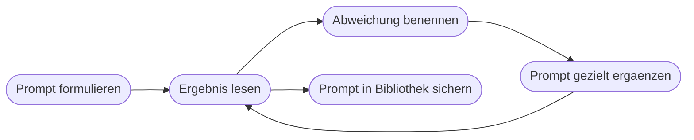

# Kapitel 9 – Prompt-Design: Grundlagen

{{ progress(9) }}

<div class="lernziele" markdown>
<h3>Was du in diesem Kapitel lernst</h3>

- Warum der **Prompt** den Unterschied zwischen brauchbarem und unbrauchbarem Ergebnis macht
- Die sechs Bausteine der **Prompt-Anatomie**: Rolle, Aufgabe, Kontext, Format, Ton, Einschränkungen
- Wie aus einem schlechten Prompt in vier nachvollziehbaren Schritten ein guter wird
- Die **typischen Fehler**, die fast alle Anfänger machen – und woran du sie am Ergebnis erkennst
- Wie du mit **Beispielen** (Few-Shot) ein Ergebnis steuerst, das sich mit Worten schwer beschreiben lässt
- Wie du **iterierst** und dir eine eigene **Prompt-Bibliothek** aufbaust
</div>

---

## 9.1 Der Prompt ist der eigentliche Hebel

Zwischen den führenden KI-Werkzeugen liegen bei Standardaufgaben kleine Unterschiede (Kap. 7). Zwischen einem schlampigen und einem durchdachten Prompt liegen Welten. Das folgt direkt aus der Funktionsweise: Das Modell erzeugt die wahrscheinlichste Fortsetzung deiner Eingabe (Kap. 5) – je unbestimmter die Eingabe, desto durchschnittlicher die Fortsetzung.

Ein **Prompt** ist deshalb kein Suchbegriff, sondern ein **Arbeitsauftrag**. Der nützlichste Vergleich: eine neue Aushilfe, fachlich fit und sprachlich gewandt, aber ohne jede Kenntnis eures Hauses und ohne die Möglichkeit, nachzufragen. Alles, was diese Person wissen muss, muss im Auftrag stehen.

!!! info "Merksatz"
    Alles, was du **nicht** sagst, entscheidet das Modell selbst – nach Wahrscheinlichkeit, nicht nach deinem Bedarf. Ein guter Prompt ist deshalb vor allem eines: **vollständig genug**.

---

## 9.2 Die Anatomie: sechs Bausteine

| Baustein | Frage, die er beantwortet | Beispielformulierung |
|---|---|---|
| **Rolle** | Aus welcher Perspektive? | „Du bist erfahrene Sachbearbeiterin im Kundenservice." |
| **Aufgabe** | Was genau ist zu tun? | „Formuliere eine Antwort auf die folgende Beschwerde." |
| **Kontext** | Was muss man wissen? | „Der Kunde wartet seit drei Wochen, die Verzögerung liegt beim Lieferanten." |
| **Format** | Wie soll das Ergebnis aussehen? | „Fließtext, maximal 150 Wörter, mit Betreffzeile." |
| **Ton** | Wie soll es klingen? | „Sachlich, entschuldigend, ohne Floskeln." |
| **Einschränkungen** | Was ist verboten oder gesetzt? | „Nenne keinen neuen Liefertermin. Erfinde keine Gründe." |

Nicht jeder Prompt braucht alle sechs. Für „Fasse diesen Text in fünf Stichpunkten zusammen" reichen Aufgabe und Format. Aber wenn ein Ergebnis nicht passt, findest du die Ursache fast immer in einem **fehlenden** Baustein – und meistens ist es Kontext oder Einschränkung.

!!! tip "Reihenfolge und Länge"
    Setze Rolle und Aufgabe nach vorn, längeres Material nach hinten und kennzeichne es klar, etwa mit einer Zeile `Hier der Text:`. Lange Prompts sind kein Problem – unstrukturierte schon. Und: Formuliere positiv, was du willst („antworte in Stichpunkten"), statt nur negativ, was du nicht willst („kein Fließtext").

---

## 9.3 Von schlecht zu gut: ein Beispiel in vier Schritten

Die Aufgabe: Ein Kunde beschwert sich schriftlich über eine verspätete Lieferung. Du brauchst einen Antwortentwurf.

**Stufe 0 – der übliche Anfang**

```text
Schreib eine Antwort auf diese Kundenbeschwerde.
```

Ergebnis: eine generische Entschuldigungsmail. Zu lang, im Zweifel mit erfundenem Ersatzangebot und einem zugesagten Termin, den es nicht gibt. Es fehlt fast alles.

**Stufe 1 – Aufgabe und Kontext ergänzen**

```text
Formuliere eine Antwort auf die folgende Kundenbeschwerde.
Kontext: Der Kunde hat am 3. Maerz bestellt, zugesagt war Lieferung
innerhalb von zehn Werktagen. Der Artikel ist beim Hersteller nicht
verfuegbar. Ein neuer Termin steht noch nicht fest.
Hier die Beschwerde: [Text der Beschwerde]
```

Besser: Die Antwort ist jetzt inhaltlich richtig. Aber sie ist noch beliebig lang, der Ton schwankt, und ob am Ende ein Datum steht, ist Glückssache.

**Stufe 2 – Format und Ton festlegen**

```text
Formuliere eine Antwort auf die folgende Kundenbeschwerde.
Kontext: [wie oben]
Format: E-Mail mit Betreffzeile, maximal 150 Woerter, Anrede mit Sie.
Ton: sachlich, entschuldigend, ohne Werbefloskeln, keine Ausreden.
Hier die Beschwerde: [Text der Beschwerde]
```

Besser: Das Ergebnis ist jetzt verwendbar und hat eine verlässliche Länge. Übrig bleibt das eigentliche Risiko – das Modell füllt Lücken.

**Stufe 3 – Rolle und Einschränkungen setzen**

```text
Du bist erfahrene Sachbearbeiterin im Kundenservice eines
Elektrogrosshandels.
Aufgabe: Formuliere eine Antwort auf die folgende Kundenbeschwerde.
Kontext: [wie oben]
Format: E-Mail mit Betreffzeile, maximal 150 Woerter, Anrede mit Sie.
Ton: sachlich, entschuldigend, ohne Werbefloskeln, keine Ausreden.
Einschraenkungen:
- Nenne keinen neuen Liefertermin und keine Kulanz.
- Erfinde keine Gruende. Nutze nur den Kontext oben.
- Kuendige an, dass wir uns bis Ende der Woche mit einem Termin melden.
- Wenn dir eine Angabe fehlt, schreibe [FEHLT] statt zu raten.
Hier die Beschwerde: [Text der Beschwerde]
```

Jetzt stimmt der Kern: Der Entwurf ist fachlich korrekt, formatgerecht, im richtigen Ton – und er **markiert Lücken, statt sie zu füllen**. Diese letzte Zeile ist der wichtigste Zugewinn der ganzen Übung, weil sie das Halluzinationsrisiko sichtbar macht (Kap. 5).

| Stufe | Ergänzt | Was besser wird | Was noch fehlt |
|---|---|---|---|
| 1 | Aufgabe, Kontext | inhaltliche Richtigkeit | Länge, Ton, Verlässlichkeit |
| 2 | Format, Ton | Verwendbarkeit ohne Nacharbeit | Schutz vor Erfundenem |
| 3 | Rolle, Einschränkungen | keine erfundenen Zusagen, Lücken markiert | nur noch die fachliche Freigabe |

!!! warning "Typische Falle"
    Viele hören nach Stufe 2 auf, weil das Ergebnis „gut aussieht". Genau dort entstehen die teuren Fehler: ein zugesagter Termin, eine erfundene Kulanzregelung, eine Aussage über einen Lieferanten. **Einschränkungen sind kein Feinschliff, sondern der Kern.**

---

## 9.4 Typische Fehler

| Fehler | Woran du ihn am Ergebnis erkennst | Gegenmittel |
|---|---|---|
| Zu vager Auftrag | Text ist allgemein und austauschbar | Aufgabe konkret benennen, Zweck nennen |
| Kontext im Kopf behalten | inhaltlich falsch, obwohl sprachlich gut | alles Nötige in den Prompt schreiben |
| Kein Format | mal drei Sätze, mal zwei Seiten | Länge, Struktur, Bestandteile vorgeben |
| Mehrere Aufgaben auf einmal | ein Teil wird gut, der Rest halbherzig | zerlegen, nacheinander (Kap. 10) |
| Nur Verbote | das Verbotene taucht trotzdem auf | positiv formulieren, was stattdessen gilt |
| Lücken nicht adressiert | erfundene Details klingen selbstverständlich | „Wenn Angabe fehlt: [FEHLT] schreiben" |

!!! example "Ein Satz, der oft alles rettet"
    Hänge an einen komplexen Auftrag an:

    ```text
    Stelle mir zuerst bis zu drei Rueckfragen, wenn dir Angaben fehlen,
    und beginne erst danach mit der Bearbeitung.
    ```

    Das dreht die Arbeitsrichtung um: Statt dass du raten musst, was fehlt, sagt es dir das Werkzeug. Für wiederkehrende Aufgaben nimmst du die Rückfragen anschließend als feste Kontextfelder in deine Vorlage auf.

---

## 9.5 Beispiele mitgeben: Few-Shot

Manches lässt sich leichter zeigen als beschreiben – Tonfall, Kürzelsystematik, Betreffzeilen-Stil, Gliederungsform. Dann gibst du **Beispiele** mit. Der Fachbegriff dafür lautet **Few-Shot-Prompting** (sinngemäß „mit wenigen Beispielen").

```text
Formuliere Betreffzeilen fuer Kundenmails nach diesem Muster:
Anliegen: Lieferung verspaetet sich
Betreff: Ihre Bestellung 10432 - aktueller Stand
Anliegen: Rechnung war fehlerhaft
Betreff: Ihre Rechnung 88120 - korrigierte Fassung

Jetzt du:
Anliegen: Ersatzteil ist eingetroffen
Betreff:
```

Zwei bis drei Beispiele reichen fast immer. Wichtig ist, dass sie **untereinander konsistent** sind: Widersprüchliche Beispiele erzeugen widersprüchliche Ergebnisse. Und sie müssen den Fall abdecken, der dir wichtig ist – zeigst du nur einfache Fälle, bekommst du bei schwierigen Fällen wieder Beliebigkeit.



---

## 9.6 Iterieren und die eigene Prompt-Bibliothek

**Iterieren** heißt nicht, dieselbe Frage noch einmal zu stellen und auf Glück zu hoffen. Es heißt: benennen, was konkret abweicht, und genau das ergänzen – etwa „Kürze auf 120 Wörter und streiche den letzten Absatz" oder „Der Ton ist zu unterwürfig, entschuldige dich einmal statt dreimal". Entscheidend ist der zweite Schritt, den fast alle auslassen: Wenn ein Prompt funktioniert, **überträgst du die Nachbesserung zurück in den ursprünglichen Prompt** und speicherst ihn. Sonst beginnst du beim nächsten Mal wieder bei Stufe 0.

| Feld deiner Bibliothek | Inhalt |
|---|---|
| Name | wofür der Prompt gedacht ist |
| Prompt-Text | vollständig, mit Platzhaltern in eckigen Klammern wie `[Kundenname]` |
| Werkzeug | wo er getestet wurde |
| Beispielergebnis | eine Ausgabe, die als gut gilt |
| Prüfpunkte | worauf du beim Ergebnis immer schaust |
| Stand | Datum der letzten Änderung |

Als Ablage genügt ein Word-Dokument, ein OneNote-Abschnitt oder eine SharePoint-Liste. Eine Liste hat den Vorteil, dass ihr sie im Team teilen und später sogar in Abläufen weiterverwenden könnt (Kap. 25).

!!! tip "Die 20-Prompt-Regel"
    Du brauchst keine hundert Vorlagen. In den meisten Bürojobs decken rund zwanzig gute Prompts den größten Teil des Alltags ab. Notiere zwei Wochen lang jedes Mal, wenn du etwas Ähnliches erneut tippst – daraus entsteht deine Liste fast von selbst. Wie du diese Vorlagen mit Platzhaltern, festen Ausgabeformaten und Selbstprüfung ausbaust, ist Thema des nächsten Kapitels.

---

## Zusammenfassung

- Der Prompt ist ein **Arbeitsauftrag**, kein Suchbegriff: Alles Ungesagte entscheidet das Modell nach Wahrscheinlichkeit.
- Die sechs Bausteine sind **Rolle, Aufgabe, Kontext, Format, Ton, Einschränkungen**; fehlt ein Ergebnis-Aspekt, fehlt meist einer davon.
- Das durchgespielte Beispiel zeigt: Kontext bringt Richtigkeit, Format bringt Verwendbarkeit, **Einschränkungen bringen Verlässlichkeit**.
- Die häufigsten Fehler sind vager Auftrag, fehlender Kontext, kein Format und mehrere Aufgaben in einem Prompt.
- **Few-Shot-Beispiele** steuern das, was sich schlecht beschreiben lässt – zwei bis drei konsistente Beispiele genügen.
- Iterieren heißt Abweichung benennen und den Prompt nachziehen; was funktioniert, gehört in eine **Prompt-Bibliothek** mit Platzhaltern und Prüfpunkten.

---

## Kurzübungen

{{ task(file="tasks/k09_01.yaml") }}

{{ task(file="tasks/k09_02.yaml") }}

{{ task(file="tasks/k09_03.yaml") }}

---

## Workshop

{{ task(file="tasks/workshop_k09.yaml") }}
